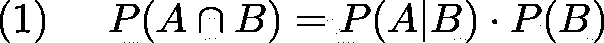
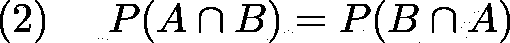
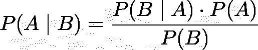
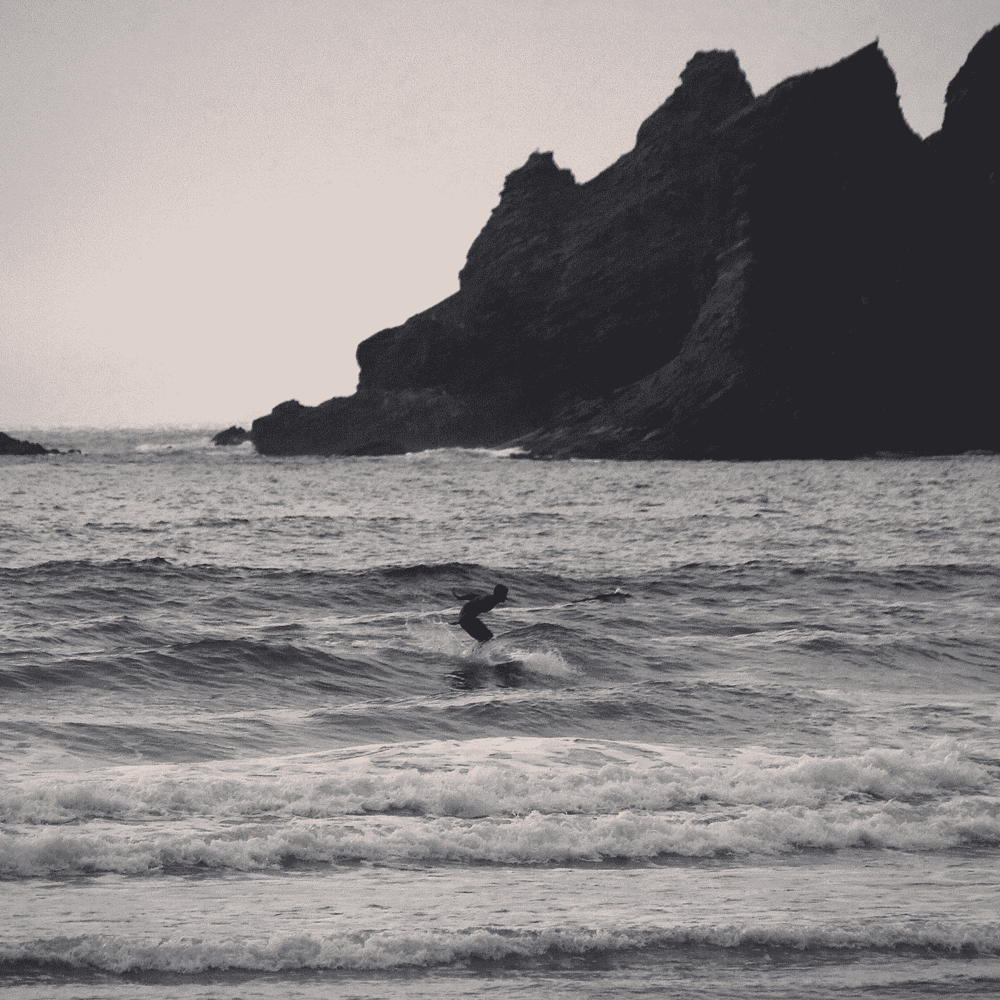
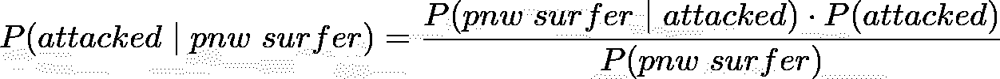
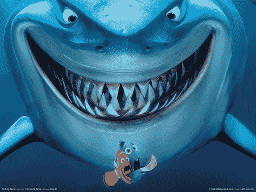

# 贝叶斯定理与鲨鱼攻击

> 原文：<https://medium.com/mlearning-ai/bayes-theorem-and-shark-attacks-74fc42a28cd?source=collection_archive---------4----------------------->

对统计学中一个最强有力的观点和一个激动人心的例子的解释。

几周前，我独自一人漂浮在太平洋俄勒冈州海岸的冲浪板上。在我能想到的所有事情中，我坐在那里思考贝叶斯定理。具体来说，我在想鲨鱼袭击的概率。你可能在新闻中或从海洋运动爱好者那里听说过这样有趣的统计数据:“一个人被鲨鱼袭击的几率比遭遇飞机失事/被闪电击中/等等的几率要小，所以没什么好担心的。”独自坐在海里，我不禁想知道这种比较有多真实，以及这些可能性是如何测量和计算的。统计学家首先学会的一个区别是频率主义者和贝叶斯概率之间的重要区别。

Slow day at Oswald West State Park

Frequentist probability 顾名思义，一个事件发生的概率定义为该事件在总的试验次数上发生的频率(具体来说就是当试验次数趋于无穷大时发生率的极限)。频率主义概率往往只是一个测试的结果，它似乎是对所讨论事件的概率的充分描述。但在现实中，频率主义概率并没有真正给我们一个准确的描述，真实的概率的事件发生。相反，为了更好地理解，我们应该看看贝叶斯定理。鲨鱼袭击的频繁率不足以描述这种概率，因为它忽略了一个事实，即一个住在堪萨斯州并且永远不会接触海洋的人可能与一个每天都冲浪的人有不同的概率。贝叶斯法则将帮助我们缩小预测的准确度。

# 贝叶斯的理论从何而来？

这个理论是由托马斯·贝叶斯牧师在 18 世纪首先发现的，但是由于他认为这个想法微不足道，不重要，直到他死后几年才由他的朋友理查德·普莱斯发表。20 年后，伟大的皮埃尔·西蒙·拉普拉斯也独立地得出了相同的结果，但理查德·普莱斯也许应该为这条规则得到最大的荣誉，因为是他认识到了它的重要性，发表了它，并发现了它的现代应用。总之，[“贝叶斯”定理'](https://en.wikipedia.org/wiki/Bayes%27_theorem)是条件概率法则(1)和联合(相交)概率对称性(2)的直接结果。这里友情提示，P(A|B)读作“给定 B 的概率”，cap 符号表示‘交集’。

Conditional Probability Rule

Intersectional Probabilities are ‘symmetric’

贝叶斯定理使用先验知识和事件可能性的组合来产生更精确的概率估计。它可以从上面给出的两条规则中非常容易地推导出来。看看你能否重新排列它们，得出贝叶斯定理，如下所示:

Bayes’ Theorem in all it’s glory

如今，贝叶斯法则通常伴随着一些你可能会遇到的术语。我们感兴趣的最终概率 P(A|B)通常被称为*后验概率*。我们需要的相反的条件概率 P(B|A)，叫做*似然*。P(A)是指之前的*，P(B)是*证据*。实际上，最难计算或者根本不可知的往往是证据 P(B)。*

# 鲨鱼袭击的可能性

A surfer makes the most of a mushy evening.

现在我们已经熟悉了贝叶斯定理，让我们来看看它的实际应用。我很好奇冲浪时被鲨鱼攻击的可能性。它真的像人们说的那么低吗？它与其他可怕的事件相比如何，比如飞机失事或被闪电击中？天真的方法是用鲨鱼攻击的总次数除以总人数；这是常客的“率”概率。但是如前所述，这个比率不足以描述攻击的可能性。从贝叶斯的角度来看，我们可以用已知的先验信息给出我们的答案。在本例中，这些已知信息是我所在的位置(太平洋西北)和我正在进行的活动(冲浪)以及相关的攻击次数。

回顾一下贝叶斯法则，我们来定义一下我们感兴趣的后验概率。我想知道我被攻击的概率，因为我们知道我是 PNW 的冲浪者。我们可以写这个 *P(被攻击| PNW 冲浪者)*。规则的右边告诉我们需要什么信息来解决这个问题。我们需要*可能性*，这是我在西北太平洋冲浪的概率，假设我被攻击了: *P(PNW 冲浪|被攻击)*。这种概率可以通过检查所有记录的攻击，并将发生在 PNW 的对冲浪者的攻击次数除以全世界对所有水上运动的攻击总数来计算。本例中的*先验*是一次攻击的概率，恰好是上面提到的频率率，称之为 *P(被攻击)*。最后，*证据*这里是一个人在西北太平洋冲浪的概率， *P(PNW 冲浪者)*。将所有这些放在一起，我们可以为这个例子重写贝叶斯定理:

Bayes’ rule written in terms of our example

# 结果

贝叶斯法则在理论上非常直观，但应用到真实数据时，往往会出现问题。计算这里的证据是非常棘手的，有无数种方法可以做到这一点。

如果你住在太平洋西北部，并且每年冲浪一次，那么你每年被攻击的几率是 1800 万分之一。在 50 年的时间里，这是 356，000 分之一的概率。但是，如果你是一个核心冲浪者，在 50 年的冲浪生涯中，在大多数适合冲浪的日子里，你一生中经历攻击的几率可能高达 7100 分之一…但是不，我只是想吓唬你..虽然每天在水中的人有可能有更高的几率，但这个数字肯定是高估了，也是计算证据困难的一个例子。我使用条件概率来计算证据的方式假设成为一名冲浪者和居住在 PNW 是独立的事件。这是不正确的，这些事件肯定是相互关联的，因为事实上，住在海边的人显然比那些不住在海边的人更有可能冲浪。植根于我们数据的另一个问题是，PNW 所有记录在案的鲨鱼袭击事件都发生在冲浪者身上，因此，当这两种情况下的可能性都不变时，进一步补充证据就不那么“公平”了。具体来说，我指的是可能性， *P(PNW 冲浪者|被攻击)*，恰好与 *P(PNW |被攻击)*相同。为了消除这种不确定性，我改变了上面等式中证据的定义。现在，不是 *P(PNW +冲浪者)*，只是 *P(PNW)* 。

看，找出贝叶斯定理中的证据总是最棘手的部分！不仔细考虑会导致可怕的结论，在处理数据和概率时，考虑你所做的每一个选择的含义是很重要的！

Surfers are friends… Not food!

## 好了，别吓我了…我的机会有多大？

如果我们去掉经常冲浪的假设，只看 PNW 的人，你在 50 年内被攻击的几率是 36 万分之一。

这与飞机失事和雷击相比如何？

根据美国疾病预防控制中心的数据，每年被闪电击中的几率大约是 50 万分之一。根据《经济学家》和这篇文章，死于飞机失事的几率甚至更低，为 540 万分之一。另一则新闻报道称，根据国家安全委员会的数据，发生致命空难的几率是 205，000 分之一。

佛罗里达博物馆报告说，一个人一生中被闪电杀死的概率是八万分之一，一生中死于飞机/空难的概率是 5051 分之一。他们还报道了在美国被鲨鱼杀死的概率为 370 万分之一。自然，被攻击的几率会比被攻击被杀的几率高。许多更常见的活动有更高的几率，在你的一生中，死于自行车事故的几率是 4900 分之一，死于车祸的几率是 84 分之一。

唷。如果我能在这里冲浪 50 年，并且比我坐飞机或者经常暴露在闪电下有更好的生还机会，我肯定会抓住这些机会。

当在互联网上搜索这些概率时，它们的差异之大令人震惊。你在计算概率时所做的每一个决定都会极大地改变结果。坚持你确定知道的事情并保持一致是很重要的。鉴于不同的结果相差如此之大，我对西北太平洋地区的结果是 360，000 分之一很有信心。[维基百科](https://en.wikipedia.org/wiki/Shark_attack#:~:text=In%20the%20United%20States%2C%20even,than%201%20in%20264.1%20million.)称，如果你是一名美国海滩游客，被鲨鱼袭击的几率是 1100 万分之一；他们还提供了一个更高的区域攻击几率的例子，在澳大利亚西南部的一个地区，攻击几率为 40，000 分之一。像我这样的人出现在 PNW 的概率高于一般人群，这是有道理的，但也没有冲浪和鲨鱼活动的热点那么高。如果我找到一种方法将一个人冲浪的频率纳入证据，我可能会像澳大利亚一样产生更高的几率，但可能不会高达 7100 分之一。但我并不急于找出答案，对于像我这样的冲浪者来说，360，000 分之一是一个不错的大概概率。它取自一个很好的样本空间，比以前更准确，而且仍然足够低，我可以呆在水里！

## 还有两个可怕的事实，一个令人欣慰:

1.  我在上面提到过，太平洋西北地区所有记录在案的攻击都是针对冲浪者的。但是，这不应该让你认为鲨鱼认为冲浪者味道更好。请记住，常客比率通常不是概率的完整解释！如果我们了解更多的数据，我们会意识到这主要是因为 PNW 的人们不太可能去游泳、潜水或做其他水上运动，而是去冲浪。忘记冲浪者基本上是这里唯一在水里的人，会让人觉得他们好像是被攻击的目标，而实际上他们并不是。警告:总的来说，冲浪仍然是最有可能被鲨鱼袭击的活动(根据 GSAF 的数据)，太平洋西北地区只是一个极端的例子，因为缺乏其他活动。
2.  所有记录在案的鲨鱼袭击事件(除了一次)都是发生在加利福尼亚州马林县北部的大白鲨袭击。我也没办法让这个不那么恐怖…对不起，这只是他们的地盘。
3.  虽然在西北太平洋被攻击的几率是 360，000 分之一，但被攻击致死的几率要小得多。小到为了这个例子，我甚至不能计算它。在 PNW 记录的所有鲨鱼袭击事件中，由于海岸警卫队和快速医疗反应，没有一起死亡事件。虽然假设零死亡率意味着你遭受致命攻击的概率也是零是幼稚的，但它肯定比被攻击的概率小得多。

# 数据

我在这个例子中使用的数据来自全球鲨鱼攻击记录。虽然本文大体上解释了如何将贝叶斯定理应用到这个例子中，但是在处理这些数据时还需要做出许多更具体的决定。要深入了解我如何使用这些数据来寻找这个例子的可能性、先验和证据，请查看本文的 [GitHub 知识库](https://github.com/jonnyhof/bayesian_shark_attacks)。Python、Numpy 和 Pandas 是用于所有计算的库。

## 来源:

Latex2png.com 被用于数学类型。提到统计资料来源时，它们的链接会嵌入正文中。两张冲浪照片是我自己拍的，鲨鱼图片来自精彩的电影《海底总动员》。

感谢阅读，以后会有更多鲨鱼攻击的文章！