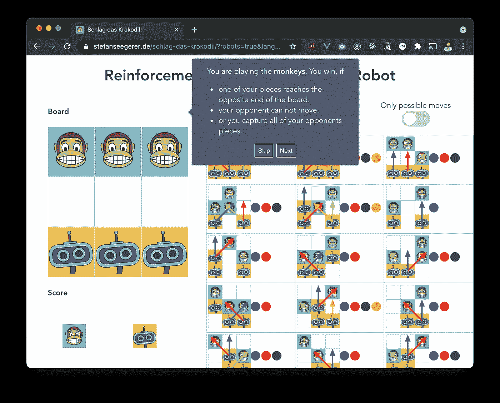
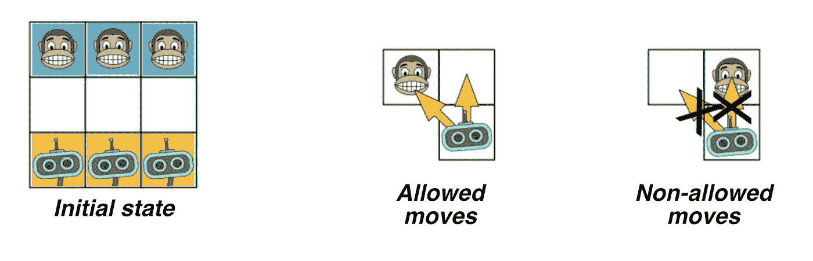
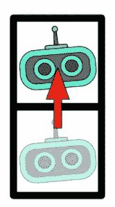

# 击败机器人——通过 hexapawn 了解机器学习

> 原文：<https://medium.com/mlearning-ai/beat-the-robots-learning-about-machine-learning-with-hexapawn-fd69ceebbb64?source=collection_archive---------3----------------------->

人工智能最新发展背后的一个主要力量是机器学习。机器学习处理随着时间推移通过经验改进的算法。机器有不同的学习方式。强化学习就是其中之一。通过强化学习，计算机通过奖励和惩罚与环境互动，试图最大化其奖励，从而学习掌握一项任务。这篇文章使用了一个名为 [hexapawn](https://en.wikipedia.org/wiki/Hexapawn) 的迷你国际象棋游戏来探索计算机如何通过强化学习进行学习。

Play the game on [https://www.stefanseegerer.de/schlag-das-krokodil/?robots=true](https://www.stefanseegerer.de/schlag-das-krokodil/?robots=true)

# 游戏

Hexapawn(或迷你象棋)源于马丁·加德纳的一个想法，他早在 1962 年就用它来解释机器学习。在这个版本中，你扮演猴子的角色，而计算机控制机器人。

每个棋子都像棋子一样移动，也就是说，它只能向前移动并对角击中对面的棋子。一方赢了，如果它设法

*   将自己的一颗棋子移动到棋盘的另一端，
*   夺取对手的所有棋子，
*   或者确保对手在下一轮无法移动。

你先走一步。你可以根据游戏规则自由移动你的一个棋子。然后就轮到电脑了。它将当前游戏场地与可能的移动进行比较，并从给定的可能性中选择合适的游戏情况(在右侧)。

然后电脑随机抽取其中一个游戏情境旁边的彩色代币。令牌的颜色决定了要走哪一步。例如，如果画了一个红色的记号，机器人就会沿着红色的箭头移动。

Computer moves robot along the red arrow.

重复这一过程，直到确定获胜者。在开始新一轮游戏之前，电脑会调整其策略如下:

*   电脑赢了:一个与最后一次获胜回合颜色相同的代币被额外放置在该回合的方格上。
*   人类赢了:决定电脑玩家最后一步棋的标记被移除。

在我们继续之前，轮到你来试试这个游戏，看看电脑是如何在每一轮游戏中变得更好的。

点击此链接，你将来到 https://www.stefanseegerer.de/schlag-das-krokodil/?的[机器人=真](https://www.stefanseegerer.de/schlag-das-krokodil/?robots=true)

# 背景

起初，计算机赢的机会很小，因为它随机选择走法(通过抽取一个代币)。电脑完成的游戏越多，它就变得越好:它“学习”哪些动作会帮助它获胜，哪些应该避免，因为它们在过去都以失败告终。这样，计算机的策略就逐渐细化了。因为计算机输了会被惩罚，赢了会被奖励，所以我们也说强化学习——通过奖励和惩罚来学习:

*   惩罚=在导致失败的一步棋中拿走一个代币。
*   奖励=在导致胜利的一步棋中添加一个令牌。

这个程序“剔除”了导致失败的棋步，因此最终只剩下“好”棋步。在实践中，不会导致成功的策略不会立即被消除，而只会降低它们发生的概率。因此，人工智能逐渐学会在何种情况下应用何种策略，但不会立即消除这次没有成功的策略。

使用强化学习，计算机可以通过了解游戏规则或可能的输入来学习赢得游戏。如果一台计算机学习玩像超级马里奥这样的视频游戏，它最初只会进行随机输入(即按下按钮)。这可能会导致马里奥只是站着不动几分钟，或者多次撞上对手。机缘巧合下，马里奥会击中一个神秘的盒子或在关卡内前进，从而获得奖励。在行动和相应的奖励之间也可能有延迟。但是随着时间的推移，计算机会学习到拿一个蘑菇，跳到敌人或缺口前面会增加它的奖励，而碰到对手会导致惩罚。通过这种方式，计算机将逐渐改进它的策略，试图最大化它的回报。

在这篇文章中，你已经体验到计算机可以从经验中学习，从而从纯粹的随机行动转变为高效的游戏策略。但是强化学习并不局限于游戏，它还可以应用于其他用例，如[加热、通风或空调控制](https://scholar.google.de/scholar?hl=de&as_sdt=0%2C5&q=reinforcement+learning+hvac+control&btnG=)(找到最佳设置以减少能耗)或在[机器人](https://scholar.google.de/scholar?hl=de&as_sdt=0%2C5&q=reinforcement+learning+robotics&btnG=)中，当机器人学会像人类一样行动和行为时。强化学习还可以用于[股票交易](https://towardsdatascience.com/deep-reinforcement-learning-for-automated-stock-trading-f1dad0126a02)或者[改进聊天机器人](https://towardsdatascience.com/deep-reinforcement-learning-for-automated-stock-trading-f1dad0126a02)。但是这个想法和 hexapawn 中使用的是一样的。

*PS:这个游戏也可以顺便类比* *来玩* [*。*](http://aiunplugged.org/)