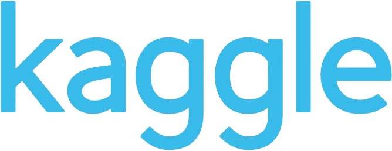

# Kaggle 初学者指南

> 原文：<https://medium.com/mlearning-ai/beginners-guide-to-kaggle-3d1b07e8715e?source=collection_archive---------8----------------------->

# 介绍

Kaggle 是最大的开源数据和协作数据科学社区之一。它通过其竞赛吸引了大量数据科学家，这些科学家希望获得数据科学界的认可，并成为明智使用数据的良好事业的一部分。虽然 Kaggle 有许多数据科学相关的课程和初学者笔记本，但作为初学者，导航 Kaggle 可能相当具有挑战性。这篇文章让你熟悉了使用 Kaggle 所需要知道的基本知识。

# 笔记本电脑

Kaggle 笔记本的功能与 Colab 或 Juptyer 笔记本相同，Kaggle 有自己的环境，该环境中预装了使用最广泛的软件包。像 Colab 一样，Kaggle 笔记本允许你使用 GPU 和 TPU，尽管是在规定的时间内。在撰写本文时，GPU 时间是 40 小时，TPU 时间是 9 小时。Kaggle 笔记本最好的一个特点是，它允许你使用存储在 Kaggle 中的数据集，省去了收集和存储数据到云的麻烦。添加要在笔记本中使用的数据或模型。

# 数据集

Kaggle 数据集具有 Jupyter 或 Colab 等其他在线笔记本所不具备的便捷功能。数据集允许您在线上传数据，并使其更容易与其他数据科学家共享。笔记本电脑的输出也可用于制作数据集或更新现有数据集。

# 课程

Kaggle 提供各种针对初学者的课程。从 python 到神经网络和强化学习，这些课程对于初学者来说是学习数据科学基础知识的好方法，但随着你在该领域的进步，这些课程变得不那么有用了。这些课程是开始学习 Kaggle 的好方法。

# 讨论

Kaggle 拥有广泛的用户参与，允许您将自己与广泛的用户联系起来。你也可以对其他笔记本发表评论，提供你的观点和对他们代码的评论。讨论是在现场建立联系和回答问题的好方法。

# 竞争

竞赛是 Kaggle 的主要关注点之一，也是专业人士和初学者加入 Kaggle 的主要原因。它提供现金奖励，汇集最聪明的头脑来解决数据科学的挑战。参加比赛时，你将接触到用来解决问题的最先进的技术。虽然这些解决方案中的大多数都很棒，但对于这些解决方案对竞赛主办方的实用性一直存在争议。由于比赛要求用户获得最高分，几乎所有的竞争者都专注于提高他们的分数，而忽略了这个解决方案必须在实际基础上使用的事实。

# 奖牌和排名

用户可以投票支持他们喜欢的数据集、笔记本和评论(讨论)。在比赛中获得一定数量的赞成票或达到一定的排名会给你一枚铜牌、银牌或金牌。随着您在卡格尔参与社区和赢得奖牌方面的进步，您的卡格尔等级将从新手->贡献者->专家->大师->特级大师增加。特级大师被赋予特权，并被允许参加独家比赛。

# 结论

正如你所看到的，Kaggle 是这个领域的新手和老手的好去处。如果你是初学者，我建议你从课程开始，然后转向公共数据集。推迟比赛，直到你感觉舒服为止。竞赛倾向于使用对初学者来说可能不和谐的高级概念。尝试解决你觉得舒服的问题，比如数据集和讨论。这是积累你的知识和在这个领域建立联系的好方法。

 [## Mlearning.ai 提交建议

### 如何成为 Mlearning.ai 上的作家

medium.com](/mlearning-ai/mlearning-ai-submission-suggestions-b51e2b130bfb)