# 通过机器学习在监控系统中进行行为分析

> 原文：<https://medium.com/mlearning-ai/behaviour-analytics-in-surveillance-systems-through-machine-learning-f16b807b04b8?source=collection_archive---------3----------------------->

自从你二十分钟前通过购物中心入口，就一直被监视着。上楼，在拐角处，在商店里；分散在可疑建筑上的小眼睛。你的每一个举动都会在这些迷你观察者之间引发另一系列混乱——你走路有目的吗？你能进入下一个隔间吗？最重要的是，它阻碍了你抢劫三楼糖果店的完美计划。

*你又拐了一个弯，摄像机跟在后面，用一种你看不见也听不见的鬼语言互相交谈。这个机器系统能在你行动前预测你的意图吗？*

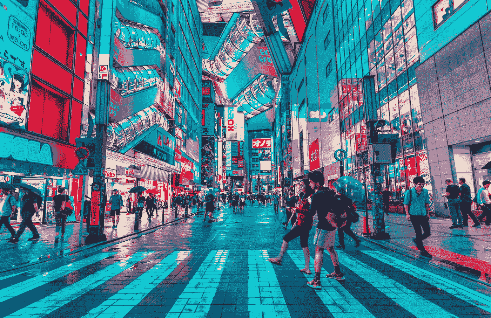

Photo by [Jezael Melgoza](https://unsplash.com/es/@jezar?utm_source=unsplash&utm_medium=referral&utm_content=creditCopyText) on [Unsplash](https://unsplash.com/s/photos/mall?utm_source=unsplash&utm_medium=referral&utm_content=creditCopyText)

> **过场:**

首先，目前你当地商场的相机还没有这个功能。但这是对未来的一瞥，在未来，机器学习和监控系统将携手合作，不仅为公民提供更安全的环境，还可以保护资产免受欺诈活动和盗窃。

我们在机器学习方面前进的速度堪比乘坐子弹头列车，而其他领域则骑着自行车漫步。然而，在这种速度下，新成员和爱好者很难跟上最新的创新。机器学习本身是一种强大的人工智能形式，利用算法的自然模式搜索能力来重复分析数据。系统会一直这样做，直到开发出一个通用的规则来根据新的用户数据进行预测。这种新的大数据方法专注于以比人工调整快得多的速度独立完善算法本身，而人工调整需要额外的劳动力和资金。

公司已经转向这个“潘多拉盒子”，以精确捕捉他们数据的趋势，并根据检测到的模式建立原型——德勤 2020 年的一项调查发现，67%的公司正在使用机器学习，97%的公司正在使用或计划在未来一年使用它。

虽然每个人都在机器学习上进行信息热潮，但对于没有任何数据科学背景的人来说，进入这个领域越来越势不可挡。从一个 ML 社区的积极学习者的角度来看，我完全同意麻省理工学院计算机科学教授 Aleksander Madry 的观点，他是麻省理工学院可部署机器学习中心的主任。

> “机器学习正在改变或将改变每个行业，领导者需要了解基本原理、潜力和局限性。虽然不是每个人都需要知道技术细节，但他们应该了解这项技术能做什么，能做什么，不能做什么，”Madry 补充道。"我认为任何人都不能不知道正在发生的事情。"

因此，在本文的第一部分，我们将专注于表达机器学习的一般思想，并研究鼓励更多人转向人工智能的激励因素。更具体地说，*是什么吸引我们在公共安全和监控行业使用它？*

> ***机器学习的总体思路。***

机器学习有几种风格:

*   **描述性:**系统使用接收到的数据重建发生的事情。这种技术的一个应用是在医疗保健领域，人工智能和深度学习被用来识别 MRI 扫描或 CT 扫描中是否存在增长。
*   **预测:**系统根据已经存储在其库中的数据进行预测。这在金融领域被广泛用于进行股票预测和分析。这里需要注意的一个关键点是，预测性机器学习系统不会做出明确的声明，这意味着没有 100%的保证预测是真实的。这通常会阻碍公司在可能影响人类生活的现实生活场景中实施这些预测系统。
*   **说明:**系统将根据收到的数据对下一步行动提出建议。这是我们目前实施的系统类型，当涉及到监管监视时，为了根据一个人在给定时间的行为来预测其意图。

然而，如果不将机器学习与三个不同的子系统相关联，我们就无法最大化机器学习带给我们的效率:

*   **自然语言处理**
*   **神经网络**
*   **深度学习**

在监控系统的情况下，所有三个子系统一起工作来帮助行业，但是，其中两个系统对我来说特别感兴趣——神经网络和深度学习。

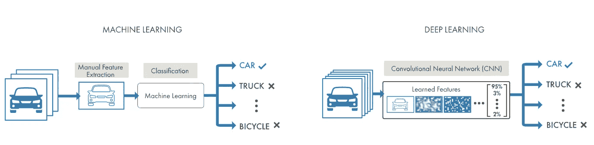

Comparison between ML and DL by mathsworks.com

简单来说，神经网络和深度学习在处理数据时会强调彼此的效率。神经网络是连接的细胞或节点，处理输入并产生输出，发送到其他几个神经元。在此过程中，标记的数据通过节点传送，每个单元对数据应用不同的函数。例如，在经过训练的神经网络中，不同的节点评估信息，并得出与数据的真实输出相匹配的输出。然后，可以将一组新的数据呈现给经过训练的模型进行评估，其中，通过多次重复迭代，提高了达到正确输出的准确性。(监督机器学习)

我说这两个子系统紧密合作的原因是，从本质上讲，深度学习网络是具有许多层的神经网络。这些附加层提供了一个更加通用的系统，可以接受大量的数据，并确定如何解释每组数据。例如，深度学习网络的一层可以识别一个人的腿的位置，另一层可以确定这个人是在散步、走路还是跑步。我们添加到网络中的层次越多，我们就有更多的方法来解释同一组数据，因此也就有更多的机会来构建复杂性和实现各种期望的结果。

使用这样的系统可以降低执行功能的成本，这些功能会给人类表演者带来精神、身体和财务负担——这就是为什么麻省理工学院数字经济倡议在 2018 年进行的一项调查强调，67%的受访企业在他们的公司中使用机器学习。

**动机很明显** —机器学习最适合大量的数据处理和自动化决策，在某些情况下，人类可能做不到。然而，使用这些系统也有一些缺点。首先，这些机器是由人类训练的，因此算法中不可避免地会考虑到人类的偏见。这些偏见可能导致极端内容的建议，从而导致人们意见的两极化或歧视性语言的错误检测。在这两种情况下，结果看起来都相当令人不快。然而，我们目前正在神经网络中建立规则，这些规则可能会针对并消除这些偏见，其中一种方法是从不同背景的人那里收集数据集，就像消除统计采样中的偏见一样！

也就是说，可以说机器学习是监控行业的一个优秀工具，特别是从他们的镜头库中收集了大量具有巨大可变性的数据。目前，机器学习可以应用于图像分析和物体检测，这是一个我觉得很有趣的领域。

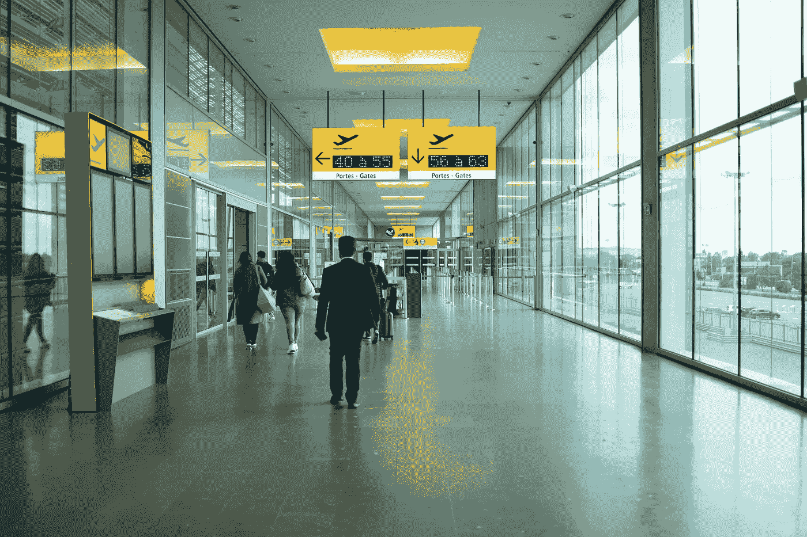

Photo by [Maëva Vigier](https://unsplash.com/@maeva_vgr?utm_source=unsplash&utm_medium=referral&utm_content=creditCopyText) on [Unsplash](https://unsplash.com/s/photos/airport?utm_source=unsplash&utm_medium=referral&utm_content=creditCopyText)

> ***目的集中。***

不到 6 个月前，我的叔祖父因疑似中风去世。他当时正和我的姑姥姥一起旅行，感到有点不安。他们两人都认为是流感，并决定回到他们的家乡，参观那里的医院。在机场转机期间，我姑奶奶上厕所，把我姑父暂时留在外面无人监管。当她出来时，我的叔祖父已经瘫倒在地上，任何有效的复苏方法都无法恢复他的大脑活动。

这让我想知道两件事——首先，在中风发生之前，有没有任何中风的迹象？第二，有没有办法检测到这一点，从而在损害不可逆转之前阻止它？我们通过观察**快速**症状(面部下垂、手臂无力、言语困难和时间)来了解如何检测中风，但我非常确定，即使我的姑奶奶掌握了这些急救技能，她仍然无法拯救我的姑父。总有一天，你已经为任何可能出错的事情做好了准备，进行了大量的模拟练习，模拟危机到来时你能做的事情，但你不能否认，当你不注意的时候，事情仍然可能变得非常糟糕。没有人能保证我的姑姥姥能全天候呆在我的叔舅身边，以避免中风发生的任何可能性，即使这样，疲劳和事故也会发生。

但我想知道，在那段时间里，是什么守护着我的叔祖父？机场的监控摄像头。我们都知道这些摄像头覆盖了像机场这样需要额外安保的地方，但大多数时候，这个“迷你眼睛”系统整天都被进出的乘客忽视。它们的存在似乎没有被我们发现，直到突然的破坏发生——比如犯罪或事故。在这样的时刻，这些摄像机成为我们最可靠的真相来源，并重现发生的事情。

***但他们能做的就这些吗？***

> ***监控系统中的机器学习概述***

在那些人口密集的地区，我们没有最大限度地利用那些“迷你眼睛”。传统上，实时 CCTV 摄像机监控由安全议程和运营经理完成，以检测监控区域的行为或情况变化。然而，全面审查这些镜头细节所需的时间和资源使得这项工作几乎不可能真正收集一个镜头所能提供的所有关键信息。诸如人为错误和注意力分散之类的偏差使得对一个或多个相机馈送的解释极其低效和无效。

此外，仅在美国，使用中的监控系统数量就增长了 80 %( T10 )( T11 ),从 4700 万增加到 8500 万。客观地说，每四个人就安装一个摄像头。花些时间思考一下——现在你家里会有多少台摄像机？这种巨大的增长鼓励 CCTV 行业采用一种基于深度学习的视频智能软件，它通过将机器网络暴露于标记数据来工作，允许它独立识别对象和模式，从而使镜头**“可搜索、可操作和可量化”**。

另一种使用 VCA(视频内容分析)的软件可以集成到当前的监控系统中，以索引某些对象或人。一旦收集了元数据，当发现异常行为时，这些镜头现在可以用于触发实时警报。这项技术的一个现实应用是检测特定区域周围的人数，当人数超过限制时，就会发出警报。同样的技术也可以根据某些物体的存在或面部识别来触发。

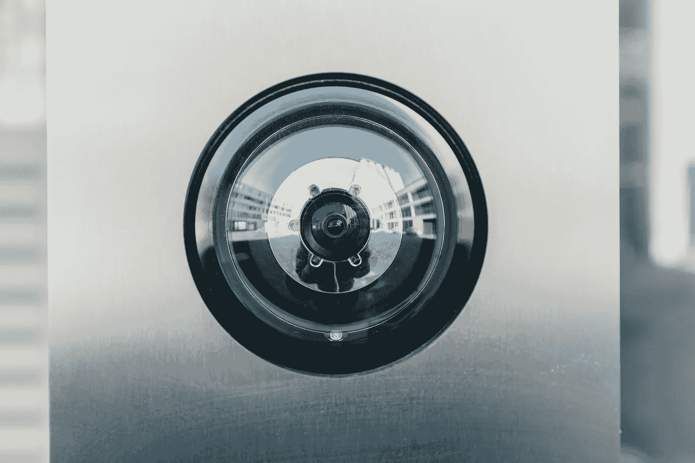

Photo by [Bernard Hermant](https://unsplash.com/@bernardhermant?utm_source=unsplash&utm_medium=referral&utm_content=creditCopyText) on [Unsplash](https://unsplash.com/s/photos/surveillance-camera?utm_source=unsplash&utm_medium=referral&utm_content=creditCopyText)

> *案例分析智能监控系统特写*

**现在，回到你抢劫三楼糖果店的计划。**

*购物中心周围的监视系统被训练来检测购物中心内的有趣模式，并将它们分类为“可疑”和“良性”。以便保护公民的隐私并节省系统内的数据存储空间。任何一开始被认为是“良性”的行为都会在不久后被从图书馆处理掉，这样人们就可以在商场里四处走动，而不必被那些看起来比你更可疑的摄像头记录下来。但是，任何在初始条目上标记为“可疑”的镜头都将被保存，直到经过验证的管理员采取进一步行动。如今，研究人员正在研究如何开发一种类似于自然语言处理的工具，但用于直播和动画视频片段。*

*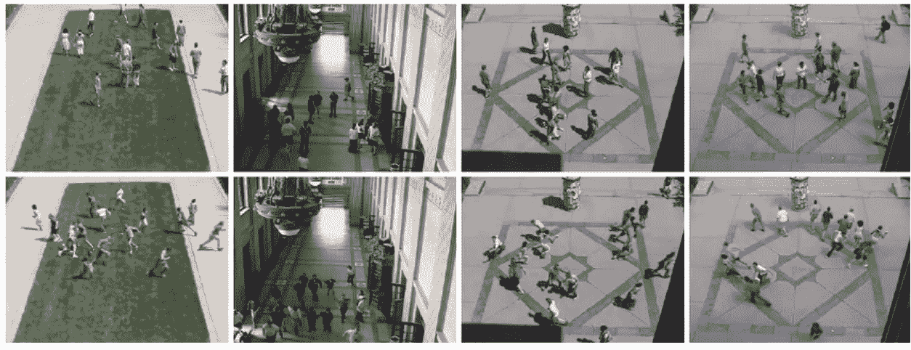*

*Cameras can deduce suspicious movements from live footage (top row = non-suspicious, bottom row = suspicious)*

*但那太离题了。这些相机现在的目标是提取基本特征，并在不改变你的实际表现的情况下给你记录的动作一个目的。例如，如果你突然改变走路的方向，这种位置的突然变化会触发监控系统的警报，根据你周围人群的活动，这可能会被视为“可疑”。所以你把帽子的边缘靠近你的脸，继续往前走。*

*这些摄像机收集的镜头在处理阶段遵循一定的步骤。首先是预处理。预处理从视频中提取帧，以提高这些部分的质量，以便暂时处理噪声和光线变化，用于未来的视频分析。一些系统使用形态学操作作为 MATLAB 中的开放系统，以提高检测视频中运动对象的效率。我们不仅可以调整检测移动物体的可能性，还可以应用几个过滤器:*

****答:高斯滤波器+平均滤波器去除颗粒类噪声****

*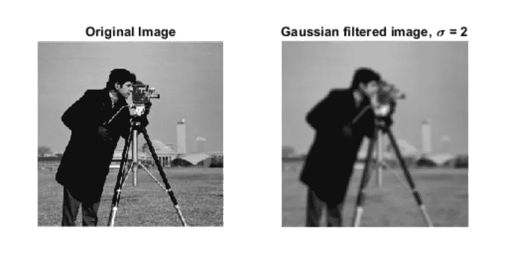*

*Figure by mathworks.com*

*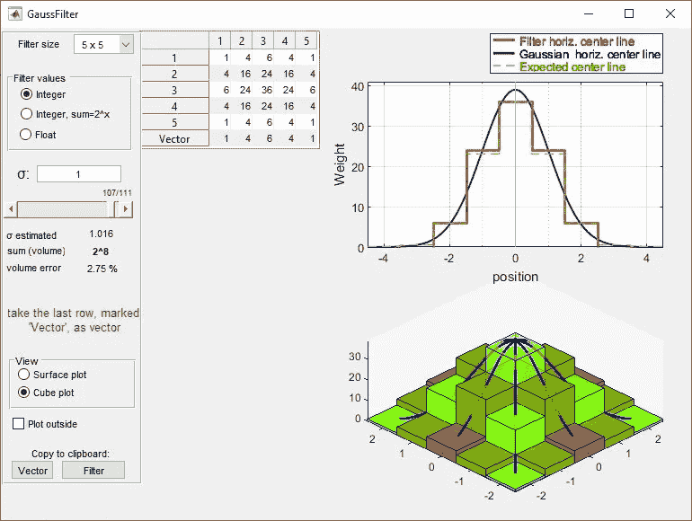*

*Visual representation of a Gauss filter algorithm that transfers data into pixels*

****B:维纳滤波器提高了帧的分辨率****

*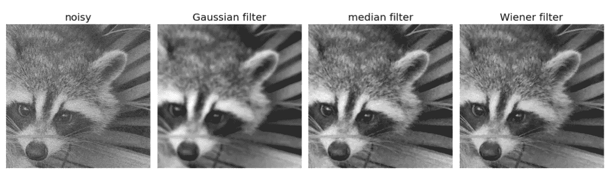*

*Figure by mathworks.com*

*这两个过滤器可以更清晰地呈现您的运动。也就是说，理论上，它会忽略你所设置的任何分散注意力的细节，而是直接关注你的行动过程。*

*然后，系统通过一系列运动检测算法运行。这通过四种不同的方法定位热区:*

***背景减法(BSM):** 通过将视频的移动部分与背景图像和前景图像进行比较来工作。通过从输入图像中减去参考图像，系统推导出确定是否存在检测到的前景图像的阈值。通过证明前景图像是有效的，这可以定位在整个镜头中没有保持静止的某些对象。*

*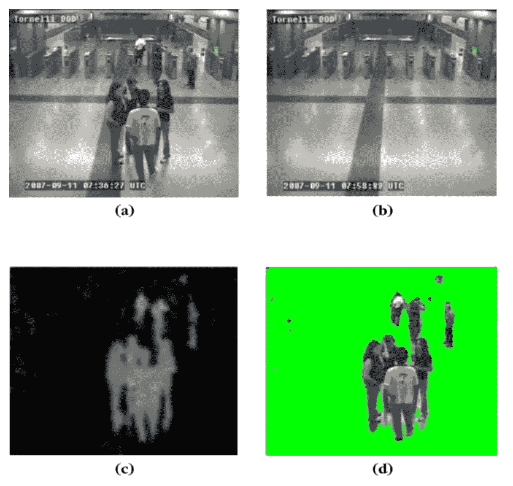*

*Determining Background (b) and Foreground (d) to detect movement after subtraction (C)*

***时间差分(TD):** 是一类无模型的强化学习方法，预测一个变量在一个状态序列中的期望值。这允许学习到的状态值指导动作，从而改变环境状态。*

***统计方法:**这是一个更复杂的系统，使用多种标准评估结构化和非结构化图像。其中一些包括均匀照明的测试。*

**

*Testing model to eliminate light interference*

*系统假设光线均匀分布作为无效假设，然后使用如下几种数学模型进行测试:*

*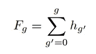*

*Kolmogorov — Smirnov image comparison*

*并决定是否有足够的证据来拒绝或接受无效假设。对于物体动作跟踪来说，在给定的时间内，观察两幅图像是否消除了噪声也是很重要的。这是为了直接推断自素材中的第一个和第二个给定图像以来您是否移动过。通过使用 Kolmogorov-Smirnov 的图像比较，这个公式设定了基本规则，根据这些规则，图像可以被认为是相同的，如果不是高度相似的话。如果两幅图像具有相同的灰度分布，则假设它们是相同的，该模型考虑了随机噪声的出现，并试图比较它们的原始灰度分布。*

***流动分析:**在图像之间比较像素，以查看每个像素移动的位置和时间。这忽略了整个物体本身，只是用二项式方法来看图像——它们要么移动了，要么保持静止——因此，只比较边界像素，我们就可以推断出图片的哪一部分移动了。*

**因此，有了这四个系统，你的行动现在会被背后拥有惊人计算能力的摄像机跟踪。**

*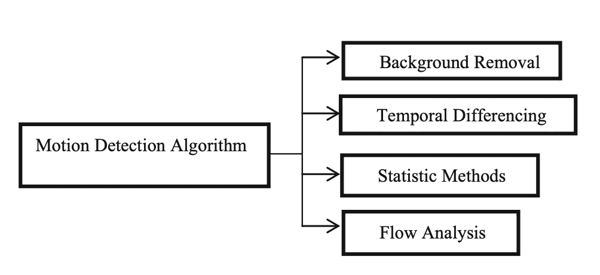*

*All four systems summarised*

*现在你的动议需要被分析，然后分类。这是视频处理的下一阶段。特征检测和提取定义了镜头的内容，如边缘、拐角和斑点。这是一种降维技术，目的是将大量数据减少到系统在对您的行为进行分类时需要考虑的集合。*

*该分析之后是分类，分类将那些定义的特征分组到类别中。这通常用于将旧规则应用于新数据集。例如，系统本身可能会在小偷行动前几秒钟存储其图像，他们运动中的这种变化被系统捕捉到，并用于开发一种算法，将任何类似的运动归类为“可疑”。*

*分类后，数据将被缩小到足以让系统做出决定——要么立即警告他们的老板，要么将其存储为“可疑”的标记数据，供人类查看并做出自己的推断。*想到这一点，你确保在接近糖果店时尽量走得平稳……**

## ****那么，解决我的问题了吗？****

*为了想出一个解决方案，我决定将这篇文章视为一个“时间旅行”任务，看看我们有什么方法可以在为时已晚之前将我的叔祖父送到医院。*

*首先，让我们回顾一下快速症状，看看我们实际上可以解决哪些问题。*

***面部下垂:***

*说到面部识别，手动将新面孔上传到监控系统早就过时了。目前，我们可以随意标记人脸，不管是否使用人类。见鬼，我们甚至可以在新面孔出现的时候就放弃输入新数据的想法。让我们使用我们目前的机器学习系统，一旦部署，它根本不需要数据库。该系统开始收集自己的图像，然后跟踪这些相同媒体的未来外观，即时更新，无需人工待命。*

*不同面部识别系统大规模开发的最初触发因素源于视频传输速度缓慢和长时间存储视频的问题。这些镜头的质量使得人脸难以准确识别，特别是在闭路电视镜头下，不同的照明和姿势以及低分辨率大大降低了市场上任何机器学习系统的识别率。然而，市场上有几种较新的系统，它们使用不同的面部检测器来实现相当理想的结果。*

**

*在【2018 年 3 月，Vikram Mutneja 开发了一个面部识别系统，以补充生物识别行业。由于视频镜头受到光照、距离、投影角度和环境因素等因素的严重影响，因此跟踪人脸非常困难。然而，对运动的**提取和基于肤色的分割**的进一步研究成功地提取了“热点区域”,并随后导致了面部检测。通过使用 Haar 分类器和图像缩放，该系统增加了其在确定缩放因子的较低值和较高值时的适应性，使得能够仅基于运动和肤色进行多尺度人脸检测。当然，还会涉及到**偏差**，比如不同种族间人类肤色的差异，从而导致网络无法识别人体的正确部位。然而，这种算法为未来的技术建立了一个基准，以促进多尺度人脸检测，并能够检测小到 8×8 像素的低分辨率人脸。这是在一个狭窄的数据范围内测试的，然而，结果证明了 98%的准确性。*

*随后，我可以利用这个神经网络来有效地检测像机场这样的大区域内的人脸。然而，人脸某些细节的识别仍然是一个令人困扰的障碍。随着大量的人进出像机场这样的人口密集区，不仅要识别人脸，还要仔细观察他们的特征并推断中风症状的发作，这需要太多的计算能力。*

*因此，我们来到了我们的问题:我们如何充分强调这些面孔的清晰度，以便仔细观察它们？*

*我们还没有答案。*

***手臂无力和言语困难***

*尽管摄像机无法捕捉到言语障碍，但我们可以详细阐述中风的第二个症状——手臂无力。这种弱点不仅延伸到手臂，而且身体某些部位的堵塞会导致四肢失去控制，最重要的是腿部。这可能会导致在患者的步态中观察到蹒跚或困难，这可以使用与摄像机在你犯罪行为之前如何跟踪你(三楼糖果店的抢劫犯)相同的方法来确定。*

*这就是我在文章第一部分提到的模型的用武之地— **监督学习**。神经网络中的这种学习方法基于标记的数据训练模型，然后允许它将它推导出的相同规则应用于任何变化的新测试数据。这种学习是一个两步的过程。首先，我们需要训练模型。这涉及到学习一个分类器——在检测人脸的情况下，机器学习算法会选择 Haar 分类器，以便在极低的分辨率下成功确定这些人脸的位置。我们可以首先从视频中定位物体或人，并开始对它们应用过滤器。然后，我们进入训练的第二阶段，即验证机器的输出，这样对于每次迭代，结果预测的准确性都会增加。*

*首先，我们从镜头中剪切出一些场景，并对它们应用高斯和维恩滤波器，以消除影响运动整体特征的噪声。一旦我们确定了运动物体的位置，我们就可以使用背景减除法来观察人的整体方向。我们可以在这里设置一个检测点，当人的常规运动发生任何变化时(比如他们突然开始朝不同的方向行走)，这些数据将被标记并存储，而所有其他数据都可以被处理掉以节省存储空间。*

*然后，我们可以使用流分析来跟踪边界像素的精确移动。一个以正常速度行走的人应该有持续的运动变化——这种节奏可以通过分析和发现人类的行走模式，由神经网络轻松获取。随着中风的发作，这种模式应该会被**暂时打破**，无论是迈出一步需要更长的时间，还是将重量从一条腿转移到另一条腿。这种模式的中断引发了异常活动的警报，应立即发送给周围的船员或工人，以便立即寻求医疗救助。*

*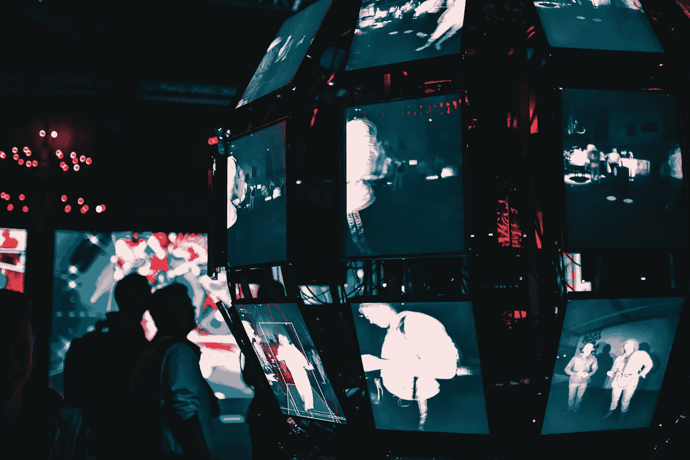*

*Photo by [Maxim Hopman](https://unsplash.com/@nampoh?utm_source=unsplash&utm_medium=referral&utm_content=creditCopyText) on [Unsplash](https://unsplash.com/s/photos/machine-learning?utm_source=unsplash&utm_medium=referral&utm_content=creditCopyText)*

*由于我们将相同的评估算法应用于受中风影响的运动检测，使用**支持向量机(SVM)和基于 HMM 的**方法也可以增强这种检测。*

*SVM 模型建立了一种算法，为每个独立的类别分配新的样本，使其成为一个非概率的二元线性分类器。它训练最大化类别之间的差距。在中风检测的情况下，通过在该模型中进行训练，系统可以有效地识别中风症状，并做出更准确的推断。使用 SVM 可以减少错误警报的数量，从而增加智能系统的可信度和可靠性。这种方法在训练中证明了 81%的准确性。结合基于 HMM 或神经网络的方法，这在 2019 年发表的一篇论文中，在识别异常行为方面取得了突破性的 99.7%的准确率。*

*在这些智能监控系统的帮助下，我希望在未来我们可以解决中风的最后一个症状——时间。监控系统发出的即时警报可能会触发一系列紧急响应，这将大大缩短中风发作和适当医疗护理之间的时间，从而在此过程中挽救更多生命。*

*在未来，我将更深入地研究建立一个更强大的神经网络，可以为我在文章中提到的需要解决的说法提供答案— ***我们如何从远处更好地分析一个人的面部特征，以便在致命的中风等情况发生之前就能检测出来？****

**

*Photo by [ThisisEngineering RAEng](https://unsplash.com/@thisisengineering?utm_source=unsplash&utm_medium=referral&utm_content=creditCopyText) on [Unsplash](https://unsplash.com/s/photos/future?utm_source=unsplash&utm_medium=referral&utm_content=creditCopyText)*

***参考书目:***

*[https://MITS loan . MIT . edu/ideas-made-to-matter/machine-learning-explained](https://mitsloan.mit.edu/ideas-made-to-matter/machine-learning-explained)*

*[https://www.mathworks.com/discovery/machine-learning.html](https://www.mathworks.com/discovery/machine-learning.html)*

*[https://royal society . org/topics-policy/projects/Machine-learning/videos-and-background-information/#:~:text = Machine % 20 learning % 20 is % 20 used % 20 in，phones % 20 so % 20 as % 20 voice % 20 recognition](https://royalsociety.org/topics-policy/projects/machine-learning/videos-and-background-information/#:~:text=Machine%20learning%20is%20used%20in,phones%20such%20as%20voice%20recognition)*

*[https://www . brief cam . com/resources/blog/how-can-machine-learning-be-use-for-CCTV-video-monitoring/](https://www.briefcam.com/resources/blog/how-can-machine-learning-be-used-for-cctv-video-surveillance/)*

*[https://scholar.google.co.nz/scholar?q =视频+监控+使用+机器+学习&HL = en&as _ SDT = 0&as _ vis = 1&oi = schol art](https://scholar.google.co.nz/scholar?q=Videos+Surveillance+using+machine+learning&hl=en&as_sdt=0&as_vis=1&oi=scholart)*

*[http://www.ijmlc.org/vol9/785-L0182.pdf](http://www.ijmlc.org/vol9/785-L0182.pdf)*

*[https://www . science direct . com/science/article/pii/s 1532046420301283](https://www.sciencedirect.com/science/article/pii/S1532046420301283)*

*[https://ieeexplore.ieee.org/abstract/document/6906721](https://ieeexplore.ieee.org/abstract/document/6906721)*

*[https://link . springer . com/article/10.1007/s 41870-019-00364-0](https://link.springer.com/article/10.1007/s41870-019-00364-0)*

*[https://pubmed.ncbi.nlm.nih.gov/34205259/](https://pubmed.ncbi.nlm.nih.gov/34205259/)*

*https://www.nature.com/articles/s41598-019-38748-8*

*【https://dl.acm.org/doi/10.1145/3474121#d1e1956 *

*[https://bmcbiol . biomed central . com/articles/10.1186/s 12915-022-01434-9](https://bmcbiol.biomedcentral.com/articles/10.1186/s12915-022-01434-9)*

* [## 背景减法

### 背景减除法(BSM)是最流行的目标检测方法之一。这个算法…

www.sciencedirect.com](https://www.sciencedirect.com/topics/engineering/background-subtraction)  [## Mlearning.ai 提交建议

### 如何成为 Mlearning.ai 上的作家

medium.com](/mlearning-ai/mlearning-ai-submission-suggestions-b51e2b130bfb)*