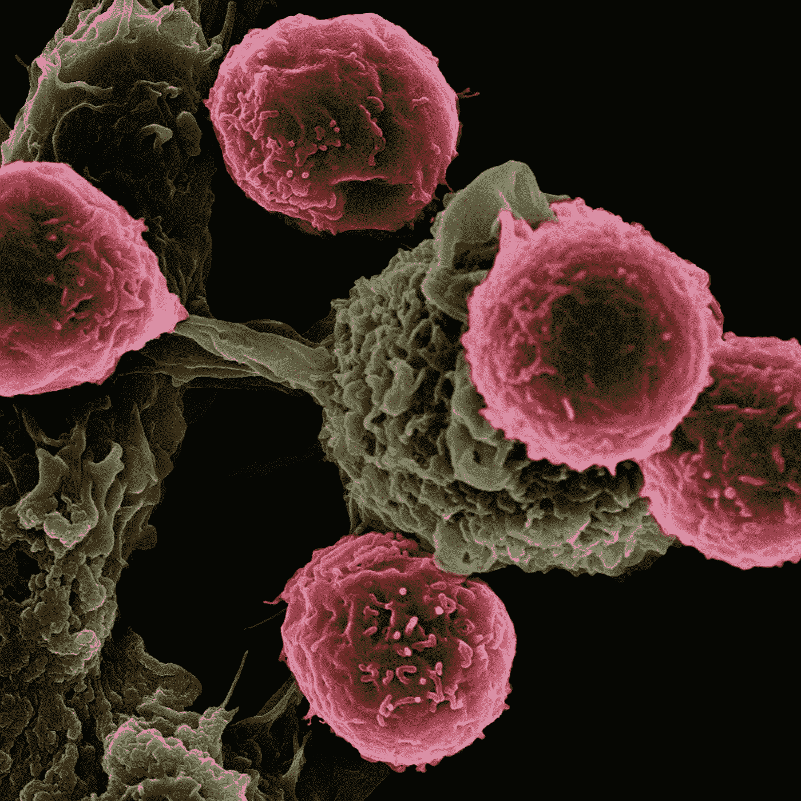

# 机器学习作品集中展示的最佳项目

> 原文：<https://medium.com/mlearning-ai/best-projects-to-showcase-in-machine-learning-portfolio-11fd5fa00bfc?source=collection_archive---------0----------------------->

Photo by [Marvin Meyer](https://unsplash.com/@marvelous?utm_source=medium&utm_medium=referral) on [Unsplash](https://unsplash.com?utm_source=medium&utm_medium=referral)

机器学习和数据科学是目前互联网上的热门词汇。随着许多行业转向这场人工智能革命，人工智能正在获得快速的牵引力。尽管存在在线课程和硕士学位，但对机器学习的需求仍然很大，各行业所需的人才短缺。由于机器学习领域每天都有越来越多的应用程序被创建，因此公司都期待着高薪聘用候选人。

Photo by [XPS](https://unsplash.com/@xps?utm_source=medium&utm_medium=referral) on [Unsplash](https://unsplash.com?utm_source=medium&utm_medium=referral)

在申请机器学习工程师或数据科学家角色时，有工作经验也很重要。由于数据科学是最近才发展起来的，所以想要拥有成为机器学习工程师所需的工作经验是相当困难的。绕过这个漏洞的一个方法是创建一个项目和大学经历的组合，让潜在雇主对你在该领域的知识有一个好的了解。下面是一个项目列表，人们可以将这些项目包含在他们的机器学习组合中，以获得雇主的良好保留。

下面是一些最好的项目，你可以上传到你的作品集里，吸引招聘人员的注意。这是根据我的意见，但它可能因人而异。

1.  **使用机器学习预测文本的可读性**

Photo by [Rishabh Sharma](https://unsplash.com/@rishabhben?utm_source=medium&utm_medium=referral) on [Unsplash](https://unsplash.com?utm_source=medium&utm_medium=referral)

许多行业都在为他们的日常工作实现自然语言处理(NLP)。汽车、医疗保健和广告行业是实施这项技术的一些行业。因此，将这个项目添加到你的文件夹中会大大增加你获得人们和招聘人员关注的机会。

在这个项目中，使用各种机器学习和深度学习技术来预测文本的难度。因为可用的文本是字符串的形式，所以将它转换成可用于机器学习目的的形式(数字)是很重要的。因此，必须采取措施对文本进行预处理，并将其转换为数字格式，以便机器学习模型可以分别执行预测。

**2。华盛顿自行车需求预测**

Photo by [Markus Winkler](https://unsplash.com/@markuswinkler?utm_source=medium&utm_medium=referral) on [Unsplash](https://unsplash.com?utm_source=medium&utm_medium=referral)

当前自行车租赁服务的一个挑战是，他们无法了解一天中不同时间不同地区对自行车的需求。为了让他们理解这一点，他们必须收集以前的信息和自行车需求的历史。然而，这是一个繁琐的过程，需要收集大量的数据点。让事情变得复杂的是，对于一个人类读者来说，考虑各种特征并理解是什么分别导致了自行车需求的上升或下降也是非常困难的。

这就是机器学习发挥作用的地方，它可以分别用于预测自行车的需求。使用数据可视化和特征提取，人们将能够理解数据，并清楚地区分导致自行车需求增加的因素，反之亦然。除此之外，机器学习模型将用于预测一天中不同时间的自行车需求。使用这些算法，公司可以在一天中的许多情况下采取正确的行动，并产生利润。

**3。使用机器学习进行癌症诊断预测**

Photo by [National Cancer Institute](https://unsplash.com/@nci?utm_source=medium&utm_medium=referral) on [Unsplash](https://unsplash.com?utm_source=medium&utm_medium=referral)

癌症是引起人类关注的死因之一。准确地识别和理解癌症是如何扩散的，对每个人来说都很简单。凭借医学领域的大量专业知识，医生们正在通过考虑导致其病情真实的各种特征来识别癌症。来自机器学习社区的一个有趣的发现是，癌症也可以使用各种机器学习和深度学习算法来预测。基于算法的输出，他们可以被视为高风险个体或低风险个体。因此，可以对高风险个体采取适当的步骤，以便帮助他们分别降低患癌症的机会。这也可以包括在你的文件夹里，因为这也会给你的简历增加很多分量。

**4。使用机器学习的推特情感分析**

Photo by [Claudio Schwarz](https://unsplash.com/@purzlbaum?utm_source=medium&utm_medium=referral) on [Unsplash](https://unsplash.com?utm_source=medium&utm_medium=referral)

借助机器学习和数据科学，还可以检测各种文本的情绪，并确定其极性。这真的很重要，因为 Twitter 产生了大量的文本数据，人类无法花时间阅读用户提供的每一条文本。这就是机器学习发挥作用的地方，它会接收文本并预测情绪或极性，基于这些情绪或极性，它们可以分别被保留或删除。将这个项目添加到你的投资组合中可以向雇主展示你在自然语言处理领域的熟练程度。

**5。使用机器学习进行学生表现分析**

Photo by [Redd](https://unsplash.com/@reddalec?utm_source=medium&utm_medium=referral) on [Unsplash](https://unsplash.com?utm_source=medium&utm_medium=referral)

由于学术对于成为机器学习工程师或数据科学家来说是不可或缺的，因此必须采取正确的措施来提高学生在测试和家庭作业中的分数。当我们对学生的表现进行数据分析和可视化时，可以找到非常有用的指标，这将进一步巩固我们对机器学习模型的理解。此外，可以部署深度学习，以确保我们从表现良好的学生和需要更多关注的学生那里获得最佳结果。

例如，假设有人想找出影响学生分数的指标。查看各种要素并将其绘制出来有助于数据科学家理解它们，并向大学或学校的教师和其他成员解释它们。因此，他们可以根据这些指标采取适当的措施来提高学生的整体表现。此外，诸如逻辑回归和决策树之类的机器学习模型可以帮助给出特征重要性，从而分别导致对学生的表现度量的更好理解。

**6。垃圾邮件检测**

Photo by [Mikaela Wiedenhoff](https://unsplash.com/@mikaela_wiedenhoff?utm_source=medium&utm_medium=referral) on [Unsplash](https://unsplash.com?utm_source=medium&utm_medium=referral)

有时，某些电子邮件包含广告、成人内容和病毒等内容。需要注意的一点是，这些电子邮件包含可以被机器学习算法识别的特定模式的信息。获取所有邮件的数据集并标注它们是否是垃圾邮件，可以在将它们交给模型进行预测之前先完成。考虑到大量的数据点将导致更好的机器学习预测。

一旦收集了数据，必须使用正确的特征将它们提供给模型，以便模型可以做出最准确的预测。需要注意的是，机器学习模型在训练数据上表现良好并不那么重要。一件事是，他们必须在测试集上表现良好(模型之前没有看到的数据)。

对于一个在机器学习或数据科学方面是**新手**并且缺乏成为一名机器学习或数据科学新手的**经验**的人来说，如果你建立一个包含你最好的项目和任务的强大作品集，这将会非常方便。请随意观看此**视频**，我在其中强调并解释了投资组合在获得第一份数据科学工作中的重要性。谢了。

Video on Building a Strong Portfolio to be selected in Top Companies (FAANG)

# **结论**

总而言之，投资组合可以展示你的机器学习和数据科学技能，这确实有助于分别作为机器学习工程师或数据科学家获得第一份机器学习工作。上述项目将分别强调机器学习的一些核心优势，如数据可视化、数据预处理和预测。欢迎分享您的想法和反馈。谢谢！

你的会员费直接支持苏哈斯·马达利和你阅读的其他作家。你还可以完全接触到媒体上的每个故事，每月只需 5 美元。点击下面的链接成为 Medium 的会员，并获得无限制的文章列表。谢了。

[https://suhas-maddali007.medium.com/membership](https://suhas-maddali007.medium.com/membership)

如果你想进一步了解我的工作，下面是我们可以联系的细节，你也可以查看我的工作。

**GitHub:**https://github.com/suhasmaddali

【领英:[https://www.linkedin.com/in/suhas-maddali/](https://www.linkedin.com/in/suhas-maddali/)

**https://www.facebook.com/suhas.maddali:**T10

 [## Mlearning.ai 提交建议

### 如何成为 Mlearning.ai 上的作家

medium.com](/mlearning-ai/mlearning-ai-submission-suggestions-b51e2b130bfb)