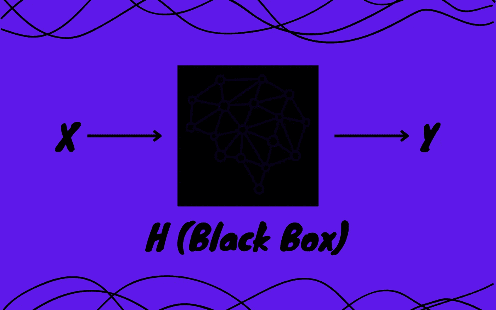

# 开发人工智能模型的黑盒与白盒方法

> 原文：<https://medium.com/mlearning-ai/black-box-vs-white-box-approaches-to-develop-ai-models-b07d781520b8?source=collection_archive---------3----------------------->

## 让我们仔细研究一下这两种方法的深度

Image by Author

从网飞、亚马逊等网站上的个性化推荐到优化电网的电力供应，人工智能(AI)正在迅速改变科学、商业和日常生活的面貌，在每个应用中，人工智能模型都服务于这一目的。无论模型来自哪个领域，是机器学习(ML)、深度学习(DL)、强化学习(RL)还是任何其他领域，开发人员都采用黑盒方法或白盒方法。

在这篇博客中，我们将简要介绍这两种方法，然后介绍这两种方法各自的优缺点。我们还将看看这些方法被利用的一些例子，以及它们的结果如何。无论是好是坏，我们现在都将把它作为一个谜，一个我们将在以后的旅程中揭开的谜。

# 简介

黑盒和白盒方法是不局限于人工智能的通用方法。它们被用来开发传统的软件，它们被用来测试软件，在众多的其他用途中，它们也被用来开发人工智能模型。为了给它们一个正式的定义，我们将通过一个使用这两种方法开发人工智能模型的例子。

假设我们想要开发一个人工智能模型“H”，它基于我们的输入“X”，预测“Y”，即 H(X) = Y。如果我们使用黑盒方法开发模型，我们可以以任何我们想要的方式看到和利用结果，但我们不能理解 H 为什么为 X 预测 Y 背后的逻辑。相反，如果我们使用白盒方法开发模型，我们将获得结果以及这些结果背后的逻辑。现在，在这一点上，一个人可能会跳到白盒方法的船上，但是我们很快就会看到为什么这个决定在某些情况下可能会适得其反。所以，废话不多说，让我们从这两种方法的优缺点开始。

# 白盒方法

Image by Author

如果模型是以白盒方法为核心开发的，那么根据定义，模型的决策过程将是完全透明的，随着人工智能模型在每个领域的自动化决策中的使用越来越多，这在很大程度上变得至关重要。如果需要的话，它可以让用户审核人工智能模型做出的决策。这包括对诸如“为什么模型做出一个特殊的决定？”、“对特定决策影响最大的变量是什么？”，“模型为达成特定决策而采取的假设是什么？”，还有很多。

当涉及的风险成倍增加时，这种可解释性变得更加重要。一个简单的例子可能是涉及医疗保健领域的人工智能模型。在这种情况下，人的生命处于危险之中，因此，对于医疗从业者来说，最重要的是确保模型做出合理的假设，并受到适当因素的影响。

然而，与此同时，这种可解释性，应该使这些人工智能模型更加可靠；使他们暴露于经常被用于不可接受的目的的漏洞。让我举一个我在 2022 年 3 月 30 日的[批次中遇到的令人震惊的例子。Collaborations Pharmaceuticals 的研究人员建立了一个药物发现模型来设计有用的医疗药物，在这个过程中，他们开发了一个排名功能，对有毒药物进行惩罚，对具有更大生物影响的药物进行奖励。在一项实验中，研究人员颠倒了毒性因子，优先考虑具有最大影响的最致命化合物，该模型继续在短短 6 小时内产生了 *4 万种毒素*，其中一些是*实际化学战剂*，它们甚至不存在于初始数据集中。](https://read.deeplearning.ai/the-batch/issue-138/)

这个讨论非常清楚地回避了这个问题，“如果白盒方法引入了漏洞，那么我们应该采用黑盒方法来开发我们的 AI 模型吗？”。让我们在下一节回答这个问题。

> 如果你不知道这一批，这是人工智能领域最好的时事通讯之一。我在这篇博客的末尾附上了相同的链接！

# **黑盒方法**

Image by Author

正如您现在可能已经熟悉的那样，以黑盒方法为核心开发的模型为其用户提供了最低限度的可解释性。这使得黑盒方法对于风险相当大的应用程序来说是一个糟糕的选择。然而，同时，这也避免了模型暴露其漏洞。

考虑一个例子，其中一家银行需要一个模型，该模型可以根据多种因素预测是否应该向申请人提供贷款，这些因素包括申请人的信用评分、债务收入比、首付金额、流动资产、抵押品价值等。假设我们从决策树模型(一个高度可解释的模型，即白盒方法的近似)开始建模。现在，不知何故，一个经纪人得到了这个模型，由于它的可解释性，他/她发现这个模型似乎接受拥有高价值抵押品的申请人，尽管他们的信用评分低，债务收入比高。利用这一事实，经纪人为许多申请人获得了贷款，并获得了高额佣金。

现在，考虑同一个例子，其中我们使用了一个随机森林模型(相对来说可解释性较差，即黑盒方法的近似)。在这种情况下，即使经纪人得到了模型，由于其不透明的性质，经纪人也不太可能利用它。当暴露漏洞的风险太高时，这就是为什么黑盒方法更适合的原因。

使用黑盒方法还有一个额外的优势。就其可解释性而言，采用黑盒方法的模型没有任何限制。在这种情况下，这些预测模型是如此复杂的变量函数并不罕见，以至于没有人能够理解这些变量是如何相互关联以达到最终预测的。然而，这往往会使模型在性能方面得到额外的提升，因为这种情况下的唯一目标是表现更好并获得更多利润，当这种情况发生时，企业往往倾向于采用黑箱方法，或者至少多年来一直如此。

> 如果你有兴趣了解更多关于决策树和随机森林模型的知识，以及为什么决策树模型比随机森林模型更容易解释，那么你可以在这篇博客的末尾找到一些很棒的资源！

# 形势正在逆转吗？

如果你是那些认为博客已经结束的人之一，那么让我向你保证，我是你们中的一员，直到我看到辛西娅·鲁丁和乔安娜·雷丁的这篇文章。这篇文章强调了最近出现的趋势，即普通民众越来越担心随着人工智能的使用越来越多，他们的生活如何受到日常影响，以及这种趋势如何强烈武装企业转向白盒方法。此外，这篇文章提出了一个非常重要的问题，即“*为什么我们在不需要的时候在 AI 中使用黑盒模型？*”。它还解释了*认为为了可解释性必须牺牲准确性的观点是不准确的*，并为研究人员解决这一观点的一些最值得注意的努力提供了参考。

我强烈建议你们每一个人都去阅读这篇精彩的文章，但是对于那些不感兴趣的人(直到现在)，让我用这篇文章中描述的一个有趣的轶事来唤起你们更多的兴趣。

2018 年，举办了一场重大的人工智能挑战赛，目标是为数据集创建一个复杂的黑盒模型，并解释其工作原理，即从黑盒方法过渡到白盒方法。在宣布挑战获胜者之前，观众被要求参加一项思维实验，他们被诊断患有癌症，需要手术切除肿瘤。在屏幕上，有两个图像。一幅图像显示，一名人类外科医生可以解释手术的任何内容(即白盒方法)，但在手术过程中有 15%的机会导致死亡。另一幅图像描绘了一个能够以 2%的失败概率进行手术的机器人手臂。在这种情况下，完全信任机器人是必要的；不能向它提出任何问题，也不能详细解释它是如何做出判决的(即黑箱方法)。然后，观众被要求举手表明他们更喜欢两个候选人中的哪一个来进行拯救生命的手术。除了一只手，所有人都投票给机器人。

虽然黑盒方法显然会胜出，但这回避了一个非常重要的问题，即“*为什么机器人必须是黑盒？如果机器人被赋予了自我解释的能力，它会失去进行精确手术的能力吗？*”，而这个答案，你很清楚地知道去哪里找。

> 对于那些对找到答案感兴趣的人，你可以在这篇博客的末尾找到这篇文章的链接！

# 关于我的一点点👋

> 如果你没有兴趣认识作者，或者你已经认识我，你可以安全地跳过这一节。我保证这部分没有隐藏的宝藏。我是一个人工智能爱好者，也是一个音乐爱好者。目前，我正在探索旧的东西，同时，学习新的东西。我真的希望你喜欢这个博客，如果你喜欢，请把你的手放在一起👏如果你想阅读更多的博客，请点击#StayTuned。在 [LinkedIn](https://www.linkedin.com/in/elemento24/) 和 [Twitter](https://twitter.com/elemento24_) 上与我联系。

# 额外资源

 [## 批处理|深度学习。人工智能

### 机器学习领域的就业增长，亚马逊人工智能驱动的服装店，机器人视觉的变形金刚，雇佣算法…

read.deeplearning.ai](https://read.deeplearning.ai/the-batch/)  [## 决策树与随机森林——你应该使用哪种算法？

### 让我们从一个思维实验开始，它将说明决策树和随机森林之间的区别…

www.analyticsvidhya.com](https://www.analyticsvidhya.com/blog/2020/05/decision-tree-vs-random-forest-algorithm/)  [## 基于决策树模型的可解释机器学习。

### 这篇文章的主题是试图解释基于决策树的方法是如何强大而又非常…

medium.com](/intel-student-ambassadors/interpretable-machine-learning-with-decision-tree-based-models-ae78245dc506)  [## 随机森林决策的可解释性

### 感谢您为交叉验证提供答案！请务必回答问题。提供详细信息并分享…

stats.stackexchange.com](https://stats.stackexchange.com/questions/464949/interpretability-of-random-forest-decisions)  [## 为什么我们在不需要的时候在 AI 中使用黑盒模型？来自一个可解释的人工智能的一课…

### 2018 年，人工智能(AI)领域发生了一个具有里程碑意义的挑战，即可解释的机器学习…

hdsr.mitpress.mit.edu](https://hdsr.mitpress.mit.edu/pub/f9kuryi8/release/7)  [## Mlearning.ai 提交建议

### 如何成为 Mlearning.ai 上的作家

medium.com](/mlearning-ai/mlearning-ai-submission-suggestions-b51e2b130bfb)