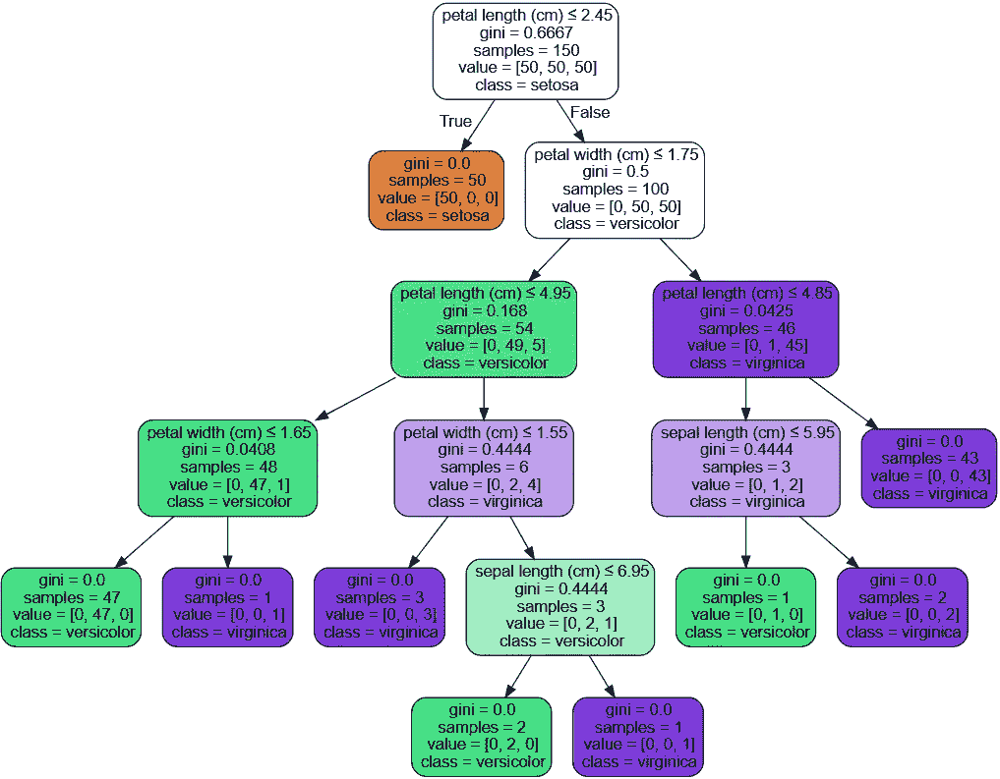
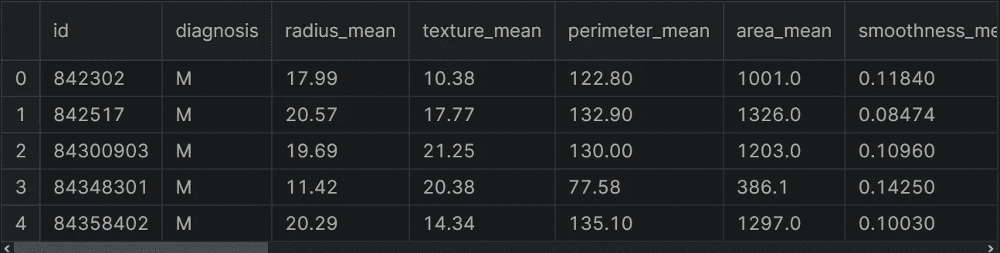

# 基于决策树的乳腺癌检测

> 原文：<https://medium.com/mlearning-ai/breast-cancer-detection-with-decision-trees-f66637ac482e?source=collection_archive---------1----------------------->

关于如何使用 scikit-learn 找出决策树算法的最佳参数的指南。


Photo by [Johannes Plenio](https://unsplash.com/@jplenio?utm_source=medium&utm_medium=referral) on [Unsplash](https://unsplash.com?utm_source=medium&utm_medium=referral)

决策树是最常用的机器学习算法之一。在这篇文章中，我将讨论以下主题，

*   什么是决策树？
*   决策树的一些优点和缺点
*   数据预处理
*   构建模型
*   模型评估
*   网格搜索超参数调谐

更多关于机器学习的内容，可以关注我们的 [Tirendaz Academy](https://youtube.com/c/tirendazacademy) YouTube 频道。

让我们开始吧！

# 什么是决策树？

决策树是一种非参数的监督学习。这种技术广泛用于分类和回归任务。这种方法的目标是创建一个模型来预测目标变量的值。换句话说，决策树编码了一系列 if-then-else 规则。树中的每个节点都包含一个条件。



[Decision tree for iris dataset](https://scikit-learn.org/stable/modules/tree.html#tree)

# 决策树的一些优点和缺点

像其他机器学习评估器一样，决策树有一些优点和缺点。通过考虑以下问题，您可以构建一个良好的决策树模型。

首先，我们来看看决策树的一些优点。

*   决策树很容易理解和解释。
*   你可以很容易地想象树木。
*   决策树几乎不需要数据预处理。
*   您可以使用这种技术处理数值和分类数据。

当然，决策树也有一些缺点。让我们来看看这些缺点。

*   决策树学习者可以创建过于复杂的树，不能很好地概括数据。为了克服这个问题，您可以使用一些方法，例如设置树的最大深度，设置叶节点所需的最小样本数，以及修剪。
*   决策树可能不稳定。为了避免这个问题，您可以在集成中使用决策树。

# 具有 scikit 学习的决策树

为了展示如何实现决策树算法，我将使用乳腺癌威斯康星州数据集。在加载数据集之前，让我导入熊猫。

```
import pandas as pd
```

让我们加载数据集。

```
df = pd.read_csv( “Breast Cancer Wisconsin.csv”)
```

你可以在这里找到数据集。让我们看一下数据集的前五行。

```
df.head()
```



The first rows of the breast cancer dataset

该数据集由恶性和良性肿瘤细胞的例子组成。数据集中的第一列显示唯一的 ID 号，第二列显示诊断，假设 M 表示恶性，B 表示良性。其余栏目是我们的特色。让我们来看看数据集的形状。

```
df.shape# output:
(569, 33)
```

# 数据预处理

现在，让我们创建输入和输出变量。为此，我将使用 loc 和 drop 方法。首先，让我创建我们的目标变量。

```
y = df.loc[:,"diagnosis"].values
```

太美了。我们创建了目标变量。让我们创建我们的特征变量。为此，我将使用 drop 方法。让我删除目标变量和不必要的列。

```
X = df.drop(["diagnosis","id","Unnamed: 32"],axis=1).values
```

注意，我们的目标变量有两个类别，M 和 b。让我们用标签编码器对目标变量进行编码。首先，我要导入这个类。

```
from sklearn.preprocessing import LabelEncoder
```

现在，我要从这个类创建一个对象。

```
le = LabelEncoder()
```

让我们拟合并转换我们的目标变量。

```
y = le.fit_transform(y)
```

在构建模型之前，让我们将数据集分为训练集和测试集。为此，我将使用 train_test_split 函数。首先，让我导入这个函数。

```
from sklearn.model_selection import train_test_split
```

让我们使用这个函数分割数据集。

```
X_train, X_test, y_train, y_test = train_test_split(X, y,   
                                                    stratify=y,
                                                    random_state=0)
```

# 构建决策树模型

让我们来看看如何构建决策树模型。首先，我要导入决策树分类器类。

```
from sklearn.tree import DecisionTreeClassifier
```

让我们从这个类创建一个对象。首先，我想使用默认值。因此，我将只使用 random_state 参数。

```
dt = DecisionTreeClassifier(random_state = 42)
```

让我们用训练集来建立模型。

```
dt.fit(X_train, y_train)
```

太棒了。我们建立了我们的模型。现在，让我们用这个模型来预测训练值和测试值。

```
y_train_pred=dt.predict(X_train)
y_test_pred=dt.predict(X_test)
```

现在，让我们看看模型在训练集和测试集上的性能。为此，我将使用 accuracy_score 函数。首先，让我导入这个函数。

```
from sklearn.metrics import accuracy_score
```

现在，让我们来看看训练集和测试集的准确性分数。

```
tree_train = accuracy_score(y_train, y_train_pred)
tree_test = accuracy_score(y_test, y_test_pred)
```

现在，让我们打印这些分数。

```
print(f’Decision tree train/test accuracies: 
       {tree_train:.3f}/{tree_test:.3f}’)#Output:
Decision tree train/test accuracies:1.000/0.951
```

如您所见，训练集上的分数是 100%，但测试集上的分数是 95%。这意味着我们的模型存在过拟合问题。请注意，决策树模型对训练集的学习非常好。所以，它只是记住了结果。但是，模型不能一概而论。请注意，当我们有一个复杂的模型时，会发生过度拟合。

为了克服过度拟合问题，我们控制树的复杂性。要做到这一点，我们有多种方法。首先，让我们指定 max_depth 参数，它控制级别的最大数量。max_depth 参数的默认值是 None，这意味着树可以尽可能地增长。我们可以尝试较小的值，并比较结果。让我指定 max_depth 参数。

```
dt = DecisionTreeClassifier(max_depth=2)
dt.fit(X_train, y_train)
```

现在，让我们再来看看这个模型在训练集和测试集上的表现。

```
y_train_pred=dt.predict(X_train)
y_test_pred=dt.predict(X_test)
tree_train = accuracy_score(y_train, y_train_pred)
tree_test = accuracy_score(y_test, y_test_pred)
print(f’Decision tree train/test accuracies: 
      {tree_train:.3f}/{tree_test:.3f}’)#Output:
Decision tree train/test accuracies:0.951/0.923
```

如您所见，训练集上的性能是 100%，但现在只有 95%。这意味着模型不再能够记住训练集中的所有结果。通过降低复杂性，我们提高了模型的泛化能力。

但是，另一个问题是模型过于简单。为了做得更好，我们需要使用不同的参数来调整模型。为此，我将使用网格搜索技术。

# 网格搜索超参数调谐

你可以用网格搜索技术找出你的模型的最佳参数。让我们导入 GridSearchCV 类。

```
from sklearn.model_selection import GridSearchCV
```

首先，我将从 DecisionTreeClassifier 创建一个对象。

```
dt = DecisionTreeClassifier(random_state = 42)
```

现在，让我创建一个参数变量，它包括 max_depth 和 min_leaf_size 的值，这是另一个重要的参数。

```
parameters = {"max_depth":[1, 2, 3, 4, 5, 7, 10],  
              "min_samples_leaf": [1, 3, 6, 10, 20]}
```

太棒了。我们指定了参数的值。为了找到最佳参数，我将从 GridSearchCV 创建一个对象。

```
clf = GridSearchCV(dt, parameters, n_jobs= 1)
```

我们的模型可以训练了。接下来，我将使用训练集来拟合我们的模型。

```
clf.fit(X_train, y_train)
```

最后，为了查看最佳参数，我将使用 best_params_ attribute。

```
print(clf.best_params_)#Output:
{'max_depth': 3, 'min_samples_leaf': 1}
```

当我们执行这个单元时，你可以看到最好的参数。最大深度为 3，最小样本叶为 1。

# 评估模型

现在，我要预测用这些参数训练的这个模型。注意，我们不需要再次训练我们的模型。因为找到最佳参数后，模型就训练好了。让我们预测训练值和测试值。

```
y_train_pred=clf.predict(X_train)
y_test_pred=clf.predict(X_test)
tree_train = accuracy_score(y_train, y_train_pred)
tree_test = accuracy_score(y_test, y_test_pred)
print(f’Decision tree train/test accuracies:
      {tree_train:.3f}/{tree_test:.3f}’)#Output:
Decision tree train/test accuracies:0.974/0.958
```

给你。根据最佳参数找到准确度分数。请注意，我们的模型在训练集上的得分接近测试集上的得分。此外，两者的准确度分数都接近 1。因此，我们获得了最佳参数，并使用这些参数预测了训练集和测试集中的值。

# 结论

决策树是一种非参数的监督学习方法。您可以使用决策树算法执行分类和回归任务。在这篇文章中，我谈到了决策树以及如何用 scikit learn 实现这项技术。最后，我展示了如何用网格搜索技术找出最佳参数。你可以在这里找到这个笔记本[。](https://www.kaggle.com/code/tirendazacademy/breast-cancer-detection-with-decision-trees)

就是这样。感谢阅读。我希望你喜欢它。别忘了在[YouTube](https://www.youtube.com/channel/UCFU9Go20p01kC64w-tmFORw)|[GitHub](https://github.com/tirendazacademy)|[Twitter](https://twitter.com/TirendazAcademy)|[ka ggle](https://www.kaggle.com/tirendazacademy)|[LinkedIn](https://www.linkedin.com/in/tirendaz-academy)上关注我们。

[](/mlearning-ai/ensemble-learning-adaboost-with-python-8332778fbb61) [## 集成学习—使用 Python 的 AdaBoost

### 关于如何用 scikit-learn 实现自适应增强(AdaBoost)算法的指南。

medium.com](/mlearning-ai/ensemble-learning-adaboost-with-python-8332778fbb61) [](/geekculture/top-8-machine-learning-algorithms-df30277b2056) [## 8 种最佳机器学习算法

### 数据科学家和机器学习工程师应该知道的最好的机器学习算法。

medium.com](/geekculture/top-8-machine-learning-algorithms-df30277b2056) 

如果这篇文章有帮助，请点击拍手👏按钮几下，以示支持👇

[](/mlearning-ai/mlearning-ai-submission-suggestions-b51e2b130bfb) [## Mlearning.ai 提交建议

### 如何成为 Mlearning.ai 上的作家

medium.com](/mlearning-ai/mlearning-ai-submission-suggestions-b51e2b130bfb)