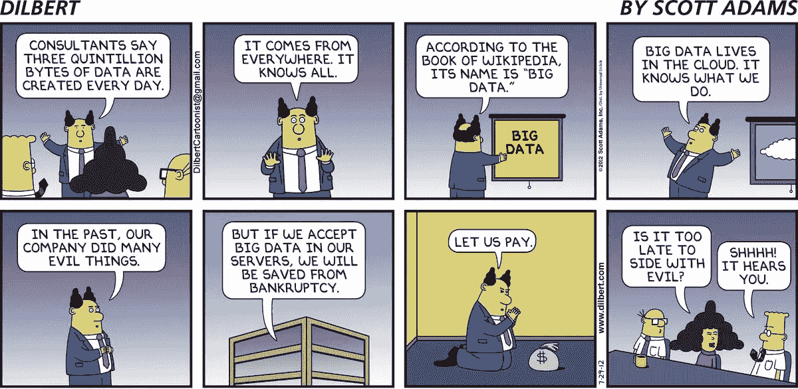
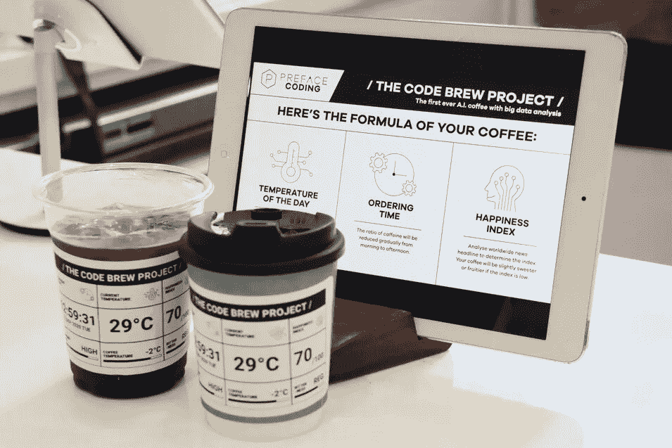
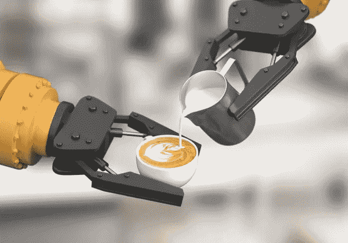
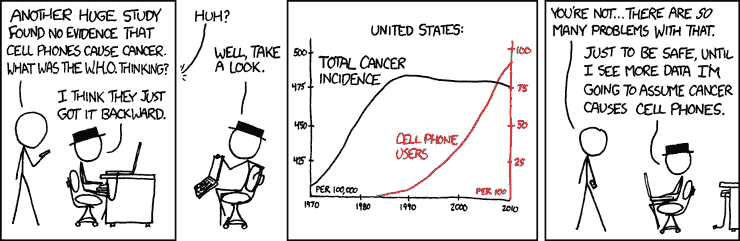

# 冲泡基于 AI 和大数据的“完美”咖啡？！数据科学到底是什么

> 原文：<https://medium.com/mlearning-ai/brewing-the-perfect-coffee-based-on-ai-and-big-data-what-data-science-really-is-about-672fffc95e73?source=collection_archive---------3----------------------->

(Credits: 《Dilbert》by Scott Adams)

Nowadays, **artificial intelligence (AI), machine learning (ML), data science, big data**, etc have become the trendy and “sexist” buzzword in almost every industries, especially since DeepMind has developed AlphaGo that beat the world’s top human professional Go players and is far ahead of human players in attaining the *Kami no Itte* (神の一手, “Divine Move”) *.

* means “a God’s/perfect move”, a term from Japanese animeHikaru no Go (ヒカルの碁)

这多少让我想起了我青少年时期的网络泡沫，或者近年来的量子/纳米技术热潮，许多人试图在营销他们的产品时使用“量子”或“纳米”这个词，即使它们大多与量子或纳米物理学无关。数据科学/人工智能会是另一个即将破裂的泡沫吗？数据科学和/或大数据的真正含义是什么？

**真实还是骗局？利用 AI &大数据冲泡咖啡？**

(Preface Coffee, a coffeehouse that claims to use AI and big data to brew coffee in Hong Kong. Photo from [http://startupbeat.hkej.com/?p=93389](http://startupbeat.hkej.com/?p=93389))

在我介绍什么是真正的数据科学之前，让我先告诉你一个故事:

去年香港有一则本地新闻《招徕》(？)有一家新的咖啡馆是由一所编码学校创建的，该学校声称已经开发出一种人工智能系统，可以分析大数据，包括天气、白天温度、一天中的时间，甚至对当前新闻标题的影响程度，以便为客户酿造最合适的咖啡。

*只是一个免责声明:我没有去过咖啡馆，所以我不能评论这是真的还是像阿里斯特咖啡兄弟[2]，*那样的骗局，尽管对我来说这更像是一个噱头。

如果你问我，要煮一杯好咖啡，最重要的是咖啡师的技术和咖啡豆的质量。其他因素如天气、气温、新闻标题大多无关紧要，最多是次要的或影响较小的。更何况品味和好感度都是主观的东西。例如，艾米可能喜欢寒冷的天气和苦味的咖啡，而鲍勃可能喜欢炎热的天气和酸味的咖啡，更不用说新闻标题了，尤其是政治新闻。那么顾客在那里买咖啡之前是否需要先回答一套个人问卷呢？人们怎么能确定对新闻标题或为顾客调制最合适咖啡的配方有一个明确的、普遍接受的“喜爱程度”呢？

（photo from [https://securecdn.pymnts.com/wp-content/uploads/2020/05/smart-factory-robot-artificial-intelligence-AI-social-distancing-Vision-Semicon-coronavirus-south-korea-.jpg](https://securecdn.pymnts.com/wp-content/uploads/2020/05/smart-factory-robot-artificial-intelligence-AI-social-distancing-Vision-Semicon-coronavirus-south-korea-.jpg))

与其投资金钱和时间来开发一个复杂的机器学习模型，包括**自然语言处理(NLP)^** )和分析次要或大部分不相关的数据集，不如做一些事情，比如提高咖啡师的技能，获得各种最佳质量的食材，甚至只是改善员工的工作环境，这肯定会更具成本效益。即使你确实想应用人工智能或大数据来酿造最好的咖啡，这些工具也应该用于分析咖啡馆的咖啡师和咖啡豆等原材料，而不是那些次要或无关的数据。

^简单来说，NLP 可以理解为计算机和人类语言之间的翻译。特别是如何给计算机编程，将自然语言数据转换成一串对计算机有意义的“0”和“1 ”,并可用于进一步分析。大多数机器学习模型中的情感分析都是使用 NLP 完成的

**数据科学家和数据分析师的区别**

回到正题，那么什么是数据科学和/或大数据？说实话，与数学题目不同，数据科学和大数据更像是一个“模糊”的概念。从某种程度上来说，并没有一个明确的、被普遍接受的定义。然而，我将尝试使用我作为数据科学家的工作经验来解释我和业界通常是如何看待“数据科学”的。

首先，也是最明显的，数据科学必须包括分析数据。在这里，数据可以是任何你能想到的东西，比如你说过的一句话，你访问过的一个地方或网站，因为“*一切都是数据*”，尤其是在当前的数字时代。

然而，除了最显而易见的，更重要的是理解数据，提取其潜在的见解，并应用这些见解来建立数学和/或机器学习模型，以模拟场景和/或进行客观预测。行业中典型的数据科学项目的主要目标通常是帮助人类进行一些决策过程，甚至使其自动化。例如，根据你的浏览数据来预测你可能会喜欢什么，然后向你宣传相关内容(甚至预测你的道德价值观或政治观点$,就像东方一个“强大”的大国*的老大哥在看着你*)。

$这样做存在数据伦理问题。数据伦理也是数据科学中另一个重要而有趣的话题，但是我将把它留到以后的博客文章中

因此，知道如何编写计算机程序甚至软件对于数据科学家来说是非常必要的。除此之外，了解整个机器学习模型管道，从最开始的数据收集到数据清理/清洗，数据管理和存储也很重要，尤其是在处理医疗保健数据等敏感数据时的数据管理。另一方面，简单地使用 Power BI、Tableau 甚至 Excel 等现有软件来执行数据分析任务的角色通常只会被视为数据分析师，而不是数据科学家。虽然从广义上讲，使用 Excel 的简单曲线拟合和回归分析也是一种机器学习。

**数据科学应该是“科学的”**

**（credits: xkcd #925,** [**https://imgs.xkcd.com/comics/cell_phones.png**](https://imgs.xkcd.com/comics/cell_phones.png)**）**

除此之外，作为一名前理论物理学家，如果我们将数据科学称为“科学”，我认为“真正的”数据科学项目也应该是“科学的”，即持有自然科学的精神并基于科学方法。换句话说，数据科学家也应该理解(至少部分理解)不同机器学习算法背后的底层逻辑和推理。有时甚至理解不同数据集和你所做的任何模型模拟/预测之间的因果关系。数据科学家不应该只专注于执行建模和数据分析任务，只追求尽可能好的准确性，然后盲目信任模型结果，并将机器学习模型视为黑盒。

众所周知，“*关联并不意味着因果关系*”。世界上有大量的数据，你总能在完全不相关的数据集之间找到虚假的相关性，这并不奇怪，例如参见[3]

除了解释机器学习模型结果之外，理解模型预测如何以及为什么会这样，至少在某种程度上计算和理解模型中的特征重要性，**交流，数据可视化**也很重要。数据科学家需要使用简单的图表和文字来翻译和解释这些知识和结果，以便非技术受众(通常包括利益相关者和监管者)能够轻松理解。

这是我第一篇数据科学/AI 博文的结尾。希望你喜欢:)我也是用粤语/中文写的这篇博文，如果你有兴趣也可以看看[https://medium . com/@ Godfrey . leung . cosmo/% E6 % A0 % B9 % E6 % 93% 9A ai-% E5 % A4 % A7 % E6 % 95% B8 % E6 % 93% 9A % E6 % B2 % 96% E5 % 92% 96% E5 % A1-% E6 % B7 % BA % E8 % AB](/@godfrey.leung.cosmo/根據 ai-大數據沖咖啡-淺談甚麼才是真-數據科學-ac2123279669)

参考资料和进一步阅读材料:

[1][https://www . marketing-interactive . com/前言-ai-coffee-big-data](https://www.marketing-interactive.com/preface-ai-coffee-big-data)

[2][https://dandesim . one/2017/04/04/arist-coffee-brother-quits-n bition-scams-continue](https://dandesim.one/2017/04/04/arist-coffee-brother-quits-nbition-scams-continue)

[3]虚假相关性示例[https://www.tylervigen.com/spurious-correlations](https://www.tylervigen.com/spurious-correlations)