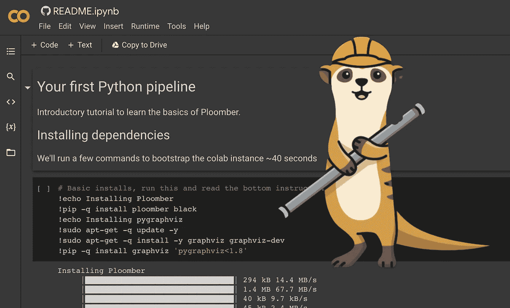

# 构建数据管道。快的

> 原文：<https://medium.com/mlearning-ai/build-data-pipelines-fast-bb2f5d25af42?source=collection_archive---------9----------------------->

## [机器学习艺术](https://mlearning.substack.com)

[http://art.mlearning.ai](http://art.mlearning.ai)

MLOps 不应过于复杂，您应该处理数据，而不是旋转基础架构和环境。多亏了 [Ploomber](#69a0) ，你可以快速连接和互动发展，而不需要转移到一个新的环境。

🟠减少了 40%开发时间，

# ⚡️Get 很快开始了