# 从零开始构建神经网络动物园:递归神经网络

> 原文：<https://medium.com/mlearning-ai/building-a-neural-network-zoo-from-scratch-the-recurrent-neural-network-9357b43e113c?source=collection_archive---------3----------------------->

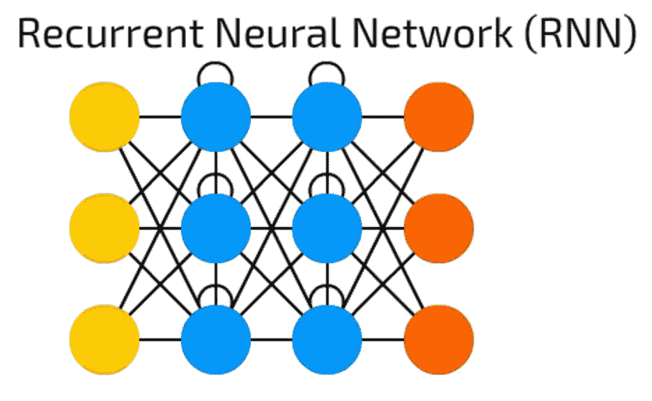

Visualization of the Vanilla Recurrent Neural Network from [Asimov Institute](https://www.asimovinstitute.org/neural-network-zoo/).

递归神经网络(RNNs)是一类深度学习架构，旨在表示数据序列。有许多不同的 RNN 架构，其中一些将在以后的文章中介绍，但是在本文中，我将重点介绍原始模型香草 RNN。如果你对深度学习架构不太熟悉，我建议你读一读我以前的文章。

尽管结果令人印象深刻，但递归神经网络的历史却相当曲折。他们早期的成功很大程度上来自于[大卫·鲁梅尔哈特在 1986 年的工作](https://apps.dtic.mil/dtic/tr/fulltext/u2/a164453.pdf)(很像多层感知机)，他们是首批在深度学习领域实现超人表现的模型。然而，RNN 的流行很大程度上是由于它的改编，如 LSTMs 和 GRUs，而不是来自它的原始设计。

# 什么是递归神经网络？

递归神经网络是基于序列的学习模型，这意味着它们用于预测数据序列中的下一个事件。他们受到大脑工作方式的启发，大脑通过不断分析以前的事件来形成和回忆记忆，以决定现在如何行动。

RNN 的魅力在于隐藏的状态。RNN 的隐藏状态表示模型希望在未来记住的信息。在每个时间步长，RNN 对输入和隐藏状态进行加权求和，直到最后一个时间步长，在该时间步长，它计算并返回最终输出。

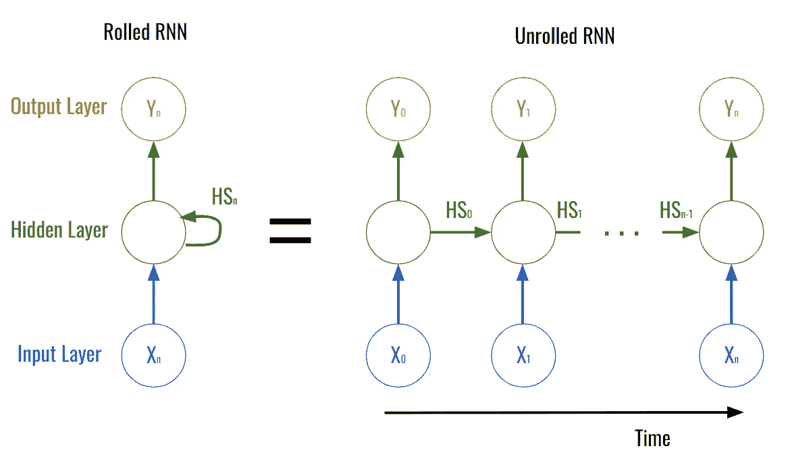

Rolled v.s Unrolled RNN.

上图展示了思考 RNNs 的两种方式:卷起和展开。在滚动模型中，您可以清楚地看到输入层、隐藏层和输出层，以及隐藏层如何连接到自身。相反，展开的模型是有用的，因为它显示了网络的中间步骤。各层保持不变，但你可以看到随着时间推移的过程。在展开的模型中，网络在第一时间步接收 X₀并返回 Y₀。然后，网络在第二个时间步中向自己传递一个隐藏状态，它使用 X₁和该隐藏状态来计算并返回 Y₁.重复相同的过程，直到网络计算并返回最终输出 Yₙ.这意味着网络的每个时间步长包含关于所有先前时间步长以及它自己的时间步长的信息。正是因为这个原因，RNNs 最初被设计用来解决多层感知器的“失忆”。然而，由于其结构，rnn 仍然容易出现[消失/爆炸梯度问题](https://www.analyticsvidhya.com/blog/2021/06/the-challenge-of-vanishing-exploding-gradients-in-deep-neural-networks/)。这是当网络层的误差接近 0(或无穷大)时，因此停止对网络输出的贡献。

# 它是如何工作的？

香草 RNN 的向前传球真的没有什么特别的。对于每个时间步，我们用下面的公式生成下一个隐藏状态，其中 *HS* 和 *x* 是时间步*n*的隐藏状态和输入

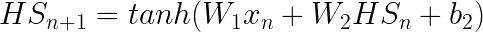

Formula for Hidden State.

一旦所有的时间步骤都被处理，网络的最终输出使用以下公式计算，其中 *HS-1* 是最终的隐藏状态。

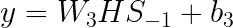

RNN output function.

反向传播算法也类似于前面讨论的网络算法，不同之处在于必须通过每个时间步长反向计算误差。这被称为通过时间的[反向传播。](https://en.wikipedia.org/wiki/Backpropagation_through_time)

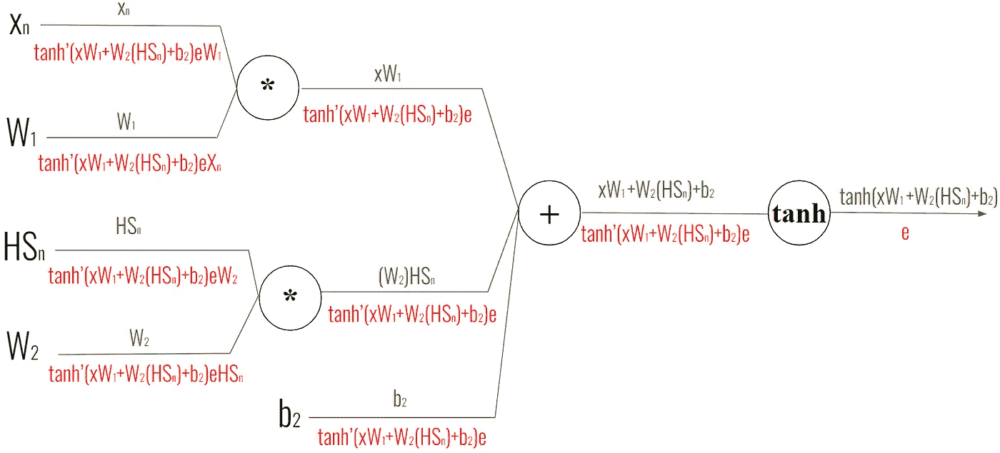

Computational graph of the hidden layers of an RNN.

*放大看文字更清楚！*

正如我在以前的帖子中解释的那样，任何给定步骤的误差都可以通过上游函数对当前函数的导数乘以上游误差来计算。这里有一个图表来说明:

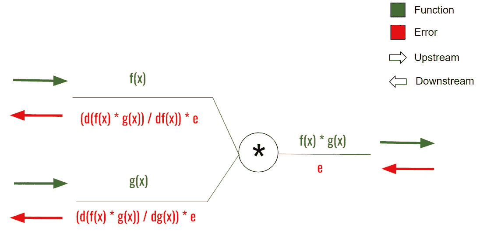

Diagram showing the construction of a computational graph.

使用这些图表，我们可以计算以下内容:

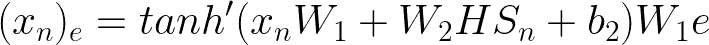

Error of the input at timestep n.

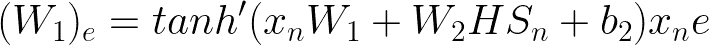

Error of the W1.

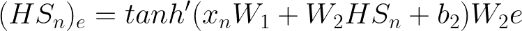

Error of the hidden state at timestep n.

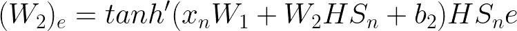

Error of W2.

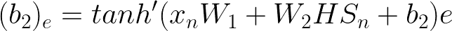

Error of b2.

与常规反向传播不同，使用时间反向传播，每个变量的误差计算为每个时间步长的误差之和。这将在代码中得到更有效的演示。然后，可以使用下图计算最终层的误差:

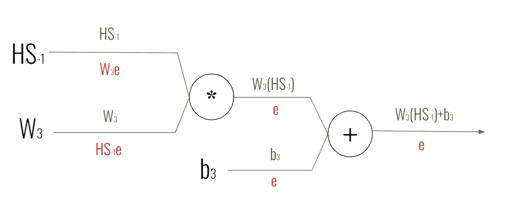

Computational graph of the output layer of an RNN.

最后，使用与前面相同的技术，每个变量的误差计算如下:

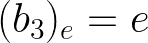

Error of b3.

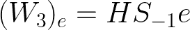

Error of W3.

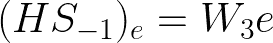

Error of the final hidden state.

先不说数学，让我们看看代码。

# 密码！

和往常一样，我们将为网络使用的唯一软件包是 NumPy。我也用一个叫 tqdm 的包，在训练阶段加一个进度条，不过那是个人选择。

虽然 RNNs 可以用于许多不同的问题，但其中最有趣的(至少对我来说)是自然语言处理。在这篇文章中，我们将训练 RNN 来判断一个句子是快乐的还是悲伤的。

`train_X`和`train_y`列表保存了我们的训练句子和标签，其中 1 表示快乐，0 表示悲伤。同样，`test_X`和`test_y`保存测试数据。最后，我们创建了一个名为`vocab`的集合，其中保存了我们的训练和测试数据中使用的所有单词，并创建了一个名为`word_to_index`的字典，我们将使用它来将我们的语言数据编码成网络可以更好理解的数字。

接下来我们定义一个名为`oneHotEncode`的函数，它接受一个句子`text`，并返回一个由 1 和 0 组成的向量，该向量代表输入文本。神经网络只接受数字作为输入，所以[一个热编码](https://en.wikipedia.org/wiki/One-hot)在我们的语言和神经网络的语言之间进行翻译。在这一节中，我还定义了一个名为`initWeights`的函数，它将用于创建每一层的权重。我在这里使用了一个 [Xavier 初始化](https://365datascience.com/tutorials/machine-learning-tutorials/what-is-xavier-initialization/)，主要是出于偏好。简单地说，初始化是改变神经网络随机性分布的一种方式。如果你对这背后的数学感兴趣，我推荐这篇文章。

该网络的激活函数将是 *tanh(x)，*，其导数可计算为 *1-tanh (x)。*然而，你可能会注意到在代码中它被定义为 1-x。*这是因为我们将在我们的网络中存储 *tanh(x)* 的值，而不仅仅是 *x，*这样当我们调用激活函数时，我们只需要对它求平方，然后从 1 中减去它。这将使代码更具可读性，并防止我们需要随着时间的推移存储太多的值。我们还将在误差计算中使用 *softmax* ，其定义为:*

*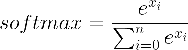*

*Definition of Softmax for some vector x.*

*现在初始化我们的网络。我们的 RNN 类使用我们的`initWeight`函数定义了三个权重( *w1、w2 和 w3* ，并定义了两个偏差。请注意，我们的第一层没有偏见。这是因为隐藏状态被计算为 *W1(x) + W2(HS) + b2* ，并且向该函数添加第二个偏置并不固有地改变它。话虽如此，如果你要添加一个 *b1* 项，这不会改变任何事情，所以如果你想为了一致性而这样做，请便。*

*如前所述，前向传播功能与单层和多层感知器非常相似。不同之处在于，我们将对给定的每个输入进行前向传播(在本例中，是对输入句子中的每个单词)。初始化一个隐藏状态，并开始迭代输入。对于每个输入，`layer1_output`计算为`input`乘以第一层中的权重`w1`。`layer2_output`是前一层隐藏状态`hidden_state[-1]`，乘以`w2`，加上第二层偏置`b2`。然后，我们的新隐藏状态(计算为第一层输出加上第二层输出的双曲正切)被附加到我们的隐藏状态列表中，并且对每个输入重复该过程。最后，将最终隐藏状态乘以输出层`w3`，再加上偏置`b3`，就达到了输出。*

*Backpropogation function.*

*反向传播函数看起来会和我们之前看到的其他神经网络有点不同。我们可以如上所述找到输出层的误差(`d_w3`和`d_b3`)。其他层我们初始化为零，然后通过输入迭代查找，加上每个时间步长的误差。偏差 2 ( `d_b2`)的误差将是每个输入的隐藏状态的误差的总和，而权重 2 ( `d_w2`)的误差将是隐藏状态乘以每个输入的隐藏状态的误差的总和。最后，第一层的误差(`d_w1`)将被计算为输入的总和乘以每个输入的隐藏状态的误差。*

*计算完这些误差值后，在我们更新网络之前还有一个步骤。正如我之前提到的，rnn 经常遭受消失/爆炸梯度问题，这意味着它们的误差要么消失到非常小的数字，要么爆炸到接近无穷大的数字。这两种情况都对网络不利。你无法阻止渐变消失。然而，爆炸的渐变可以使用渐变剪辑来调节，这基本上意味着使任何大于 *n* 的渐变等于*n。*在这种情况下，我已经将剪辑设置为 1，但可以随意使用。*

*Train & Test function.*

*`train`和`test`函数并不新鲜。`train`函数迭代输入和标签(使用 tqdm 显示进度条)，并对网络进行前向和后向传播。使用的误差函数是 softmax，它本质上使输出更容易为网络解释。测试函数是类似的，迭代提供的输入和标签并转发。不同的是，它打印网络的预测，以便您可以看到网络是否正在改善，然后更新精度变量，以便我们可以在完成时获得百分比精度。*

*最后，我们初始化网络，训练和测试！我使用了 64 的隐藏大小、0.02 的学习率和 1000 个历元，但是和往常一样，我强烈建议使用这些超参数来获得最佳结果。此外，尝试添加一些新的训练和测试数据，看看网络能理解什么，不能理解什么。掌握神经网络的最好方法是自己玩它们并发现它们。*

*我的“从零开始构建神经网络动物园”系列的第三篇文章到此结束。我希望你喜欢阅读这篇文章。如果你有，如果你能把这篇文章分享给你的朋友和同事，我会很感激。和往常一样，[的完整代码可以在 GitHub](https://github.com/CallMeTwitch/Neural-Network-Zoo/blob/main/RecurrentNeuralNetwork.py) 上获得。*

*非常感谢艾米丽·赫尔帮助编辑这篇文章。*

* [## Mlearning.ai 提交建议

### 如何成为 Mlearning.ai 上的作家

medium.com](/mlearning-ai/mlearning-ai-submission-suggestions-b51e2b130bfb)*