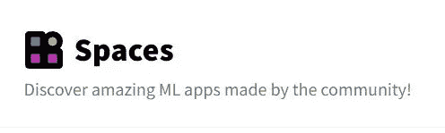
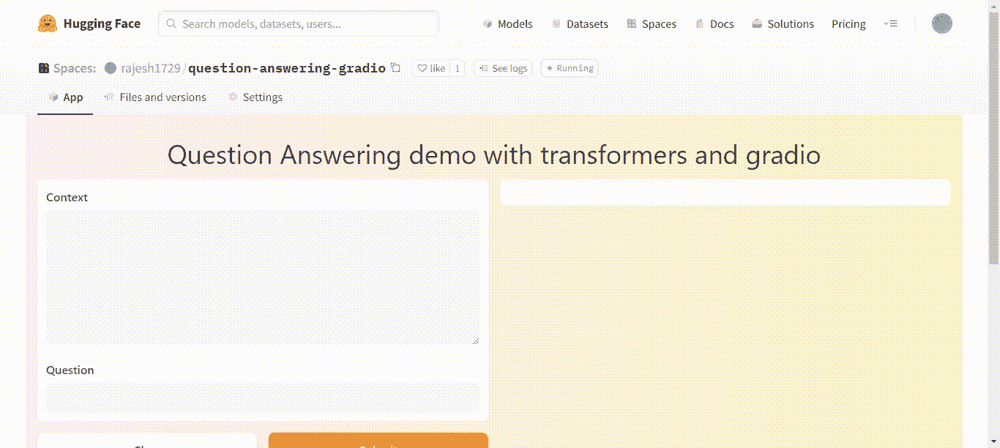

# 构建一个 NLP 抽取式问答 web 应用程序

> 原文：<https://medium.com/mlearning-ai/building-a-question-answer-web-app-using-hugging-face-transformers-and-gradio-f2f881414895?source=collection_archive---------1----------------------->

## 使用拥抱脸变形金刚，Gradio 建立一个提取的问答网络应用程序，并部署在拥抱脸空间


Photo by [Andy Kelly](https://unsplash.com/@askkell?utm_source=medium&utm_medium=referral) on [Unsplash](https://unsplash.com?utm_source=medium&utm_medium=referral)

# **简介**

问答系统是一种在给定上下文的情况下为问题提供正确简短答案的技术。客户支持、解决网站上的用户查询以及从大量的知识中检索资料都从这些系统中受益。

自然语言处理(NLP)的最新进展使这些系统在工业上对我们可用。在本文中，我们将看看如何使用拥抱脸变形器 gradio 开发一个问答系统，并在本文中将其部署在拥抱脸空间上。

# 概观

1.  格拉迪欧
2.  拥抱面部空间
3.  建筑应用
4.  部署
5.  结论

# 格拉迪欧

[Gradio](https://gradio.app/) 是一个开源的 Python 框架，允许我们使用 web 界面快速构建机器学习模型的原型。Gradio 这几年比较流行，机器学习从业者都在用。Gradio 最近被拥抱脸公司收购了。Gradio 允许我们快速制作一个机器学习模型的演示。编写代码非常简单，因为只需几行代码就可以创建一个接口。


Image source: [Gradio](https://gradio.app/)

# 拥抱面部空间

[拥抱脸空间](https://huggingface.co/spaces)是一个免费平台，我们可以在这里托管用 streamlit 和 gradio 构建的机器学习网络应用，并展示我们的模型在实践中的表现。建立一个非常稳定的平台非常简单。我们可以根据需要设计和部署任意多的应用程序。我们也可以在同一个平台上编写代码，而不是在单独的机器上。我们将在这个平台上编写代码，并在这个项目的同一个平台上托管我们的应用程序。



Image source: [Spaces — Hugging Face](https://huggingface.co/spaces)

# **构建应用**

为了构建这个应用程序，我们将使用拥抱脸变形金刚库和 gradio 库。我们将使用变形金刚库的'*管道*'模块。这个'*管道*'模块有几个功能，用于情感分析、文本摘要等。你可以在变形金刚官方文档[中找到更多关于拥抱脸变形金刚库的信息。](https://huggingface.co/docs/transformers/index)

我们将在我们的应用程序中使用管道模块的'*问答*'函数。它将上下文文本和相应的问题作为输入，并输出该问题的答案以及置信度得分、开始值和结束值，它们是文本中提取的答案的位置。因此，让我们通过使用 pip 命令安装必要的库来编写我们的应用程序。

```
pip install transformers
pip install gradio
```

现在打开代码编辑器，创建一个“ *app.py* ”文件。让我们导入库，如下所示

```
import gradio as gr
from transformers import pipeline
```

现在我们已经导入了库，让我们创建一个问答管道的实例，并为我们的应用程序提供一个标题、一个示例问题和上下文，如下所示...

```
question_answerer = pipeline("question-answering")title = 'Question Answering demo with transformers and gradio'context = "The Amazon rainforest (Portuguese: Floresta Amazônica or Amazônia; Spanish: Selva Amazónica, Amazonía or usually Amazonia; French: Forêt amazonienne; Dutch: Amazoneregenwoud), also known in English as Amazonia or the Amazon Jungle, is a moist broadleaf forest that covers most of the Amazon basin of South America. This basin encompasses 7,000,000 square kilometres (2,700,000 sq mi), of which 5,500,000 square kilometres (2,100,000 sq mi) are covered by the rainforest. This region includes territory belonging to nine nations. The majority of the forest is contained within Brazil, with 60% of the rainforest, followed by Peru with 13%, Colombia with 10%, and with minor amounts in Venezuela, Ecuador, Bolivia, Guyana, Suriname, and French Guiana. States or departments in four nations contain 'Amazonas' in their names. The Amazon represents over half of the planet's remaining rainforests, and comprises the largest and most biodiverse tract of tropical rainforest in the world, with an estimated 390 billion individual trees divided into 16,000 species."question = "Which name is also used to describe the Amazon rainforest in English?"
```

现在，我们需要使用 gradio 为我们的应用程序创建一个界面。我们按如下方式进行操作…

```
interface = gr.Interface.from_pipeline(question_answerer,
    title = title,
    theme = "peach",
    examples = [[context, question]]).launch()
```

Gradio 使用“接口”对象创建接口。因为我们使用的是一个 transformers 管道，所以我们使用“ *from_pipeline* 来加载我们创建的管道实例。我们给出标题并设置一个主题，如上图所示。我们还使用如上所示创建的上下文和问题来设置示例。以上步骤的完整代码可以在下面看到…

保存文件，让我们将它部署到拥抱脸空间。

# 部署

我们创建了我们的应用程序文件。是时候让拥抱面部空间发挥作用了。在拥抱脸空间[网站](https://huggingface.co/spaces)上创建一个用户账户。创建帐户后，单击“创建共享空间”。接下来，你会看到屏幕询问你的应用和技术堆栈的名称。为项目命名，选择许可证，从 SDK 下拉菜单中选择“Gradio ”,然后单击“创建”。

之后，您会看到一个页面，上面有关于克隆 GitHub repo 并将其推送到 spaces 的说明。您还可以在空间内创建存储库。在这个文件夹中创建一个名为“ *requirements.txt* 的文件。在需求文本文件中，粘贴以下材料...

```
tensorflow
transformers
```

另外，上传我们在上一步中创建的' *app.py* '文件。现在拥抱面部空间将会处理剩下的事情并部署我们的应用程序。我们的应用程序在工作时看起来如下…



Image by author

我们可以看到，我们的应用程序不仅给出了问题的答案，还给出置信度得分。请在下面的链接中找到我构建并部署在拥抱脸空间上的应用程序…

[问答 Gradio——rajesh 1729 的拥抱脸空间](https://huggingface.co/spaces/rajesh1729/question-answering-gradio)

# 结论

我们为拥抱脸空间创建了一个提取式问答应用程序并发布了它。Gradio 库是一个低代码工具，允许我们通过用户友好的 web 界面创建我们的机器学习模型的演示，使这变得简单。因此，我们可以使用拥抱面部变形器和 gradio 以本文描述的方式创建 NLP web 应用程序。

# 参考

[1] [空格—拥抱脸](https://huggingface.co/spaces)

[2] [任务概要(huggingface.co)](https://huggingface.co/docs/transformers/task_summary#extractive-question-answering)

[3] [🤗变形金刚(huggingface.co)](https://huggingface.co/docs/transformers/index)

[4] [格拉迪欧](https://gradio.app/)

[5] [Gradio Docs](https://gradio.app/docs/)

[](/mlearning-ai/mlearning-ai-submission-suggestions-b51e2b130bfb) [## Mlearning.ai 提交建议

### 如何成为 Mlearning.ai 上的作家

medium.com](/mlearning-ai/mlearning-ai-submission-suggestions-b51e2b130bfb)