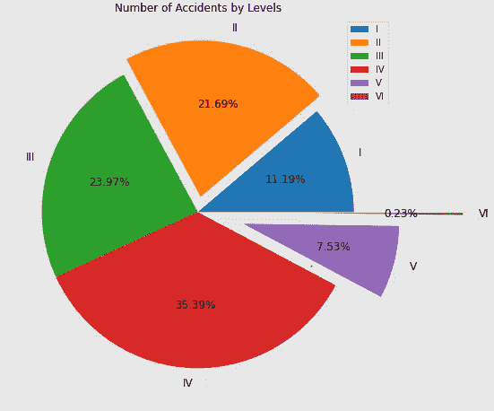
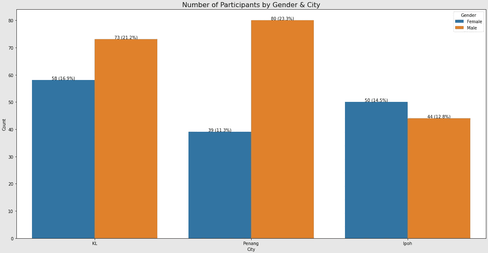

# 使用 Matplotlib & Seaborn 构建饼图、堆积条形图和柱形图(带数据标签)

> 原文：<https://medium.com/mlearning-ai/building-pie-chart-stacked-bar-chart-column-bar-chart-with-data-labels-using-matplotlib-32fc3fb5cfe9?source=collection_archive---------8----------------------->

如果你知道如何使用[matplotlib](https://matplotlib.org/)&[seaborn](https://seaborn.pydata.org/)来创建可视化并交流你的分析结果，这对你也是一个优势。我个人认为，为了创建有用的可视化效果，我们需要做 3 件事。

1.  了解[类型的数据](https://www.scribbr.com/statistics/levels-of-measurement/)。主要有两种类型的数据:分类数据(名义数据或顺序数据)和数字数据(比率数据或区间数据)。
2.  知道你的目的(总是问谁，什么，何时，何地，为什么，如何)。
3.  使用文字和标签清晰明了。在使用颜色表示某些数据时要保持一致(以避免给浏览者造成混淆)。👀


Source: [Pexels@ThisIsEngineering](https://www.pexels.com/photo/code-projected-over-woman-3861969/)

事不宜迟，让我们开始使用 matplotlib & seaborn 学习一些基本的可视化。我相信你会爱上他们的。💗

# 饼图🥧

饼图对于显示分类数据的百分比很有用。最好不要有超过 7 个类别。否则，很难区分每个部分的大小。😫

*   `**autopct**`:显示各段的百分比。下面的例子显示了两位小数`**autopct=’%1.2f%%’**`。对于一个小数位，你只需要使用`**autopct=’%1.1f%%’**`。
*   `**explode**`:从 0 开始改变数值，移动剩余的线段。

```
import numpy as np
import pandas as pd
import matplotlib.pyplot as plt
df = pd.DataFrame(data={'Count':[49,95,105,155,33,1]},
                  index=['I','II','III','IV','V','VI'])
df.plot.pie(y='Count',
           autopct='%1.2f%%',
           ylabel='',
           fontsize=12,
           explode=(0,0.1,0,0,0.3,0.7),
           figsize=(12,8),
           title='Number of Accidents by Levels');
```



# **堆积条形图📊**

```
import numpy as np
import pandas as pd
import matplotlib.pyplot as pltdf = pd.DataFrame(data=
{'Sector':['Mining','Metals','Others'],
'I':[167,119,42],'II':[26,12,2],'III':[20,7,4],'IV':[21,8,5]})# plotting stacked bar chart
h = df.plot(kind='bar', stacked=True,figsize=(20,12))
plt.title('Number of Accidents by Industry Sector & Accident Level', fontsize=16)
for c in h.containers:
    h.bar_label(c, labels=[f"{v.get_height():.0f} ({v.get_height()/np.sum(np.array(np.sum(df))[1:])*100:.2f}%)" for v in c],label_type='center')# creating total column for the df
df['Total']=df['I']+df['II']+df['III']+df['IV']# add total value at the end of each bar 
abs_total = np.array(df['Total'])
rel_total = [float(i)/sum(abs_total)*100 for i in abs_total]
lbs_total = [f"{i[0]} ({i[1]:.2f}%)" for i in zip(abs_total,rel_total)] 
for i in range(3):
    h.text(i,abs_total[i],lbs_total[i],ha='center')
plt.xticks([0,1,2],df.Sector,rotation = 50);
```


# **柱形图** 🧮

```
import numpy as np
import pandas as pd
import matplotlib.pyplot as plt
import seaborn as snsdf = pd.DataFrame(data=
{'City':['KL','KL','Penang','Penang','Ipoh','Ipoh'],
'Gender':['Female','Male','Female','Male','Female','Male'],
'Count':[58,73,39,80,50,44]})plt.figure(figsize=(20,10))
plt.title('Number of Participants by Gender & City', fontsize=16)
p = sns.barplot(x='City', y='Count',hue='Gender',data=df)
for i in p.containers:
    labels = [f'{v.get_height():.0f} ({v.get_height()/np.sum(df.Count)*100:.1f}%)' for v in i]
    p.bar_label(i, labels=labels)
```



快乐学习！✌:如果你想了解如何创建关联矩阵和混淆矩阵的热图，请点击这里查看我的另一篇文章。👋

[](/mlearning-ai/mlearning-ai-submission-suggestions-b51e2b130bfb) [## Mlearning.ai 提交建议

### 如何成为 Mlearning.ai 上的作家

medium.com](/mlearning-ai/mlearning-ai-submission-suggestions-b51e2b130bfb) 

🔵 [**成为作家**](/mlearning-ai/mlearning-ai-submission-suggestions-b51e2b130bfb)