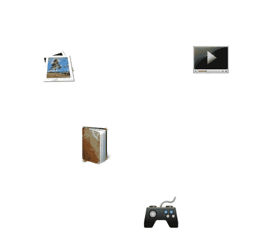
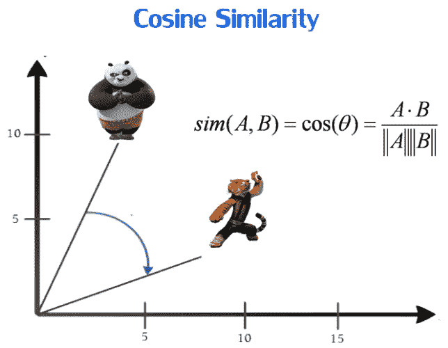
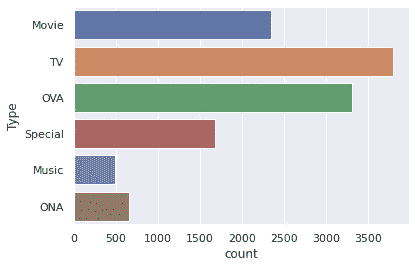
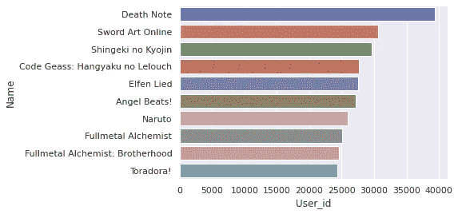
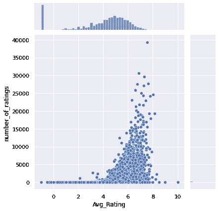
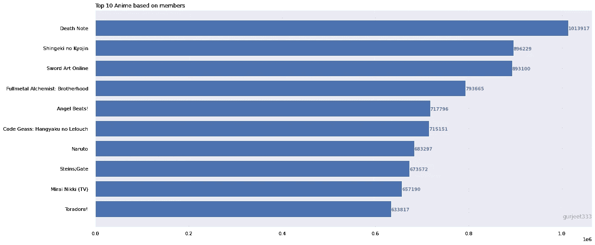

# 建立推荐系统？初学者指南

> 原文：<https://medium.com/mlearning-ai/building-recommendations-system-a-beginner-guide-8593f205bc0a?source=collection_archive---------0----------------------->

## 实现协同过滤推荐动漫

Photo by [Yilin Liu](https://unsplash.com/@l61012345?utm_source=medium&utm_medium=referral) on [Unsplash](https://unsplash.com?utm_source=medium&utm_medium=referral)

如今，构建推荐系统需要分析、机器学习和软件工程方面的专业知识，学习新的技能和工具既困难又耗时。在这本笔记本中，我们将从头开始，涵盖 Python 中的一些基本技术和实现。我使用协同过滤技术构建了推荐系统。这将帮助用户识别他们喜欢的内容。

在我们开始构建推荐系统之前，我们需要理解下面的概念，我们在构建推荐系统时会用到这些概念

## ***协同过滤***

Photo by [wiki]([https://unsplash.com/@eviradauscher?utm_source=medium&utm_medium=referral](https://en.wikipedia.org/wiki/Collaborative_filtering))

**协同过滤** ( **CF** )是推荐系统使用的一种技术。它试图预测用户对某个商品的“评分”或“偏好”。它使用以下方法广泛实现。

*基于用户的协同过滤*

1.  寻找与活动用户(预测所针对的用户)具有相同评级模式的用户。
2.  使用在步骤 1 中找到的志同道合的用户的评级来计算活动用户的预测

这属于基于用户的协同过滤的范畴。这种方法的一个具体应用是基于用户的最近邻算法。

我们使用这种技术构建了本文中的推荐系统

*基于项目的协同过滤*

**项目** - **项目协同过滤**是一种基于的推荐系统，其**是利用用户对**项目**的评分来计算**项目**之间的相似度。它有助于解决基于用户**的协作**过滤器所遭受的问题，例如当系统具有许多**项而较少**项**被评级时。****

*余弦相似度*

余弦相似性是一种度量标准，用于衡量文档的相似程度，而不考虑文档的大小。在数学上，它测量的是在多维空间中投影的两个向量之间的角度余弦。余弦相似性是有利的，因为即使两个相似的文档相距欧几里德距离很远(由于文档的大小)，它们仍有可能更靠近在一起。角度越小，余弦相似度越高。因此，余弦 0=1，余弦 90=0，余弦 45=.7071

# 目录

1.  [关于数据集](#35dc)
2.  [加载和预处理数据集](#e545)
3.  [解释性数据分析](#368f)
4.  [数据清理和识别相关数据](#7257)
5.  [实现协同过滤](#90bd)
6.  [制作动漫推荐](#4ae9)
7.  [总结](#d475)
8.  [未来工作](#0e4e)
9.  [参考文献](#30e3)

# №1:关于数据集

该数据集包含来自 73，516 个用户的关于 12，294 部动漫的用户偏好数据的信息。每个用户都可以添加动画到他们的完整列表中，并给它一个评级，这个数据集是这些评级的汇编。

**内容**
anime . CSV
-anime _ id—[my animelist . net 的](https://myanimelist.net/)唯一标识一个动漫的 id。
-名称——动漫全称。
-流派——逗号分隔的该动漫流派列表。
-类型——电影、电视、OVA 等。这部剧有多少集？(1 如果是电影)。
-评分——这部动漫的平均评分(满分 10 分)。
-成员——该动漫“群组”中的社区成员数量。

rating . CSV
-user _ id——不可识别的随机生成的用户 id。
-anime _ id——该用户评价过的动漫。
-评分—该用户已分配的 10 分中的评分(如果用户观看了该视频但未分配评分，则为 1 分)。

# №2:加载和预处理数据集

导入所有必需的库，让我们开始处理这个数据集

使用读取数据集🐼s 图书馆

在我加入之前，让我们重新命名一些列，以避免混淆，同时改进格式

# №3:解释性数据分析

执行 EDA 以理解数据和探索见解

## Q1:动漫评论是基于“类型”的吗？

连接两个数据集，这将使数据粒度处于同一水平，因此执行 EDA 将更容易。

我用 seaborn 来开发计数图

Review Vs Media Types

> 电视上播出的胺获得了最高的评论数

## Q2:哪部动漫获得了最高的评论数？

根据动画名称对数据集进行分组，以统计用户 id 的数量。

> 动漫《死亡笔记》似乎获得了最高的评论数。(4 万)用户。因此，这是迄今为止动画界评价最高的动画。

## Q3:平均评分如何根据用户收到的评分进行传播。

计算每部动画的*平均评分*

计算每部动漫的*评分数*

将*等级数量*和*平均等级*带入一个数据框内

> 大部分动漫的评分似乎都在 4 到 8 之间。也有大量的

## Q4:基于社区成员的高评价动漫系列？

> *死亡笔记似乎拥有最高的社区成员，其次是新极客 no Kyojin*

## 问题 5:流媒体？

> 电视似乎是动漫爱好者选择的主要来源或媒介

## Q6:动漫中最常见的类型是什么？

> 我能想到的一些流行类型是动作片、喜剧片、奇幻片、科幻片和冒险片

# №4:数据清理和识别相关数据

用零代替-1 的等级

识别空值并移除数据集中的那些记录

为简单起见，重命名列名

由于计算限制，让我们选择在整个数据集内提供了至少 200 条评论的用户

将上述数据框架与完整数据集合并，以过滤掉提供了至少 200 条评论的用户

# №5:实现协同过滤

这个数据透视表由作为标题的行和作为用户 id 的列组成，这将帮助我们创建稀疏矩阵，这对于查找余弦相似性非常有帮助

实现余弦相似度并应用最近邻机器学习算法。在预测我通过邻居值 6 时。这将识别出用户可能喜欢的 6 个最近的动画。这不是🆒

# №6:做动漫推荐

第 5 排预测动漫

上面你可以看到 6 个最近的动画以及它们之间的距离。

# №7:摘要

我把我的整个笔记本总结如下

*   我们从 Kaggle 下载了动漫数据集数据集。
*   我们运行了 EDA 并分析了输入特性。
*   然后，我们执行数据清理，过滤掉相关的用户数据。
*   我们实现了协同过滤并提出了建议。

source: [https://giphy.com](https://giphy.com/)

# №8:未来的工作

*   实现基于用户的协同过滤并评估结果。
*   实施基于内容的协作过滤，并将结果与当前笔记本进行比较。

# №9:参考

*   [https://www . ka ggle . com/Cooper union/anime-recommendations-database](https://jovian.ai/outlink?url=https%3A%2F%2Fwww.kaggle.com%2FCooperUnion%2Fanime-recommendations-database)
*   [https://www . ka ggle . com/benroshan/content-collaborative-anime-re commendation](https://jovian.ai/outlink?url=https%3A%2F%2Fwww.kaggle.com%2Fbenroshan%2Fcontent-collaborative-anime-recommendation)
*   [https://scikit-learn.org/stable/](https://jovian.ai/outlink?url=https%3A%2F%2Fscikit-learn.org%2Fstable%2F)
*   [https://sci kit-learn . org/stable/modules/generated/sk learn . nearest neighbors . html](https://jovian.ai/outlink?url=https%3A%2F%2Fscikit-learn.org%2Fstable%2Fmodules%2Fgenerated%2Fsklearn.neighbors.NearestNeighbors.html)
*   您可以在此访问完整的笔记本

 [## hargurjeet/推荐系统

### 回购包含我的推荐系统项目-hargurjeet/Recommendation-Systems

github.com](https://github.com/hargurjeet/Recommedation-Systems) 

我真的希望你们能从这篇文章中学到一些东西。如果你喜欢你学到的东西，请随意鼓掌。如果有什么需要我帮忙的，请告诉我。

source: [https://giphy.com](https://giphy.com/)

 [## 协作过滤-维基百科

### 协同过滤(CF)是推荐系统使用的一种技术。协同过滤有两个含义，一个是…

en.wikipedia.org](https://en.wikipedia.org/wiki/Collaborative_filtering)