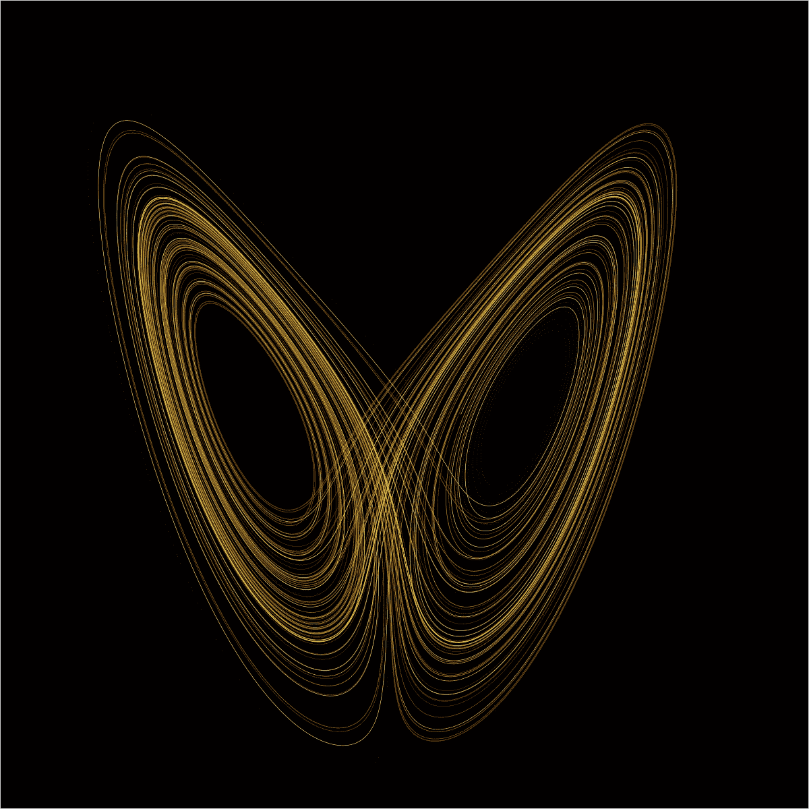
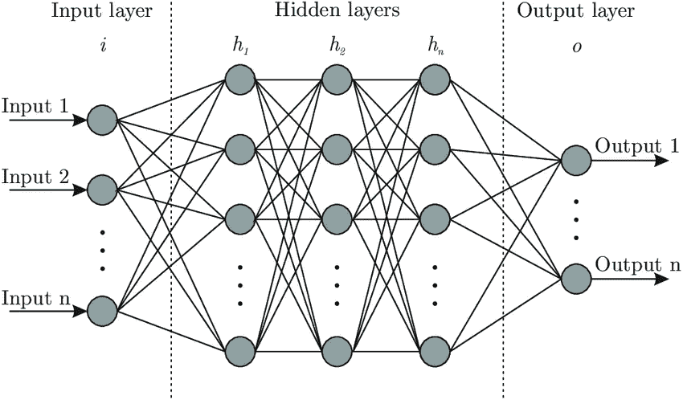

# 我们能预测未来吗？还是我们只是哑巴？我们来谈谈逻辑

> 原文：<https://medium.com/mlearning-ai/can-we-predict-the-future-or-were-just-dumb-let-s-talk-logic-f3f1b19dc9b7?source=collection_archive---------2----------------------->

Future or just Present of Future

我们能预测未来吗？这个问题不仅困扰着科学，也困扰着哲学。世界各地的不同文化也有自己的发言权。你怎么想呢?

宇宙是神秘的，因为我们对它一无所知。甚至开发一个测量属性的尺度也是未知的。我们不断尝试假设，试图创造新的发现，希望其中一些能带领我们超越混乱，给我们平静的信心，相信我们是宇宙的一部分，我们理解它。仍然给我希望的是数学语言。数学最美妙的地方在于它和逻辑呆在一起，告诉我们我们到底在哪里。我将站在概率和疯狂的立场上，试图进入这个未来的难题。

数学的工作是直截了当的。它需要假设，评估的参数，和一些领导关系，它会给我们所需要的。用数学术语来说，我们需要条件、变量和一个与结果相关的方程。

我们必须小心这些假设。精心选择的假设会导致准确的结果。当我们在一个精心选择的环境中以一种确定的关系应用变量时，我们会得到结果。我们不能为了预测而相信一个关系，更好的方法是先测试这个关系。在最终计算之前，应该用已知的结果来检验数学方程。让我们定义我们的假设、变量和等式:

***假设:*** 为未来定义假设本身就是预测未来。这是一个悖论吗？但愿不是这样。如果我们根据现在来定义未来。我们肯定能做到。虽然，如果我们在**统一尺度**上考虑时间，那么我们可以假设，在时间 t 发生的任何事情都是由于在时间 t 之前发生的事情。所以，我们有我们的第一个假设。

> 时间以线性比例运行，在任何时间 t 发生的每一个事件都依赖于在时间 t 之前发生的事件。

下一个假设挑战了人类构思自然事件的能力，即使我说的是蝴蝶效应。

What if a butterfly wing’s flutter is controlling our breath?

混沌理论很好地解释了蝴蝶效应，它是这样的:

> 据说，一只蝴蝶扇动翅膀这样的小事最终会在半个世界之外引发一场台风。

蝴蝶效应要求我们不要逃避简单，而是要考虑每一个微小的细节。为了准确预测，我们必须考虑数学方程中的每一个可能的数据点。宇宙不能在系统中定义，但可以以数据点的形式呈现。每个事件都可以在一个数据点中定义，这些数据点将被提供给数学方程进行预测。所以，第二个假设是这样的:

> 人类拥有足够的智慧，无论是在他们自身还是在他们先进的机器中，他们甚至不能忽视蝴蝶效应。

我们能不能就一个事实达成共识，我们不是在谈论去未来，而是预测未来？当我们进入未来时间旅行的困境时，我们看到的都是悖论。我们在这里谈论的是未来的预测。因为我们把时间作为一个线性尺度，这意味着即使我们预测未来发生的事情，也不会影响最终的结果。简单地说，**脚本已经写好，**所以如果我们预测正确的未来，那么它将是事件时间线的一部分。或多或少，我们生活在一个模拟环境中。

> 我们的生活是一个大模拟的一部分。即使我们预测未来，那也不会影响事件的时间线，因为预测本身就是时间线的一部分。

最后一个假设是**连接点**的能力。开发算法的一个关键部分是获取所有影响我们试图预测的事件的数据，当然也包括像蝴蝶效应这样的事件。我们能把这么多数据联系起来吗？寻找模式不仅会挑战人类设计这种系统的能力，也会挑战设备的硬件能力。

在涉及假设之后，下一步是在数据中生成模式。开发这样的算法，可以从已经给定的数据预测未来。当然有许多方法可以开发它。
暗示:已经发生了。

Looks like the neighborhood knows you.

**了解你的系统:**你还记得玩射击游戏吗？在这个游戏中，你试图攻击你的一个敌人，他试图躲起来，同时也反击你。幕后到底发生了什么，是程序员创建了那个数据点(你的敌人),它被赋予了一些动作，以及它在游戏中将遵循的条件。所以，我们的行动决定了敌人在游戏中的未来行动。在现实世界中确实如此。正如那句名言所说:

> 凡事皆有因。

在我们的例子中，原因实际上是现在的行为，它们会影响将要发生的事情。上图来自一款著名游戏，GTA 5。这个游戏模拟了一个全新的世界，在这里你几乎可以做任何事情。所以，想想这个，你离线了，在玩这个游戏。网络上没有类似的东西，但你仍然会受到游戏环境的关注。如果我们让游戏的开发者来，他们可以告诉你如果我们采取任何行动，下一刻会发生什么。他们之所以能够做到，是因为他们设计了这个环境。所以，他们什么都知道。他们可以预测这个游戏的未来。如果我们想预测未来，关键是尽可能地了解这个系统。让我们关注实现这种能力的两种方式:

***旧派人脑道:*** 这绝对是直来直去，走自己知道的路。我说的是我们在日常生活中做出的简单决定。我们一生都在预测事情。这里用的都是有逻辑的人脑。在机器学习出现之前，一切都是这样工作的。如果有事发生，就这样做。在编程中，它被称为条件语句。

以这种人脑的方式，我们设计运行在条件语句上的算法，输出将相当依赖于设计者本身的技能。让我们试着用老办法预测一个人第二天早上的心情。首先，我们要找出他的诱因。他早上做的第一件事是什么？什么让他难过？什么让他开心？

所以，让我们假设我们已经找到了 10 个触发器。如果一个触发器让他开心，我们就给+1，否则就给-1。所以，我们的算法看起来会像这样。

> 如果(触发一发生):+1 否则-1
> 
> 如果(触发二发生):+1 否则-1
> 
> 如果(触发三发生):+1 否则-1
> 
> 如果(触发四发生):+1 否则-1
> 
> ..
> 
> 如果(触发十发生):+1 否则-1
> 
> 对所有值求和
> 
> 如果(最终值小于 5):悲伤否则快乐

这是一个简单的逻辑方法。但是我考虑到一切了吗？影响他的诱因只有 10 个吗？所有触发器都应该有相同的值吗？

有很多问题我们无法回答。我们不能自己解决所有问题。我们需要更智能、更快速的东西。这就引出了我们的第二种能力。

***机器智能:*** 现在是我们可以相当肯定地说机器正在接管人类智能的时候了。每天都有新的系统被开发出来，取代人类的工作。它说的不是我们，而是他们的能力。在像雅达利这样复杂的游戏中，机器[打败了世界级的玩家](https://www.youtube.com/watch?v=Ih8EfvOzBOY),当机器开始玩游戏时，它就学会了整个事情，它学会了每一步。所以，如果我们不能考虑每一个数据点，找到其中的模式，机器能做到吗？是的，他们可以这样做。

Neural network architecture

> 如果你想了解更多关于神经网络的知识。访问我的另一篇文章:[https://abhi lash-Maurya . medium . com/do-we-control-our-thought-process-or-them-hint-not-us-ca 8 e 7d 0 Fe 4 e 4](https://abhilash-maurya.medium.com/do-we-control-our-thought-process-or-them-hint-not-us-ca8e7d0fe4e4)

机器算法已经变得如此先进，以至于他们可以通过观看视频来判断是否有聚会发生或者人们只是在互相殴打。有给  视频上色的算法，[制作动态图片的算法](https://www.youtube.com/watch?v=Aq93TSau8GE)，[唇读的算法](https://www.youtube.com/watch?v=wg3upHE8qJw)，还有[玩捉迷藏的算法](https://www.youtube.com/watch?v=Lu56xVlZ40M)。

如果我们着眼于这样的能力，那么是的，预测未来是可能的。机器仅仅通过观察摄像机画面就能做得很好。想象一下，如果我们给他们更多的输入模式，会发生什么。

> 未来预测这个术语本身似乎被夸大了，但是如果我们拿一个系统来说，试着一个元素一个元素地分解它，并遵循正确的过程，这是可以做到的。根据问题的不同，环境范围可能很大，我们可能需要大量的假设，我们还可能需要很高的计算能力，但所有这些都可以实现。我们正在解决的问题的规模日益扩大。我们所说的未来只是一个瞬间，它将成为现在，并由一些已知和未知的变量来定义。我们已经在预测未来，我们只需要做得更好。

如果你喜欢这篇文章的内容，请鼓掌并分享。你也可以在推特上关注我的相关内容:[https://twitter.com/poison_writes](https://twitter.com/poison_writes)