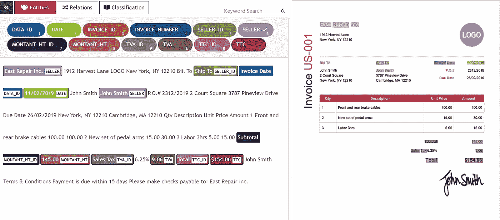
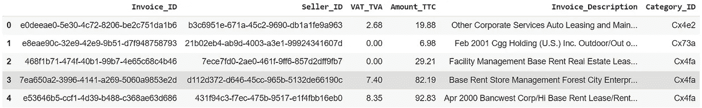
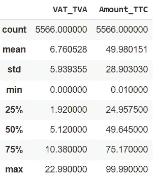
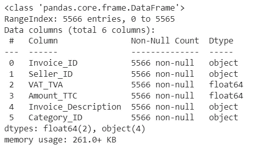
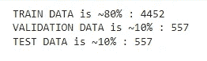
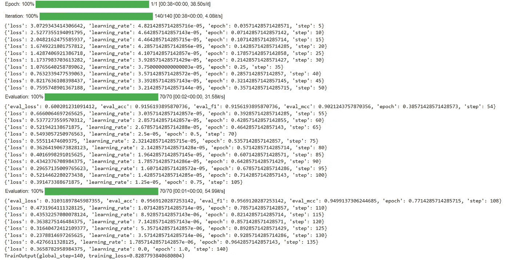
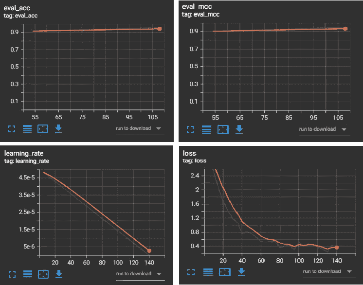
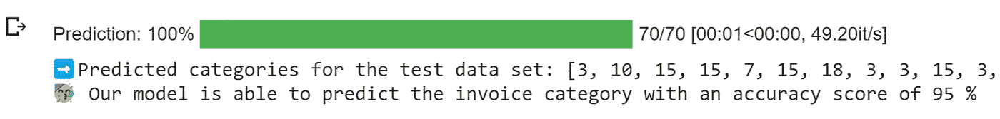

# 使用多模式转换器对发票进行分类:利用结构化和非结构化数据

> 原文：<https://medium.com/mlearning-ai/categorize-invoices-using-multimodal-transformers-leveraging-both-structured-and-unstructured-data-d291ee0295d6?source=collection_archive---------0----------------------->


How to know the category of invoices automatically? (Source: [Unsplash](https://unsplash.com/photos/0rHxkbcvQAE))

在本文中，我们将对我们的“**多模态”数据**的预训练 BERT 模型进行微调，以按照类别对发票进行**多类别分类。**

1.  商业理解
2.  工作环境准备
3.  数据理解
4.  什么是多模态变压器？
5.  数据准备
6.  建模
7.  评估结果

# 1.商业理解

首先，让我们看看这篇文章的商业方面。

事实上，在大多数组织中，每张发票都被归入一个特定的类别。实际上，如果雇员发生了维修或维护办公室设施或设备的费用，这些发票将被归入“维修和维护”类别。

因此，该类别是创建费用报告的重要信息，以便为员工报销符合条件的业务费用，并跟踪整个组织的费用或与特定产品、客户或项目相关的费用。

尽管对费用进行分类是一项需要完成的重要任务，但是手动进行分类是一项真正的负担，并且会浪费时间和资源。当我们需要从发票中提取数据(如日期、TTC 金额、税收和卖方)时，也会出现同样的问题。然而，随着深度学习模型(如 Transformers)的最新进展，微调大型语言模型以满足特定的业务需求变得比以往任何时候都更容易。你需要的只是高质量的标注数据来训练模型。

对于发票提取，我们需要找到一个注释工具，它提供 OCR 注释来解析发票中的文本和边界框，并允许本地标记。幸运的是，我找到了一个名为 [UBIAI](https://ubiai.tools/) 的工具，它将使你能够直接标记你的发票，还可以训练 LayoutLM 等深度学习模型自动从发票图像中提取信息(如下图所示)。



UBIAI’s OCR Annotation (Source: [UBIAI.tools](https://ubiai.tools/features/r1-ocr-annotation-feature))

鉴于上述信息(日期、金额 _TTC、税款……)在发票上明确注明，我们使用 UBIAI 注释工具提取这些信息，但发票上并未直接提及类别信息，因此必须从我们使用 UBIAI 工具提取的数据中推断(扣除)这些信息。

现在我们已经介绍了业务上下文，让我们准备工作环境来实现我们的发票类别分类模型。

# 2.工作环境准备

对于本文，我们使用了[公开可用的数据集](http://github.com/50gramx/guess-the-product/blob/master/train_set.csv)——我们对其进行了轻微的调整和补充以适应我们的业务需求——来训练我们的多模型转换器。

我们使用 Google Colab 作为 python 的 web IDE，它是免费的，所以继续创建一个新的笔记本，以最简单的方式跟随我们。

接下来，我们需要导入我们将使用的库:

```
import numpy as np
import pandas as pd
from sklearn import preprocessing
from sklearn.metrics import f1_score, matthews_corrcoef!pip install multimodal-transformers
from transformers import AutoTokenizer, AutoConfig, Trainer, EvalPrediction, set_seed
from transformers.training_args import TrainingArgumentsfrom multimodal_transformers.data import load_data_from_folder
from multimodal_transformers.model import TabularConfig
from multimodal_transformers.model import AutoModelWithTabular
```

不要担心导入的数量，我们会在相关的时候看到每一个的使用。但是现在让我们继续来看看我们的数据。

# 3.数据理解

如上所述，类别是我们将从当前发票信息中推断出的一条信息:

```
df = pd.read_csv('/content/categorized ocr_annotated_invoices.csv')
df.head()
```



The head (first 5 rows) of the df data frame

```
df.describe()
```



Descriptive statistics of df

```
df.info()
```



Summary info of df

正如我们所看到的，我们的数据是一组发票，这些发票类似于 UBIAI 注释工具正在处理的发票(我们只选择了几列进行处理)，它们以表格格式呈现；每行代表一张发票(观察)。每列代表一个特征(预测值)，例如*金额 _TTC* 、*增值税 _ 增值税*、*卖方 _ID、*和*发票 _ 描述*。数据被标记，目标变量是*类别 ID* 。

因此，我们将基于其他特征来预测 *Category_ID* 。让我们计算数据集中出现的不同类别的数量:

```
number_categories = df.Category_ID.nunique()print("We have ", number_categories, " classes, so it's a Multiclass Classification")
```

我们有 36 个类，所以这是一个多类分类。

# 4.多模式变压器

使用非结构化文本数据的基于 Transformer 的模型非常强大，得到了广泛的讨论，并且被广泛使用。然而，在我们的例子中，**我们确实有文本数据呈现在 *Invoice_Description* 列中，但是我们也有有价值的结构化数据**。对于具有结构化数据的特性，我们有 *Seller_ID* 、 *VAT_TVA* 和 *Amount_TTC* ，这些特性中的每一个都带来了单个特性无法提供的信息。

我们称这些不同的感知数据的方式(非结构化文本，结构化数字数据…) **模态**。将来自几个模态的信息结合起来进行预测被称为“多模态融合”。

为此，我们决定使用[multimodal-transformers](https://github.com/georgian-io/Multimodal-Toolkit)包，用最简单的话来说，它将文本数据上的 transformer 模型的输出与分类和数字特征中的结构化数据相结合。

# 5.数据准备

既然我们已经熟悉了我们的业务案例、数据属性和适当的工具，我们就可以开始准备数据集了。

我们定义了字典 *column_info* ，其中我们将指定哪些列包含文本数据、数字数据、分类数据和目标变量:

```
column_info = {
'text_cols': ['Invoice_Description'],
'num_cols': ['VAT_TVA', 'Amount_TTC'],
'cat_cols': ['Seller_ID'],
'label_col': 'Category_ID',
# 'label_list': list(df.Category_ID.unique( ))
}
```

那么我们应该将标签列 *Category_ID* 编码为 transformers。Trainer 不处理定性标签列，它希望标签列包含从 0 到类别数-1 的整数:

```
encoder = preprocessing.LabelEncoder( )df["Category_ID"] = encoder.fit_transform(df['Category_ID']).astype(int)
```

> 注意:对特征进行编码有多种方式，我们这里用的是 sk learn . preprocessing . labelen coder(！请注意，如果您要使用此方法对非标签特征进行编码，您应该小心在维度中创建错误序号重要性的可能性，因此您可能需要使用 sk learn . preprocessing . onehotencoder)。

为了建立一个可靠的模型，我们不应该使用相同的数据集进行模型训练和评估，因此我们需要将数据分为训练集、验证集和测试集:

```
train_df, validation_df, test_df = np.split(df.sample(frac = 1), [int(.8 * len(df)), int(.9 * len(df))])print('TRAIN DATA is ~80% :', len(train_df))
print('VALIDATION DATA is ~10% :', len(validation_df))
print('TEST DATA is ~10% :', len(test_df))train_df.to_csv('train.csv')
validation_df.to_csv('val.csv')
test_df.to_csv('test.csv')
```



Splitting the data

> 注意:我们将 3 套保存在 csv 文件中，文件名必须为 train.csv、test.csv 和 val.csv，否则 multimodal _ transformers . data .**load _ data _ from _ folder**函数将无法加载它们。

然后，我们将数据集加载到 TorchTabularTextDataset 中，它将包括 HuggingFace 转换器的文本输入，以及我们指定的分类和数字特征列。为此，我们必须首先加载我们的 HuggingFace 标记器:

```
pretrained_model_name = 'bert-base-uncased'
tokenizer = AutoTokenizer.from_pretrained(pretrained_model_name)train_dataset, validation_dataset, test_dataset = load_data_from_folder(folder_path = '.',
                       text_cols = column_info['text_cols'],
                       tokenizer = tokenizer,
                       label_col = column_info['label_col'],
                       # label_list = column_info['label_list'],
                       categorical_cols = column_info['cat_cols'],
                       numerical_cols = column_info['num_cols'],
                       sep_text_token_str = tokenizer.sep_token,
)
```

我们选择使用预训练的 BERT 基础模型(未装箱)，根据您的要求，您可以从[这里](https://huggingface.co/models)选择另一个预训练模型。

> 注意:使用预先训练的模型(如 BERT)时，不需要进行文本预处理，它使用句子中的所有信息，包括标点符号和停用词。

# 6.建模

现在接下来要做的事情是用表格模型加载我们的转换器。

首先，我们在 TabularConfig 对象中指定我们的表格配置，在该对象中，我们还指定我们希望如何将表格特性与文本特性相结合，并且我们将使用加权求和方法。

其次，我们将这个配置定义为 HuggingFace 转换器的 BertConfig 对象的 tabular_config 成员变量。

一旦我们定义了 model_config，我们就可以使用 hugging face multimodal _ transformers . model . automodelwithfatable .**from _ pre trained**方法加载模型。

```
tabular_config = 
TabularConfig(
        num_labels = number_categories,
        cat_feat_dim = train_dataset.cat_feats.shape[1],
        numerical_feat_dim = train_dataset.numerical_feats.shape[1],
        combine_feat_method =     'weighted_feature_sum_on_transformer_cat_and_numerical_feats'
) model_config = AutoConfig.from_pretrained('bert-base-uncased')
model_config.tabular_config = tabular_config model = AutoModelWithTabular.from_pretrained('bert-base-uncased', config = model_config)
```

加载模型后，在对我们的数据进行训练之前，我们需要定义一些相关的评估指标来提供对模型性能的深入了解，因此我们定义了返回精度、F1 分数和 Matthew 相关系数的函数:

```
def calculate_classification_metrics(p: EvalPrediction): predicted_labels = np.argmax(p.predictions, axis = 1)
  expected_labels = p.label_ids accuracy = (predicted_labels == expected_labels).mean( )
  f1 = f1_score(y_true = expected_labels, y_pred = predicted_labels, average = 'micro') eval_result = {
         "acc": accuracy,
         "f1": f1,
         "mcc": matthews_corrcoef(expected_labels, predicted_labels)
  } return eval_result
```

此时，我们只需要训练我们的模型，因此只剩下三个步骤🎉：

1.  在训练参数中定义训练超参数。
2.  将我们的训练参数以及我们的数据集、模型和评估函数传递给培训师。
3.  调用 train()来微调我们的模型。

```
training_args = TrainingArguments(output_dir = "./UBIAI/model_out",
                                  logging_dir = "./UBIAI/run_logs",
                                  overwrite_output_dir = True,
                                  do_train = True,
                                  do_eval = True,
                                  per_device_train_batch_size = 32,
                                  num_train_epochs = 1,
                                  evaluate_during_training = True,
                                  logging_steps = 5,
                                  eval_steps = 54)
set_seed(training_args.seed)trainer = Trainer(model = model,
                 args = training_args,
                 train_dataset = train_dataset,
                 eval_dataset = validation_dataset,
                 compute_metrics = calculate_classification_metrics) trainer.train( )
```



trainer.train( )

# 7.估价

训练完模型后，让我们看看验证指标:

```
# Load the TensorBoard notebook extension
%load_ext tensorboard
%tensorboard --logdir ./UBIAI/run_logs --port=6006
```



Training validation metrics

作为模型预测的实际演示，我们现在将对一些新发票运行预测，这些发票不是用于微调模型的训练集或验证集的一部分:

```
# Save our model
trainer.save_model ("./UBIAI/model_out") # Load it
model = AutoModelWithTabular.from_pretrained("./UBIAI/model_out", local_files_only=True)trainer = Trainer(model=model) # Predict with it
y_predicted = [list(i).index(max(i)) for i in trainer.predict(test_dataset).predictions]print("➡️Predicted categories for the test data set:", y_predicted)# Evaluate the prediction
precision = sum(1 for x,y in zip(y_predicted,test_dataset.labels) if x == y) / float(len(y_predicted))print("🥳 Our model is able to predict the invoice category with an accuracy score of", round(precision*100), "%")
```



Post-training prediction test results

> 注意:让我们记住 3 个数据集的用途:
> 
> ***-****train _ dataset*用于训练模型，让它学习数据中的隐藏模式。
> 
> ***-****validation _ dataset*用于验证我们的模型在训练时的表现。
> 
> **-** test_dataset 用于完成训练后对模型进行测试。

# 结论

通过处理包含结构化数据(Amount_TTC…)和非结构化数据(Invoice_Description)的带注释的发票，我们能够加载一个利用文本和结构化数据的表格模型的转换器，根据我们的数据对预训练模型进行微调，并且能够以大约 95%的精度预测发票的类别。

> *链接到 Colab* [*笔记本*](https://colab.research.google.com/drive/1gx_f0mth2PzPbzt8geSpOJEqJUJnXzPp?usp=sharing) *。(*所有非来源视觉均来自此处截图 *)*
> 
> *如果你有兴趣了解* ***如何从非结构化数据(图片、文档……)****中提取结构化信息(日期、金额 _ TTC……)，可以考虑阅读来自 UBIAI* *的* [*这篇文章。*](https://ubiai.tools/blog/article/Fine_tuning_LayoutLM)

[](/mlearning-ai/mlearning-ai-submission-suggestions-b51e2b130bfb) [## Mlearning.ai 提交建议

### 如何成为 Mlearning.ai 上的作家

medium.com](/mlearning-ai/mlearning-ai-submission-suggestions-b51e2b130bfb)