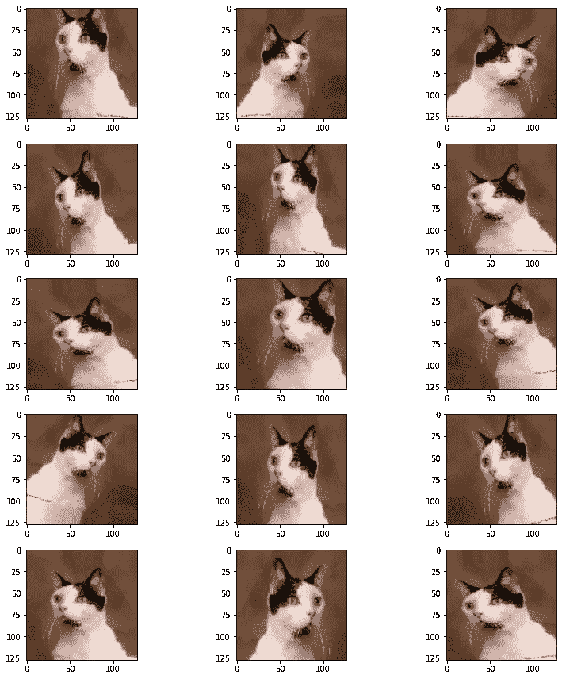
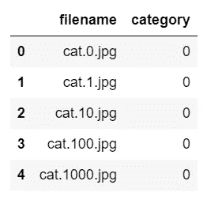
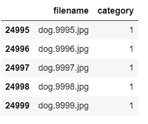
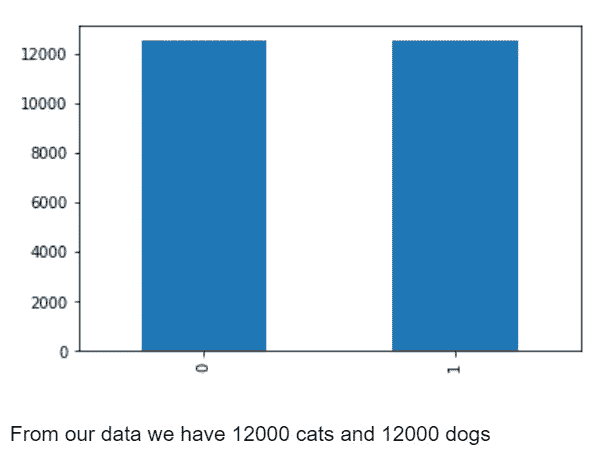
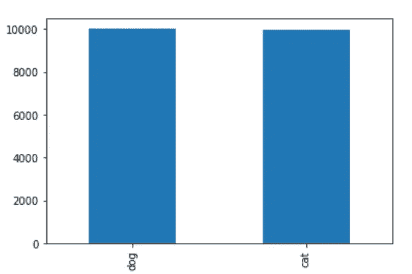
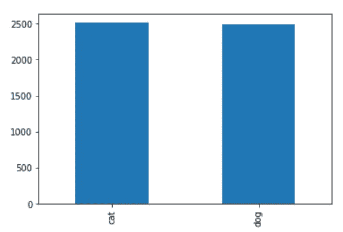
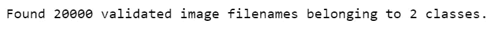
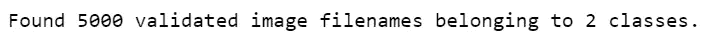
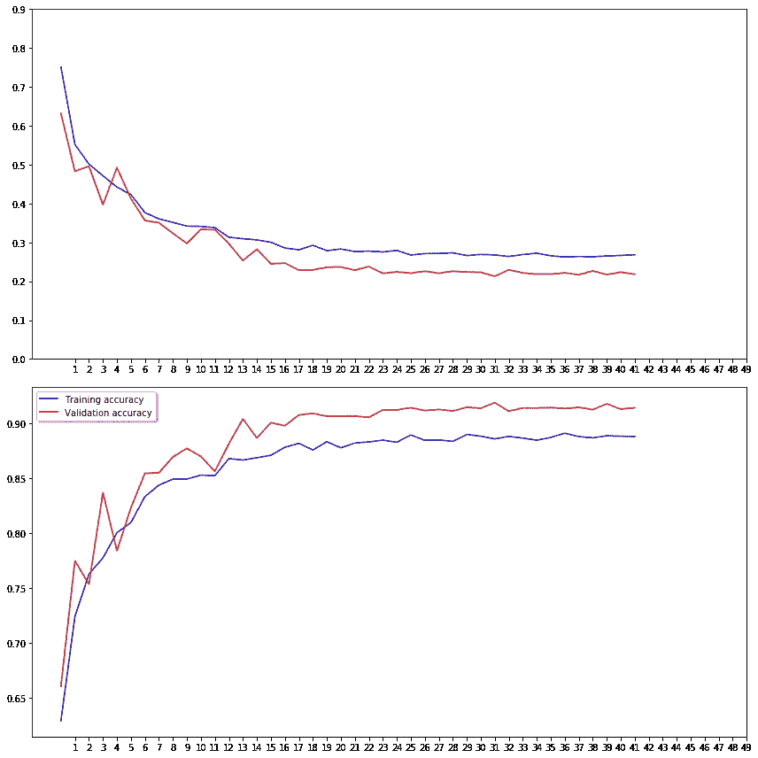

# 猫狗分类器——最简单的方法——带源代码——简单易懂

> 原文：<https://medium.com/mlearning-ai/cats-and-dogs-classifier-easiest-way-with-source-code-easy-explanation-97d2459af658?source=collection_archive---------0----------------------->

在今天的博客中，我们将使用卷积神经网络构建一个猫狗分类器。这将是一个非常有趣的博客，所以没有任何进一步的到期。

**在这里阅读带源代码的整篇文章—**[https://machine learning projects . net/cats-and-dogs-classifier/](https://machinelearningprojects.net/cats-and-dogs-classifier/)



augmented images

# 让我们开始吧…

## 步骤 1-导入猫狗分类器所需的库。

```
import numpy as np
import pandas as pd 
from keras.preprocessing.image import ImageDataGenerator, load_img
from keras.utils.np_utils import to_categorical
from sklearn.model_selection import train_test_split
import matplotlib.pyplot as plt
import random
import os
from keras.models import Sequential
from keras.layers import Conv2D, MaxPooling2D, Dropout, Flatten, Dense, Activation, BatchNormalization
from keras.callbacks import EarlyStopping, ReduceLROnPlateau
import cv2
```

## 步骤 2 —初始化一些常数。

```
IMAGE_WIDTH=128
IMAGE_HEIGHT=128
IMAGE_SIZE=(IMAGE_WIDTH, IMAGE_HEIGHT)
IMAGE_CHANNELS=3
```

## 步骤 3-加载猫狗分类器的输入数据。

```
filenames = os.listdir("train")
categories = []
for filename in filenames:
    category = filename.split('.')[0]
    if category == 'dog':
        categories.append(1)
    else:
        categories.append(0)

df = pd.DataFrame({
    'filename': filenames,
    'category': categories
})
```

*   我们在火车文件夹里有我们所有的图像。所以 os.listdir('train ')会给出所有图像名称的列表。
*   然后我们遍历所有图像，从图像名称中提取它们的类别(狗或猫)。
*   最后，我们正在创建数据的数据框架。

## 步骤 4 —检查数据的头部。

```
df.head()
```



## 步骤 5 —检查数据的尾部。

```
df.tail()
```



## 步骤 6 —可视化类别列。

```
df[‘category’].value_counts().plot.bar()
```



## 步骤 7-为猫狗分类器建立模型。

```
model = Sequential()

model.add(Conv2D(32, (3, 3), activation='relu', input_shape=(IMAGE_WIDTH, IMAGE_HEIGHT, IMAGE_CHANNELS)))
model.add(BatchNormalization())
model.add(MaxPooling2D(pool_size=(2, 2)))
model.add(Dropout(0.25))

model.add(Conv2D(64, (3, 3), activation='relu'))
model.add(BatchNormalization())
model.add(MaxPooling2D(pool_size=(2, 2)))
model.add(Dropout(0.25))

model.add(Conv2D(128, (3, 3), activation='relu'))
model.add(BatchNormalization())
model.add(MaxPooling2D(pool_size=(2, 2)))
model.add(Dropout(0.25))

model.add(Flatten())
model.add(Dense(512, activation='relu'))
model.add(BatchNormalization())
model.add(Dropout(0.5))

model.add(Dense(2, activation='softmax')) # 2 because we have cat and dog classes

model.compile(loss='categorical_crossentropy', optimizer='rmsprop', metrics=['accuracy'])

model.summary()
```

*   在这里，我们创建了一个非常容易使用的顺序 Keras 模型。只需使用 model.add()并根据您的用例方便地继续添加层。
*   这里我们基本上用了 3 套[**【Conv2D】**](https://keras.io/api/layers/convolution_layers/convolution2d/)**——**[**batch normalization**](https://keras.io/api/layers/normalization_layers/batch_normalization/)**——**[**max pooling**](https://keras.io/api/layers/pooling_layers/max_pooling2d/)**——**[**Dropout**](https://keras.io/api/layers/regularization_layers/dropout/)图层。
*   之后，我们展平这些层的结果，并将这些结果传递给 [**密集**](https://keras.io/api/layers/core_layers/dense/) 层或完全连接的层。
*   最后的 [**密集**](https://keras.io/api/layers/core_layers/dense/) 层将总是包含 n 个节点，其中 n 是数据集中的类的数量。
*   构建模型的最后一步是 model.compile()，它用于将我们上面所做的一切放在一起。
*   我们在这里使用 [**分类交叉熵**](https://keras.io/api/losses/probabilistic_losses/#categoricalcrossentropy-class) 因为我们在这里有 2 个分类，我们使用了 [**rmsprop**](https://keras.io/api/optimizers/rmsprop/) 优化器，我们也可以使用 adam，但 rmsprop 在这种情况下提供了更好的结果，我们将衡量模型性能的指标是**准确性**。


## 步骤 8-初始化猫狗分类器模型的回调。

```
earlystop = EarlyStopping(patience=10)

learning_rate_reduction = ReduceLROnPlateau(monitor='val_accuracy', 
                                            patience=2, 
                                            verbose=1, 
                                            factor=0.5, 
                                            min_lr=0.00001)

callbacks = [earlystop, learning_rate_reduction]
```

*   简单初始化 [**这里提前停止**](https://keras.io/api/callbacks/early_stopping/) 和[**ReduceLROnPlateau**](https://keras.io/api/callbacks/reduce_lr_on_plateau/)。
*   提前停止当 val_accuracy 停止增加或 val_loss 停止减少时，提前停止训练。
*   当我们的模型达到损失函数的极小值附近时，ReduceLROnPlateau 降低学习率。

## 步骤 9-用猫代替 0，用狗代替 1。

```
df[“category”] = df[“category”].replace({0: ‘cat’, 1: ‘dog’})
```

## 步骤 10-将数据分为训练和验证。

```
train_df, validate_df = train_test_split(df, test_size=0.20, random_state=42)

train_df = train_df.reset_index(drop=True)
validate_df = validate_df.reset_index(drop=True)
```

## 步骤 11-列车数据中两个类别的计数。

```
train_df[‘category’].value_counts().plot.bar()
```

*   0 和 1 在训练数据集中各有 10000 幅图像。



## 第 12 步—验证数据中两个类别的计数。

```
validate_df[‘category’].value_counts().plot.bar()
```

*   0 和 1 在验证数据集中各有 2500 个图像。



## 步骤 13——获得一些形状。

```
total_train = train_df.shape[0]
total_validate = validate_df.shape[0]
batch_size=15
```

*   第一行给出了训练数据集中的图像数量。
*   第二行给出了验证数据集中图像的数量。

## 步骤 14-扩充猫狗分类器的训练数据。

```
train_datagen = ImageDataGenerator(
    rotation_range=15,
    rescale=1./255,
    shear_range=0.1,
    zoom_range=0.2,
    horizontal_flip=True,
    width_shift_range=0.1,
    height_shift_range=0.1
)

train_generator = train_datagen.flow_from_dataframe(
    train_df, 
    "train/", 
    x_col='filename',
    y_col='category',
    target_size=IMAGE_SIZE,
    class_mode='categorical',
    batch_size=batch_size
)
```

*   使用 [**图像数据生成器**](https://keras.io/api/preprocessing/image/) 扩充列车数据。



## 步骤 15——扩充验证数据。

```
validation_datagen = ImageDataGenerator(rescale=1./255)

validation_generator = validation_datagen.flow_from_dataframe(
    validate_df, 
    "train/", 
    x_col='filename',
    y_col='category',
    target_size=IMAGE_SIZE,
    class_mode='categorical',
    batch_size=batch_size
)
```

*   使用 [**图像数据生成器**](https://keras.io/api/preprocessing/image/) 扩充验证数据。



## 步骤 16-在随机示例图像上可视化增强。

```
example_df = train_df.sample(n=1).reset_index(drop=True)

example_generator = train_datagen.flow_from_dataframe(
    example_df, 
    "train/", 
    x_col='filename',
    y_col='category',
    target_size=IMAGE_SIZE,
    class_mode='categorical'
)

plt.figure(figsize=(12, 12))
for i in range(0, 15):
    plt.subplot(5, 3, i+1)
    for X_batch, Y_batch in example_generator:
        image = X_batch[0]
        plt.imshow(image)
        break
plt.tight_layout()
plt.show()
```


augmented images

## 步骤 17-训练和保存我们的猫狗分类器模型。

```
epochs = 50
history = model.fit_generator(
    train_generator, 
    epochs=epochs,
    validation_data=validation_generator,
    validation_steps=total_validate//batch_size,
    steps_per_epoch=total_train//batch_size,
    callbacks=callbacks
)
model.save("model.h5")
```

## 第 18 步——可视化培训过程。

```
fig, (ax1, ax2) = plt.subplots(1, 2, figsize=(12, 6))
ax1.plot(history.history['loss'], color='b', label="Training loss")
ax1.plot(history.history['val_loss'], color='r', label="validation loss")
ax1.set_xticks(np.arange(1, epochs, 1))
ax1.set_yticks(np.arange(0, 1, 0.1))

ax2.plot(history.history['accuracy'], color='b', label="Training accuracy")
ax2.plot(history.history['val_accuracy'], color='r',label="Validation accuracy")
ax2.set_xticks(np.arange(1, epochs, 1))

legend = plt.legend(loc='best', shadow=True)
plt.tight_layout()
plt.show()
```



## 步骤 19-猫狗分类器的实时预测。

```
for i in range(10):
    all_test_images = os.listdir('test')
    random_image = random.choice(all_test_images)
    img = cv2.imread(f'test/{random_image}')
    img = cv2.resize(img,(IMAGE_HEIGHT,IMAGE_WIDTH))

    org = img.copy()
    img = img.reshape(1,128,128,3)

    pred = model.predict(img)
    print(['cat','dog'][int(pred[0][0])])
    cv2.imshow('Live predictions',org)
    cv2.waitKey(0)
cv2.destroyAllWindows()
```

*   从测试文件夹中随机取出 10 张图片，对其进行预测。

如果对猫狗分类器有任何疑问，请通过电子邮件或 LinkedIn 联系我。

***探索更多机器学习、深度学习、计算机视觉、NLP、Flask 项目访问我的博客—*** [***机器学习项目***](https://machinelearningprojects.net/)

**如需进一步的代码解释和源代码，请访问此处**—[https://machine learning projects . net/cats-and-dogs-classifier/](https://machinelearningprojects.net/cats-and-dogs-classifier/)

*这就是我写给这个博客的全部内容，感谢你的阅读，我希望你在阅读完这篇文章后，能有所收获，直到下一次👋…*

***阅读我之前的帖子:*** [***使用自动编码器降维***](https://machinelearningprojects.net/dimensionality-reduction-using-autoencoders/)

[](/mlearning-ai/mlearning-ai-submission-suggestions-b51e2b130bfb) [## Mlearning.ai 提交建议

### 如何成为 Mlearning.ai 上的作家

medium.com](/mlearning-ai/mlearning-ai-submission-suggestions-b51e2b130bfb)