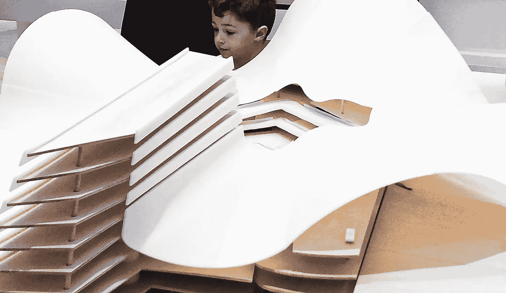

# 人工智能时代的童年

> 原文：<https://medium.com/mlearning-ai/childhood-in-the-ai-age-90f9051dddb8?source=collection_archive---------9----------------------->

## 机器学习艺术

## 怎样才能让自己的孩子成为神童？

🔵[获得完全媒体访问权限](https://datasculptor.medium.com/membership)

[How Can You Make Your Child a Prodigy?](https://mlearning.substack.com)

[**机器学习**](https://mlearning.substack.com) 在[艺术](/mlearning-ai/how-i-use-gpt3-in-my-art-61e0a2d07f2)的世界里越来越流行。但是，有些人喜欢认为 AI 无法创造出和人类一样的思想，但是我们是怎么知道的呢？我们都有成为思维神童的潜力。AI 可以…