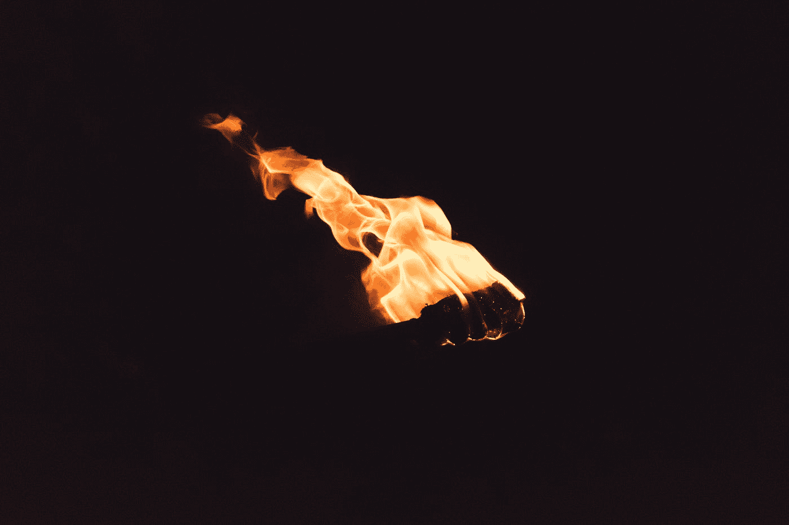

# PyTorch 中的 CIFAR10 图像分类

> 原文：<https://medium.com/mlearning-ai/cifar10-image-classification-in-pytorch-e5185176fbef?source=collection_archive---------0----------------------->

Photo by [Igor Lepilin](https://unsplash.com/@ilepilin?utm_source=medium&utm_medium=referral) on [Unsplash](https://unsplash.com?utm_source=medium&utm_medium=referral)

在本文中，我们将深入探讨 CIFAR10 图像分类问题。为了解决这个问题，我们将使用众所周知的深度学习库 [PyTorch](https://medium.com/u/ee766b3488b5?source=post_page-----e5185176fbef--------------------------------) 。最终，您将能够从头开始训练 CNN，并在 CIFAR10 图像数据集上实现 90%以上的准确率。

## 概述

*   [设置](#985c)
*   [数据收集](#405e)