# 电力商业智能中的集群

> 原文：<https://medium.com/mlearning-ai/clustering-in-power-bi-e1c7fd5700e?source=collection_archive---------0----------------------->

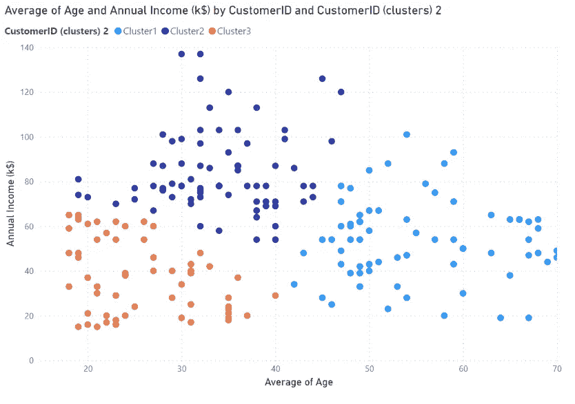

Clustering Example

# ❓什么是集群？

聚类分析是一种识别数据集中相似数据组的方法，这种方法使得同一组(称为聚类)中的对象具有相同的属性。

聚类是无监督学习，因为不需要每个对象都有标签。

**集群的用例**包括:

*   异常检测，如欺诈检测、检测有缺陷的机械零件
*   出于营销目的的客户细分
*   Rideshare 数据分析

# 🛣️聚类方法

1.电力商业智能中的自动聚类

*   二维:散点图
*   多维:表格

2.Python/R

*   形象化
*   转换

# 📥检索数据

我将使用的数据集是商场客户细分数据。它包含关于商店顾客的基本数据，如顾客 ID、年龄、性别、年收入和消费分数。

 [## 你的数据科学之家

### Kaggle 是世界上最大的数据科学社区，拥有强大的工具和资源来帮助您实现您的数据…

www.kaggle.com](https://www.kaggle.com/datasets/vjchoudhary7/customer-segmentation-tutorial-in-python/download?datasetVersionNumber=1) 

下载数据后，获取 csv 数据以启动 BI。

接下来，您将看到 Power BI 中的 3 种集群方法

# 🧩方法 power bi 中的自动聚类

这是最简单的方法，但是它有一些限制。

首先，让我们看看如何为 2 个参数/维度执行聚类

## 二维:散点图

在右侧的可视化平面中，单击散点图图标。


如下所示，将 3 个参数拖到可视化字段中(这些值是聚类所必需的！！).在本例中，我将根据年龄和年收入对数据进行聚类。

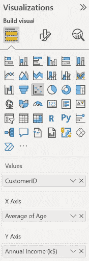

将生成一个散点图。

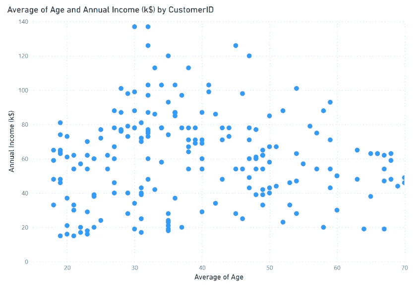

点击散点图角上的三点图标(通常在右上角)并选择**自动查找集群**。

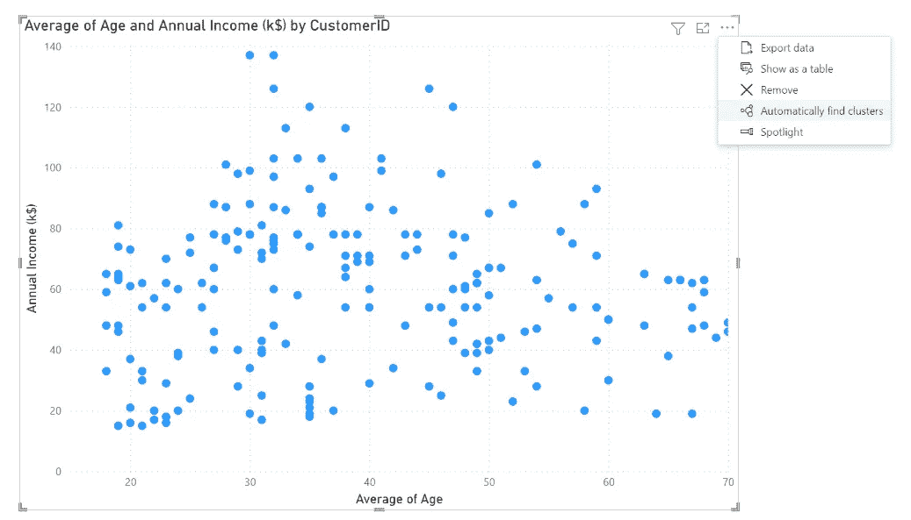

在弹出框中，您可以命名您的集群并选择集群的数量。在这种情况下，我不会选择集群的数量，而是让 Power BI 来完成这项工作。

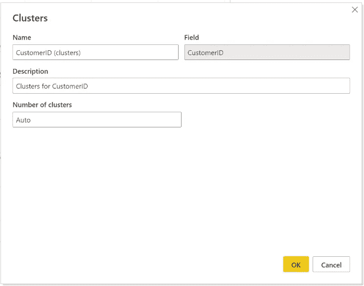

数据被分成 3 个组，Power BI 认为这是最佳组数。每个聚类都用它的颜色来表示。您可以看到，同一个群集中的客户彼此靠近。


新的聚类参数会在图例字段中自动创建。您还可以使用该参数进行进一步分析。

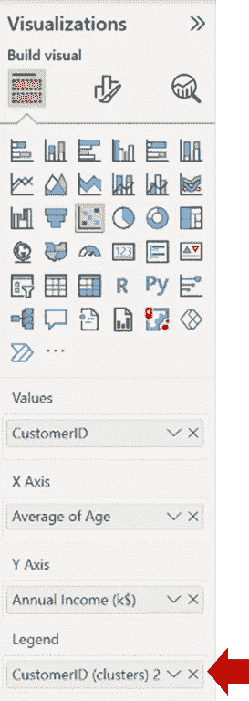

> T 那么，如果你想聚类超过 2 个参数/维度呢？您可能无法像散点图一样将其可视化，但您可以在表格中做到这一点。

## 多维:表格

首先，单击可视化效果平面中的表格图标。

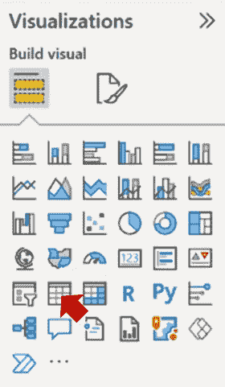

将要聚类的参数拖到值字段中。

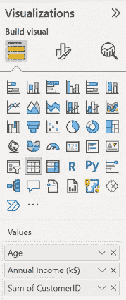

将创建一个表。

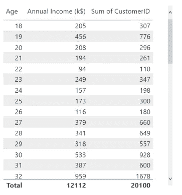

重复与散点图相同的步骤(**自动寻找集群)**。

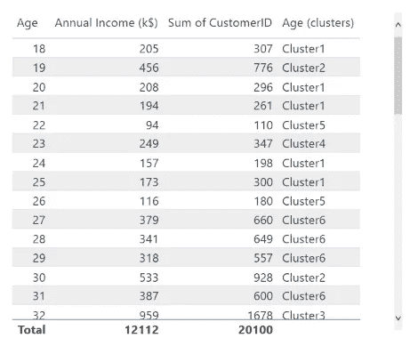

搞定了。！聚类完成。

## 限制

*   聚类不会在数据刷新时更新。新数据将进入空白簇。
*   您必须处理丢失的值并缩放这些值，以便每个参数都具有相同的范围。
*   Power BI 中使用的聚类算法是[可伸缩 EM 算法](https://docs.microsoft.com/en-us/analysis-services/data-mining/microsoft-clustering-algorithm-technical-reference?view=asallproducts-allversions)(感谢 [Calvin Nurge](https://medium.com/u/e1fa33879a95?source=post_page-----e1c7fd5700e--------------------------------) 提供参考)。它可能在某些类型的数据上表现不佳，并且您无法调整它。

# 🤖方法 2: Python/R

这种方法可能更复杂，但更灵活。您可以编写 Python 或 R 以任何方式执行集群。

使用这种方法，可以在有新数据时刷新分类，并且可以调整分类算法。

在本文中，我将只向您展示 Python 方法。然而，R 实现与 Python 并没有太大的不同。

> 你可以在下面阅读如何在 Power BI 中使用 Python。

[](/mlearning-ai/python-in-power-bi-66a80590ecc0) [## Python 在 Power BI 中的应用

### 通过集成 Python 增强 Power BI 仪表板的功能。一步一步地使用 Python 来获取、转换和…

medium.com](/mlearning-ai/python-in-power-bi-66a80590ecc0) 

> 如果你设置完 Python，我们就开始集群吧。

使用 Python 执行聚类有两种方式:可视化和转换。

# 📊形象化

> 使用 Python 可视化将在仪表盘中创建一个图表。用这种方法，你会有一个集群图，可以用 Python 代码调整这个图，但是你**不能在其他地方使用集群**。

在可视化平面中，单击 Py 图标(Python 的缩写)。


您将看到一个空的 Python 脚本编辑器区域。选择要可视化的列(本例中为年收入和支出分数)。

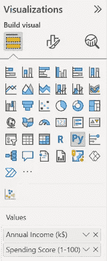

你会看到一个空的编码区。写下面的代码。

**1。导入库**

```
from sklearn.cluster import KMeansimport matplotlib.pyplot as plt
```

**2。执行 K 均值聚类**

对年收入和支出分数进行聚类。

分成 5 组。

使用 fit_predict 执行聚类分析。

```
X = dataset[['Annual Income (k$)','Spending Score (1-100)']]kmeansmodel = KMeans(n_clusters= 5, init='k-means++', random_state=0)y_kmeans = kmeansmodel.fit_predict(X)
```

**3。可视化**

创建一个散点图和颜色的集群。

```
plt.scatter(X.iloc[y_kmeans == 0, 0], X.iloc[y_kmeans == 0, 1], s = 100, c = 'tomato', label = 'Cluster 1')plt.scatter(X.iloc[y_kmeans == 1, 0], X.iloc[y_kmeans == 1, 1], s = 100, c = 'dodgerblue', label = 'Cluster 2')plt.scatter(X.iloc[y_kmeans == 2, 0], X.iloc[y_kmeans == 2, 1], s = 100, c = 'palegreen', label = 'Cluster 3')plt.scatter(X.iloc[y_kmeans == 3, 0], X.iloc[y_kmeans == 3, 1], s = 100, c = 'violet', label = 'Cluster 4')plt.scatter(X.iloc[y_kmeans == 4, 0], X.iloc[y_kmeans == 4, 1], s = 100, c = 'sandybrown', label = 'Cluster 5')plt.scatter(kmeansmodel.cluster_centers_[:, 0], kmeansmodel.cluster_centers_[:, 1], s = 300, c = 'yellow', label = 'Centroids')plt.title('Clusters of customers')plt.xlabel('Annual Income (k$)')plt.ylabel('Spending Score (1-100)')plt.legend()plt.show()
```

图表如下所示。

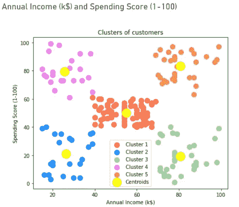

一旦有了新的数据，这个图表就会更新。

# 🔄转换

这种方法是最灵活的。您将在数据转换步骤中执行聚类，并且可以在仪表板中使用生成的聚类。

1.  单击转换数据


2.选择要转换的查询


3.在变换选项卡中，单击运行 Python 脚本


4.您将看到一个新的运行 Python 脚本窗口。复制下面的代码，然后单击“确定”。

```
from sklearn.cluster import KMeans
import matplotlib.pyplot as pltX = dataset[['Annual Income (k$)','Spending Score (1-100)']]
kmeansmodel = KMeans(n_clusters= 5, init='k-means++', random_state=0)
dataset['Cluster'] = kmeansmodel.fit_predict(X)
```

这段代码将运行 K-mean 并创建 5 个聚类。将创建一个新列“Cluster”来存储生成的分类。

5.结果将是一个表格。单击以展开表格。确保未选中“使用原始列名作为前缀”。

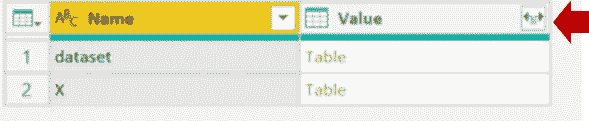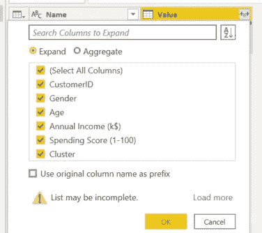

6.耶！！将创建分类列。该列的范围为 0–4，即步骤 4 中指定的 5 个分类。

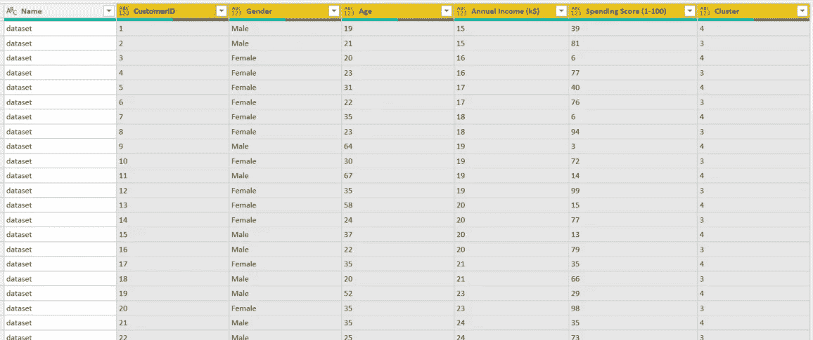

7.单击主页选项卡中的关闭并应用。

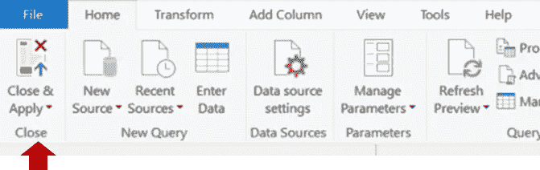

⚠️确保在聚类之后，将列更改为适当的类型。

当您刷新数据时,“分类”列将自动刷新。

您可以在仪表板的任何地方使用该集群参数。大多数情况下，它将被用作图例或过滤器。

这篇文章很长，因为我想涵盖 Power BI 中的所有集群方法。

希望你喜欢阅读这篇文章。更多数据分析内容请鼓掌关注我。

[](/mlearning-ai/mlearning-ai-submission-suggestions-b51e2b130bfb) [## Mlearning.ai 提交建议

### 如何成为 Mlearning.ai 上的作家

medium.com](/mlearning-ai/mlearning-ai-submission-suggestions-b51e2b130bfb)