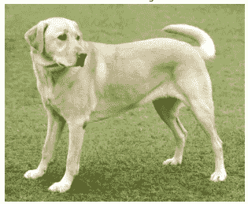
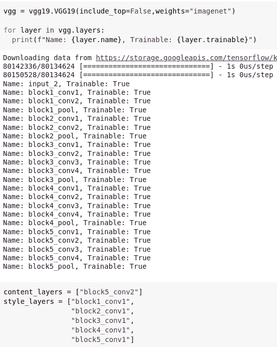
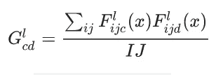
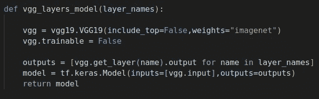
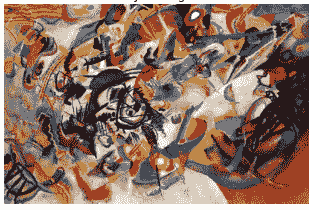
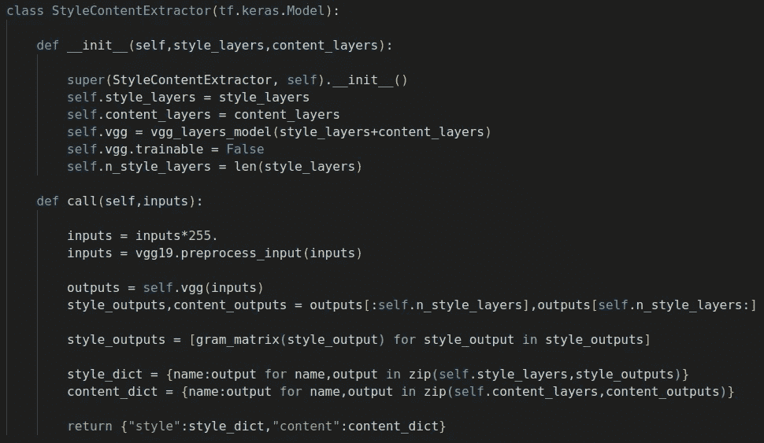
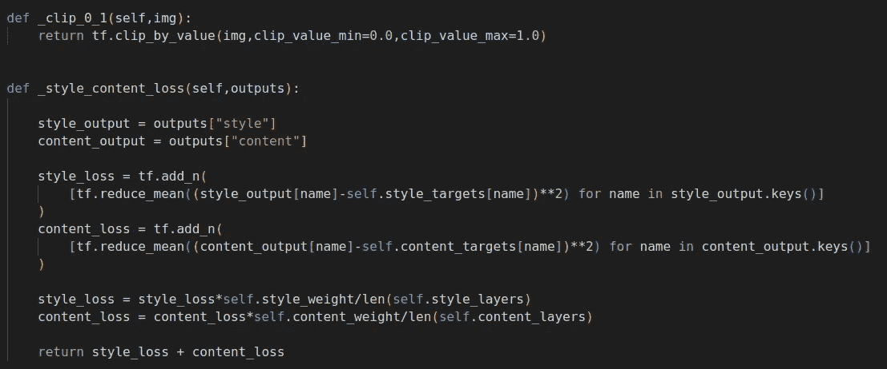
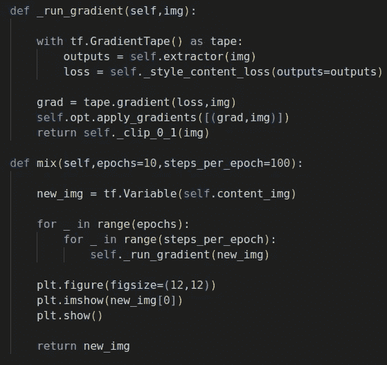
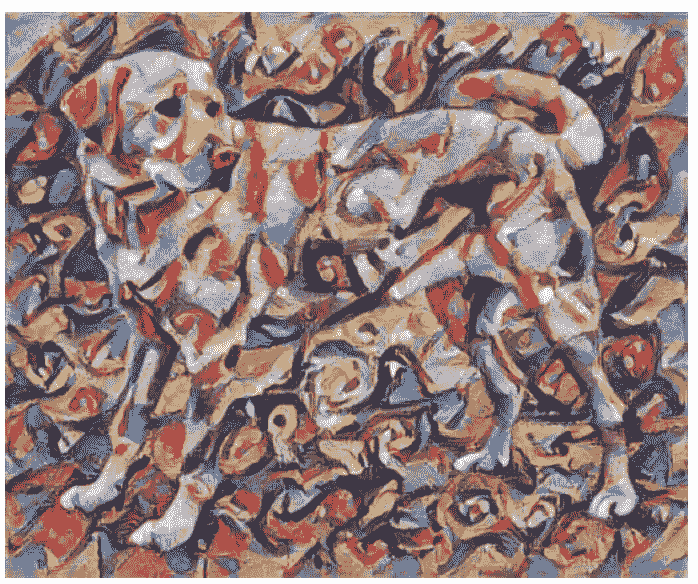

# CNN:神经风格转移

> 原文：<https://medium.com/mlearning-ai/cnn-neural-style-transfer-88829c6e8f75?source=collection_archive---------8----------------------->

萨提亚·克里希南·苏雷什

在这篇文章中，我们将讨论一个有趣的话题，称为“神经风格转移”，这是一种可以用来生成新图像的方法，其风格和内容来自两个独立的图像。本文基于 [*一种艺术风格的神经算法*](https://arxiv.org/abs/1508.06576) 由 *Leon A Gatys* 等人提出，其中作者详细解释了如何使用卷积神经网络(CNN)的层数来生成新图像。本文中的代码可以在这里找到。改编自 [tensorflow 网站](https://www.tensorflow.org/tutorials/generative/style_transfer)。

**CNN 基础知识:** 在我们开始混合图像和艺术创作之前，先来了解一下 CNN 的基础知识，这是理解题目绝对必要的。注意，这只是对 CNN 基础知识的一个简单概述。

卷积神经网络(CNN)是由多个卷积层组成的深度学习模型。这些层用于从图像中提取各种信息，这些信息用于解决手头的问题，即图像分类、对象检测等。卷积层通过对每个卷积层使用多个滤波器来提取信息，这些滤波器输出表示图像的一些特征的特征图。

每个滤波器使用一个内核，该内核是一个二维滑动窗口，根据其在 CNN 架构中的位置在图像或特征图上滑动。当内核滑过前一层的特征图时，它产生特征图，这些特征图是由内核权重和它所滑过的特征图的位置值的矢量相乘产生的。CNN 的较低层捕捉与图像相关的最一般的信息，如边缘的形状等。当您在网络中移动时，您会发现顶层的层结合了由较低层捕获的低层特征，顶层识别图像的特定特征，如鼻子的存在、汽车上的凹痕等。

**样式和内容层:** 每张图片都有内容和样式。例如，考虑下面的一只狗的图像。图像的内容是狗，图像的风格是图像的纹理、图像的颜色、图像的组织方式以及狗在图像中的位置。

CNN 识别图像的风格、内容和许多其他特征，并且表示这些层的信息存储在 CNN 模型的特征图中。在这篇文章中，我们将重点放在那些代表这个图像的风格和内容的图层上。

通常较低的层可以很好地捕捉图像的内容，因为较低的层中很少对图像进行处理，并且图像或多或少以其原始形式存在。架构的顶层很好地捕捉了图像的风格，因为它们结合了在较低层捕捉到的信息，并且通常对图像的风格有很好的了解。

在本文中，我们将使用的架构是 VGG19 模型，这是一个 ILSVRC 获奖模型。本文作者确定了代表模型井风格的 5 个模型层和代表模型井内容的 1 个模型层。下图显示了模型的图层，底部提到了选择作为样式和内容图层的图层。

在我们开始混合图像之前，最后要了解的一件事是，如何从一个图层的多个特征图中捕捉样式。事实证明，图像的风格可以由一个图层的多个特征图的平均值和相关性来表示。这就是为什么使用克矩阵的原因。使用下面的公式计算克矩阵，

这里 F 表示特征图，“jc”和“jd”表示特征图的尺寸，这对于相同层的特征图是相同的，“I”表示层“l”的哪个特征图被相乘。理解我们将要做什么所需要的每个概念都已经讨论过了。让我们现在开始混合图像。

**传递样式:** 首先，我们要做的是获取上面提到的 VGG19 模型的样式和内容层产生的输出。这可以通过构建一个自定义模型来实现，该模型将为我们提供这些层的输出。下图显示了如何获得所需的输出。

在上图中，我们首先加载 VGG19 模型，不包括顶层。我们将需要其输出的层的名称作为参数传递，然后构建一个自定义模型，将它的输入传递给 VGG19 模型，并将它们产生的输出返回给我们。该函数返回模型。

康定斯基的画被选为风格图像，我们将结合拉布拉多的形象。

我们将遵循的转换该图像的步骤很简单。首先我们将提取内容图像的内容和风格，然后我们将提取风格图像的风格(康定斯基的画)。然后，我们将尝试将内容图像的样式转换为样式图像的样式。转换样式的过程是通过首先计算目标(康定斯基图像的样式层输出)和内容图像的样式层输出之间的均方损失来完成的。然后，相对于内容图像计算该损失的梯度，随后，样式图像的样式层的值被改变为更接近目标值，该目标值是康定斯基图像的样式层的值。上述步骤如下所示。

构建定制模型以通过层名称注释样式和内容层的输出，并且它返回字典作为包含样式和内容注释的输出。您可以看到，样式层的输出在返回之前被传递给了一个 gram 矩阵。

损失计算如下图所示。您可以看到，计算了样式和内容的均方误差，并返回了它们的加权和。内容权重通常较高，因为内容目标与内容层输出相同。样式权重总是很小。

最后，混合图像的两个重要函数如下所示。run_gradient 函数跟踪输出和损失变量，并在样式和内容层上运行梯度下降。mix 函数用于决定我们想要在拉布拉多的图像中加入多少康定斯基的风格。

当模型运行时，将获得以下输出，这是内容图像和样式图像的美丽结合。

**结语:** 在这篇文章中，我们看到了风格转移这个令人着迷的概念。接下来的文章将重点关注增强和集成。如果你喜欢这篇文章鼓掌，订阅和评论。

 [## Mlearning.ai 提交建议

### 如何成为 Mlearning.ai 上的作家

medium.com](/mlearning-ai/mlearning-ai-submission-suggestions-b51e2b130bfb)