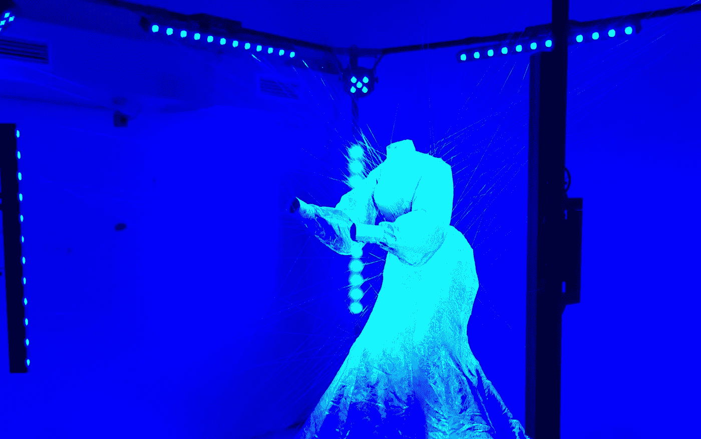

# “用于眼睛和大脑的可卡因”

> 原文：<https://medium.com/mlearning-ai/cocaine-for-the-eyes-and-brain-2f55312b8e77?source=collection_archive---------2----------------------->

## 数据驱动艺术

## 艺术消费的新世界

🟣要成为会员，使用此链接: [**获得全媒体权限**](https://evartology.medium.com/membership)

[evartology.com](https://evartology.com/)

[**机器学习**](https://mlearning.substack.com/) 是 21 世纪艺术最重要的消费者，人类已经走到了观众的后面。