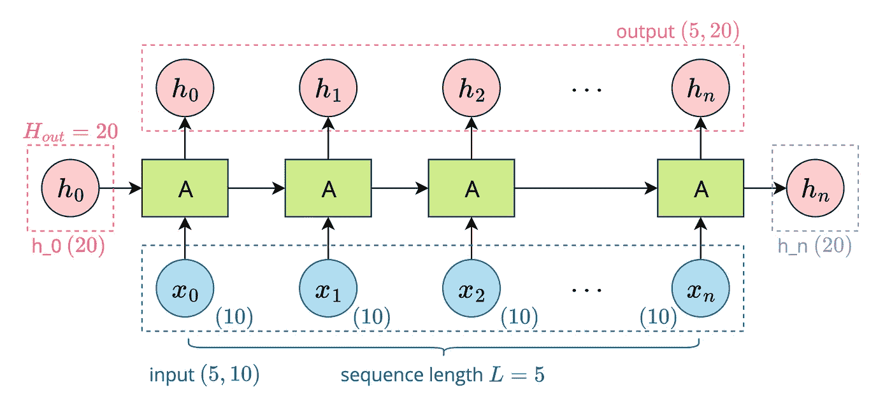
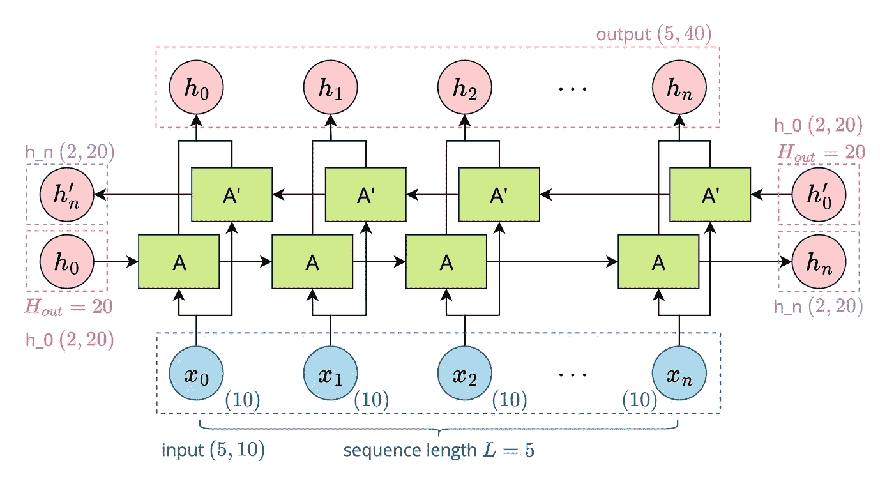
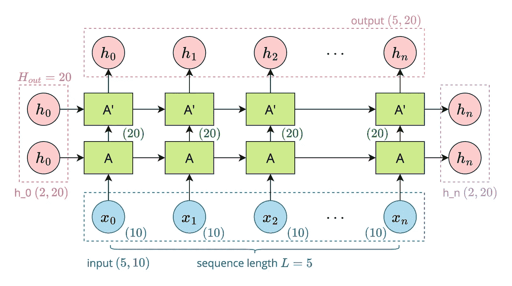

# 用 PyTorch 编码 RNN

> 原文：<https://medium.com/mlearning-ai/coding-rnn-in-pytorch-62c0c0120221?source=collection_archive---------11----------------------->

🌟所有的代码都可以在 Github 上找到:[https://github.com/hahahumble/Coding-RNN-PyTorch](https://github.com/hahahumble/Coding-RNN-PyTorch)

**递归神经网络(RNN)** 是一种使用**序列数据**或**时间序列数据**的人工神经网络。递归神经网络赋予神经网络记忆功能，因此被广泛应用于机器翻译、语音识别等领域。

在 PyTorch，RNN 是用`torch.nn.RNN`级建造的。你可以在这里了解它的参数、输入和输出:[https://pytorch.org/docs/stable/generated/torch.nn.RNN.html](https://pytorch.org/docs/stable/generated/torch.nn.RNN.html)

# 简单的 RNN

在第一个例子中，我用`num_layer=1`、`bidirectional=False`实现了最基本的 RNN。

Image by Author

# 双向 RNN

在这个例子中，我用`num_layer=1`和`bidirectional=True`实现了一个双向 RNN。

Image by Author

# 多层 RNN

在最后一个例子中，我用`num_layer=2`和`bidirectional=False`实现了一个两层 RNN。

Image by Author

 [## Mlearning.ai 提交建议

### 如何成为 Mlearning.ai 上的作家

medium.com](/mlearning-ai/mlearning-ai-submission-suggestions-b51e2b130bfb)