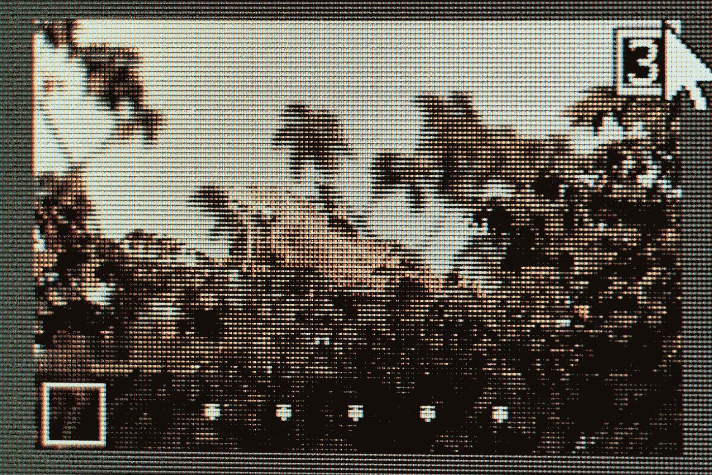

# 颜色、形状和纹理:基于 OpenCV 的特征提取

> 原文：<https://medium.com/mlearning-ai/color-shape-and-texture-feature-extraction-using-opencv-cb1feb2dbd73?source=collection_archive---------0----------------------->

## 我是不是应该开始遍历图像的每一列，取出每一个像素？

Photo by [🇻🇪 Jose G. Ortega Castro 🇲🇽](https://unsplash.com/@j0rt?utm_source=unsplash&utm_medium=referral&utm_content=creditCopyText) on [Unsplash](https://unsplash.com/s/photos/pixels?utm_source=unsplash&utm_medium=referral&utm_content=creditCopyText)

自从我开始学习计算机视觉以来，很长一段时间我都在想，如何从图像中提取特征？我第一次听说“特征提取”这个术语是在 YouTube 上的一个机器学习视频教程中，它显然…