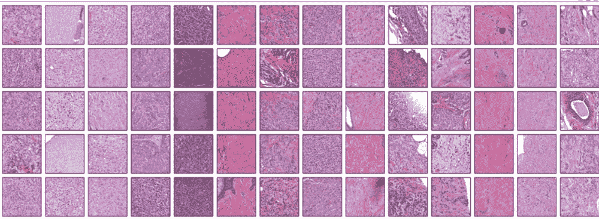
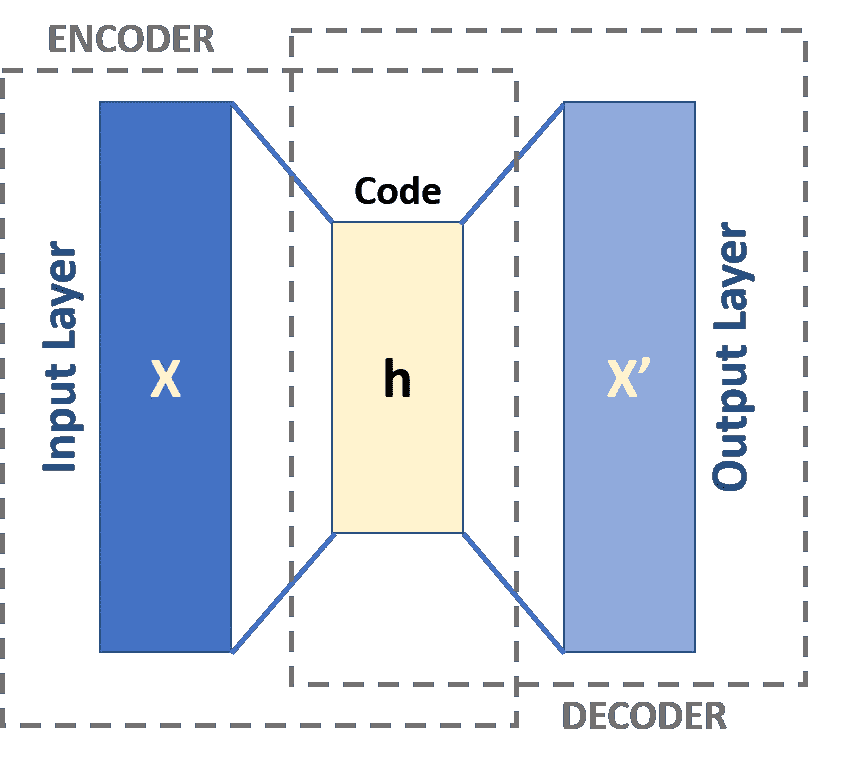

# 计算机视觉与乳腺癌模式识别

> 原文：<https://medium.com/mlearning-ai/computer-vision-and-identifying-patterns-in-breast-cancer-adc7c8127b79?source=collection_archive---------7----------------------->

**背景**

2019 年末，我有幸有机会与[美国癌症协会](https://www.cancer.org/)一起领导[结果驱动的机器学习项目](https://www.slalom.com/case-studies/american-cancer-society-breast-cancer-machine-learning)(与 Slalom Consulting 合作)，以纪念一位因癌症去世的同事。当我们探索不同的主题，并在我们的技能可以互补的合作领域(计算机科学、人工智能、流行病学、人口科学)举办研讨会时，我们最终找到了一个非常接近我内心的用例。我希望这篇高水平的概述向任何读者传达了这类工作的总体过程、要考虑的事情、挑战和机遇。

**问题**

从统计数据来看，我们知道仅在美国就有八分之一的女性被诊断患有乳腺癌。我们中的许多人，包括我自己，已经或将要因为这种复杂的疾病失去家人和亲近的人。

我们还知道，病理学家是高度专业化的科学家，他们接受过特别是从样本(如组织样本)中了解特定疾病的培训，需求量大，但供应量小。根本没有足够的病理学家来支持日益增长的病例需求。

然而，随着数字病理学的兴起(根据联合市场研究，预计到 2026 年将逐年增长 13%)和组织样本的数字化，有机会增加病理学家并使用机器学习来扩展组织样本的审查，以支持它们(**而不是取代它们**)具有一致、不懈的计算机能力。机器也有可能在图像中看到人眼无法看到的像素级信息。

这就是我们想要研究和探索的使用[计算机视觉](https://en.wikipedia.org/wiki/Computer_vision)在乳腺癌肿瘤组织样本的数字图像中识别模式的可行性。

**项目**

美国癌症协会有着丰富的通过大型队列研究收集癌症数据的历史，称为[癌症预防研究](https://www.cancer.org/research/population-science/cancer-prevention-and-survivorship-research-team/acs-cancer-prevention-studies/history-cancer-prevention-study.html)。这些研究通过纵向调查跟踪参与者的一生，并从生活方式因素、诊断甚至现在的基因组信息为我们提供了关于癌症如何发展的宝贵见解。当我们开始合作时，他们刚刚数字化了通过癌症预防研究 II (20 年)从美国 847 家医院收集的 1700 份乳腺癌肿瘤组织样本。

我们想探讨以下问题:

*   机器学习，特别是计算机视觉和深度学习，是否可以用来识别所有这些图像的模式，而无需明确告知要寻找什么(无监督)？
*   会不会有只有机器才能看到的新颖图案？
*   基于这些模式，我们可以根据共有的特征对图像进行分组吗？这些分组会导致支持或加速病理学家工作的逻辑分组吗？

为了有效地确定这些问题是否适合一起探讨，以及我们是否想一起踏上这一旅程，考虑以下因素至关重要:

*   这是一个合适的范围级别吗？在什么时间框架内可以完成这种探索？
*   两个团队的价值观和兴趣是否一致？
*   回答这个问题有重大的研究/社会价值吗？如何衡量成功？
*   是否有足够的跨学科代表来进行合作？机器学习项目仅凭计算机科学家就能完成，这是一种普遍的误解。现实是，不同背景和观点的正确组合会使项目取得更好的结果。
*   这从技术角度可行吗？我们有足够的计算能力和对 GPU 的访问吗？为了解决后一个问题，我们在这个项目中引入了一个云合作伙伴，并利用那里可用的计算资源来进行大规模的分布式处理。

**流程**

这种类型的合作通常从数据开始，即使在今天，当看到像图像这样的非结构化数据时，也有很多挑战。我们在这项工作中使用的图像如下所示。

Hematoxylin and eosin (H&E) stained breast cancer tumor tissue images (tissue samples are not naturally this color — they are stained in a variety of ways).

我们的数据集包含许多数据质量问题，这对于任何机器学习项目来说也是非常正常的。特别是:

*   图像是从超过 847 家医院收集的，这意味着用于收集它们的方法不一定一致。
*   一些样本已经老化，这意味着颜色或染色剂已经褪色。其他的被过度染色，只会给任何机器学习模型增加噪音。
*   我们拥有的 1，700 张图像是多维的(分层的),每张图像有 3-12GB。它们也以专有的图像格式存储。来自徕卡的 SCN)。
*   一些样品在载玻片上被物理撕裂，无法使用。

为了将数据设计成我们需要的格式，以便在其上运行相关的计算机视觉和深度学习模型，我们需要进行图像处理，并考虑这些不同的数据质量问题。

**图像处理**

需要做的第一步是将图像转换成标准格式。大多数机器学习模型要求图像数据为标准格式，以便在其上运行。SCN 不在其中。这是专用于徕卡和这些类型的医学图像的专有格式。不幸的是，在这个项目启动时，没有简单的方法来大规模地实现这一点(并行地从多个层中抽出特定的一层)，需要一个定制的工程解决方案来完成这一转换。

一旦克服了这个障碍，我们就需要一种方法来解决褪色和其他数据质量问题，包括物理撕裂的组织和进入数字图像的载玻片上的手绘锐度标记。这些错误的数据被称为“工件”我们还希望避免将计算资源浪费在处理空白图像部分上，而只关注图像中有实际组织的部分。

为了解决褪色和一些伪像，我们实现了一种称为颜色归一化的技术。这实质上是定义特定颜色范围的地方——我们采用“黄金模板”,并确保在某个范围内，我们考虑的图像的大部分组织都在相同的颜色范围内，因此“紫色”是全面的“紫色”。像黑色记号笔那样的不自然的颜色会很快被识别和标记出来。这项技术并不总是应用于此类研究，也不总是必需或有益的。

为了避免白色空间的处理，我们使用了一个公式来确定给定图像的比例，由此可以确定图像中哪些区域相对于实际组织具有高比例的白色空间。

现在，我们意识到图像太大而无法处理(这就是所谓的整片图像处理),所以另一种技术与所有这些技术结合起来，称为“平铺”这正是它听起来的样子，一个巨大的图像(记住，高达 10GB 张)被分成几个更小的“瓦片”这样做可以更容易地消除具有伪像的较小部分(图块)，以及那些具有空白的部分，从而允许我们以分布式方式进行计算，这意味着每个图块可以在许多机器上同时处理。这是该过程中最耗费资源的部分，并且可能非常昂贵，可能会使一些人望而却步(稍后将详细介绍)。

Slides from Google Next 2018.

整个幻灯片图像“平铺”的示例

一旦整个过程完成，建模过程就可以开始了。

**特色工程**

由于这次探索性合作的目标是根据机器看到的模式对图像进行分组，而不是根据人类使用的逻辑分组，我们需要利用所谓的“无监督”方法。在“有监督的”方法中，我们会告诉计算机什么是“猫”，并向它提供数百万张被人类标记为“猫”的图像，而在无监督的方法中，我们必须找到让机器完成剩余步骤的方法，包括特征工程。

特征工程是指机器学习过程的一部分，在这一部分中，我们将基于领域知识将原始数据或部分原始数据转换为工程数据，这将更有效地预测我们想要的东西。这可能意味着利用金融专业知识来使用某事物的标准差，而不是原始数字。

有很多方法可以在无人监督的情况下完成这个过程。其中一种技术被称为“[自动编码器](https://en.wikipedia.org/wiki/Autoencoder)，经常应用于计算机视觉和其他非结构化数据问题。

Sample autoencoder image from [Wikipedia](https://en.wikipedia.org/wiki/Autoencoder)

在这种情况下，自动编码器的工作是获取“平铺”图像，并将其缩减为主要组件和图案的数字矢量表示，同时仍然能够尽可能多地复制原始输入。这被应用于所有的瓷砖，并涵盖了使用“机器确定”模式的问题，然后输出被馈入第二种类型的机器学习(具体来说，[深度学习](https://en.wikipedia.org/wiki/Deep_learning))模型。

**聚类**

最初的假设不仅是为了看看机器是否能识别图像中的模式，也是为了对它们进行分组。为了做到这一点，我们利用一种叫做 [K-means](https://en.wikipedia.org/wiki/K-means_clustering) 的算法进行多轮聚类。这将上一步的结果分为 10 组，如下图所示(仅具有代表性):

Representative image of clustering of tiles from Google NEXT slides.

**结果**

通过由非监督技术识别的特征对计算机生成的聚类进行分组，然后由研究小组进行进一步的研究，并基于然后将瓦片/组织样本与来自癌症预防研究 II 的基本纵向调查信息相结合来确定分组的新颖性。更多这方面的研究可以在下面的链接中找到。

还有一个愿望是将这项工作开源并将其回馈给社区，以便其他人可以继续这项研究或改进这一过程。

我们知道，这些类型的技术进步有机会改善许多患者的预后并加强世界各地病理学家的工作，但我们也必须确保随着这些技术进步的发展，其可及性水平也有所提高。

**未来的机遇**

该合作有许多经验教训和发现，但在这方面仍有进一步努力的余地，以便为患者带来更好的结果。其中一些考虑事项包括:

1.  减少计算工作量—为了使此类技术更容易为所有区域和患者所用，必须减少由计算资源和所需的专业人力技能造成的进入障碍。医学图像的性质使其在大规模处理时既复杂又昂贵。
2.  增加源信息的数据分布—许多组织正在努力增加为研究收集的数据的多样性，这应继续作为一个重点领域，以确保考虑到所有人。
3.  为深度学习模型创造更多可解释性——这方面有许多创新，但在理解其中一些模型如何得出具体结论方面仍是一个有待改进的领域。我们还应该能够复制现有的任何研究，但情况并不总是如此。
4.  提高数字病理学的可访问性/可采用性—并非每个人都能访问数字病理学，因为在硬件方面采用数字病理学通常需要较高的基础架构成本(例如，特定的扫描仪、集成等)。).有许多专业组织推动这种采用，但这是另一个机会领域，因为它将释放病理学家在任何地方审查和讨论病例的能力。

从我的网站[传到这里](https://www.michelleyi.ai/)。

**参考**

联合市场研究。“报告。”2020.

AACR。"一个可扩展的，基于云的，无监督的深度学习系统，用于识别，提取和总结乳腺癌组织的整张幻灯片图像中潜在的不可察觉的模式."2019.[链接](https://cancerres.aacrjournals.org/content/79/13_Supplement/1635)。

WABE。"利用人工智能对抗乳腺癌."2019.[链接](https://www.wabe.org/episode/closer-look-using-artificial-intelligence-to-fight-breast-cancer-atlanta-plastic-surgeon-performs-free-facial-reconstruction-for-children-in-peru/)。

来自谷歌 NEXT 公开演示的原始图像。2019.[链接](https://www.youtube.com/watch?v=O7yorZdXQp4)。[连接 2](https://www.youtube.com/watch?v=rR4PjTnSyGs) 。

美国癌症协会。“关于乳腺癌。”2021.[链接](https://www.cancer.org/cancer/breast-cancer/about/how-common-is-breast-cancer.html)。

美国癌症协会。“癌症预防研究的历史”2021.[链接](https://www.cancer.org/research/population-science/cancer-prevention-and-survivorship-research-team/acs-cancer-prevention-studies/history-cancer-prevention-study.html)。

维基百科参考。

 [## Mlearning.ai 提交建议

### 如何成为 Mlearning.ai 上的作家

medium.com](/mlearning-ai/mlearning-ai-submission-suggestions-b51e2b130bfb)