# 使用 DVC 对 Huggingface Transformer 进行连续机器学习，包括权重和偏差实现以及将权重转换为 ONNX。

> 原文：<https://medium.com/mlearning-ai/continuous-machine-learning-on-huggingface-transformer-with-dvc-including-weights-biases-6a909983e48e?source=collection_archive---------6----------------------->

# 作者

**纳巴润巴鲁阿**

[Git](https://github.com/nabarunbaruaAIML)/[LinkedIn](https://www.linkedin.com/in/nabarun-barua-aiml-engineer/)/[towards data science](/@nabarun.barua)

**阿尔琼·库姆巴克拉**

[Git](https://github.com/arjunKumbakkara)/[LinkedIn](https://www.linkedin.com/in/arjunkumbakkara/)/[towards data science](/@arjunkumbakkara)

# 简介:

> 这个项目的主要思想是解释如何在 NLP 项目中实现 CML，因此这个项目的主要重点是解释如何实现 CML。我们假设用户很熟悉🤗变形金刚，DVC，ONNX & Weights & bias(Wandb)实施。

下面是用于构建这个项目的在线资源。

下面是用于构建这个项目的在线资源。

*   [DVC Youtube 播放列表](https://www.youtube.com/playlist?list=PL7WG7YrwYcnDBDuCkFbcyjnZQrdskFsBz)和 [DVC CML 官方文档](https://cml.dev/doc/self-hosted-runners?tab=AWS)
*   官方拥抱脸网站
*   [权重&偏向公文](https://docs.wandb.ai/guides/integrations/huggingface)

在我们开始会话之前，需要设置以下几项内容:

*   一个具有 EC2 和 S3 开发人员访问权限的 AWS IAM 用户
*   存储数据集的 S3 存储桶
*   如果没有提前完成，则需要提前请求第二个 EC2 Spot 实例。

请遵循这些在线资源 AWS 相关信息

*   [Youtube 资源 1](https://www.youtube.com/watch?v=rYHt0gtRKFg&t=180s)
*   [Youtube 资源 2](https://www.youtube.com/watch?v=GCt-cymgdvo)
*   [用于右 GPU 选择](https://towardsdatascience.com/choosing-the-right-gpu-for-deep-learning-on-aws-d69c157d8c86)和同一个 [Youtube 链接](https://www.youtube.com/watch?v=4bVrIbgGWEA)

在这个项目中，我们希望为 [Kaggle 数据集](https://www.kaggle.com/hassanamin/atis-airlinetravelinformationsystem)实现变压器分类，想法是实现 DVC，以便我们可以从 DVC 工作室做实验，而在变压器权重&偏差有一个内置的实现，允许保存最佳模型的权重&矩阵。

我们可以使用 DVC 进行度量跟踪，但需要进行进一步的更改和实施。另一方面，Weights & Biases 只需要对任何 transformer 代码进行最小化的修改就可以开始跟踪。**我认为使用权重&偏差的一个主要优点是，它保存了最佳模型，否则我们必须在每次实验后进行。**

现在，我相信我们已经完成了这个项目的目标和清晰的愿景。

让我们从点击并进入这个[模板库](https://github.com/nabarunbaruaAIML/project-template-with-DVC)开始

一旦进入模板库，请点击按钮**使用此模板**。

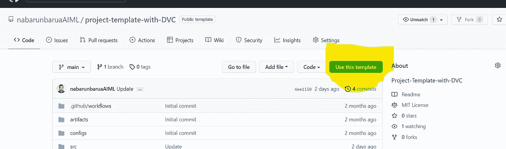

然后填写详细信息，并根据模板创建存储库。

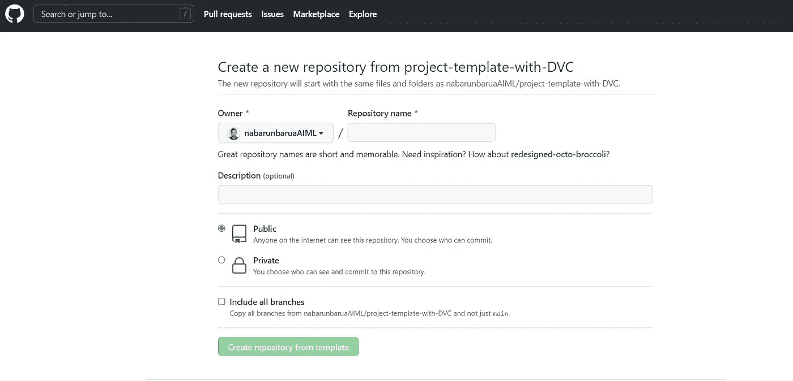

# 概述:

**为什么是 DVC？**

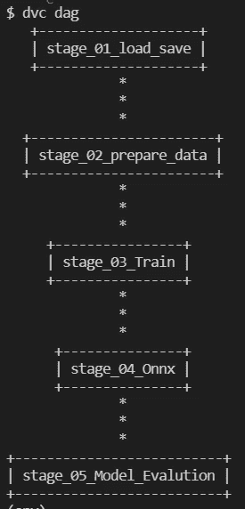

对于大多数用例，数据处理或 ML 管道通常从大型原始数据集开始，包括中间特征化和训练阶段。然后，这最终产生最终的调整模型以及所需的准确性度量。仅仅对这些大型数据文件和目录进行版本控制是不够的。我们还需要理解数据是如何被过滤、转换、丰富(如果是这样的话)，或者最终用于训练 ML 模型的？DVC 引入了一种机制来捕捉和监控这些数据管道——产生最终结果(最终状态为图形)的一系列数据过程。DVC 管道及其数据也可以很容易地版本化(使用 Git)。这可以让你更好地组织你的项目，并在需要的时间和地点重现你的工作流程，结果完全可以超越它！

**为什么是 S3？**

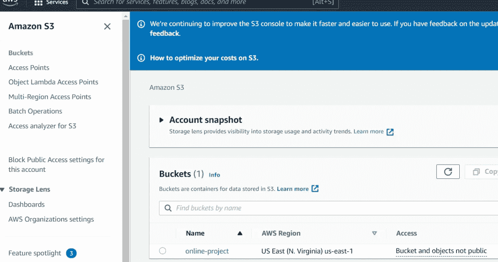

Amazon S3 is what we have used as a remote storage for Data .Firstly, starting with the platform github, we have restrictions storing data at scale in github (limit being as little as 100mb) .Secondly, as part of best practices , it is never considered safe to store data on Code repositories (be is privately hostel Github,Gitlab,Bitbucket etc) As the enterprise softwares thes days have a prerequisite to be GDPR compliant. The secrecy of data is of high importance. Now, Amazon S3 being one of the most reliable and secure storage , we chose it for our use case too. S3 is also highly agile and has the all-time availability trait.We may for the most part find it difficult to sometimes store and manage data, however, with S3 its such a breeze to manage data at such low costs. (You can also refer the Boto-core section above for integration information) So head over to amazon S3 setup the account and create a bucket with a decent storage. This bucker can then be connected to for file transferring using tools like Putty,MobaXterm,FileZilla etc. This way you can place the files and get the location .

**Why EC2?**

EC2 is a cost efficient virtual server in Amazon’s Elastic Compute Cloud for Amazon Web Services . Its highly elastic, scalable and reliable when it comes to Failover management and information security.There are out of the box features such as Elastic Load balancing which automatically distributes the traffic to the active instances and recovers the unhealthy instances. However , we would be using these features only during out deployment pipeline. So, to perform the model training, you would have to have an instance of the below kind at the least:

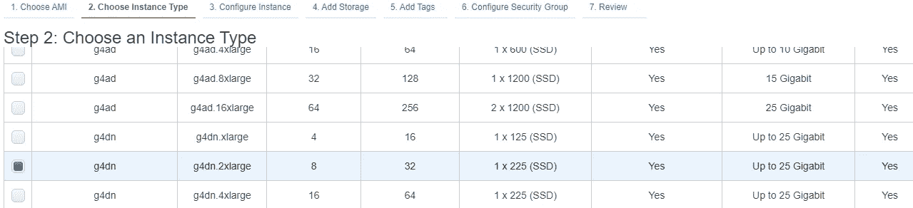

Because, as we know, Transformers are resource-intensive .

**Is there a Rigid File Structure for DVC?**

Yes, More than rigidity it means a standard which way it becomes very easy for organization and continuous iterations of change

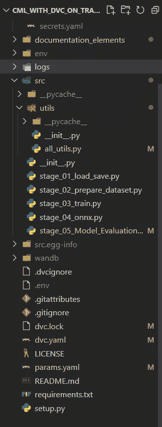

As seen above, stage_01_load_save.py , stage_02_prepare_dataset.py , stage_03_train.py, stage_04_onnx.py & stage_05_Model_Evalution.py are the stages of the DAG or the DVC pipeline. yaml files such as dvc.yaml( **This File controls the Pipeline**) , params.yaml ( **This file Contains all the Parameters which are needed to perform experiments on Training Pipeline via DVC Studio**) and config.yaml( **This file contains all the configurations for the training pipeline**) carries the major mandatory configurations. dvc.yaml being the control file here with all the Stage details like follows :

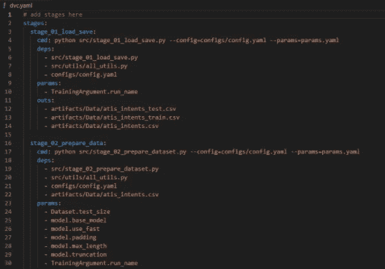

The all_utils.py can be seen as a collection of operational python functions which is such that it is modular and reusable which constitutes File operations etc

**Architecture:**


The architecture of this entire project is broadly divided into three

1.  Training
2.  Deployment and
3.  然而，与这个库相关的架构可以在下面的章节中看到。

# DVC 的阶段和标准文件:

**阶段:**

在这个培训管道中，我们有三个线性排列的主要阶段。

1.  加载并保存数据(stage_01_load_save.py):在这里，从 S3 存储桶加载数据，并完成 tockenization。
2.  数据集的准备(stage_02_prepare_dataset.py)这里的训练测试拆分，为模型训练进行数据的预处理。
3.  训练模型(stage_03_train.py)此处，模型使用所需的超参数和回调进行训练。最后，模型权重将保存在 wandb(权重和偏差)中。可以使用 wandb api 获取。(有关更多详细信息，请参考相应的文档)
4.  将模型转换为 Onnx (Stage_04_Onnx.py)这里我们将权重转换为 Onnx 运行时框架。标准的 Transformer Onnx convertion 是可用的，但我们认为它不可用于序列分类，因此我们使用自己的逻辑将权重转换为 Onnx 运行时框架。除了转换之外，我们还量化 Onnx 模型，并将其推至权重和偏差以及 S3 桶，原因是如果组织不使用权重和偏差，那么个人仍可以获得 S3 桶中的权重，同时考虑到信息安全合规性，这是当前的需要。建议将砝码存放在安全的地方，如 S3 等。我们从 txtai 的这款[笔记本中获取了开发参考。如果你是 Onnx 的新手，那么请参考来自](https://colab.research.google.com/github/neuml/txtai/blob/master/examples/18_Export_and_run_models_with_ONNX.ipynb#scrollTo=XMQuuun2R06J) [Abhishek Thakur](https://www.youtube.com/watch?v=7nutT3Aacyw) 的视频来了解 Onnx 的基础知识。他尽可能简单地解释了这件事。我们在实施时面临的一个问题是 Albert Transformer 模型，它的大小为 46 MB，转换为 Onnx 时为 341 MB，这对我们来说很奇怪，我们实施的 Onnx 团队给出了解决方案。关于[的解释](https://github.com/arjunKumbakkara/onnx_model_size_compression)，请参考该知识库。【ONNX 团队关于解决方案正确性的摘录:作为 BERT 优化的一部分，ALBERT 模型在各层之间共享权重。随着模型尺寸变大，export torch.onnx.export 将权重输出到不同的张量。使用 [Repo](https://github.com/arjunKumbakkara/onnx_model_size_compression/blob/main/weight_onnx_runtime_compression.py) 的 python 脚本，我们可以删除重复的权重，并减少模型大小，即，比较每对初始值设定项，当它们相同时，只需删除一个初始值设定项，并将它的所有引用更新到另一个初始值设定项。
5.  在 stage _ 05 _ Model _ Evalution.py 中，我们正在进行 Onnx 模型评估，并将重量和日志转移到 S3 桶和重量和偏差。

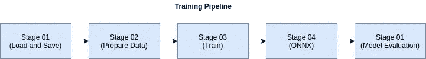

**标准文件:**

1.  DVC . YAML——它充当支点文件，以线性或其他方式组织定义在其中的阶段。标记“deps”(这些是该阶段的依赖文件)、“params”(params . YAML 中与该阶段相关的所有参数)、“outs”(该阶段运行后的输出文件)。)dvc.yaml 基本上容纳了构成阶段的 DAG 关系。
2.  params.yaml —该文件存放了所有需要随时更改的可配置参数。这在实验管理中有很大的帮助。例如，如果你通过 DVC 工作室登录，这个文件的参数可以单独改变，管道可以作为实验运行。
3.  config.yaml —目录、文件名等配置保存在这里，以便随时更改。
4.  ci-cd.yml —这是定义 github 动作工作流的地方。这里我们定义了挂钩事件(推送、重置基础、部署等)和下面的事件链。亮点是它能够从所有主要的云服务提供商(AWS、Azure、GCP、Digital Ocean 或任何自定义云实例)注册一个 cloud runner 实例，只需将 API 访问键配置为环境变量。自定义命令字符串也可以配置为在每个作业的文件的 run 部分下运行。
5.  all_utils.py —这是所有实用程序方法的集合，例如使用 Shutil 的高级文件操作、加载、解析、json 转储、yaml 等。

# 现在，按照以下步骤启动项目:

**步骤 01-在克隆使用模板 Repo 后新创建的存储库后，创建本地存储库。如果使用 windows 系统，我们可以使用 git bash 进行克隆。如果 Linux/Mac OS，那么终端将工作。**

**步骤 02——在打开存储库 invscode 后创建一个 conda 环境**

```
conda create --prefix ./env python=3.7 -y
```

通过执行以下命令激活 VSCode 中的环境:

```
conda activate ./env
```

运筹学

```
source activate ./env
```

**步骤 03-安装需求**

在执行以下命令之前，在此取消对 **DVC** 的注释

```
pip install -r requirements.txt
```

执行上述命令后，请**在 requirements.txt 文件中注释 DVC**

**步骤 04-初始化 dvc 项目**

```
dvc init
```

本地测试:

```
dvc repro
```

这可用于在没有 CML 启用的 github 操作的情况下运行管道。这也将满足整个管道。然而，在这种情况下，代码命令需要从基于实例的代码内部运行，比如 Ec2 或带有适当 GPU 的本地 linux/win 系统。如果这需要在 cpu 上完成，确保将 requirements.txt 中的 transformer 依赖项更新为 CPU 版本。(请参考官方文件)

**步骤 05-启动 EC2 实例**

由于我们没有使用 aws EC2 Spot 实例，因此我们没有在 ci-cd.yml 文件中创建实例。因此，我们需要一个支持 GPU 的 EC2 实例，并在 EC2 的终端中执行以下命令。

```
docker run --gpus all dvcorg/cml-py3 nvidia-smi
```

然后

```
docker run --name myrunner -d --gpus all \
    -e RUNNER_IDLE_TIMEOUT=1800 \
    -e RUNNER_LABELS=cml,gpu \
    -e RUNNER_REPO="https://github.com/USER_ID/REPO_NAME" \
    -e repo_token=REPO_Token \
    dvcorg/cml-py3
```

保持 EC2 实例运行，以便我们可以在 GitHub 操作中使用它。工作流完成后，您可以关闭或终止 EC2 实例。此外，可以在 github 的 cloud runner 部分找到与 Github 存储库锁在一起的同一个实例，它被列为 runner。

**步骤 06——提交并将变更推送到远程存储库**

```
git add .
git commit -m "Detailed Commit for further reference"
git push origin master    # Branch of choice
```

**步骤 07-流水线推送操作触发器**

如果所有必需的 API 键和配置都以相同的顺序就位，推送操作将触发整个训练管道，如上所述。

**步骤 08-推送为 Github 事件:**

Github 通过 github 工作流将 Push 作为一个事件来监听。然后，这将启动工作流中定义的管道，如下面的 Actions 选项卡所示

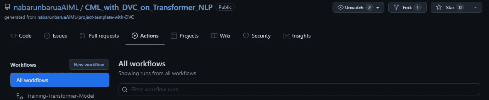

配置的 DVC 阶段现在在 EC2( Ubuntu 18 OS)配置的实例(我们的例子)中一个接一个地执行，否则如果实例没有配置，那么 github 在内部的 spot 实例上运行这些，并且在整个管道完成之后，它还清理所利用的资源，只给我们留下保存的指标和最佳模型。

如前所述，各阶段的执行顺序如下:

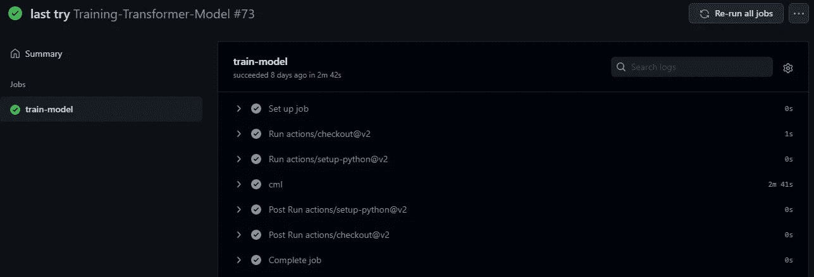

同样的详细日志也可以通过点击以下步骤找到:现在如下所示，培训开始和结束

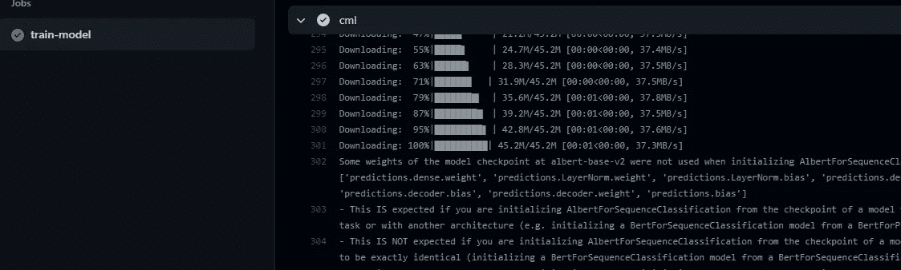

如果我们使用 Github 的专用实例而不是 spot 实例，自定义级别的日志(info、debug、error)也可以从 EC2 实例定制和访问。

**步骤 09-实验管理:**

DVC 工作室— [DVC 工作室](https://studio.iterative.ai)这有助于我们进行 ML 实验跟踪、可视化和协作(同时一组开发人员处理不同的实验)。DVC 工作室也自动记账。见下文:

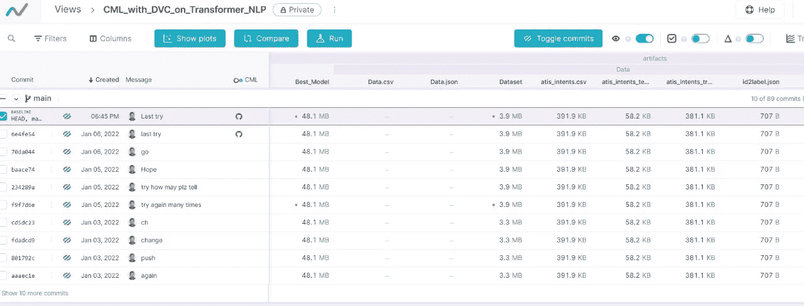

由于 DVC 工作室与 github 顺利集成，我们可以审查和挑选每个与实验相关的提交，这提供了很大的灵活性。

**步骤 10-评估指标管理:**

wandb-权重和偏差 [Wandb](https://wandb.ai/site) 虽然，DVC 工作室这有助于我们进行 ML 实验跟踪、可视化、协作和最佳模型(如果使用的话)，但权重和偏差(Wandb)通过记录评估指标和提供图形洞察使其变得更加容易。

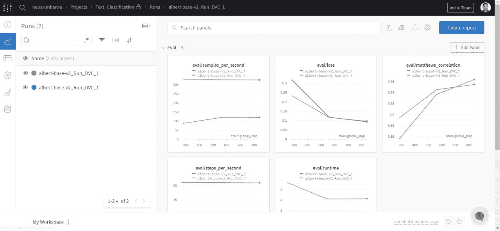

**第 11 步-最佳模型选择:**

Wandb-权重和偏差 [Wandb](https://wandb.ai/site) 如下图所示，是我们在不同实验中获得的最佳权重。这是一个非常有用的功能，因为寻找最佳重量有时会很麻烦。

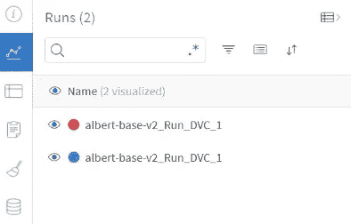

**步骤 12-结束注释:**

当所有步骤完成后，cml 工作流中的最后一个事件被执行，它是对线程的注释。

```
cml-send-comment report.md
```

当这种情况发生时，消息通知将弹出在用户横幅上，如您所见。

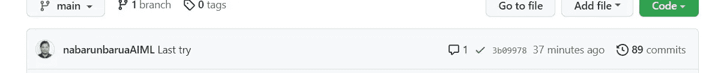

完整的培训日志也可以在 report.md 中找到，因为我们已经在 cml 工作流文件(ci-cd.yaml)中配置了以下步骤

见下文:

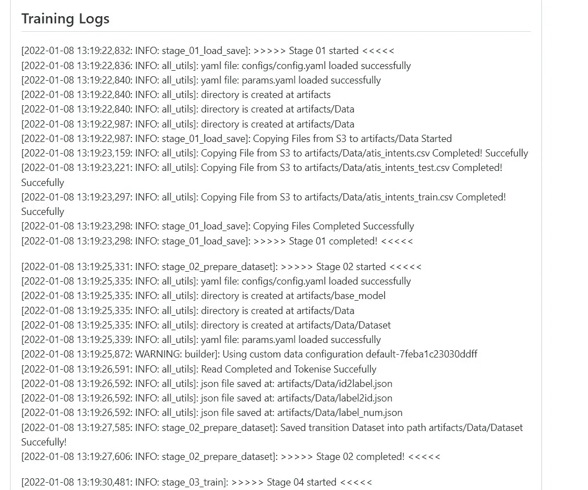

# W.I.P:“部署管道”将很快跟进这个存储库

**采用 Kubernetes 编排的 Dockerized 容器应用集群**

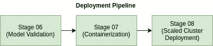

下面的存储库的架构如上

跟随此库获取更新:[Dockerized _ CML _ Application _ On _ KubernetesCluster](https://github.com/arjunKumbakkara/NLP_CML_Deployment_Pipeline_On_Kubernetes)

@misc{Transformer，wandb，DVC & ONNX，title = {使用 DVC 在 Huggingface Transformer 上进行连续机器学习，包括权重和偏差实现以及将权重转换为 ONNX}，年份= {2022}，作者= {Nabarun Barua，Arjun Kumbakkara}，}

*原载于*[https://github . com/nabarunbaraaiml/CML _ with _ DVC _ on _ Transformer _ NLP](https://github.com/nabarunbaruaAIML/CML_with_DVC_on_Transformer_NLP)*。*

[](/mlearning-ai/mlearning-ai-submission-suggestions-b51e2b130bfb) [## Mlearning.ai 提交建议

### 如何成为 Mlearning.ai 上的作家

medium.com](/mlearning-ai/mlearning-ai-submission-suggestions-b51e2b130bfb)