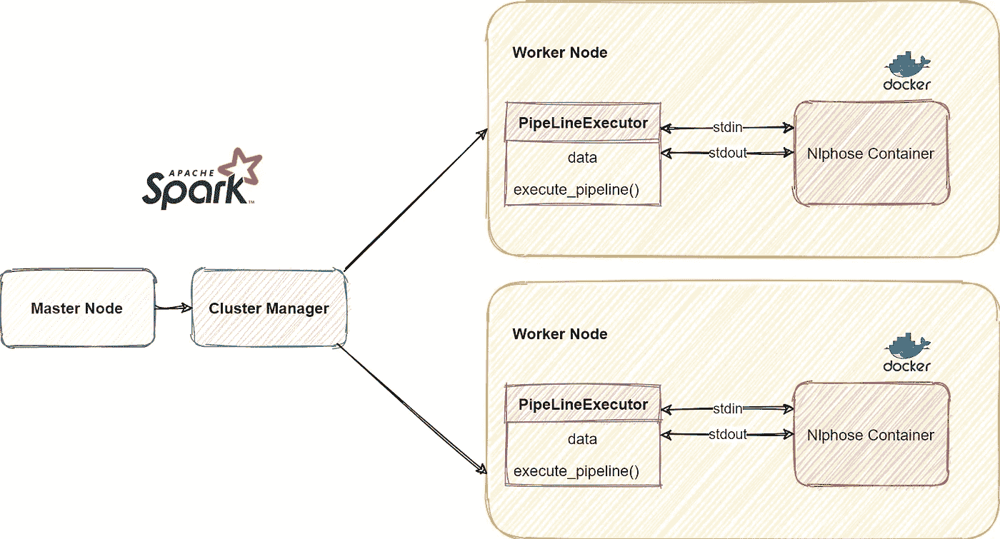
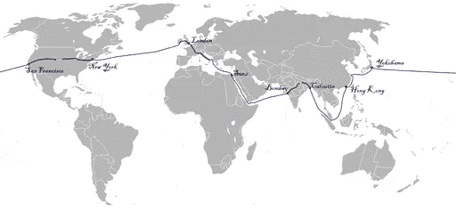

# 使用 PySpark 和 Nlphose 创建可伸缩的 NLP 管道

> 原文：<https://medium.com/mlearning-ai/creating-scalable-nlp-pipelines-using-pyspark-and-nlphose-b93afa3097c1?source=collection_archive---------6----------------------->

在本文中，我们将了解如何使用[NLP hoste](https://github.com/code2k13/nlphose)和 Pyspark 来执行 NLP 管道，并收集关于儒勒·凡尔纳的著作《80 天环游世界》中的著名旅程的信息。这里是本文中使用的⬇️ [Pyspark 笔记本的链接。](https://github.com/code2k13/nlphose/blob/main/Nlphose_Pyspark.ipynb)


根据我的个人经验，我发现从非结构化数据中挖掘数据需要使用多种技术。没有一个单一的模型或库可以提供您需要的一切。通常，您可能需要使用用不同编程语言/框架编写的组件。这就是我的开源项目 [Nlphose](https://github.com/code2k13/nlphose) 出现的地方。Nlphose 支持使用一组简单的命令行工具，在几秒钟内创建复杂的 NLP 管道，用于处理静态文件或流文本。您可以在终端中执行单个命令，对文本执行多种操作，如 NER、情感分析、分块、语言识别、Q & A、0-shot 分类等。Spark 是广泛使用的大数据处理工具，可用于并行化工作负载。



[Nlphose](https://github.com/code2k13/nlphose) 基于“ [Unix 工具哲学](https://tldp.org/LDP/GNU-Linux-Tools-Summary/html/c1089.htm)”。这个想法是创造简单的工具，它们可以一起工作来完成多项任务。Nlphose 脚本依靠标准的“文件流”来读写数据，并且可以通过管道连接在一起，以创建复杂的自然语言处理管道。每个脚本从“标准输入”读取 JSON，并写入“标准输出”。所有的脚本都期望 JSON 以 nlphose 兼容格式编码，并且输出也需要是 nlphose 兼容的。你可以在这里阅读关于 NLP hose[架构的更多细节。](https://github.com/code2k13/nlphose/wiki/Architecture-of-nlphose)

# Nlphose 有什么不同？

Nlphose 在设计上不像 SparkML 那样支持 Spark/Pyspark。Pyspark 中的 Nlphose 依赖于安装在 spark 集群所有节点上的“Docker”。当在 [Google Dataproc](https://cloud.google.com/dataproc/) 中创建一个新的集群时，这是很容易做到的(对于任何其他 Spark 分布也应该是一样的)。除了 Docker 之外，Nlphose 不需要在 Spark 集群的工作节点上安装任何其他依赖项。我们使用下面描述的“PipeLineExecutor”类从 Pyspark 中执行 Nlphose 管道。

在幕后，这个类使用“[子进程](https://docs.python.org/3/library/subprocess.html)模块为一个 Spark 任务生成一个新的 docker 容器，并执行一个 Nlphose 管道。使用 stdout 和 stdin 执行 I/O。这听起来很简单，但这就是我构建 Nlphose 的方式。它从未被设想为支持任何特定的计算框架或库。您可以用许多不同的方式运行 Nlphose，这里将介绍其中一种方式。

# 我们开始吧

首先，我们安装一个包，稍后我们将使用它来构建一个可视化。

！pip 安装字数

下面的命令从 gutenber.org 的[下载电子书《80 天环游世界》，并使用 Nlphose 提供的工具将单个文本文件分割成行分隔的 json。每个 json 对象都有一个“id”和“text”属性。](https://ashishware.com/2022/01/23/PysparkNlphose/gutenber.org)

```
!docker run code2k13/nlphose:latest \
/bin/bash -c “wget [https://www.gutenberg.org/files/103/103-0.txt](https://www.gutenberg.org/files/103/103-0.txt) && ./file2json.py 103–0.txt -n 2” > ebook.json
```

我们删除所有不再需要的 docker 容器。

```
!docker system prune -f
```

让我们导入所有需要的库。读取我们之前创建的 json 文件，并将其转换为 pandas 数据框。然后，我们将一个“group_id”列添加到行中，该列从 0 到 3 之间随机分配一个 groupId。完成后，我们创建一个新的 PySpark 数据框架并显示一些结果。

```
import pandas as pd
from pyspark.sql.types import StructType,StructField, StringType, IntegerType
from pyspark.sql.functions import desc
from pyspark.sql.functions import udfdf_pd = pd.read_json(“ebook.json”,lines=True) 
df_pd[‘group_id’] = [i for i in range(0,3)]*347
df= spark.createDataFrame(df_pd)
df= spark.createDataFrame(df_pd)+ — — — — -+ — — — — — — — — — — + — — — — — — — — — — + — — — — +
|file_name| id| text|group_id|
+ — — — — -+ — — — — — — — — — — + — — — — — — — — — — + — — — — +
|103–0.txt|2bbbfe64–7c1e-11e…| The Project Gute…| 0|
|103–0.txt|2bbea7ea-7c1e-11e…| Title: Around th…| 1|
|103–0.txt|2bbf2eb8–7c1e-11e…|IN WHICH PHILEAS …| 2|
|103–0.txt|2bbfdbd8–7c1e-11e…| Certainly an Eng…| 0|
|103–0.txt|2bbff29e-7c1e-11e…| Phileas Fogg was…| 1|
|103–0.txt|2bc00734–7c1e-11e…| The way in which…| 2|
|103–0.txt|2bc02570–7c1e-11e…| He was recommend…| 0|
|103–0.txt|2bc095f0–7c1e-11e…| Was Phileas Fogg…| 1|
|103–0.txt|2bc0ed20–7c1e-11e…| Had he travelled…| 2|
|103–0.txt|2bc159d6–7c1e-11e…| It was at least …| 0|
|103–0.txt|2bc1a3be-7c1e-11e…| Phileas Fogg was…| 1|
|103–0.txt|2bc2a2aa-7c1e-11e…|He breakfasted an…| 2|
|103–0.txt|2bc2c280–7c1e-11e…| If to live in th…| 0|
|103–0.txt|2bc30b3c-7c1e-11e…| The mansion in S…| 1|
|103–0.txt|2bc34dd6–7c1e-11e…| Phileas Fogg was…| 2|
|103–0.txt|2bc35f88–7c1e-11e…|Fogg would, accor…| 0|
|103–0.txt|2bc3772a-7c1e-11e…| A rap at this mo…| 1|
|103–0.txt|2bc3818e-7c1e-11e…| “The new servant…| 2|
|103–0.txt|2bc38e0e-7c1e-11e…| A young man of t…| 0|
|103–0.txt|2bc45c6c-7c1e-11e…| “You are a Frenc…| 1|
+ — — — — -+ — — — — — — — — — — + — — — — — — — — — — + — — — — +
```

# 使用 Pyspark 运行 nlphose 管道

如前所述，Nlphose 没有与 Pyspark/Spark 的本地集成。因此，我们创建了一个名为“PipeLineExecutor”的类，它启动一个 docker 容器并执行一个 Nlphose 命令。这个类使用“标准输入”和“标准输出”与 docker 容器通信。最后，当 docker 容器完成执行时，我们执行‘docker system prune-f’来清除任何未使用的容器。“execute_pipeline”方法将数据从 dataframe 写入 stdin(逐行)，从 stdout 读取输出，并返回从输出创建的 dataframe。

```
import subprocess
import pandas as pd
import json

class PipeLineExecutor:
  def __init__(self, nlphose_command,data,id_column='id',text_column='text'):
    self.nlphose_command = nlphose_command
    self.id_column = id_column
    self.text_column = text_column
    self.data = data

  def execute_pipeline(self):
    try:
     prune_proc = subprocess.Popen(["docker system prune -f"],shell=True)
     prune_proc.communicate()

     proc = subprocess.Popen([self.nlphose_command],shell=True,stdout=subprocess.PIPE, stdin=subprocess.PIPE,stderr=subprocess.PIPE)
     for idx,row in self.data.iterrows():       
        proc.stdin.write(bytes(json.dumps({"id":row[self.id_column],"text":row[self.text_column]}),"utf8"))
        proc.stdin.write(b"\n")
        proc.stdin.flush()

     output,error = proc.communicate()
     output_str = str(output,'utf-8')
     output_str = output_str
     data = output_str.split("\n")    
     data = [d for d in data if len(d) > 2]
    finally:
        prune_proc = subprocess.Popen(["docker system prune -f"],shell=True)
        prune_proc.communicate()
    return pd.DataFrame(data)
```

# Nlphose 命令

以下命令执行多项任务:

*   它使用 dockerhub 中的 [code2k13/nlphose:latest](https://hub.docker.com/r/code2k13/nlphose#!) 图像启动 docker 容器。
*   它将主机的 stdin、stdout 和 stderr 重定向到 docker 容器中。
*   然后，它在 docker 容器中运行 nlphose 命令，该命令对来自“stdin”的 json 执行以下操作，并将输出写入“stdout”:
*   [实体识别](https://github.com/code2k13/nlphose/wiki/Name-Entity-Recognition)
*   寻找“他们携带了什么”这个问题的答案[使用基于变压器的模型](https://github.com/code2k13/nlphose/wiki/Question-Answering)。

```
command = '''
docker run -a stdin -a stdout -a stderr -i code2k13/nlphose:latest /bin/bash -c “./entity.py |\
./xformer.py — pipeline question-answering — param ‘what did they carry?’ 
“ 
'''
```

下面的函数格式化 PipelineExecutor 任务返回的数据。“pipeline executor . execute _ pipeline”返回的 dataframe 有一个字符串列，其中包含 Nlphose 命令的输出。数据帧中的每一行代表 Nlphose 命令的一行/一个文档输出。

```
def get_answer(row):
  try:
    x =  json.loads(row[0],strict=False)
    row['json_obj'] = json.dumps(x)
    if x['xfrmr_question_answering']['score'] > 0.80:
        row['id'] =  str(x['id'])
        row['answer'] = x['xfrmr_question_answering']['answer']        
    else:
        row['id'] = str(x['id'])
        row['answer'] = None

  except Exception as e:
    row['id'] = None
    row['answer'] = "ERROR " + str(e) #.message
    row['json_obj'] = None

  return row
```

下面的函数创建一个“PipeLineExecutor”对象，将数据传递给它，然后对该对象调用“execute_pipeline”方法。然后，它使用“get_answer”方法来格式化“execute_pipeline”方法的输出。

```
def run_pipeline(data):
  nlphose_executor = PipeLineExecutor(command,data,"id","text")
  result = nlphose_executor.execute_pipeline()
  result =  result.apply(get_answer,axis=1)     
  return  result[["id","answer","json_obj"]]
```

# 使用 PySpark 扩展管道

我们使用 PySpark 的“ [applyInPandas](https://spark.apache.org/docs/latest/api/python/reference/api/pyspark.sql.GroupedData.applyInPandas.html) ”来并行化和大规模处理文本。PySpark 自动处理 Spark 集群上 Nlphose 管道的缩放。对输入数据的每个“组”调用“run_pipeline”方法。重要的是根据节点数量设置适当数量的组，以便在 Spark 集群上有效地处理数据。

```
output = df.groupby(“group_id”).applyInPandas(run_pipeline, schema=”id string,answer string,json_obj string”)
output.cache()
```

# 可视化我们的发现

一旦我们完成了 nlphose 管道的执行，我们就开始可视化我们的发现。我已经创建了两个可视化:

*   显示书中提到的地方的地图。
*   人物旅途中携带的所有重要物品的单词云。

# 在世界地图上标出书中最常见的位置

下面的代码从 Nlphose 管道中提取纬度和经度信息，并创建一个最常见位置的列表。

> *💡注意:Nlphose 实体提取将使用基于字典的方法自动猜测已知位置的坐标*

```
def get_latlon2(data):
        json_obj = json.loads(data)
        if 'entities' in json_obj.keys():
            for e in json_obj['entities']:
                if e['label'] == 'GPE' and 'cords' in e.keys():
                    return json.dumps({'data':[e['entity'],e['cords']['lat'],e['cords']['lon']]})
        return None

get_latlon_udf2 = udf(get_latlon2)  
df_locations = output.withColumn("locations",get_latlon_udf2(output["json_obj"]))
top_locations = df_locations.filter("`locations` != 'null'").groupby("locations").count().sort(desc("count")).filter("`count` >= 1")
top_locations.cache() 
top_locations.show()
```

然后，我们使用“geopandas”包在世界地图上绘制这些位置。在此之前，我们必须将数据帧转换成“geopandas”能够理解的格式。这是通过应用函数‘add _ lat _ long’来完成的

```
def add_lat_long(row):
     obj =  json.loads(row[0])["data"]
     row["lat"] = obj[1]
     row["lon"] = obj[2]
     return rowimport geopandas

df_locations = top_locations.toPandas()
df_locations = df_locations.apply(add_lat_long,axis=1)

gdf = geopandas.GeoDataFrame(df_locations, geometry=geopandas.points_from_xy(df_locations.lon, df_locations.lat))
world = geopandas.read_file(geopandas.datasets.get_path('naturalearth_lowres'))
ax = world.plot(color=(25/255,211/255,243/255) ,edgecolor=(25/255,211/255,243/255),
                    linewidth=0.4,edgecolors='none',figsize=(15, 15))
ax.axis('off')   
gdf.plot(ax=ax,alpha=0.5,marker=".",markersize=df_locations['count']*100,color='seagreen')
```

如果你熟悉这本书，你会意识到我们几乎描绘了福格在他著名的旅程中所走的实际路线。


作为参考，下面是他从维基百科上截取的实际路线的图片



八十天环游世界地图

[Roke](https://commons.wikimedia.org/wiki/File:Around_the_World_in_Eighty_Days_map.png) ， [CC BY-SA 3.0](https://creativecommons.org/licenses/by-sa/3.0/) ，通过维基共享

# 创建一个福格旅途中携带物品的单词云

下面的代码使用“提取问题回答”找到旅行者携带的最常见的物品，并创建一个单词云。

```
from wordcloud import WordCloud, STOPWORDS
import matplotlib.pyplot as plt
from matplotlib.pyplot import figurefigure(figsize=(12, 6), dpi=120)
wordcloud = WordCloud(background_color=’white’,width=1024,height=500).generate(‘ ‘.join(output.filter(“`answer` != ‘null’”).toPandas()[‘answer’].tolist()))
plt.imshow(wordcloud)
plt.axis(“off”)
plt.show()
```


# 结论

PySpark 是数据科学家和 ML 实践者最喜欢的工具的原因之一是因为使用数据框架非常方便。本文展示了如何使用 PySpark 在 Spark 集群上运行 Nlphose。使用本文描述的方法，我们可以非常容易地将 Nlphose 管道作为数据处理管道的一部分嵌入。希望你喜欢这篇文章。随时欢迎反馈和评论，谢谢！

[](/mlearning-ai/mlearning-ai-submission-suggestions-b51e2b130bfb) [## Mlearning.ai 提交建议

### 如何成为 Mlearning.ai 上的作家

medium.com](/mlearning-ai/mlearning-ai-submission-suggestions-b51e2b130bfb)