# 信用卡欺诈检测

> 原文：<https://medium.com/mlearning-ai/credit-card-fraud-detection-2527ca04c3de?source=collection_archive---------0----------------------->

## 使用 Streamlit、FastAPI 和 Docker 的端到端机器学习项目。


Photo by [rupixen.com](https://unsplash.com/@rupixen?utm_source=unsplash&utm_medium=referral&utm_content=creditCopyText) on [Unsplash](https://unsplash.com/s/photos/credit-card?utm_source=unsplash&utm_medium=referral&utm_content=creditCopyText)

# **简介**

## 什么是信用卡诈骗？

据[法律信息研究所](https://www.law.cornell.edu/wex/credit_card_fraud#:~:text=Credit%20card%20fraud%20is%20a,or%20removing%20funds%20from%20it.):

> 信用卡欺诈是一种身份盗窃形式，涉及未经授权获取他人的信用卡信息，目的是将购物费用记入帐户或从帐户中取出资金。

在这个项目中，我们将开发一个机器学习模型，使用分类算法和技术来准确检测信用卡交易是否欺诈。我们还将使用 FastAPI 将我们的模型部署为 API，并使用 Streamlit 创建一个前端接口来访问我们的 API。

如果您想查看已完成的项目和源代码，可以访问下面的链接:

[](https://github.com/Nneji123/Credit-Card-Fraud-Detection.git) [## GitHub-nneji 123/信用卡欺诈检测:信用卡欺诈检测论文库…

### Group 3 Zummit Africa AI/ML 团队开展的端到端机器学习项目，用于检测欺诈性信用卡…

github.com](https://github.com/Nneji123/Credit-Card-Fraud-Detection.git) 

# 项目大纲

以下是将在本项目中执行的步骤:

1.  数据来源
2.  数据分析
3.  模型结构
4.  模型评估
5.  使用 FastAPI 部署模型
6.  API 与 Streamlit 前端的接口
7.  用 docker-compose 组合前端和后端

# 数据来源

公开的金融服务数据集很少，尤其是在新兴的移动转账领域。许多像我们这样在欺诈检测领域进行研究的学者重视金融数据集。因为金融交易本质上是私密的，所以没有公开的数据集，这也是问题的一部分。

使用名为 PaySim 的模拟器生成的合成数据集被用作构建该项目中使用的模型的数据集。PaySim 使用私有数据集中的数据生成一个类似于正常交易操作的合成数据集，并注入恶意行为，以便以后评估欺诈检测方法的性能。

[](https://www.kaggle.com/datasets/ealaxi/paysim1) [## 用于欺诈检测的合成财务数据集

### PaySim 移动货币模拟器生成的合成数据集

www.kaggle.com](https://www.kaggle.com/datasets/ealaxi/paysim1) 

## 设置我们的环境

我们将使用[谷歌实验室](https://research.google.com/colaboratory/)来执行这个项目。Colab 是一种托管的 Jupyter 笔记本服务，无需设置即可使用，同时提供对包括 GPU 在内的计算资源的免费访问。

为了使用 Google Colab 加载数据集，我们将使用 Kaggle API 来下载数据集。您可以通过创建一个 Kaggle 帐户并下载您的 Kaggle JSON 认证密钥来访问 Kaggle API。

> [https://research.google.com/colaboratory/](https://research.google.com/colaboratory/)
> 
> [在 Google Colab |数据科学和机器学习中下载 kaggle 数据的最简单方法](https://www.kaggle.com/general/74235)

## 加载数据集

我们现在可以通过在另一个单元格中运行以下代码，用 Kaggle API 加载数据集:

```
**!**pip install -q kaggle
```

使用 Google Colab 中的 kaggle API 上传 kaggle.json 文件

```
**from** google.colab **import** files

files**.**upload()
```

这个单元在我们的根目录中创建一个. kaggle 隐藏文件夹，并将 kaggle.json 文件复制到该文件夹中。

```
**!** mkdir ~/.kaggle
**!** cp kaggle.json ~/.kaggle/
**!** chmod 600 /root/.kaggle/kaggle.json
```

这个单元将把用于这个项目的数据集下载到 Google Colab 实例中的/content 目录，并解压缩 csv 文件。

```
**!**kaggle datasets download -d ealaxi/paysim1
**!**unzip /content/paysim1.zip
```

在我们安装了需求并加载了数据之后，我们就可以对数据集进行一些分析了。

# 数据分析

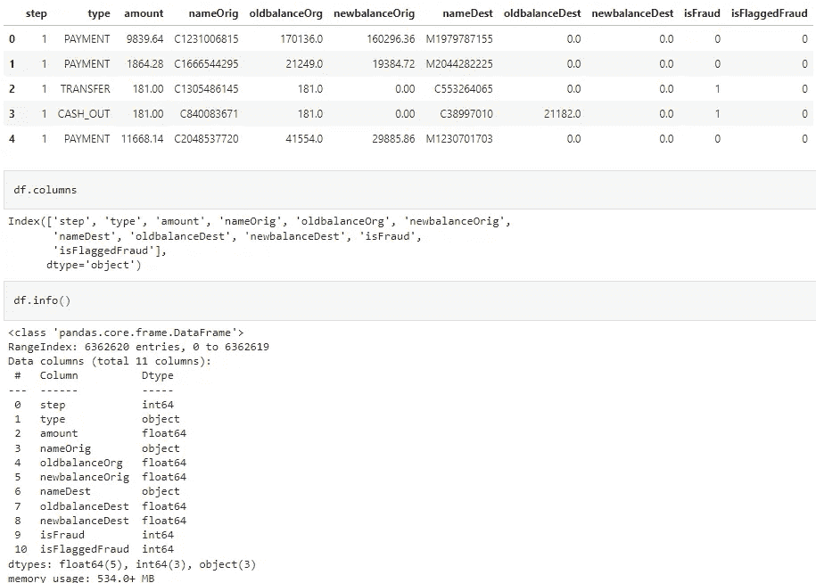

Screenshot by Author: Loaded Data

我们可以从上面看到，数据集总共包含 11 列和 600 多万行。

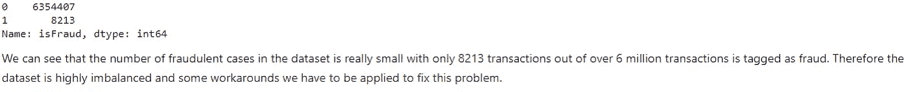

Screenshot by Author: Number of fraudulent cases.

数据集也非常不平衡，只有 0.12%的交易被标记为欺诈案件。处理不平衡数据时，可以采取一些变通办法，例如:

*   合成少数过采样技术(SMOTE)
*   欠采样

但是为了简单起见，我们不会在这里应用任何技术。你可以通过下面的链接了解 SMOTE、欠采样和处理不平衡数据；

[](/analytics-vidhya/credit-card-fraud-detection-how-to-handle-imbalanced-dataset-1f18b6f881) [## 信用卡欺诈检测:如何处理不平衡数据集

### 这篇文章将关注 stey-by-step 项目及其结果，你可以在我的 Github 中查看我的代码。

medium.com](/analytics-vidhya/credit-card-fraud-detection-how-to-handle-imbalanced-dataset-1f18b6f881) [](https://machinelearningmastery.com/imbalanced-classification-with-the-fraudulent-credit-card-transactions-dataset/) [## 欺诈性信用卡交易数据集的不平衡分类-机器学习…

### 欺诈是信用卡公司的一个主要问题，这是因为完成了大量的交易…

machinelearningmastery.com](https://machinelearningmastery.com/imbalanced-classification-with-the-fraudulent-credit-card-transactions-dataset/) 

## 特征工程

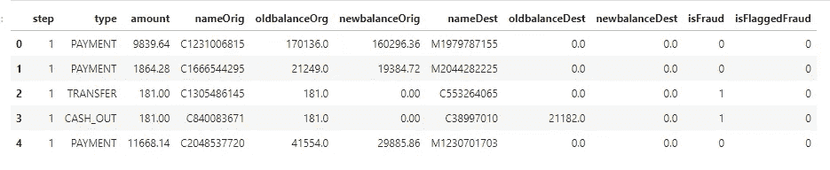

Screenshot by Author: Feature Selection

上图显示了数据集中的列。这是对每列的描述:

*   步骤列:完成一个事务所用的小时数。
*   类型栏:发生的交易类型。这一栏有 5 个类别，即:'付款'，'转账'，'提现'，'借记'，'提现'。
*   nameOrig:发件人的姓名/ID。
*   oldbalanceOrg:交易发生前的发送方余额。
*   newbalanceOrg:交易发生后的发送方余额。
*   nameDest:收件人的姓名/ID。
*   oldbalanceDest:交易发生前的接收方余额。
*   newbalanceDest:交易发生后的接收方余额。
*   isFraud:这是模拟中欺诈代理进行的交易。
*   isFlaggedFraud:这种商业模式旨在控制从一个账户到另一个账户的大规模转账，并标记非法企图。此数据集中的非法尝试是指试图在单次交易中转移超过 200.000 英镑的金额。

我们将删除“nameOrig”和“nameDest”列，并使用标签编码将“type”列从分类数据转换为数字数据。

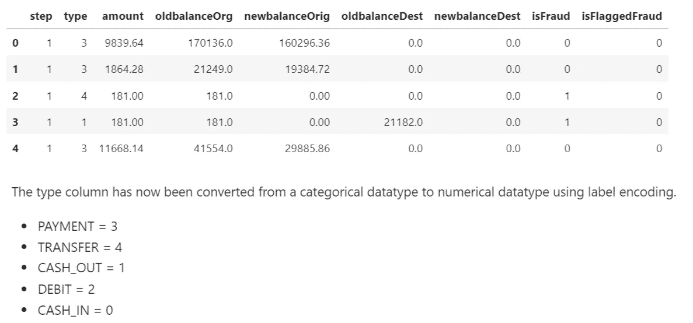

Screenshot by Author: Label Encoding

我们还将创建一个“evaluate_model”函数，该函数将用于获取我们的评估模型的度量分数。使用的指标有:

*   准确性得分:准确性是分类问题中使用的一种度量，用于告诉准确预测的百分比。我们通过将正确预测的数量除以预测的总数来计算它。
*   精度分数:精度量化了实际属于正类的正类预测的数量。
*   召回分数:召回量化了从数据集中的所有正例中做出的正类预测的数量。
*   F1 分数:F-Measure 或 F1 分数提供了一个单一的分数，在一个数字中平衡了精确度和召回率。
*   混淆矩阵:混淆矩阵**是一种总结分类算法**性能的技术。如果每个类中的观测值数量不相等，或者数据集中有两个以上的类，那么分类精度本身就可能会产生误导。

> [机器学习中的性能度量【完全指南】— neptune.ai](https://neptune.ai/blog/performance-metrics-in-machine-learning-complete-guide#:~:text=Classification%20models%20have%20discrete%20output,it%20in%20a%20different%20way.)

# 模型结构

鉴于这个项目试图解决一个分类问题(检测交易是否欺诈)，我们将为我们的信用卡检测应用程序建立和评估一个分类模型。

你可以通过下面的链接阅读更多关于分类机器学习技术的内容:

> [机器学习中的分类|分类算法| Edureka](https://www.edureka.co/blog/classification-in-machine-learning/#:~:text=In%20machine%20learning%2C%20classification%20is,recognition%2C%20document%20classification%2C%20etc.)
> 
> [机器学习中的 4 类分类任务(machinelearningmastery.com)](https://machinelearningmastery.com/types-of-classification-in-machine-learning/)

## 逻辑回归

逻辑回归**根据给定的独立变量数据集**估计某一事件发生的概率，如投票或未投票。由于结果是一个概率，因变量被限制在 0 和 1 之间。

我们将把数据集分成训练集和测试集，并使用 Sci-Kit Learn 库中的 LogisticRegression 函数来预测信用卡交易的结果。

在上面的代码片段中；

*   我们通过删除“isFraud”列来设置 X 变量，因为这是我们的目标列。
*   “isFraud”列随后被赋给我们的 y 变量。
*   然后将数据分为训练集和测试集，然后对训练集应用逻辑回归。
*   使用我们之前声明的“评估模型”函数，我们然后评估模型。

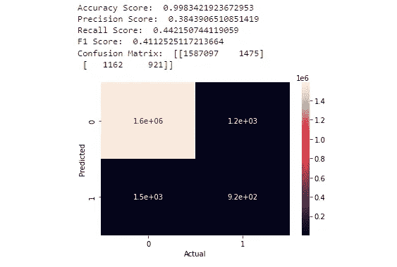

Image by Author: Logistic Regression

如上图所示，逻辑回归模型的准确率很高，但召回率很低。

准确性分数不是评估我们模型的好指标，因为数据是高度不平衡的，并且模型倾向于预测非欺诈案件比欺诈案件更准确，因为数据集中有更多的欺诈案件。

您可以通过以下链接了解有关评估模型准确性的更多信息:

> 机器学习——为什么准确度不是评估分类模型的最佳衡量标准？—交叉验证(stackexchange.com)
> 
> [ML 分类——为什么准确度不是评估的最佳标准？？奎师那·拉吉|灵媒](/@KrishnaRaj_Parthasarathy/ml-classification-why-accuracy-is-not-a-best-measure-for-assessing-ceeb964ae47c)

## 随机森林分类器

顾名思义，随机森林是**一种分类器，它包含给定数据集的各个子集上的许多决策树，并取平均值来提高数据集的预测准确性**。

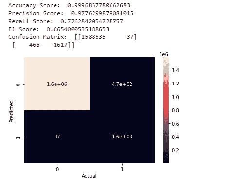

Image by Author: Random Forest Classifier

我们可以看到，使用不同的度量评估，随机森林分类器表现非常好。我们现在可以将这个模型用于我们的 web 应用程序。

## 保存我们的模型

我们现在可以将随机森林模型保存为 pickle 文件”。使用 joblib。

```
import joblib
joblib.dump(rfc, "credit_fraud.pkl")
```

# 使用 FastAPI、Streamlit 和 Docker 部署我们的模型

在本节中，我们将使用 FastAPI 将我们保存的模型部署为一个 API，并创建一个前端接口来获取来自用户的输入，这些输入将用于预测信用卡交易是否欺诈。Dockerfile 和 docker-compose 文件也将用于编译我们的项目。

**什么是 API？**

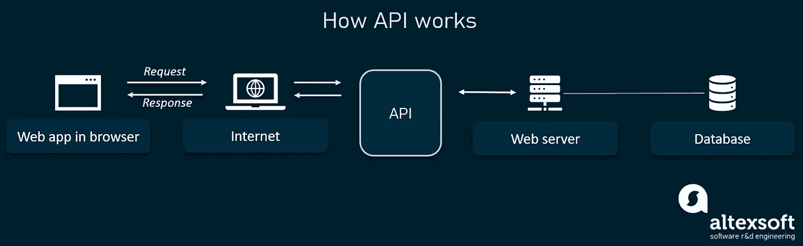

Image from [altexsoft.com](https://www.altexsoft.com/blog/engineering/what-is-api-definition-types-specifications-documentation/)

**应用程序接口(API)** 是一组用于构建软件应用程序的例程、协议和工具。基本上，API 规定了软件组件应该如何交互。

**什么是 FastAPI？**

**FastAPI** 是一个用 Python 开发**RESTful API**的 Web 框架。FastAPI 基于 **Pydantic** 和类型提示来验证、序列化和反序列化数据，并自动生成 **OpenAPI** 文档。它完全支持异步编程，可以与**uvicon**和 **Gunicorn** 一起运行。

您可以查看 FastAPI 文档中的这些链接以及它是如何工作的👇

> [法斯塔皮(tiangolo.com)](https://fastapi.tiangolo.com/)
> 
> [使用 FastAPI 构建 Python Web API——真正的 Python](https://realpython.com/fastapi-python-web-apis/)
> 
> 【github.com】tiangolo/FastAPI:FastAPI 框架，高性能，简单易学，代码编写速度快，可投入生产

**什么是细流？**

Streamlit 是 Python 语言的开源 app 框架。它**帮助我们在短时间内创建数据科学和机器学习的网络应用**。它兼容主要的 Python 库，如 scikit-learn、Keras、PyTorch、SymPy(latex)、NumPy、pandas、Matplotlib 等。

您可以在下面找到有关 streamlit 的更多信息👇

> [简化 it 构建和共享数据应用的最快方式](https://streamlit.io/)
> 
> [https://www . analyticsvidhya . com/blog/2021/06/build-we b-app-instant-for-machine-learning-using-streamlit/](https://www.analyticsvidhya.com/blog/2021/06/build-web-app-instantly-for-machine-learning-using-streamlit/)

**Docker 是什么？**

Docker 是一个开源的容器化平台。它**使我们能够将应用打包到容器中**——标准化的可执行组件，将应用源代码与操作系统(OS)库以及在任何环境中运行该代码所需的依赖项相结合。

**什么是 Docker-Compose？**

Docker Compose 是一个被开发用来帮助定义和共享多容器应用程序的工具。使用 Compose，我们可以创建一个 YAML 文件来定义服务，并且只需一个命令，就可以将所有东西旋转起来或全部拆除。

关于 Docker 和 docker-compose 的更多信息可以在下面找到👇

> [https://www.docker.com/](https://www.docker.com/)
> 
> [https://docs.docker.com/compose/](https://docs.docker.com/compose/)

# 项目结构

该项目由两部分组成，一个基于 Streamlit 的前端和一个基于 FastAPI 的后端，整个应用程序使用 Docker 打包。

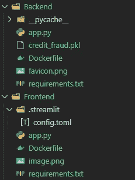

Screenshot by Author: Project Structure

## 使用 Docker 设置 Streamlit 应用程序

Streamlit 应用程序将用于向我们的 API 发出请求，以便在向它发送数据时获得预测。

```
📦Frontend
 ┣ 📂.streamlit
 ┃ ┗ 📜config.toml 
 ┣ 📜Dockerfile
 ┣ 📜app.py
 ┗  image.png
 ┗ 📜requirements.txt
```

在 app.py 中，您创建自己的网页，并使用 [Streamlit widgets](https://share.streamlit.io/daniellewisdl/streamlit-cheat-sheet/master/app.py) 来完成此操作。

对于您的 Streamlit 应用程序的自定义主题，它们可以在配置文件:`./.streamlit/config.toml`中定义。查看此[链接](https://blog.streamlit.io/introducing-theming/)了解更多详情。

以下是 streamlit 应用程序的依赖项:

```
numpy==1.21.6
requests==2.23.0
streamlit==1.10.0
```

下面是我用来构建 Streamlit 应用程序的 Dockerfile。它由我在 requirements.txt 文件中列出的依赖项组成。运行构建命令后，这些依赖项将随其相应的版本一起安装。

我们的 streamlit 应用程序的代码如下所示:

上面的代码执行以下操作:

*   接受用户的输入，
*   将输入作为 post 请求发送到托管模型的 FastAPI 应用程序。
*   当 API 收到数据时，模型预测交易的结果，并将响应发送回前端，以便显示结果。

构建我的 Dockerfile 文件的命令是:

```
docker build -t myapp:latest .
```

要运行应用程序，请在终端中使用以下命令:

```
docker run -p 8501:8501 myapp:latest
```

结果应该是这样的:

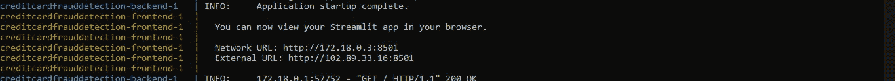

Image by Author: Streamlit Running from Terminal

然后你就可以使用网络 URL:[http://localhost:8501/](http://localhost:8501/)在浏览器中查看你的应用了

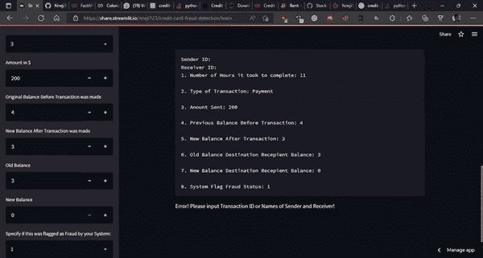

GIF by Author: Streamlit Application

## 用 FastAPI 和 Docker 设置后端

我们将使用 FastAPI 和 docker 文件将我们的模型部署为 API 来获得预测。

我们保存为“credit_fraud.pkl”的随机森林模型将用于进行预测。该模型将通过 web 界面触发，从最终用户提供的测试数据样本中获得预测。

这是我的后端存储库结构:

```
📦Backend
 ┣ 📜Dockerfile
 ┣ 📜credit_fraud.pkl
 ┣ 📜app.py
 ┗ 📜requirements.txt
```

在 app.py 文件中，加载了模型并创建了一个 API，用于从测试数据中获取属性并生成与之相关的预测。

这些是我在这个项目中使用的后端依赖:

```
fastapi==0.68.0
gunicorn==20.1.0
uvicorn==0.14.0
pandas==1.3.1
scikit-learn==1.0.2
scipy==1.8.1
six==1.16.0
joblib==1.0.1
numpy==1.21.6
pydantic==1.9.1
httptools
uvloop
```

这是用于后端的 docker 文件:

为了详细说明后端 docker 文件中的最后一个命令，下面是为[uvicon](https://www.uvicorn.org/deployment/)定义的**设置**:

**—主机 0.0.0.0** 定义托管服务器的地址。

**—端口 8000** 定义托管服务器的端口。

**app:app** 告诉 Uvicorn 在哪里可以找到 FastAPI ASGI 应用程序——例如，“在‘app . py’文件中，您会找到 ASGI 应用程序，app = FastAPI()。

**—重新加载**启用自动重新加载，这样服务器将在对代码库进行更改后重新启动。

API 的代码如下所示:

以下是解释上述代码的步骤:

1.  创建了“fraudDetection”模型类，以便定义我们的机器学习模型的所有参数。前两个值是整数类型，其余的是浮点类型。
2.  接下来，用 joblib 加载模型，然后保存为一个名为“model”的变量。这个模型对象将用于获得预测。
3.  “/predict”路由函数声明了一个名为“data”的“fraudDetection”模型类型的参数。该参数可以作为字典来访问。dictionary 对象将允许您以键值对的形式访问参数值。
4.  现在，您正在保存客户端发送的所有参数值。这些值现在被提供给模型预测函数，您就可以对提供的数据进行预测了。

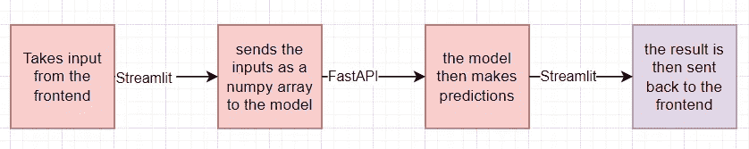

Image by Author: Data Transfer between API and Streamlit Application

在终端的“后端”文件夹中，通过执行以下命令构建映像:

```
$ docker build -t backend .
```

运行容器:

```
$ docker run -p 8000:8000 backend
```

在浏览器中，导航至 [http://localhost:8000/](http://localhost:8080/) 。您应该看到:

```
Credit Card Fraud Detection API 🙌🏻

Note: add "/docs" to the URL to get the Swagger UI Docs or "/redoc"
```

如果您导航到[http://localhost:8000/docs](http://localhost:8080/docs)，您可以访问 API 文档

您将看到您创建的每条路由的文档，以及一个交互式界面，您可以直接从浏览器测试每个端点。

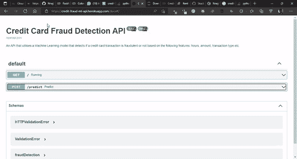

GIF by Author: Credit Card Fraud Detection API

现在我们将定义一个 docker-compose.yml 文件，该文件将为我们的 API 创建一个服务，并为前端 Streamlit 应用程序创建一个服务。

Docker-compose 是定义多容器应用程序的一个很好的工具，它使你能够配置它们，也使你能够在你的服务之间建立通信。

这是 docker-compose 文件，用于将后端和前端容器连接在一起:

docker-compose 文件已经过配置，因此我们不再需要一次构建不同图像的每个 docker 文件。我们可以通过运行 docker- compose 命令一次性完成:

```
docker-compose up -d --build
```

构建服务前端和后端的映像是因为它们还不存在。

为了实现前端和后端 docker 容器之间的通信，创建一个网络并给每个容器一个别名是必要的。

要查看更改，使用以下命令很有用:

```
docker-compose stop
```

然后，如果您没有添加任何新的依赖项，您不需要重新构建您的 Streamlit 和 FastAPI 映像，您可以只使用以下命令来查看更改:

```
docker-compose up -d
```

# 结论

总之，我们能够建立一个可以检测欺诈性信用卡交易的机器学习模型，使用 FastAPI 将我们的模型部署为 API，使用 Streamlit 创建一个前端应用程序，并使用 docker-compose 将这两个应用程序结合起来。

> 您可以通过下面的[**链接**](https://share.streamlit.io/nneji123/credit-card-fraud-detection/main) **查看部署在 streamlit cloud 上的最终应用。**
> 
> API 部署在 Heroku 平台上，可以在这里 **找到 [**。**](https://credit-fraud-ml-api.herokuapp.com/)**
> 
> 包含源代码的库可以在这里 **找到 [**。**](https://github.com/Nneji123/Credit-Card-Fraud-Detection/)**

# 参考

[https://testdriven.io/blog/fastapi-streamlit/](https://testdriven.io/blog/fastapi-streamlit/)

[使用 Streamlit、FastAPI 和 Docker 部署机器学习模型|作者 Rihab Feki | Medium](https://rihab-feki.medium.com/deploying-machine-learning-models-with-streamlit-fastapi-and-docker-bb16bbf8eb91)

你坚持到了文章的结尾！感谢您的阅读，希望您能学到很多，如果您喜欢我的内容，并希望与我联系，您可以通过以下方式联系:

1.  跟我上 [*中*。](/@ifeanyinneji777)
2.  在[*LinkedIn*](https://www.linkedin.com/in/ifeanyi-nneji)*和* [*Twitter*](https://twitter.com/Neji_14) 上与我连线。
3.  在 LinkedIn 上与 Zummit Africa 联系

[](/mlearning-ai/mlearning-ai-submission-suggestions-b51e2b130bfb) [## Mlearning.ai 提交建议

### 如何成为 Mlearning.ai 上的作家

medium.com](/mlearning-ai/mlearning-ai-submission-suggestions-b51e2b130bfb)