# 使用 Python 的 CRISP-DM 方法(包括使用 Flask 的模型部署)|分类案例研究

> 原文：<https://medium.com/mlearning-ai/crisp-dm-methodology-with-python-model-deployment-using-flask-included-classification-case-33b9e184f4e7?source=collection_archive---------0----------------------->

跨行业数据挖掘标准流程(CRISP-DM)方法由 6 个阶段组成，包括业务理解、数据准备和解释性数据分析(EDA)、建模、评估、部署以及维护和监控。出于这个案例研究的目的，我将使用来自 Kaggle 的[电子商务运输数据](https://www.kaggle.com/prachi13/customer-analytics)。🚢


Source: [Pexels@Martin Damboldt](https://www.pexels.com/photo/photography-of-ship-799091/)

**第一阶段:业务理解🐣**

在我们开始分析过程之前，我们需要设定 SMART(具体的、可测量的、可操作的、以结果为导向的、有时限的)目标。一个SMART 目标可以让我们理解从商业角度判断项目成功的标准。🎯

对于本案例研究，主要目标是通过识别和减少延迟发货，在 3 个月内将客户流失率(客户转向竞争对手的比率)降低 5%。相关的业务问题可能是*“客户的询问得到回答了吗？”*、*“客户评价如何？产品是否按时交付？”*或*“如果产品重要性高，产品是否按时交付？”。*

为了使我们的目标成为现实，我们需要一个描述必要步骤的**项目计划**、约束**(例如，适用于建模的数据集的大小)、截止日期、可能导致项目延迟或失败的风险/事件，以及相应的应急计划。**

****第二阶段:数据准备/解释性数据分析(EDA)📈****

*   **从[电子商务运输数据](https://www.kaggle.com/prachi13/customer-analytics)下载数据集，并将其保存在您的本地电脑上。打开 Jupyter 笔记本，导入所需的库。要加载数据集，您需要右键单击下载的 CSV 文件，选择“复制”，然后粘贴代码的路径。记住在将普通字符串转换为原始字符串的路径前加上`r`。否则，您可能会得到 Unicode 错误。**

```
import numpy as np *# linear algebra*
import pandas as pd *# data processing* import matplotlib.pyplot as plt
%matplotlib inline
import seaborn as snsecomm = pd.read_csv(r"C:\Users\User\Desktop\Data Science\Kaggle Data\ecomm.csv")
```

*   **为了对数据有一些基本的了解，我们可以使用`[DataFrame.describe()](https://pandas.pydata.org/docs/reference/api/pandas.DataFrame.describe.htmlhttps://pandas.pydata.org/docs/reference/api/pandas.DataFrame.describe.html)`函数。默认情况下，该函数返回数值变量的描述性统计数据。然而，我们可以通过将`include=’object’`作为参数来找出对象的信息。(很酷吧？😎)**

```
ecomm[['Customer_care_calls','Customer_rating', 'Cost_of_the_Product','Prior_purchases','Discount_offered', 'Weight_in_gms']].describe()
```

**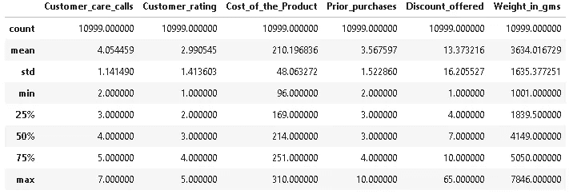**

```
ecomm.describe(include='object')
```

**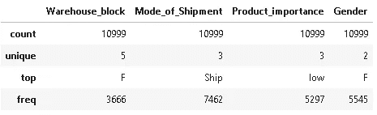**

*   **下面是结果`[Dataframe.info()](https://pandas.pydata.org/docs/reference/api/pandas.DataFrame.info.html)`，它显示电子商务运输数据包含 12 列和 10，999 行。8 列数据是整数形式，而其余的是字符串形式。我们还可以得出结论，数据的任何列中都没有缺失值(数据集的所有列都为 10，999 非空)。**

```
ecomm.info()
```

**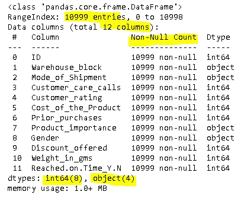**

*   **在创建任何可视化之前，我们需要了解数据集的每一列的数据类型。`*‘*Cost_of_the_Product*’*`、`‘Weight_in_gms’`和`‘Discount_offered’`下的数据是数值型的，我们可以使用直方图来探究这些列的累积频率分布。**

```
*# plotting multiple graphs in a grid*
fig, axes = plt.subplots(3,1,figsize=(20,16))

*# cumulative frequency distribution for '*Cost_of_the_Product*'*
sns.histplot(ecomm.Cost_of_the_Product, kde=True, ax=axes[0])
ax=axes[0].set_title('Frequency Distribution of Product Cost',fontsize=12)
ax=axes[0].set_xlabel('Product Cost',fontsize=10)
ax=axes[0].set_ylabel('Count',fontsize=10)

*# cumulative frequency distribution for 'Weight_in_gms'*
sns.histplot(ecomm.Weight_in_gms, kde=True, ax=axes[1])
ax=axes[1].set_title('Frequency Distribution of Weight',fontsize=12)
ax=axes[1].set_xlabel('Weight (in gms)',fontsize=10)
ax=axes[1].set_ylabel('Count',fontsize=10)

*# cumulative frequency distribution for'Discount_offered'*
sns.histplot(ecomm.Discount_offered, kde=True, ax=axes[2])
ax=axes[2].set_title('Frequency Distribution of Discount Offered',fontsize=12)
ax=axes[2].set_xlabel('Discount Offered',fontsize=10)
ax=axes[2].set_ylabel('Count',fontsize=10)
```

**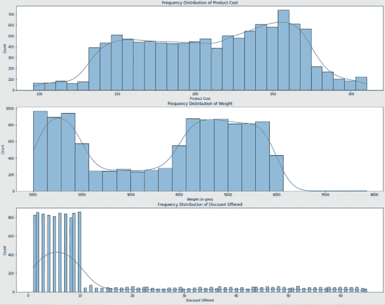**

**从上面的直方图中，我们可以推断:**

1.  **大多数产品的价格在 240.00-275.00 美元之间。**
2.  **大多数产品的重量在 1000-2000 克和 4000-6000 克之间。**
3.  **最有可能给出的折扣在 1%到 10%之间。有许多异常值位于第三个四分位数。**

```
fig, axes = plt.subplots(2,2,figsize=(20,12),facecolor='#e6ffff')*# countplot for 'Warehouse_block'*
sns.countplot(x=ecomm["Warehouse_block"], ax=axes[0,0], palette='CMRmap_r')
axes[0,0].set_title('Orders Handled By Each Warehouse Block', fontsize=12)
axes[0,0].set_xlabel('Warehouse Block', fontsize=10)
axes[0,0].set_ylabel('Count', fontsize=10)*# countplot for 'Mode_of_Shipment'* 
sns.countplot(x=ecomm["Mode_of_Shipment"], ax=axes[0,1], palette=['#DC143C','#556b2f','#008b8b'])
axes[0,1].set_title('Number of Orders By Shipment Mode', fontsize=12)
axes[0,1].set_xlabel('Shipment Mode', fontsize=10)
axes[0,1].set_ylabel('Count', fontsize=10)*# countplot for 'Customer_care_calls'*
sns.countplot(x=ecomm["Customer_care_calls"], ax=axes[1,0],palette='cubehelix')
axes[1,0].set_title('Number of Customer Care Calls Made by Customers', fontsize=12)
axes[1,0].set_xlabel('Customer Care Calls', fontsize=10)
axes[1,0].set_ylabel('Count', fontsize=10)*# countplot for 'Customer_rating'*
sns.countplot(x=ecomm["Customer_rating"], ax=axes[1,1],palette="rocket")
axes[1,1].set_title('Customer Rating Received', fontsize=12);
axes[1,1].set_xlabel('Customer Rating', fontsize=10)
axes[1,1].set_ylabel('Count', fontsize=10);
```

****

**从上面的支线剧情中，我们可以做出如下推论:**

1.  **大多数订单由仓库区 F 处理，而其他仓库区同样处理其余订单。**
2.  **大部分订单都是海运，其次是航班，最后是公路。**
3.  **许多客户需要打 4 次电话来跟踪他们的货物。这是公司的一个警告点，因为客户的问题需要尽快解决，而不需要客户打几个电话。**
4.  **1 是第二高的评分。更有可能是因为产品没有按时交付，以及客户需要打大量的电话。**

```
fig, axes = plt.subplots(2,2,figsize=(20,12),facecolor='#e6ffff')*# countplot for 'Prior_purchases'*
sns.countplot(x=ecomm["Prior_purchases"],ax=axes[0,0],palette='viridis')
axes[0,0].set_title('Number of Prior Purchases Made by Customers', fontsize=12)
axes[0,0].set_xlabel('Prior Purchases', fontsize=10)
axes[0,0].set_ylabel('Count', fontsize=10)*# countplot for'Product_importance'*
sns.countplot(x=ecomm["Product_importance"], order=abs_priority.index,ax=axes[0,1])
axes[0,1].set_title('Number of Orders Made by Product Importance', fontsize=12)
axes[0,1].set_xlabel('Product Importance', fontsize=10)
axes[0,1].set_ylabel('Count', fontsize=10)*# countplot for'Gender'*
sns.countplot(x=ecomm["Gender"], order=abs_gender.index,ax=axes[1,0],palette=['#800000','#191970'])
axes[1,0].set_title("Number of Orders Made by Customers' Gender", fontsize=12)
axes[1,0].set_xlabel("Customers' Gender", fontsize=10)
axes[1,0].set_ylabel('Count', fontsize=10)*# countplot for'Reached.on.Time_Y.N'*
sns.countplot(x=ecomm["Reached.on.Time_Y.N"], order=abs_arrival.index,ax=axes[1,1],palette='tab20c_r')
axes[1,1].set_title('Number of Orders Based On Arrival Time', fontsize=12)
axes[1,1].set_xlabel('Arrival', fontsize=10)
axes[1,1].set_xticklabels(['On Time', 'Late'])
axes[1,1].set_ylabel('Count', fontsize=10);
```

**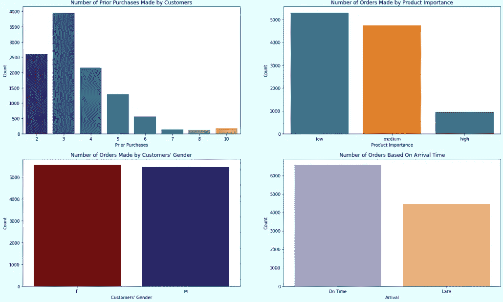**

**从上面的支线剧情，我们可以得出结论:**

1.  **许多顾客已经购买了 3 次。我们还发现，我们有大约 100 名忠诚客户，他们之前至少购买过 8 次。**
2.  **大多数订单的重要性较低，其次是中等和高。**
3.  **在 10，999 份订单中，超过一半的订单没有按时交付。**

**👋如果您想了解在可视化中添加数据标签的方法，请查看我的另一篇关于[的文章“使用 Matplotlib&Seaborn](/mlearning-ai/building-pie-chart-stacked-bar-chart-column-bar-chart-with-data-labels-using-matplotlib-32fc3fb5cfe9)构建饼状图、堆积条形图&柱形图(带数据标签)”。🤩**

*   **为了更深入地挖掘，我们可以问一些关于数据的问题并回答它们。结果可以是任何格式。下面是你可以提出的问题的例子。**

> **产品的平均成本是多少，给那些订单非常重要但延迟到达的客户的平均折扣是多少，客户给的评分是 1？**

```
ecomm[(ecomm['Product_importance']=='high') & (ecomm['Reached.on.Time_Y.N']==1) & (ecomm['Customer_rating']==1)][['Prior_purchases','ID','Discount_offered','Cost_of_the_Product','Customer_rating']].groupby('Customer_rating').agg({'Prior_purchases':'mean','ID':'count','Discount_offered':'mean', 'Cost_of_the_Product':'mean'})
```

**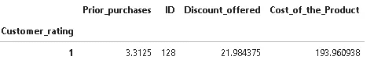**

> **不同重要性的产品的折扣范围是多少？**

```
sns.boxplot(x=ecomm['Product_importance'],
            y=ecomm['Discount_offered'])
```

**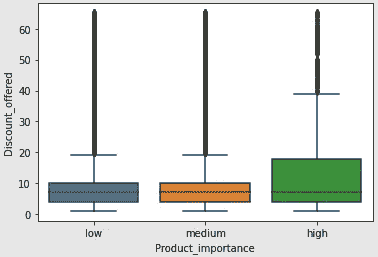**

## ****第三阶段:建模💁‍♀️****

**为了预测订单是否按时交付，我们可以使用`‘Reached.on.Time_Y.N’`列作为输出。既然是分类数据，就需要使用分类监督的机器学习算法，比如逻辑回归、K-neighbors、支持向量机等。在我们开始应用这些算法之前，我们需要将分类变量转换成虚拟变量，并对数值变量进行缩放**

```
*# create dummy variables for categorical variables* dummy1 = pd.DataFrame(pd.get_dummies(ecomm[['Warehouse_block', 'Mode_of_Shipment','Product_importance','Gender']]))
dummy2 = pd.DataFrame(pd.get_dummies(ecomm[['Customer_care_calls','Customer_rating','Prior_purchases']].astype(str)))# for normalizing data
from sklearn.preprocessing import scale  
ecomm1 = pd.DataFrame(scale(ecomm[['Cost_of_the_Product','Discount_offered', 'Weight_in_gms']]),columns=['Cost_of_the_Product','Discount_offered', 'Weight_in_gms'])# create new datafame for modeling 
ecomm2 = pd.concat([ecomm1,dummy1,dummy2,ecomm[['Reached.on.Time_Y.N']]],axis=1)
```

**之后，我们需要将数据分离为训练和测试数据，以及导入必要的 ML 算法库。💦**

```
from sklearn.model_selection import train_test_split*# split data into output and input*
X = ecomm2.iloc[:,:-1] # inputs
Y = ecomm2['Reached.on.Time_Y.N'] # outputs*# split data into train data and test data*
X_train, X_test, Y_train, Y_test = train_test_split(X,Y, test_size=0.25,shuffle=True) *# import classification ML* 
import xgboost
from sklearn.linear_model import LogisticRegression 
from sklearn.neighbors import KNeighborsClassifier
from sklearn.tree import DecisionTreeClassifier as DT
from sklearn.ensemble import RandomForestClassifier as RT
from sklearn.naive_bayes import GaussianNB as GB  
from sklearn.svm import SVC 
```

**然后，我们可以建立模型。👷‍♀️**

```
*# append different classification models into classifiers array* 
classifiers=[]
LR_model = LogisticRegression()
classifiers.append(LR_model)
KNN_model = KNeighborsClassifier(n_neighbors=11, metric='euclidean')
classifiers.append(KNN_model)
DT_model = DT(criterion = 'entropy',max_depth=4) 
classifiers.append(DT_model)
RF_model = RT(n_jobs=2, n_estimators=99, criterion="entropy")
classifiers.append(RF_model)
GNB_model = GB() 
classifiers.append(GNB_model)
SVC_model = SVC(kernel = "linear")
classifiers.append(SVC_model)
XGB_model = xgboost.XGBClassifier()
classifiers.append(XGB_model)
```

## **第 4 阶段:评估🧠**

**我们可以根据测试精度来选择型号。根据下面的结果，我们可以选择决策树作为我们的最终模型，因为它返回了最高的测试精度。**

```
from sklearn.metrics import accuracy_scoreaccuracy_result = pd.DataFrame(data={'Model':['LR','KNN','Decision Tree','Random Forest','Gaussian Bayes','SVM','XGB'],
'Training Accuracy':accuracy_train,
'Testing Accuracy':accuracy_test})
accuracy_result.sort_values('Testing Accuracy',ascending=False)
```

**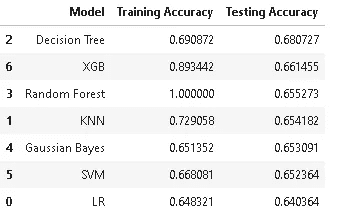**

**要绘制决策树，可以使用下面几行代码。正如你可能意识到的，我喜欢把`facecolor`参数放在支线剧情中。这个功能帮助我们设置支线剧情的背景颜色。您可以传入十六进制代码(如 EDA 部分所示)或颜色名称。**

```
from sklearn import tree
from sklearn.tree import plot_treeDT_model = DT(criterion = 'entropy',max_depth=4) 
DT_model.fit(X_train,Y_train)fig, ax = plt.subplots(figsize=(20, 20), facecolor='w')
tree.plot_tree(DT_model,
               feature_names=np.array(X.columns),
               class_names=['0','1'],
               filled=True,
               ax=ax);
```

**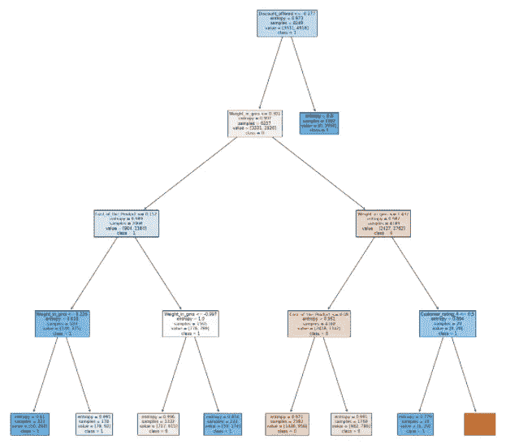**

**下面是你如何为你的困惑矩阵创建一个热图。**

**👋如果你想给你的混淆矩阵添加数据标签，你可以看看我的另一篇文章[‘相关矩阵热图&混淆矩阵|机器学习的额外技巧’](/mlearning-ai/heatmap-for-correlation-matrix-confusion-matrix-extra-tips-on-machine-learning-b0377cee31c2)。🍡**

```
from sklearn.metrics import confusion_matrix
plt.figure(figsize=(16,5))
sns.heatmap(confusion_matrix(Y_test,pred_test_DT), annot=True, fmt='', cmap='Blues')
plt.title('Confusion matrix for test data (DT model)',fontsize=16);
```

**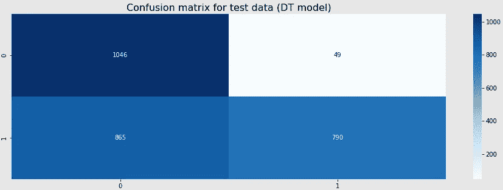**

## ****阶段 5:部署(使用** [**烧瓶**](https://flask.palletsprojects.com/en/2.0.x/) **+ HTML + CSS)🏭****

****为什么需要部署？**并非每个用户都是程序员，因此期望最终用户知道如何运行 Jupyter 笔记本并获得输出是不现实的。因此，模型部署可能是 ML 中最关键的部分。**

****我们如何部署模型？这取决于你想使用的编程语言。如果你用的是 R，你可以用 [R 闪亮](https://shiny.rstudio.com/)。如果你正在使用 Python，你可以使用 Flask，你也需要有一些关于 HTML 和 CSS 的基础知识。对于这个案例研究，我将使用 Flask 进行演示。别担心！我将详细解释。😉****

**现在，我们已经使用决策树分类器创建了一个模型。然后，我们需要使用 [pickle](https://docs.python.org/2/library/pickle.html) 将训练好的模型序列化，并将序列化后的格式保存到一个文件中。🥒运行下面的代码后，您可以在您的目录中找到一个名为'*finalized _ dt _ model _ ecomm . pkl '*的 pickle 文件，请不要删除该文件，因为我们将在 main.py 中使用它(该应用程序文件获取并使用来自用户的输入来进行预测，并将结果发送回用户)。**

**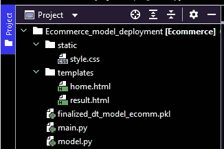**

**Structure of Model Deployment Directory**

**如上图所示，我们需要创建一个名为' *templates* 的文件夹来存储*home.html*文件(基本上是一个允许用户传入输入的表单)和*result.html*文件(向用户显示结果的文件)。**

**下面是部分*home.html*文件。我将解释一些重要的事情，当你在此基础上创建表单时，你需要知道这些事情。**

**另一个名为“静态”的文件夹用于存储 CSS 文件，以改善网页的外观或存储任何图像。您可以使用`[<link>](https://www.w3schools.com/tags/att_link_rel.asp)`将 CSS 文件链接到 HTML 文件。你是否想要创建一个 CSS 文件是可选的，因为你总是可以在 HTML 中应用[内部 CSS](https://www.instagram.com/p/CTtXPh8PbAO/) ，通过在 HTML 文件的`<head>`部分使用`<style>`标签来包含样式特性(PS:内部 CSS 可能会增加页面大小和加载时间)。**

**从上面的代码可以看出(在`<select>`和`[<input>](https://www.w3schools.com/html/html_form_input_types.asp)`中)，每个问题都有一个**名称。这些名称很重要，因为我们将在 *main.py* 文件**中使用相同的名称，以便将相应的输入正确分配给模型中的相应变量。**

**除了 Flask 库，我们还需要导入以下库:**

*   **`render_template`:渲染 HTML 模板。**
*   **`request`:使用 Python 发送 HTTP 请求。**

**首先，我们需要使用`@app.route(“/”)`来创建到主页的路径。之后，我们需要构建一个定制的预测函数和`@app.route(“/result”, methods=[“POST”])`来根据用户的输入预测货物的到达(准时到达或延迟到达)，并将输出呈现给*result.html*。值得注意的是，*中的`methods=[“POST”]`也是 home.html*中的元素。相信你明白*home.html*和 *main.py* 之间的联系。🤓**

**完成编码部分后，您可以在本地 PC 上运行 *main.py* 并通过点击出现的链接使用浏览器查看应用程序。**

**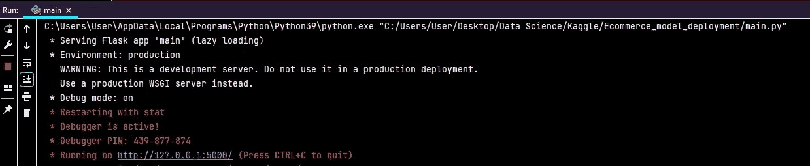**

**下面是点击链接后你可能*看到的*home.html*页面。顺便说一下，我的部署代码还有改进的空间。如果你能评论并让我知道你的想法使它变得更好，我将不胜感激。***

**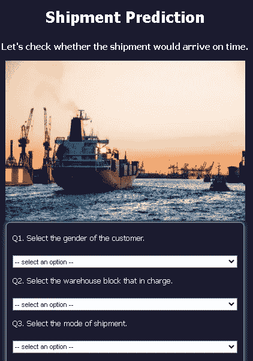****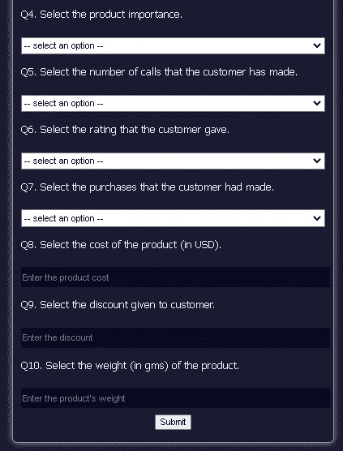**

****第六阶段:维护&监控🚴‍♂️****

**总有千变万化的政治、经济、社会、技术(害虫)因素。模型并不总是在静态环境中运行，这些有害因素会导致模型漂移(模型性能下降)，因为模型对解释不熟悉的数据没有预测能力。🍭**

**无论模型的表现如何，都需要了解模型中的数据和变量更改的频率，以便以固定的间隔重新训练模型。⏳**

**希望你喜欢我的文章。🙌如果你愿意，你也可以在我的 GitHub 库上查看完整的项目，名为[电子商务-运输](https://github.com/jadanpl/E-Commerce-Shipping)。☕**

**快乐学习！😊**

**[](/mlearning-ai/mlearning-ai-submission-suggestions-b51e2b130bfb) [## Mlearning.ai 提交建议

### 如何成为 Mlearning.ai 上的作家

medium.com](/mlearning-ai/mlearning-ai-submission-suggestions-b51e2b130bfb)**