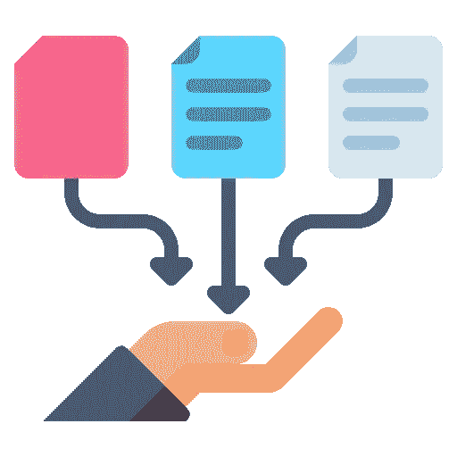
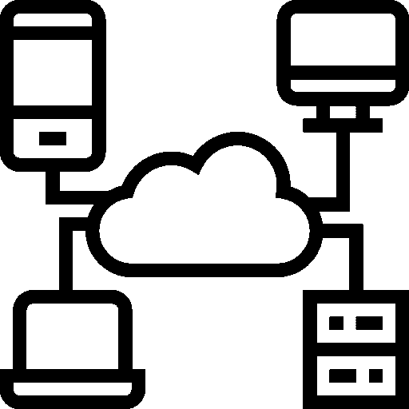
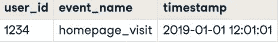
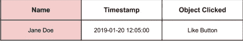
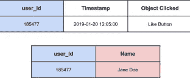
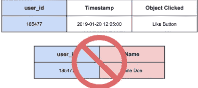
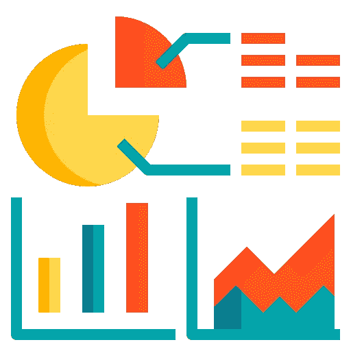
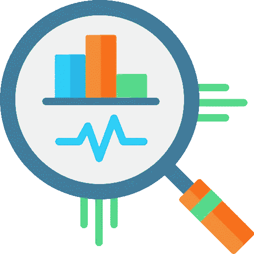
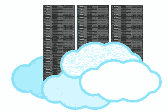

# 数据收集

> 原文：<https://medium.com/mlearning-ai/data-collection-2dc5d69d9e0f?source=collection_archive---------7----------------------->

首先要知道**什么是数据采集。**

数据收集是收集数据用于商业决策、战略规划、研究和其他目的的过程。这是数据科学应用和研究项目的关键部分:有效的数据收集提供了回答问题、分析业务绩效或其他结果以及预测未来趋势、行动和场景所需的信息

在这个故事中，我将讲述数据收集过程，我的写作将围绕四个主要方面展开:

1 - **数据来源**

2 - **征集数据**

3 - **收集附加数据**

4 - **数据存储和检索**

# **数据来源**

所有的数据都有来源和风险，当我们将数据用于我们的应用程序时，我们必须避免这些来源和风险，在这个阶段，我将了解其中的一些

## 常见的数据来源

在我们的生活中，在我们做的每一个动作中，比如点击、购买、销售等等，都有很多很多的数据。所有这些都是数据，以及我们获取数据的一些来源:

*   网络事件
*   客户数据
*   物流数据
*   金融交易

我们以**网络数据**为例:

**网络数据**

*   事件
*   时间戳
*   用户信息

在这种类型的数据中，我们必须熟悉一些重要的概念，例如:

*   [个人身份信息(PII)](https://www.investopedia.com/terms/p/personally-identifiable-information-pii.asp)

*   [数据假名化](https://dataprivacymanager.net/pseudonymization-according-to-the-gdpr/)

*   [数据匿名化](https://www.imperva.com/learn/data-security/anonymization/)

# **请求数据**

请求的数据是作为特定信息请求的结果或作为您已采取的操作的结果而接收的。某些 SNA 控制单元保存它们检测到的不同类型的通信错误的计数器，并将这些计数器仅作为请求的数据发送给主机。

我们为什么要收集数据？

*   创建营销宣传材料
*   去风险决策
*   监控质量

**被请求数据的类型。**

*   调查
*   顾客评论
*   应用内问卷
*   小组讨论

我们还将**请求的数据**分为:

*   定性的

—对话

—开放式问题

*   数量的

—多项选择

—多项选择

这种类型的数据是最好的，因为它更容易获得和处理。

**透露和陈述的偏好:**

*   声明的偏好

—假设的
—主观的

*   显示偏好

—行动
—采购决策

而在收集数据时，必须做到:

*   具体点
*   避免加载语言
*   校准
*   要求可行的结果

# **收集附加数据**

有时我们在项目开始时为我们的应用程序收集数据，在项目期间，我们需要额外的数据。在这种情况下，我们求助于下面提到的一些方法。

## 更多数据

*   蜜蜂
*   公共记录
*   机械土耳其人

**数据 API:**

*   应用程序界面
*   通过互联网请求数据

我们从以下几个方面入手:

*   推特
*   维基百科(一个基于 wiki 技术的多语言的百科全书协作计划ˌ也是一部用不同语言写成的网络百科全书ˌ 其目标及宗旨是为全人类提供自由的百科全书)ˌ开放性的百科全书
*   雅虎！金融
*   谷歌地图
*   更多！

**公共记录:**

这些网站包含许多由公共机构注册的数据库，如卫生、教育、经济等。最受欢迎的网站:

*   对于美国，[data.gov](https://data.gov/)
*   对于欧盟， [data.Europa. EU](https://data.europa.eu/en)

**土耳其机械人**

自 2005 年创建以来，Mechanical Turk 是一个由亚马逊拥有和运营的网站。这个名字来源于奥地利女皇玛丽亚·特蕾莎委托制作的一种 18 世纪的国际象棋装置。挑战者与土耳其人竞争，相信他们是在与自动化机器竞争。然而，土耳其人只是一个假象。挑战者被引导去相信他们正在玩一个机械化的装置，而事实上他们正在和一个藏在里面的人竞争。

*   资源: [AWS MTurk](https://www.mturk.com/)
*   标记客户评论
*   从表格中提取文本
*   突出显示句子中的关键词

# 数据存储和检索。

为了从数据中受益，我们必须存储它直到我们使用它，因为没有旧的或新的数据，但是所有的工具对企业主都是有用的。存储数据的方法之一是:

**并行存储解决方案:**

这里的意思是，我们将数据分为许多存储可能性，例如，计算机，如图所示，用于传统和旧的地方或小型设施

# 云:

云存储是一种云计算模式，通过云计算提供商将数据存储在互联网上，云计算提供商将数据存储作为服务进行管理和运营。它按需交付，具有及时的容量和成本，无需购买和管理您自己的数据存储基础架构。这为您提供了灵活性、全球规模和耐用性，以及“随时随地”的数据访问。许多人认为这是当今技术进步的重要因素之一。

# 数据存储的类型:

我们有两种类型的数据:

*   无社会组织的

—电子邮件
—文本
—视频和音频，les
—网页
—社交媒体

*   表格或结构化

—这是我们在表和数据库中处理的类型

***数据库有两种类型其中之一是:***

*   关系数据库

—关系数据库是一个信息集合，它以预定义的关系组织数据，其中数据存储在一个或多个由列和行组成的表(或“关系”)中，从而便于查看和理解不同数据结构之间的关系。关系是不同表之间的逻辑连接，是基于这些表之间的交互建立的。

*   文档数据库

—文档数据库是一种非关系数据库，旨在将数据存储和查询为类似 JSON 的文档。文档数据库使开发人员能够更容易地存储和查询数据库中的数据，方法是使用他们在应用程序代码中使用的相同的文档模型格式。文档和文档数据库的灵活、半结构化和层次化特性允许它们随着应用程序的需求而发展。文档模型适用于目录、用户配置文件和内容管理系统等用例，在这些用例中，每个文档都是唯一且不断发展的。文档数据库支持灵活的索引、强大的即席查询和对文档集合的分析。

***我们可以在那里存储我们的数据！？***

*   内部集群
*   云提供商:
    — Azure
    — AWS
    —谷歌云

> 最后，我希望这篇文章对您有用，也希望您支持我在❤️数据科学领域发表更多文章😊

我的推荐人:

[数据营自投业务](https://app.datacamp.com/learn/courses/data-science-for-business)

 [## Mlearning.ai 提交建议

### 如何成为 Mlearning.ai 上的作家

medium.com](/mlearning-ai/mlearning-ai-submission-suggestions-b51e2b130bfb)