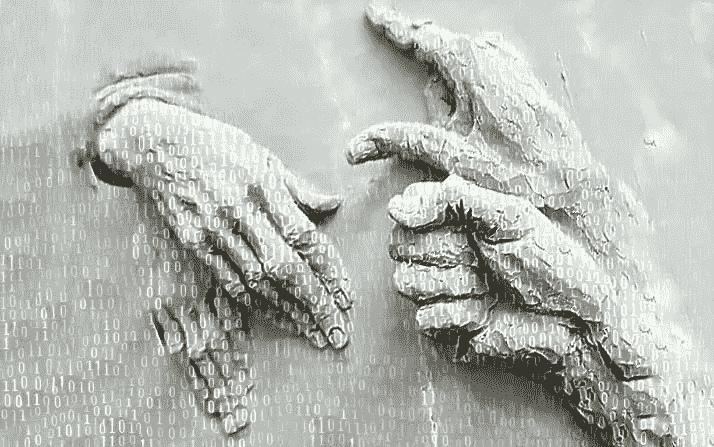

# 数据已经取代了我们双手的角色

> 原文：<https://medium.com/mlearning-ai/data-has-taken-the-role-of-our-hands-dde1d8d74db0?source=collection_archive---------3----------------------->

## [机器学习](http://art.mlearning.ai)工具

[https://www.hicetnunc.xyz/objkt/18898](https://www.hicetnunc.xyz/objkt/18898)

在数字世界中，数据已经取代了我们的手。我们如何保存我们身体的语言，或者更确切地说，我们如何在数字时代重新使用我们的手？
我们已经接受了这样的事实:所有的东西都被统一在同一准则下，我们生活在一个共同的环境中，我们使用同一种语言。身体变得越来越…