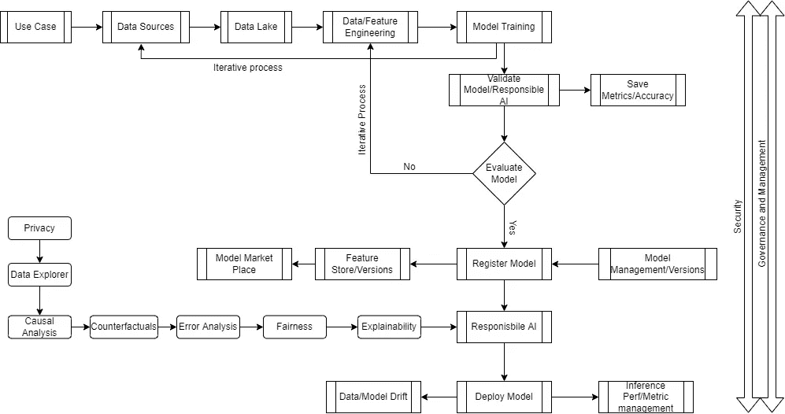

# 数据科学和 ML Ops 流程

> 原文：<https://medium.com/mlearning-ai/data-science-and-ml-ops-process-9ca3d6d37abd?source=collection_archive---------1----------------------->

# 2022 年的 MLOps

# 机器学习和数据科学运营流程

*   随着数据科学领域的发展，新的创新正在扩展这一过程
*   解释和观察模型的新过程
*   检查模型中的偏差和公平性
*   监控和维护数据漂移和模型性能漂移
*   新工具和自动化
*   隐私、治理和安全
*   这只是截至 2022 年的最新版本，可能会随着技术的变化而变化

# MLOPS 过程

# 解释流程

*   当我们采用基于用例的方法时，数据科学已经取得了成功
*   每个用例都会让我们知道需要什么数据，以及来自哪些数据源
*   由于数据来源于各种数据源，因此最好构建一个数据湖来存放数据
*   一旦数据进入数据湖，就该进行数据工程或特性工程了
*   特征工程是一种组织建模所需特征方法
*   特征可以是来自多个源的源
*   功能可能基于用例创建
*   功能可以基于用例进行聚合
*   一旦特征被收集和处理，下一次建模
*   建模是将数据分成两部分的过程
*   大部分是 70、30 或 80、20%的比例
*   一旦数据被分割，运行算法
*   这是一个迭代过程，要么改变特征，要么改变算法
*   根据机器学习的类型(分类、回归或时间序列),可以应用各种算法
*   使用新数据集验证模型并分析性能
*   在这里，我们还将深入研究该模型，并解释它在做什么
*   *可解释性*
*   *公平*
*   *错误分析*
*   *反事实*
*   *因果分析*
*   *数据浏览器*
*   *隐私*
*   应用负责任的人工智能来确保模型是公平的，并提供最佳结果
*   选择提供最佳精度的模型向前推进。
*   确保存储了模型度量和精度
*   在某些情况下，还保存了北爱尔兰保安队的图表或其他图像，以供进一步分析
*   当我们准备好部署时，我们需要评估新的模型是否比已经创建的模型更好
*   如果新模型或现有模型的特征计数发生变化，那么我们可以跳过评估检查
*   一旦通过，就注册模型
*   注册模型时，我们还注册了特征库供他人使用
*   存储模型度量，如准确性和其他度量，以跟踪模型性能
*   或者，我们可以将模型注册为市场，供组织中的其他人消费
*   下一个负责任的人工智能
*   这一节是新的
*   在这里，我们还将深入研究该模型，并解释它在做什么
*   *解释能力*
*   *公平性*
*   *错误分析*
*   反事实
*   *因果分析*
*   *数据浏览器*
*   *隐私*
*   以上都是模型的计算和保存能力。
*   在开发阶段，这可以应用于每个模型，以确定哪个模型提供了最好的结果
*   然后将您的模型部署为实时或批处理端点
*   还要保存模型推理的度量
*   如果性能下降，可以观察数据漂移和模型漂移等可选功能来重新训练模型
*   整个过程都考虑到了安全性
*   治理也是通过监控来管理过程的
*   可选的沿袭和编目也适用于训练和推理

[位于主巴拉克列什南的 samples 2022/mlops . MD/samples 2022(github.com)](https://github.com/balakreshnan/Samples2022/blob/main/MLOps/mlops.md)

 [## Mlearning.ai 提交建议

### 如何成为 Mlearning.ai 上的作家

medium.com](/mlearning-ai/mlearning-ai-submission-suggestions-b51e2b130bfb)