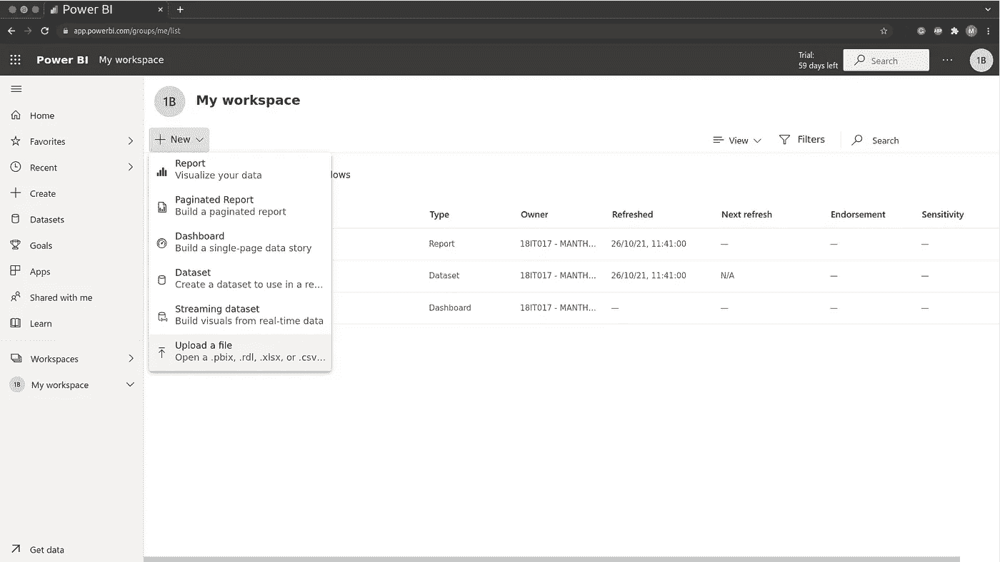
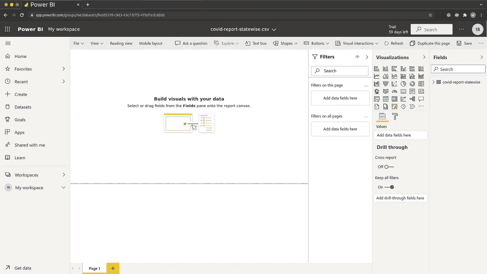
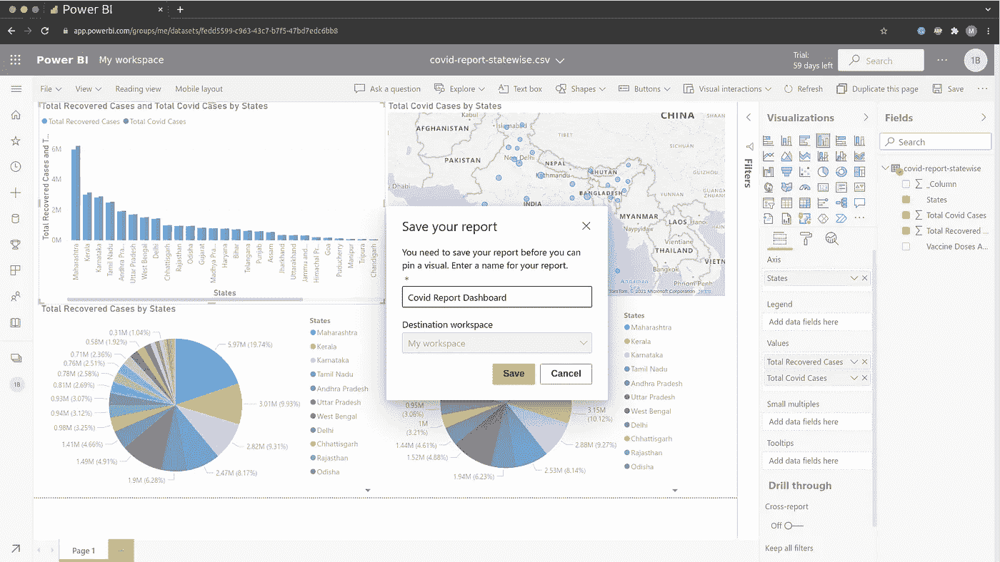
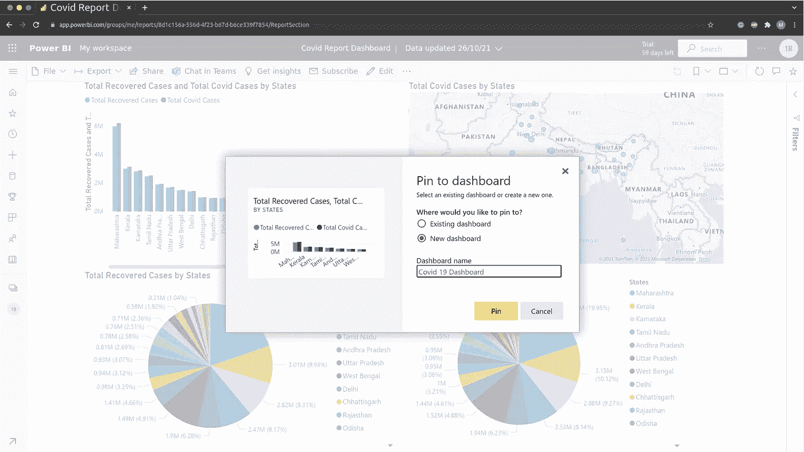
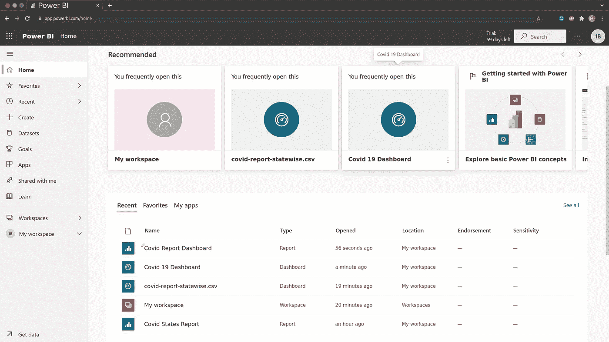
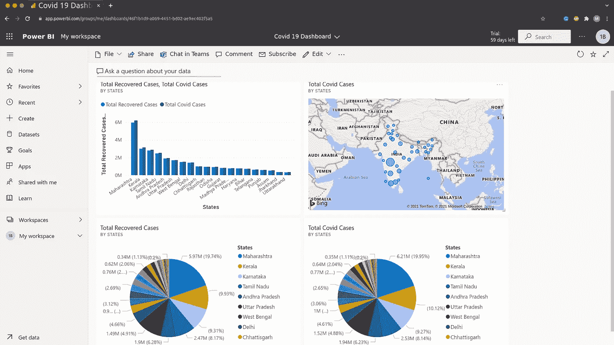

# 数据科学👨‍💻:在 Power BI 中创建简单的仪表板

> 原文：<https://medium.com/mlearning-ai/data-science-create-simple-dashboard-in-power-bi-d068cde60c70?source=collection_archive---------3----------------------->

**欢迎来到数据科学博客系列。**请点击这里查看我之前的数据科学博客系列 [***的博客。***](https://manthan-bhikadiya.medium.com/)

> 摔倒是意外，蹲下是选择。
> 
> ~尼什塔·辛格

> ***概述:***

Power BI 仪表板是一个单独的页面，通常称为画布，它使用可视化来讲述一个故事。因为它被限制在一个页面中，所以一个设计良好的仪表板只包含这个故事中最重要的元素。仪表板上的可视化来自报告，每个报告都基于一个数据集。

数据集名称:Covid 状态报告

[**链接……**](https://github.com/manthan89-py/Data-Science/blob/master/Practical%201%20Scrapping%20the%20Data/covid-report-statewise.csv)

> ***创建仪表板:***

**步骤 1:** 将数据集添加到 Power BI 工作区

upload a file

**第二步:**在工作区添加一些可视化，做一个报表。

Workspace

第三步:添加视觉效果后，保存您的报告。

**第 4 步:**现在，点击你的视频上的大头针图标，将其添加到你的仪表板或创建一个新的仪表板。

第五步:同样地，在你的仪表板上添加其他视觉效果。

**第 6 步:**点击您的仪表板，查看您的仪表板。

**第七步:**现在您可以根据需要添加和修改仪表板磁贴。

> ***结论:***

在此了解更多关于仪表板[***……***](https://docs.microsoft.com/en-us/power-bi/create-reports/service-dashboard-create)

**领英:**

 [## 印度古吉拉特邦苏拉特曼丹·比卡第亚-查罗特科技大学|…

### 查看 Manthan Bhikadiya 在世界上最大的职业社区 LinkedIn 上的个人资料。Manthan 有 3 份工作列在…

in.linkedin.com](https://in.linkedin.com/in/manthanbhikadiya) 

**Github:**

 [## manthan89-py -概述

### 对 AI、深度学习、机器学习、计算机视觉、区块链、Flutter 感兴趣😇。做一些竞争性的…

github.com](https://github.com/manthan89-py) 

**感谢阅读！如果你喜欢这篇文章，请点击**👏尽可能多的按按钮。这将意味着很多，并鼓励我继续分享我的知识。如果你喜欢我的内容，请在 medium 上关注我，我会尽可能多地发布博客。