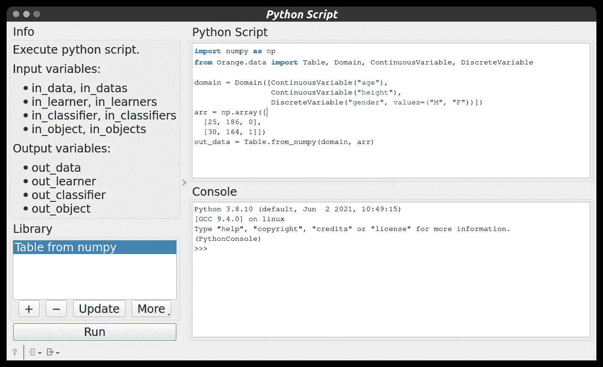
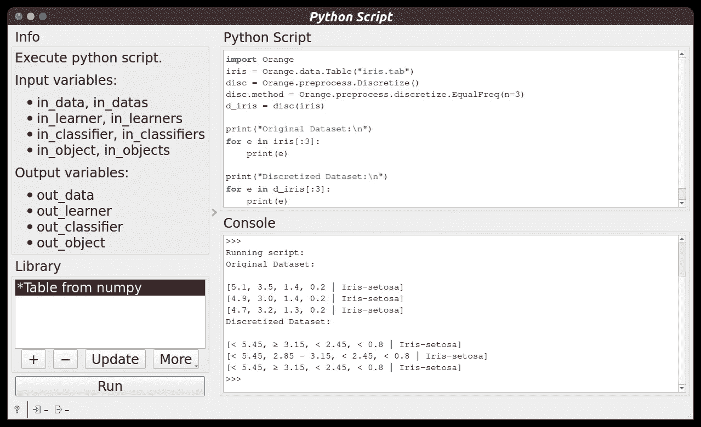
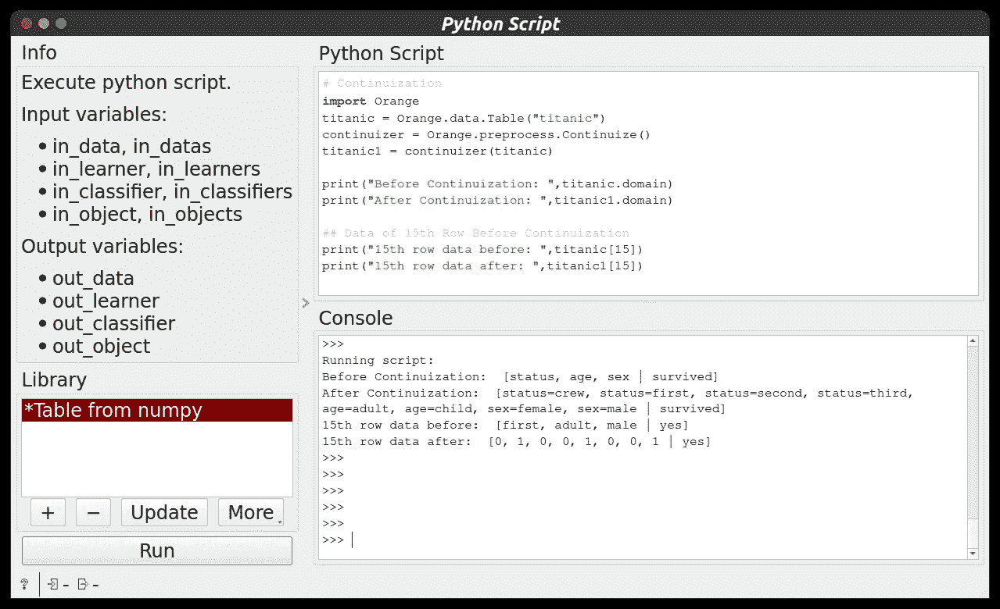
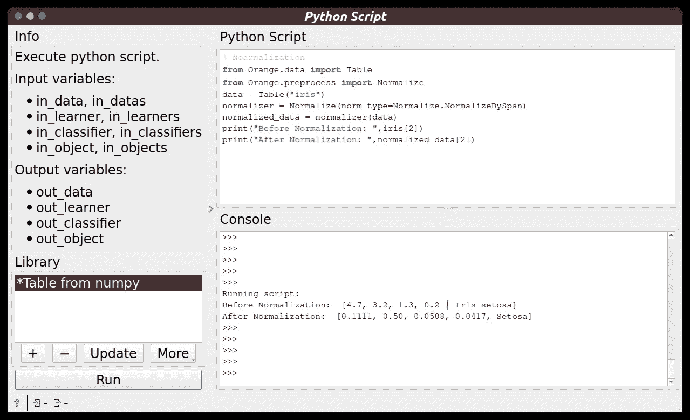
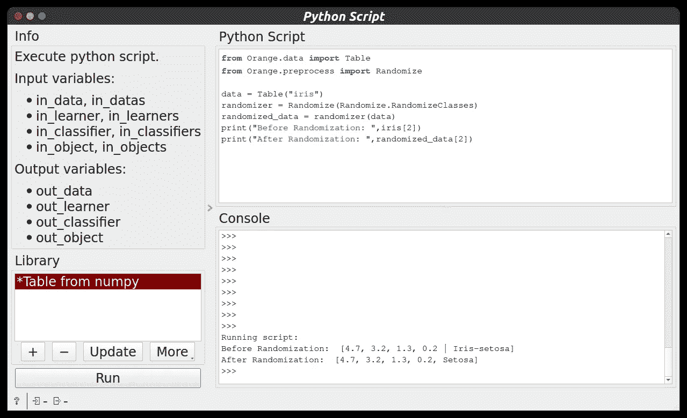

# 数据科学👨‍💻:使用 Orange 工具进行数据预处理

> 原文：<https://medium.com/mlearning-ai/data-science-data-preprocessing-with-orange-tool-68650f12e6ed?source=collection_archive---------5----------------------->

**欢迎来到数据科学博客系列。**请点击这里查看我之前的数据科学博客系列 [***的博客。***](https://manthan-bhikadiya.medium.com/)

> 累了不要停，做完了就停。
> 
> ~韦斯利·斯奈普斯

> ***概述:***

这篇博客是橙色工具的第三部分。在这篇博客中，我将讨论如何使用 python 中的 Orange 库，并借助各种 Orange 函数对数据执行各种数据预处理任务，如 ***离散化、连续化、随机化和规范化*** 。

在橙色工具画布中，从左侧面板中取出 Python 脚本并双击它。

Python Script Widget

***所有的脚本都可以在* Github *页面*** 获得。

一定要看看这篇博客末尾的链接。

> ***离散化:***

数据离散化指的是一种将大量数据值转换成较小值的方法，以便数据的评估和管理变得容易。换句话说，数据离散化是一种以最小的数据损失将连续数据的属性值转换成有限的一组区间的方法。在这个例子中，我采用了 Orange 提供的内置数据集，即 **iris** ，它根据花朵的特征对它们进行分类。为执行离散化**，使用离散化**功能。

Discretization using Python Script

> ***延续:***

给定一个数据表，返回一个新表，其中的离散化属性被替换为连续属性或被删除。

*   根据参数`zero_based`，二进制变量被转换为 0.0/1.0 或-1.0/1.0 指示变量。
*   根据参数`multinomial_treatment`处理多项式变量。
*   只有一个可能值的离散属性将被删除。

**Continuize_Indicators**

该变量由指示变量代替，每个指示变量对应于原始变量的一个值。对于原始属性的每个值，只有对应的新属性的值为 1，其他属性的值为零。这是默认行为。

例如，如下面的代码片段所示，数据集" titanic "的" status "值依次为" crew "、" first "、" second "和" third "。它在第 10 行的值是“first”。连续化将变量替换为变量“状态=机组”、“状态=第一”、“状态=第二”和“状态=第三”。

Continuization using Python Script

> ***归一化:***

它用于缩放属性的数据，使其落在一个较小的范围内，如-1.0 到 1.0 或 0.0 到 1.0。当我们在不同的尺度上处理属性时，通常需要标准化，否则，它可能会导致一个同等重要的属性(在较低的尺度上)的有效性被稀释，因为其他属性在较大的尺度上具有值。我们使用 **Normalize** 函数来执行规范化。

Normalization using Python Script

> ***随机化:***

使用随机化，给定一个数据表，预处理器返回一个新表，其中的数据被混洗。**随机化**功能用于从 Orange 库中执行随机化。

Randomization using Python Script

> **Python 脚本文件:**

 [## 数据科学/实用 6 master man than 89-py/数据科学用 Orange 工具进行数据预处理

### 这个存储库包含概念和项目相关的数据科学和机器学习。-数据科学/实用 6…

github.com](https://github.com/manthan89-py/Data-Science/tree/master/Practical%206%20Data%20Preprocessing%20with%20Orange%20tool) 

> ***结论:***

我希望你能学到一些东西…

请点击这里查看橙色工具 [***的更多特性。***](https://orangedatamining.com/docs/)

之前关于橙色工具[**blog 1**](https://manthan-bhikadiya.medium.com/data-science-introduction-to-orange-tool-part-1-bff18bb159a)&[**blog 2**](/geekculture/data-science-introduction-to-orange-tool-part-2-c59d483d9716)**的博客。**

继续探索…！！👍

## LinkedIn:

 [## Manthan Bhikadiya -开源贡献者-girl script Winter of contribution | LinkedIn

### 查看 Manthan Bhikadiya 在世界上最大的职业社区 LinkedIn 上的个人资料。曼坦有 4 份工作列在…

linkedin.com](https://linkedin.com/in/manthanbhikadiya) 

## Github:

 [## manthan89-py -概述

### 对 AI、深度学习、机器学习、计算机视觉、区块链、Flutter 感兴趣😇。做一些竞争性的…

github.com](https://github.com/manthan89-py) 

**感谢阅读！如果你喜欢这篇文章，请点击**👏**尽可能多地按下按钮(最多 50 次**😂)**。这将意味着很多，并鼓励我继续分享我的知识。如果你喜欢我的内容，请在 medium 上关注我，我会尽可能多地发布博客。**