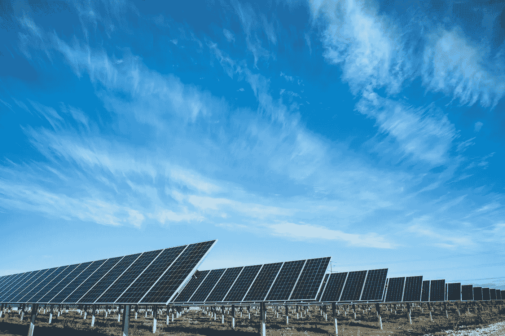
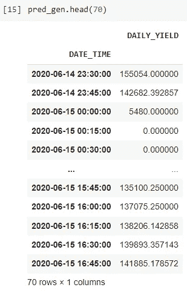
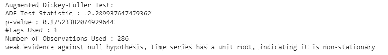
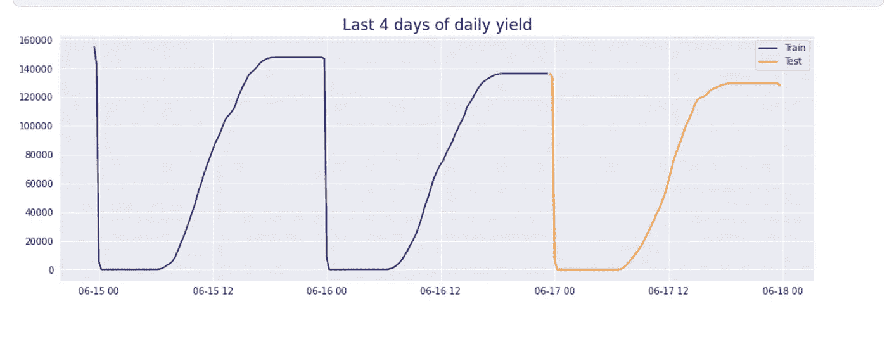
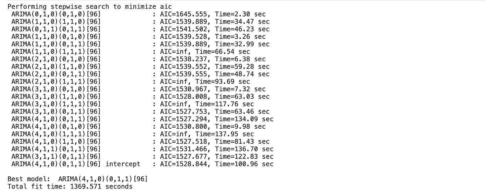
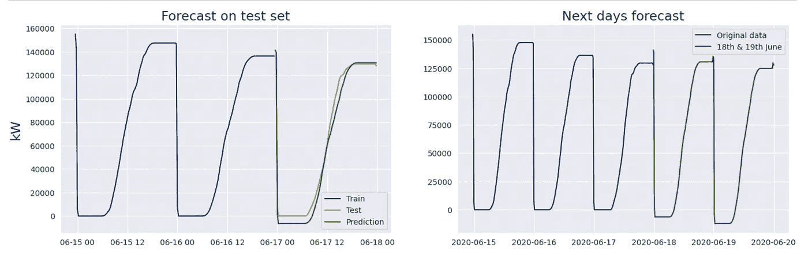

# 数据科学项目:太阳能电池板，第一章:用 Arima 模型预测发电量

> 原文：<https://medium.com/mlearning-ai/data-science-project-solar-panel-chapter-i-electricity-generation-prediction-with-arima-model-eb9b5d8bfd41?source=collection_archive---------8----------------------->

Unsplash American Public Power Association

本文由[阿尔帕斯兰·梅斯里](https://medium.com/u/fe99f0a4a612?source=post_page-----eb9b5d8bfd41--------------------------------)和[马德胡斯·阿鲁穆甘](https://www.linkedin.com/in/madhujith-arumugam/)撰写

你可以在这里访问[的数据。](https://www.kaggle.com/datasets/anikannal/solar-power-generation-data?resource=download&select=Plant_1_Generation_Data.csv)

在本文中，首先我们将检查太阳能电池板的能源数据。然后我们用 Arima 模型进行预测，预测未来几天的发电量。

首先，我们需要导入所需的库。

然后将 CSV 文件分配到变量中。在此数据集中，时间列没有被指定为日期-时间。我们需要处理它。我们还删除了 Plant_ID 列。

在这个过程之后，我们根据 data_time 特性将数据复制到组 daily_yield 列。我们也给出了新的索引。

现在我们的分组数据框看起来像这样:

在运行 Arima 模型之前，我们需要执行增强的 Dickey-Fuller 测试。在这个测试中，我们检验我们的数据是否有一个系统的模式？零假设表明它有一个单位根，替代假设拒绝零假设。

如果 p 值大于 5%，那么有强有力的证据反对零假设，如果它小于 5%，那么我们可以说它是反对零假设的弱证据。

从上面我们可以得出结论，数据是非平稳的。因此，在构建自动 ARIMA 模型时，我们需要使用时间序列中用值“d”表示的集成概念来使数据保持稳定。

我们需要将数据分成训练和测试部分。另外，在图表上看到这些数据会很好。

之后，我们调整 auto_arima 参数。m 等于 96。因为我们每 15 分钟观察一次。一小时内有 4 次观测，每天有 96 次观测。

关于 d 参数，我们把它调整为“1”，因为我们需要把数据变成一个平稳的情况。

` p '是自回归(AR)模型的季节分量的阶。

“d”是季节性过程的积分顺序。

` q '是移动平均(MA)模型的季节分量的阶。

我们的 arima 模型搜索了最佳参数，发现 ARIMA(4，1，0)(0，1，1)是最佳模型。如果你看结果，你可以看到它的 AIC 点(1527)是最小的。

这里为了预测，我们需要指定 future _ dates。我们将预测这几天的天气。

现在让我们看看结果。为了更好地理解它，我们需要将结果可视化。

所以，看起来 Arima 预测得很好。如你所见，预测值和测试值非常相似。该模型还对未来几天进行了预测。

参考资料:

[1]:[https://www . ka ggle . com/code/viro sky/how-to-management-a-solar-power-plant # Task-2:-Forecast](https://www.kaggle.com/code/virosky/how-to-manage-a-solar-power-plant#Task-2:-Forecast)

[2]:[https://ademos . people . UIC . edu/chapter 23 . html #:~:text = ARIMA % 20 models % 20 is % 20 typical % 20 expressed，growth % 2f decline % 20 in % 20 our % 20 data](https://ademos.people.uic.edu/Chapter23.html#:~:text=ARIMA%20models%20are%20typically%20expressed,growth%2Fdecline%20in%20our%20data)

【3】:【https://pypi.org/project/pmdarima/ 

[4]:[https://www . ka ggle . com/datasets/anikannal/solar-power-generation-data？resource = download&select = Plant _ 1 _ Generation _ data . CSV](https://www.kaggle.com/datasets/anikannal/solar-power-generation-data?resource=download&select=Plant_1_Generation_Data.csv)

 [## MLearning.ai 艺术

### 创意经济的人工智能艺术解决方案🟠最先进的机器学习演示，快速易用🔵…

mlearning.substack.com](https://mlearning.substack.com)