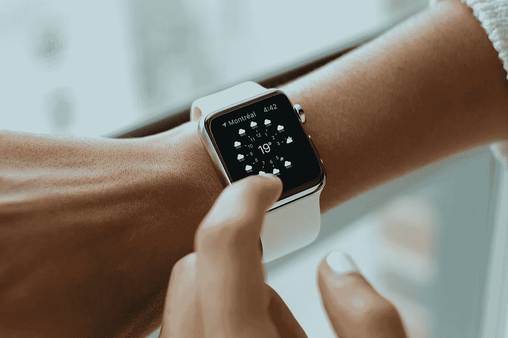
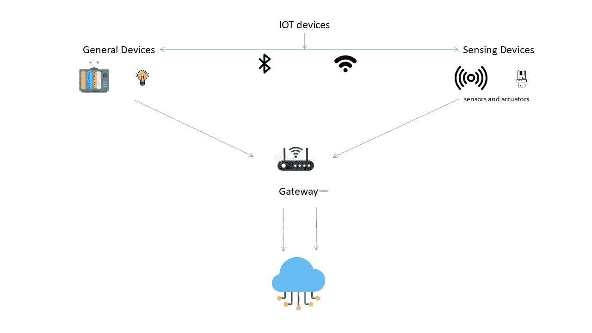
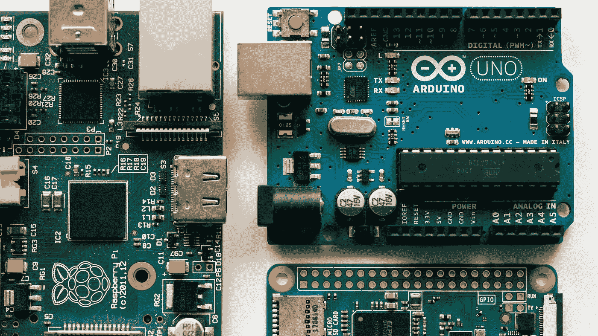

# 利用 Raspberry Pi 和智能传感器进行数据科学

> 原文：<https://medium.com/mlearning-ai/data-science-with-raspberry-pi-and-smart-sensors-1c32c34e5ee1?source=collection_archive---------0----------------------->

有谁认为 IOT 可以用于数据科学？很可能你甚至没有想到它(如果你做了 bravo！).我将与您分享 IOT 设备的工作原理，以及我们如何在数据科学中从中受益。

在进入之前，我想告诉你，我将主要谈论树莓派，一个迷你电脑，以及我们可以用它来使用的不同传感器和插件。有许多物联网设备，但我将讨论这种特殊的设备。

Photo by [Vishnu Mohanan](https://unsplash.com/@vishnumaiea?utm_source=unsplash&utm_medium=referral&utm_content=creditCopyText) on [Unsplash](https://unsplash.com/s/photos/raspberry-pi?utm_source=unsplash&utm_medium=referral&utm_content=creditCopyText)

# 博客内容

*   IoT 是什么？
*   它们是如何工作的？
*   树莓派
*   它在数据科学中的应用

## IoT 是什么？

IoT 代表**“物联网”。**它们是连接到互联网的东西或物理设备，不断收集和共享数据。他们可以在芯片的帮助下做到这一点，因为芯片现在非常便宜。任何东西或设备都可以在芯片的帮助下变成物联网设备。

将所有这些不同的对象连接起来，并为它们添加传感器，为原本愚蠢的设备增加了数字智能水平，使它们能够在没有人类参与的情况下交流实时数据。物联网通过融合物理和数字维度，使我们周围的世界更加智能和灵敏。

物联网的一个例子是你在锻炼时佩戴的**智能手环/健身手环**。它不断检查你的心跳，消耗的卡路里，你走的步数等。这一切都进入了云端。你也可以用手机控制它。

Photo by [Luke Chesser](https://unsplash.com/@lukechesser?utm_source=unsplash&utm_medium=referral&utm_content=creditCopyText) on [Unsplash](https://unsplash.com/s/photos/smart-fridge?utm_source=unsplash&utm_medium=referral&utm_content=creditCopyText)

另一个例子是可以通过手机应用程序控制的灯泡。太多了。小东西变得越来越智能，这一切都有可能，因为物联网(最准确地说是芯片。)

## 它们是如何工作的？

Image by author

物联网设备基本分为两种。它们是:

1.  通用设备
2.  传感设备

T.v 和灯泡属于通用设备，传感器和执行器属于传感设备。**传感器**是检测外部信息的设备，用人类和机器可以区分的信号代替。**致动器**是一种将能量转化为运动的机构。

传感器的一个例子是检测温度的*温度传感器*。对于执行机构，“*液压执行机构利用液体产生运动。*

这些设备连接到网关/处理单元。这些网关处理来自传感器和设备的数据，并将其发送到云端。云充当存储单元和处理单元。对收集的数据执行动作，用于进一步的学习和推断。无线和有线连接，如 wifi、蓝牙、Zigbee 等。用于提供连接。

现在，我们对物联网设备的工作原理和工作方式有了一点了解。所以让我们进入有趣的部分，也就是**树莓酱**。

# 什么是树莓派

Raspberry Pi 是一款低成本、信用卡大小的电脑，可以插入电脑显示器或电视，使用标准键盘和鼠标。它是一个功能强大的小设备，使所有年龄的人都能探索计算，并学习如何用 Scratch 和 Python 等语言编程。(显然 R 也是)

它看起来像一个电脑主板，有 USB 端口，四核 ARM CPU，HDMI 端口，以太网插孔，micro SD 卡插槽，等等。这本身就很重要了。树莓派不是唯一的。还有类似的板像 Arduino，华硕 Tinker Board S，NVIDIA Jetson Nano Developer Kit 就是其中的一些。

Photo by [Harrison Broadbent](https://unsplash.com/@harrisonbroadbent?utm_source=unsplash&utm_medium=referral&utm_content=creditCopyText) on [Unsplash](https://unsplash.com/s/photos/raspberry-pi?utm_source=unsplash&utm_medium=referral&utm_content=creditCopyText)

Raspberry Pi 具有与外界互动的能力，已被广泛用于各种数字制造商项目，从音乐机器和父母探测器到气象站和带红外摄像头的推特鸟笼。

# 它是如何用于数据科学的？

> *“数据科学是一个跨学科领域，它使用科学方法、流程、算法和系统从结构化和非结构化数据中提取知识和见解，并将来自数据的知识和可操作的见解应用于广泛的应用领域。”*

总而言之，这一切都取决于**的数据。没有数据，一切都是空的。对于数据科学家来说，数据是最重要的。Raspberry Pi 可以帮助他获得这些数据。**

Photo by [Siim Lukka](https://unsplash.com/@siimlukka?utm_source=unsplash&utm_medium=referral&utm_content=creditCopyText) on [Unsplash](https://unsplash.com/s/photos/swan?utm_source=unsplash&utm_medium=referral&utm_content=creditCopyText)

我们举个例子。我们可以制作一个树莓 pi 来拍摄鸟类的照片，并将它们归类为天鹅与否。如果它们是天鹅，照片会被保留，否则会被处理掉。

使用 raspberry pi 的另一种方式是，我们可以将它作为一种廉价的网络爬行设备，为您正在处理的模型获取数据。这非常有帮助，而且节省时间。我们可以在 Pi 本身上进行爬行、数据清理等等。

Photo by [Alina Grubnyak](https://unsplash.com/@alinnnaaaa?utm_source=unsplash&utm_medium=referral&utm_content=creditCopyText) on [Unsplash](https://unsplash.com/s/photos/neural-network?utm_source=unsplash&utm_medium=referral&utm_content=creditCopyText)

我们还可以使用 Raspberry Pi 通过人工神经网络对图像进行分类。这可以通过直接将模型上传到 Raspberry Pi 中来实现。

关于传感器使用 Raspberry Pi 作为数据中心将数据发送到服务器的想法如何？它可能有许多应用。例如，旧的咖啡机可以发送关于剩余咖啡和水的数据，以便及时重新装满机器。

这些只是小例子，我认为将来当树莓 Pi 的计算能力增加时会有更多的例子。

有了**你就有了**无穷无尽的想法。

# **结论**

Photo by [Kévin et Laurianne Langlais](https://unsplash.com/@laukev?utm_source=unsplash&utm_medium=referral&utm_content=creditCopyText) on [Unsplash](https://unsplash.com/s/photos/end?utm_source=unsplash&utm_medium=referral&utm_content=creditCopyText)

关键要点是

*   我们现在知道物联网是什么，代表什么
*   我们现在知道物联网是如何工作的
*   我们现在知道什么是树莓派和它的多功能性。
*   最后，我们现在知道了 Raspberry Pi 如何在数据科学中发挥作用

如果你喜欢这个博客，那么我建议你在 [Medium](https://karthikbhandary2.medium.com/) 和 [YouTube](https://www.youtube.com/channel/UCKplT0-YqAQdCq6Xajcq5Tw) 上关注我，了解更多关于生产力、自我提升、编码和技术的内容。

另外，你可以看看我最近的作品

 [## 量子计算机如何影响数据科学

### 也在 ML 上

medium.com](/mlearning-ai/how-quantum-computers-impact-data-science-ff14f043dcc9)  [## 作为初学者，我学到了关于 3D 打印的三件事

### 我最近买了一台 3D 打印机(更像是我哥哥送我的😅，但无论如何他的东西是我的，也是我的…

karthikbhandary2.medium.com](https://karthikbhandary2.medium.com/three-things-i-learned-about-3d-printing-as-a-beginner-4122d4b205ad)