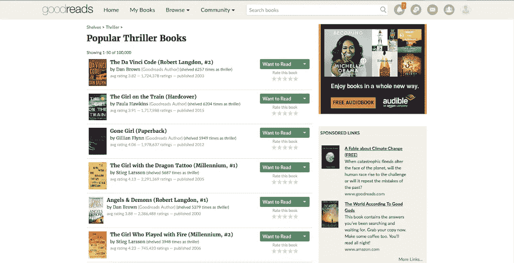

# 使用 Python BeautifulSoup 的数据抓取 Goodreads

> 原文：<https://medium.com/mlearning-ai/data-scraping-goodreads-using-python-beautifulsoup-3f4f16960255?source=collection_archive---------4----------------------->

# 什么是刮痧？

网络抓取是一种从网站获取信息的技术。每个网站都以 HTML 或一些静态文本的形式在网上托管信息，抓取涉及接受 HTML 代码并提取相关信息，如页面标题、页面中的标题、链接或电子邮件地址等。