# SQL 数据库管理(续。)

> 原文：<https://medium.com/mlearning-ai/database-management-in-sql-cont-59220e0dfe35?source=collection_archive---------6----------------------->

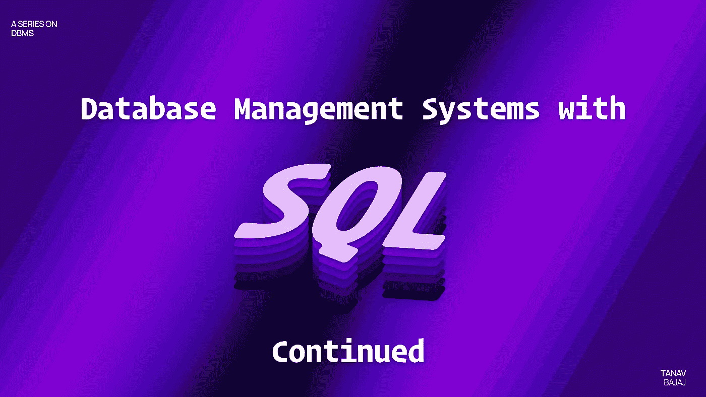

Image- [Umang Bhalla](https://twitter.com/umgbhalla)

这篇文章是我在 [DBMS 系列](/@tanav2202/database-management-system-with-sql-4109cbef79f9)上一篇文章的延续。

对于这篇文章，我使用一个随机大学的数据库。

我拥有的表格列表如下:

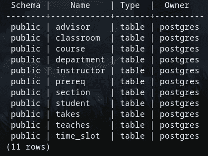

Tables in University Database

不要被`owner= Postgres`弄糊涂了，那是因为我在本地主机中使用 Postgresql(大多数命令与 sql 相同)。

## 与和或

and 和 OR 操作符**用于根据多个条件**过滤记录:如果由 AND 分隔的所有条件都为真，AND 操作符将显示一条记录。如果由 or 分隔的任何条件为真，OR 运算符将显示一条记录。

```
select name from instructor I , department D where D.dept_name=I.dept_name and (I.dept_name='Finance' or building in ('Watson','Taylor'));
```

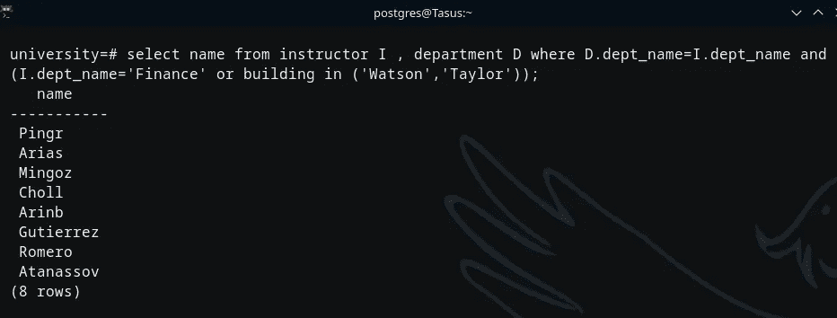

这显示了在**财务部**或其部门位于**沃森或泰勒大楼**的**讲师名单**。

## 字符串操作

SQL Server 提供了下列字符串运算符。字符串串联运算符可以:

*   将两个或多个字符、列等组合成一个表达式
*   在字符串比较操作中匹配一个或多个字符。

语法:`expression1 + expression2`连接两个表达式

“%”帮助查找零个或多个字符的任何字符串

“_”有助于查找单个字符

“[]”帮助查找指定范围([a-f])或([abcdef])内的单个字符

“[^]”帮助查找不在范围([^a-f])或([^abc])内的单个字符

LIKE 查询通常与 WHERE 和 string 运算符一起使用。

比如:`Select * from table where x LIKE “x%”`

在我的大学数据库中使用这个

```
SELECT course_id , title
FROM course
WHERE course_id LIKE '7__';
```

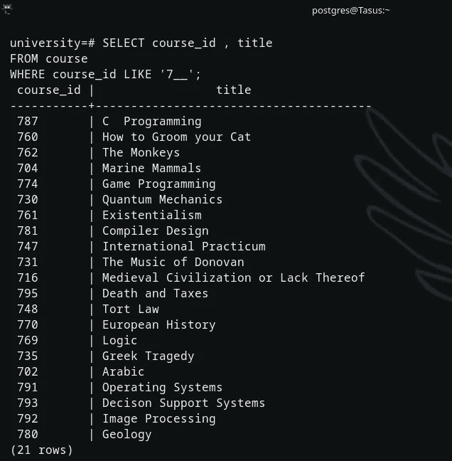

这显示了具有从 7 开始的 3 位数课程 id 的课程列表。

## 以...排序

**用于根据一列或多列对数据进行升序或降序排序**。

添加 ASC 使输出按升序排列(通常是默认的)

添加 DESC 会使输出按降序排列。

```
SELECT course_id , title
FROM course
 WHERE course_id LIKE ‘_3_’ ORDER BY course_id desc;
```

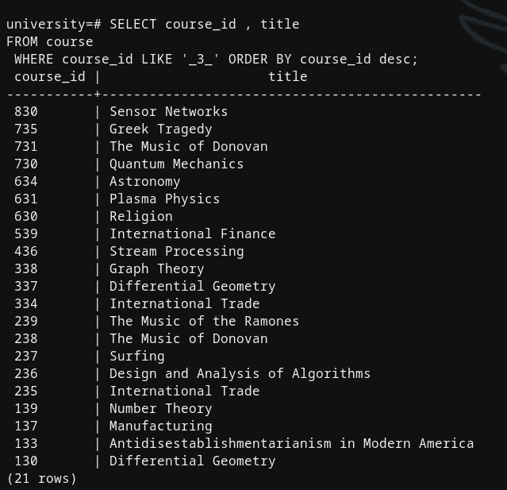

这显示了所有课程的课程 id 和标题，它们是 3 位数，中间有 3 个，按降序排列。

## 分组依据

将它与 SELECT 语句一起使用会根据行在一列或几列中的值将行分组。下面给出了一个例子(检查 AVG 的查询)

# 聚合函数

SQL **中的聚合函数对多个值执行计算并返回单个值。**示例:AVG、总和、最小值、最大值、计数等。

## AVG

AVG 函数计算一组值的平均值。

```
SELECT building, AVG(capacity)
FROM classroom
GROUP BY building
HAVING AVG(capacity) > 25;
```

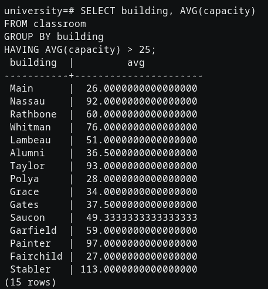

这显示了平均超过 25 人的每栋建筑的平均座位容量。

## 部

MIN 聚合函数返回一组非空值中的最小值。

`SELECT MIN(salary) AS least_salary FROM instructor;`

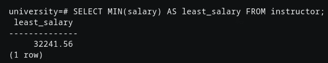

这显示了任何讲师的最低工资。

## 马克斯(男子名ˌ等于 Maximilian)

MAX 聚合函数返回一组非空值中的最大值。

`SELECT MAX(salary) AS max_salary FROM instructor;`

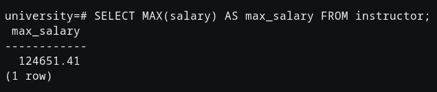

这显示了任何讲师的最高工资。

## 数数

执行所有条件和操作后，COUNT 函数返回数据库表中的行数。

`SELECT dept_name, COUNT(id) AS ins_count FROM instructor GROUP BY dept_name;`

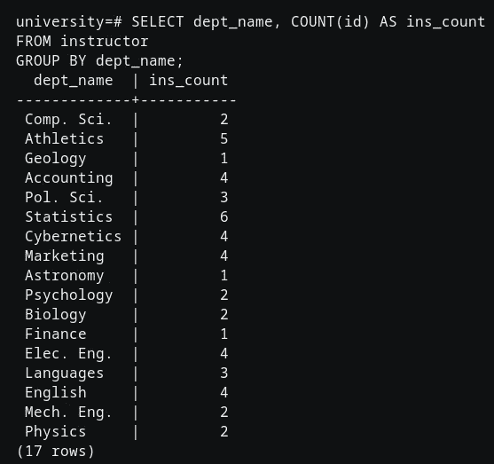

这显示了每个部门的讲师人数。

## 总和

SUM 函数返回数值列的总和。

`SELECT dept_name, SUM(budget) AS dept_budget FROM department GROUP BY dept_name;`

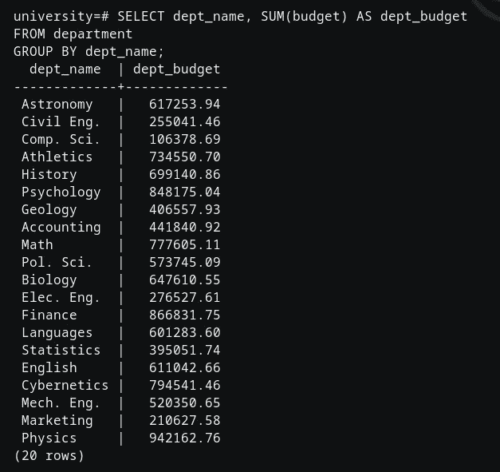

这显示了每个部门的预算。

# 嵌套子查询

SQL 提供了一个嵌套子查询的系统。这些是嵌套在另一个查询中的 SELECT-FROM-WHERE 表达式。

子查询可以与 SELECT、INSERT、UPDATE 和 DELETE 语句以及像=、、> =、<=, IN, BETWEEN, etc.

It can be written as

【 A₁, A₂…. Aₙ 【 r₁, r₂…….rₘ 【 P

Aᵢ can be replaced by a sub-query that generates a single value.

rᵢ is a valid sub-query

P is an expression somewhat like B <operation>子查询这样的操作符一起使用</operation>

*注意:查询的输入→一个或多个关系
查询的输出→总是单个关系*

```
SELECT DISTINCT course_id
FROM section
WHERE semester = ‘Fall’
AND year = 2009
AND course_id NOT IN (
SELECT course_id
FROM section
WHERE semester = ‘Spring’ AND year = 2010);
```

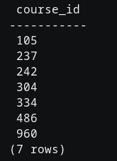

这可能看起来是一个相当长的查询，但简单来说，它显示了 2009 年秋季出现但 2010 年春季没有出现的所有课程的课程 id。

这里有一个嵌套在另一个语句中的语句。这里的主语句选择 2009 年秋季的课程 id，另一个查询语句位于显示 2010 年春季课程 id 的查询的 NOT IN 部分。

本文到此为止。**敬请关注**了解更多信息

[](/mlearning-ai/mlearning-ai-submission-suggestions-b51e2b130bfb) [## Mlearning.ai 提交建议

### 如何成为 Mlearning.ai 上的作家

medium.com](/mlearning-ai/mlearning-ai-submission-suggestions-b51e2b130bfb) 

🔵 [**成为作家**](/mlearning-ai/mlearning-ai-submission-suggestions-b51e2b130bfb)