# Deep Learning 可以解决微分方程(理论和 pytorch 实现)

> 原文：<https://medium.com/mlearning-ai/deep-learning-solves-differential-equations-better-than-any-other-numerical-method-14126c7a2a7c?source=collection_archive---------0----------------------->

嘿！欢迎阅读其他数学文章！在之前的一篇文章中，我描述了我的论文方法，这是一种受神经常微分方程启发的方法，其动机是**如何使用神经网络进行外推**、[https://seven t-Christina . media . com/a-不同的方法-受神经常微分方程启发-神经网络外推-9766f846bd02](https://sevent-christina.medium.com/a-different-approach-inspired-by-neural-odes-extrapolation-of-neural-networks-9766f846bd02) 下面我们来看一看！我使用的一个非常有趣的方法是使用神经网络来求解 ode。

# 求解常微分方程和偏微分方程的人工神经网络

这种方法最早是由 A. Likas，E. Lagaris 和 D. Fotiadis 在论文[https://www.cs.uoi.gr/~lagaris/papers/TNN-LLF.pdf](https://www.cs.uoi.gr/~lagaris/papers/TNN-LLF.pdf)中提出的，这是一种启发了很多人的前沿方法。尤其是现在关于**科学机器学习**的话题已经非常“热门”而且我们手中已经有了强大的工具来实现和测试，这篇论文更是必读。在这里，我用一个简单的方法来解释和实现本文！让我们深入探讨一下这个方法吧！

# 数学背景

在这里，我将介绍一个一阶常微分方程的例子，然而，它也很容易工作为较大的秩序常微分方程或偏微分方程。

*   ***通用:***

在数值分析中，我们用以下形式表示 ODE:

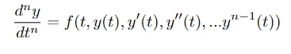

所以，对于一阶颂歌，我们有

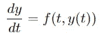

我们将研究本文的示例 2:

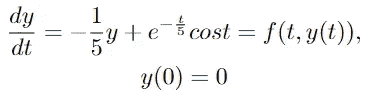

该一阶常微分方程的解析解为:

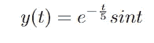

*   ***欧拉法:***

有很多已知的数值方法来解决一个微分方程。最流行的是欧拉方法。欧拉的基本思想是我们以均匀的方式在 N 个点上离散区域[α，b]，

[a=t0，t1，t2，t3，… tN=b]我们通过一个公式找到解，欧拉公式是:

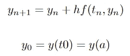

在我们的例子中，我们在[0，5]=[α，b]中有 t，最后的公式是:

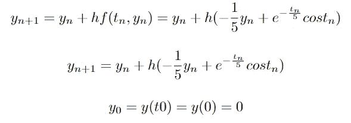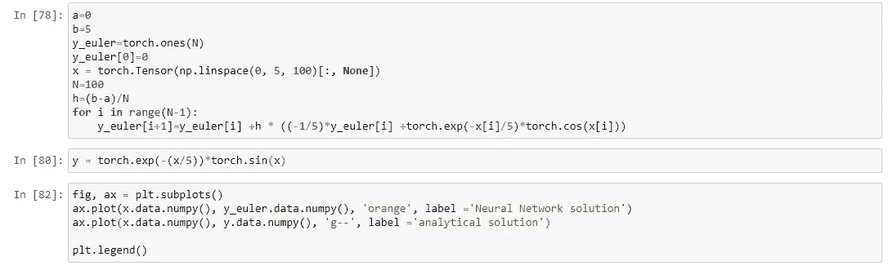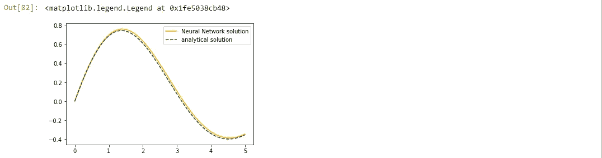

上面的一个两分钟实现方法给出了一个额外的好结果！例如，如果我们有一个更复杂的微分方程，情况就不总是这样。幸运的是，在这种情况下，我们也可以使用一些方法，比如龙格库塔(Runge Kutta)或改进的欧拉(Euler)方法。

# 建议的方法

> **理论上:我们假设一个试验解依赖于一个神经网络。该神经网络将被训练成使得试解适合于 ode 的分析解。**

*   根据本文的等式(11)，对于具体的例子，我们有下面的 y 试验。N(x，θ)是要训练的神经网络。

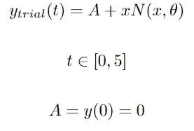

*   损失函数:神经网络是连续和可微的函数，所以我们可以有一个神经网络的导数。

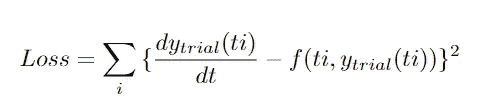

> **实现:假设 N(t，theta)是一个架构简单的神经网络。它有一个输入层，一个神经元对应于[a，b]的每个点 ti，一个隐藏层有 10 个神经元，一个输出层有一个神经元对应于试解 y(ti)，我们使用 sigmoid 作为激活函数。**

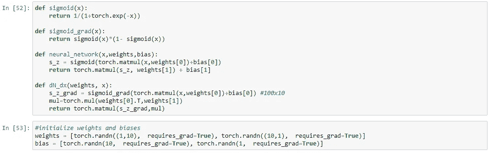

I define the network and the derivative of the network by hand. Below is also the same network using the Sequential module of Pytorch and then use autograd package for the derivative. It is also very handy! I did it from scratch in order to dive deep into the paper’s method! The derivative comes from formulas (5) and (6) in the paper.

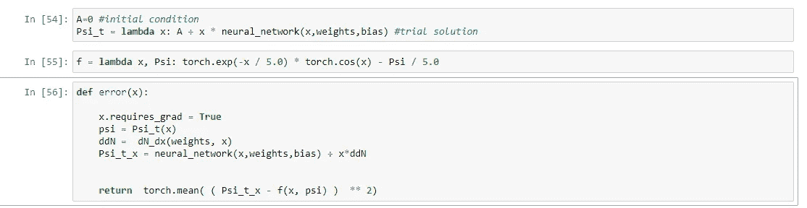

The definition of y trial, f function(the ode) and the loss function.

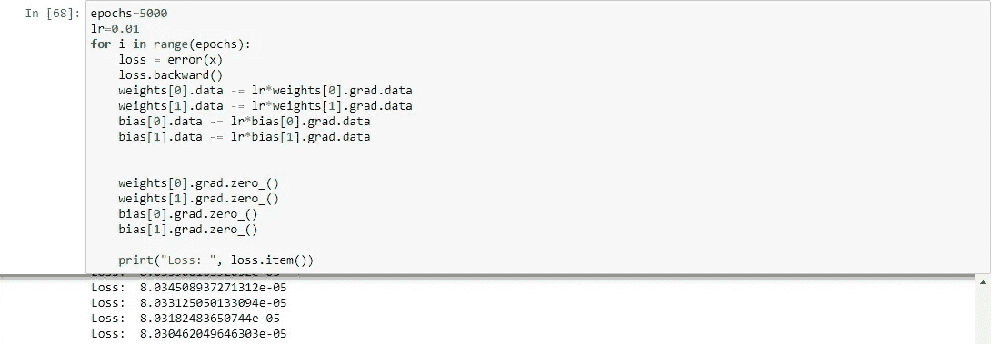

training of this simple Neural Network achieves great loss.

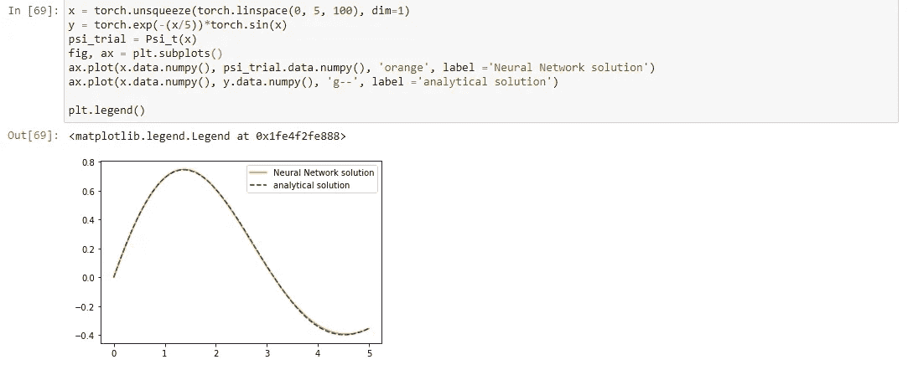

final result

> **实施亲笔签名。我们可以使用 pytorch 顺序模块，而不是手动定义神经网络和导数。**

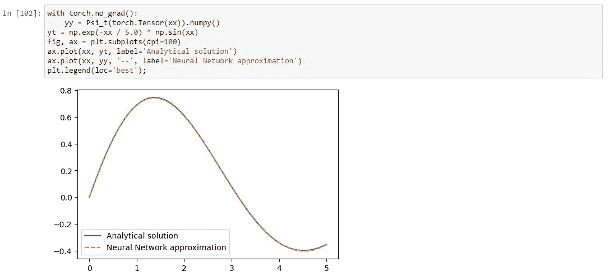

The result using Sequential module, autograd and Adam or BFGS optimizer is the same and also very fast 👐

# 结论

我们可以使用神经网络来解决一个常微分方程或偏微分方程，我们可以很快获得很好的结果。对于更高阶的常微分方程或偏微分方程，想法是相同的，但在实现中有些事情发生了变化。

感谢您的阅读！联系我以获得评论和更多讨论..:)

 [## Mlearning.ai 提交建议

### 如何成为 Mlearning.ai 上的作家

medium.com](/mlearning-ai/mlearning-ai-submission-suggestions-b51e2b130bfb)