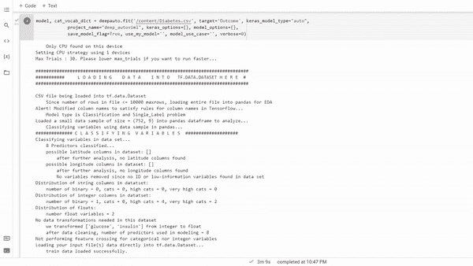

# 单码深度神经网络

> 原文：<https://medium.com/mlearning-ai/deep-neural-network-in-single-of-code-ac8df92f7282?source=collection_archive---------5----------------------->

## 使用 Deep AutoViml 构建 Keras 管道和模型

Deep AutoViml (Source: By Author)

深度学习是数据科学的一个领域，我们在其中创建基于人工智能的模型/算法，是机器学习的一部分，它模仿并学习人脑的工作方式。这是一个通过组合不同层而创建的模型，每层都包含特定的神经元。这些…