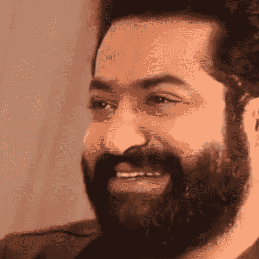

# DeepFaceLab 是当今最先进的人脸交换人工智能。

> 原文：<https://medium.com/mlearning-ai/deepfacelab-is-the-most-advanced-face-swapping-ai-out-there-today-2f39fd0e9186?source=collection_archive---------1----------------------->

**制作深度假视频有哪些步骤？**

本文概述了我使用 DeepFaceLab 创建 deepfake 视频的步骤。这个过程并不像乍看上去那么简单，但是一旦你完成了这些步骤，你就会更好地理解这项技术已经变得多么先进，并且使用起来多么简单。本教程并没有提供一步一步的指导，但是如果你有兴趣学习更多关于 deepfakes 的知识，它会给你指明一个方向。

# 介绍

Deepfakes 让我着迷。它们被用来创建名人混搭和摩根·弗里曼的虚假视频。

RRR 或好莱坞电影及其令人难以置信的电脑特效吸引了许多观众的注意。然而，我们也都见过糟糕的 CGI。期望和现实之间的反差令人不快；不是说 CGI 不好，而是你期望它好。Deepfakes 是如此引人注目，因为这些视频实际上没有价值，但却有着令人难以置信的效果。

# 背景

当我开始从事 deepfake 研究时，我是从零开始的。我没有使用 deepfakes 的经验，但是我很清楚这种趋势和关于它们的新闻故事。我的背景是机器学习，但与这个项目无关。

我有一台全新的华硕 Rog 游戏笔记本电脑，配有锐龙 9 处理器和 4GB 的英伟达 GeForce RTX 3050。当我在上面运行 6 秒深度假视频时，我能够在 5 小时内完成任务。

# 入门:DeepFaceLab vs Faceswap

两个开源的 deepfake 生成项目——DeepFaceLab(DFL)@和 face swap——主导了这个领域。乍一看，Faceswap 似乎是一个更安全的选择。它有多个贡献者和更广泛的受众，以及比许多其他脸交换程序更多的文档和代码示例。但是我在程序的 GUI 和转换过程中苦苦挣扎，一直没有完成。后来，我用 Ubuntu 发行版替换了 GUI 并调整了视频 FPS 设置，从而解决了这两个问题。“所以我必须投身于 DFL，因为这是我在尽可能短的时间内学习和成功的最有效方式。

# DeepFaceLab

在这篇博文中，我们将使用 DeepFaceLab 来创建 deepfakes。要开始这个项目，你可以从 Google Drive 或 Mega 下载预建的 Windows 版本。这些将为您提供依赖项，并允许您以最快的速度开始。

# 第一步:提取

Deepfakes 是看起来像是由人制作的视觉效果。Deepfakes 是通过首先从视频中提取帧，然后使用人工智能将帧中的人的脸换成其他人的脸来制作的。在程序的最后，使用几百到几千张高质量的照片。每个 DFL 阶段都是一个可执行的批处理文件，它会一直运行，直到完成或者终止。虽然高级用法需要直接运行 Python，但是您可以通过一步一步的方式使用提供的可执行文件。

你的模型的有效性取决于它用来训练的数据。好的投入是好的产出的必要条件。为了确保照片质量上乘，DFL 能够正确识别人脸，有必要筛选数百张照片。DFL 包括许多批处理文件，将帮助您完成这个过程的大部分。您可以按模糊度、面孔相似度、直方图和其他因素进行排序。通过将不需要的帧和不正确捕捉的面部分组，这加快了过程，但你仍然会从亲自筛选剩余的材料中获益。由于你将花费大量时间训练，在这方面付出额外的努力是值得的。

在这个阶段结束时，你将会有成千上万的切片帧和标准化的人脸。

Extracted face from Video

请注意，这些不是普通的照片；图像文件包含对齐信息。这些元数据对于即将到来的行动至关重要。如果在 DFL 之外进一步处理这些照片，可能会出现问题。

# 第二步:培训

您要训练的模型必须在以下步骤中选择。DFL 提供六个版本，每个版本都有特定的复杂程度和用途。AMP 是为性能较低的显卡设计的，Avatar 是用来改变一个源视频中的人脸情绪的，SAE 是把几个不同的模型结合起来。手册和网络指南都建议使用 SAE，但我选择了唯一一款能与我最初的显卡兼容的 Quick96。这里有一大堆你可以改变的变量，但是你不会真正知道它们的影响，直到你把它们付诸实践。你必须耐心等待结果，因为这需要几个小时或几天。

您可以随时暂停训练，并在以后继续训练，以存储“检查点”和备份模型。备份后，您可以发散检查新设置是否产生有希望的结果。我建议在大约 40，000 次迭代后进行备份，然后在此基础上尝试其他设置。在尝试积极设置之前，请先进行备份。这种机器学习很容易崩溃，使得模型变得无用。没有办法从这种崩溃中恢复，因此您唯一的选择是从备份中恢复。

# 第三步:转换

一旦你训练好了你的模型，你就可以转换一个目标视频并制作出一个 deepfake。转换过程采用您的模型，并使用它来生成图像以叠加到目标视频上。您可以调整模糊或收缩覆盖视频的遮罩的设置，更改输出的颜色，重新缩放输出，等等。

将每个帧转换成视频后，可以将所有转换后的帧合并成一个视频文件。这个过程不会花太多时间。据我所知，1 分钟的视频转换大概需要 10 分钟。

# 结果

下面可以看到华硕 Rog 游戏笔记本电脑处理 6 秒钟视频的结果，该笔记本电脑采用锐龙 9 处理器和 4GB NVIDIA GeForce RTX 3050。

在这个视频中，你可以看到电影《巴胡巴利》中的一个片段，主要演员是帕拉巴斯，现在我把他的脸换成了 NTR Jr。

# 结论

为了改进，最好的办法是获得更好的输入数据，手动调整程序并训练更长时间。随着时间的推移，这项技术会变得越来越好，越来越容易使用，但是不应该期望一夜之间就能有所改进。Windows 版本是独立的，不需要任何外部依赖。我仍然会遇到 Faceswap 的问题，但这些都是用户体验问题，可以通过添加额外的功能或改进程序的整体设计来解决。它们是重要的问题，但不是只有天才和科学家才能解决的深度机器学习问题。

 [## Mlearning.ai 提交建议

### 如何成为 Mlearning.ai 上的作家

medium.com](/mlearning-ai/mlearning-ai-submission-suggestions-b51e2b130bfb)