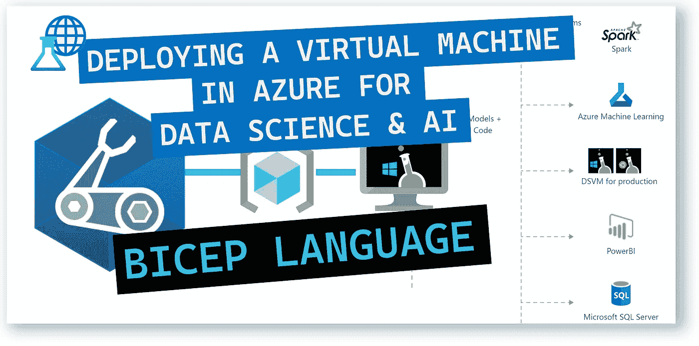
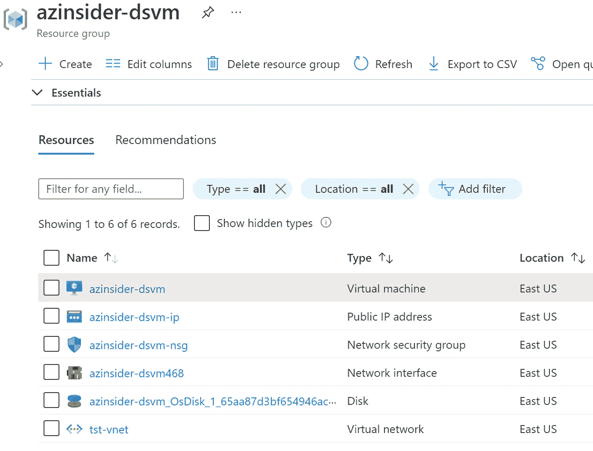
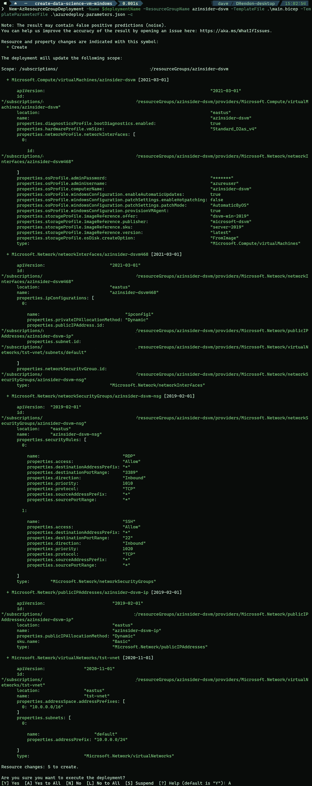
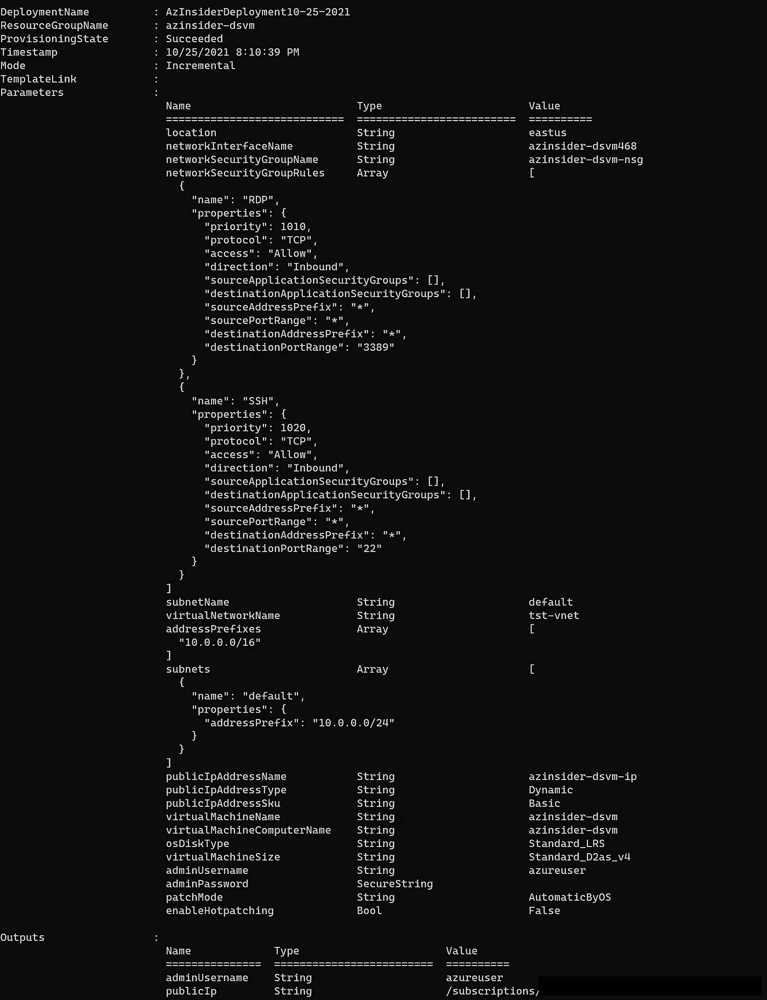
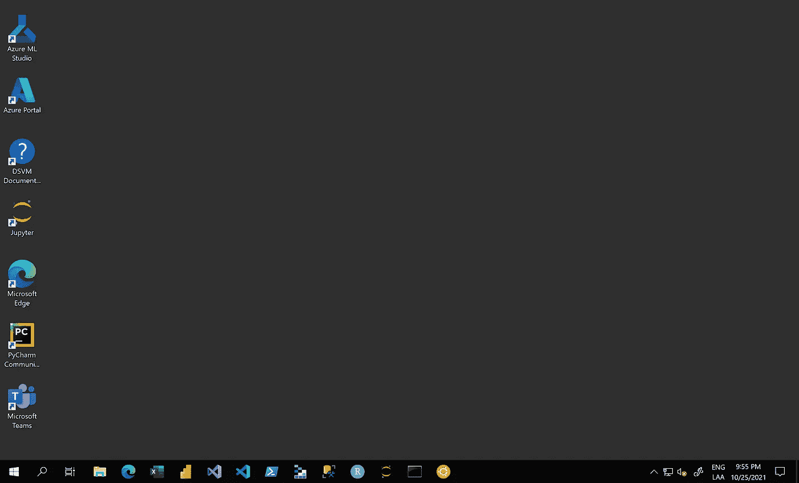

# 💪在 Azure 中部署预配置的虚拟机，用于数据科学和人工智能开发

> 原文：<https://medium.com/mlearning-ai/deploying-a-pre-configured-virtual-machine-in-azure-for-data-science-and-ai-development-16a4d1d46142?source=collection_archive---------3----------------------->

了解如何在 Azure 中部署用于数据科学的虚拟机，并预装用于数据分析、机器学习和人工智能培训的工具。



💪Deploying a Pre-Configured virtual machine in Azure for Data Science and AI Development

为数据科学和人工智能开发构建实验室环境不应该很复杂。

在本文中，我们将回顾如何使用 Azure Bicep 利用基础设施即代码在 Azure 云平台上构建一个定制的 VM 镜像来进行数据科学研究。

# 解决方案概述

我们将创作一个 Bicep 模板，在 Azure 中创建一个基于 Linux 的数据科学虚拟机(DSVM ),其中包括预安装和预配置的流行数据科学工具，以启动构建高级分析的智能应用程序。

DSVM 是为数据科学定制的虚拟机映像。DSVM 支持许多语言，如 Python、R、Julia、SQL、C#、Jave、Node.js、F#。

您可以选择纵向扩展虚拟机以及 SSH 或 RDP。

# 部署的资源

*   Windows Server 2019 虚拟机
*   IP 地址(公有和私有)
*   虚拟网络和子网
*   唱片
*   网络安全配置



DSVM solution components

# 在部署到 Azure 之前

确保您具备以下条件:

*   有效的 Azure 订阅
*   Azure 二头肌已安装
*   Azure PowerShell
*   Azure 订阅中的资源组

现在让我们使用 Bicep 模板在 Azure 上部署 Moodle。

# 1.Azure 二头肌模板-参数

我们将定义以下参数:

```
param location string
param networkInterfaceName string
param networkSecurityGroupName string
param networkSecurityGroupRules array
param subnetName string
param virtualNetworkName string
param addressPrefixes array
param subnets array
param publicIpAddressName string
param publicIpAddressType string
param publicIpAddressSku string
param virtualMachineName string
param virtualMachineComputerName string
param osDiskType string
param virtualMachineSize string
param adminUsername string@secure()
param adminPassword string
param patchMode string
param enableHotpatching bool
```

# 2.Azure 二头肌模板-变量

我们将定义以下变量:

```
var nsgId = resourceId(resourceGroup().name, 'Microsoft.Network/networkSecurityGroups', networkSecurityGroupName)
var vnetId = resourceId(resourceGroup().name, 'Microsoft.Network/virtualNetworks', virtualNetworkName)
var subnetRef = '${vnetId}/subnets/${subnetName}'
```

# 3.Azure 二头肌模板—资源

我们将定义以下资源:

```
// This will be your Primary NIC
resource networkInterfaceName_resource 'Microsoft.Network/networkInterfaces@2021-03-01' = {
  name: networkInterfaceName
  location: location
  properties: {
    ipConfigurations: [
      {
        name: 'ipconfig1'
        properties: {
          subnet: {
            id: subnetRef
          }
          privateIPAllocationMethod: 'Dynamic'
          publicIPAddress: {
            id: pip.id
          }
        }
      }
    ]
    networkSecurityGroup: {
      id: nsgId
    }
  }
  dependsOn: [
    networkSecurityGroupName_resource
    virtualNetworkName_resource
    pip
  ]
}
// Simple Network Security Group
resource networkSecurityGroupName_resource 'Microsoft.Network/networkSecurityGroups@2019-02-01' = {
  name: networkSecurityGroupName
  location: location
  properties: {
    securityRules: networkSecurityGroupRules
  }
}
// This will build a Virtual Network.
resource virtualNetworkName_resource 'Microsoft.Network/virtualNetworks@2020-11-01' = {
  name: virtualNetworkName
  location: location
  properties: {
    addressSpace: {
      addressPrefixes: addressPrefixes
    }
    subnets: subnets
  }
}
// Public IP for your Primary NIC
resource pip 'Microsoft.Network/publicIpAddresses@2019-02-01' = {
  name: publicIpAddressName
  location: location
  properties: {
    publicIPAllocationMethod: publicIpAddressType
  }
  sku: {
    name: publicIpAddressSku
  }
}
// This is the virtual machine that you're building.
resource virtualMachineName_resource 'Microsoft.Compute/virtualMachines@2021-03-01' = {
  name: virtualMachineName
  location: location
  properties: {
    hardwareProfile: {
      vmSize: virtualMachineSize
    }
    storageProfile: {
      osDisk: {
        createOption: 'FromImage'
        managedDisk: {
          storageAccountType: osDiskType
        }
      }
      imageReference: {
        publisher: 'microsoft-dsvm'
        offer: 'dsvm-win-2019'
        sku: 'server-2019'
        version: 'latest'
      }
    }
    networkProfile: {
      networkInterfaces: [
        {
          id: networkInterfaceName_resource.id
        }
      ]
    }
    osProfile: {
      computerName: virtualMachineComputerName
      adminUsername: adminUsername
      adminPassword: adminPassword
      windowsConfiguration: {
        enableAutomaticUpdates: true
        provisionVMAgent: true
        patchSettings: {
          enableHotpatching: enableHotpatching
          patchMode: patchMode
        }
      }
    }
    diagnosticsProfile: {
      bootDiagnostics: {
        enabled: true
      }
    }
  }
}
```

# 4.Azure 二头肌模板-输出

我们将定义以下输出:

```
output adminUsername string = adminUsername
output publicIp string = pip.id
```

# 5.Azure Bicep 模板-部署

我们将使用下面的命令来部署我们的二头肌模板:

```
$date = Get-Date -Format "MM-dd-yyyy"
$deploymentName = "AzInsiderDeployment"+"$date"New-AzResourceGroupDeployment -Name $deploymentName -ResourceGroupName azinsider-dsvm -TemplateFile .\main.bicep -TemplateParameterFile .\azuredeploy.parameters.json -c
```

下图显示了部署的预览:



然后我们将执行部署。下图显示了部署输出:



virtual machine in Azure for Data Science and AI Development — Deployment output

现在，您可以通过 RDP 访问虚拟机。你可以从 Azure 门户获得公共 IP 和私有 IP。

访问虚拟机后，您将看到所有工具都已准备就绪，可供您进行数据科学和人工智能开发:



Windows Server 2019 — Data Science virtual machine

您可以参考以下 URL 来查看此虚拟机中包含的预配置工具的详细信息:

[](https://docs.microsoft.com/en-us/azure/machine-learning/data-science-virtual-machine/tools-included?WT.mc_id=AZ-MVP-5000671) [## Azure 数据科学虚拟机上包含的工具——Azure 数据科学虚拟机

### 数据科学虚拟机是一种在云中探索数据和进行机器学习的简单方法。数据科学…

docs.microsoft.com](https://docs.microsoft.com/en-us/azure/machine-learning/data-science-virtual-machine/tools-included?WT.mc_id=AZ-MVP-5000671) 

希望你能利用 Azure 平台的虚拟机扩展能力。当您训练大型模型时，或者当您需要高速计算同时保持相同的操作系统磁盘时，您可以切换到基于 GPU 的虚拟机。

该解决方案的完整代码可以在以下 URL 中找到。请随意投稿！

[](https://github.com/daveRendon/azinsider/tree/main/application-workloads/create-data-science-vm-windows) [## azin sider/应用程序-工作负载/创建-数据-科学-虚拟机-主数据上的 windows rendon/azin sider

### 在 GitHub 上创建一个帐户，为 daveRendon/azinsider 开发做出贡献。

github.com](https://github.com/daveRendon/azinsider/tree/main/application-workloads/create-data-science-vm-windows) 

👉 [*在此加入****azin sider****邮箱列表。*](http://eepurl.com/gKmLdf)

*-戴夫·r·*