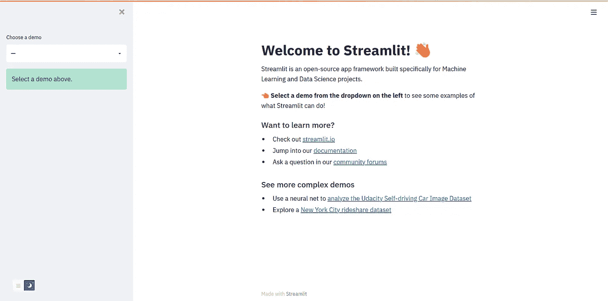
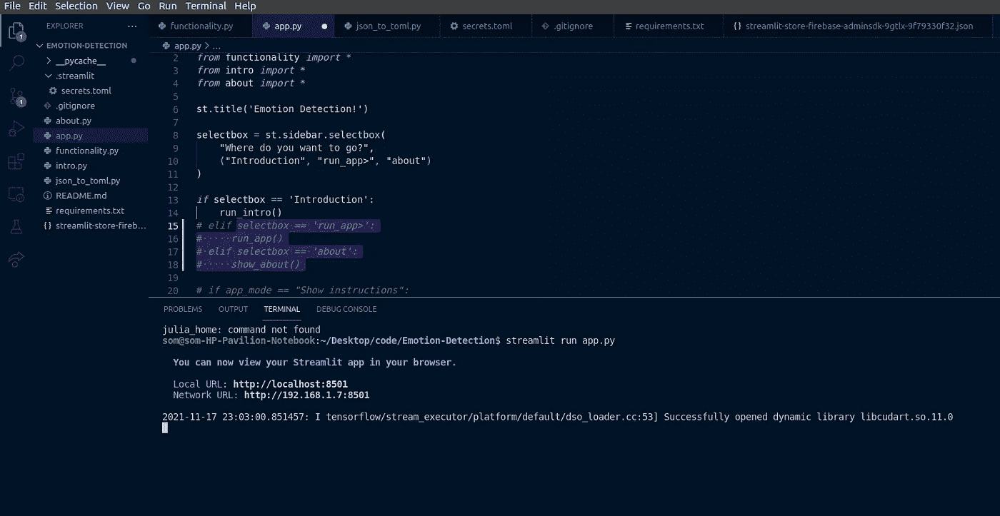
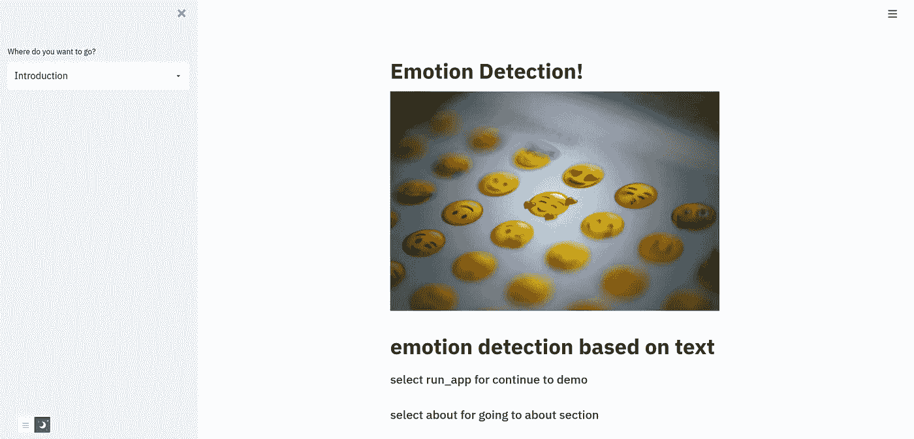

# 在 web 上部署您的 ML 模型，共享它们，制作令人惊叹的 web 界面第 1 部分

> 原文：<https://medium.com/mlearning-ai/deploying-your-ml-models-on-the-web-sharing-them-and-making-the-awesome-web-interface-part-1-1b70c6579d71?source=collection_archive---------0----------------------->


Photo by [Taras Shypka](https://unsplash.com/@bugsster?utm_source=medium&utm_medium=referral) on [Unsplash](https://unsplash.com?utm_source=medium&utm_medium=referral)

在对某个问题建立了一个机器学习模型之后，你可能想与其他朋友分享它，让他们看看它能为项目做些什么。

为了部署我们的模型，Streamlit 平台帮助我们创建漂亮的应用程序界面，并将其部署在 web 机器上

## 安装 Streamlit

要安装 Streamlit，您可以使用 pip 和命令进行安装

```
pip install streamlit
```

要检查 Streamlit 是否正确安装并在您的机器上运行良好，您可以使用 CMD 中的命令进行检查

```
streamlit hello 
```



如果您看到上面的输出屏幕，说明您已经在系统上完美地安装了 Streamlit:)

## 开始构建您的应用程序

这里我假设你已经把模型下载到你的机器上了

在这里，我使用了一个来自情绪检测(Kaggle)竞赛的模型来检测一个陈述(https://www.kaggle.com/c/tweet-emotion-detection/overview)的情绪

在继续下一步之前，我鼓励你创建一个 git 库并创建一个 Streamlit 帐户(【https://share.streamlit.io/】T4)

初始化 repo 并在您最喜欢的 ide 中打开它之后，让我们开始创建应用程序

我们会有不同类型的文件用于不同的目的

1.  app.py —这是用于启动我们的应用程序和第一个介绍性部分
2.  intro.py —为我们的应用程序创建一个好的介绍
3.  functionality . py——这是我们应用程序的全部功能所在
4.  about . py——提及我们自己是创造者并分享更多关于模型的信息

在你的 ide 中创建上述文件

## 编辑 app.py

让我们首先创建 app.py 文件

在这里，我们首先导入 Streamlit。

设置侧栏使我们的应用程序看起来更好

此功能帮助我们在应用程序的主屏幕上显示标题

这里`st.sidebar.selectbox`这个函数显示在我们应用程序的侧边栏上，给它一个更优雅的外观，我们可以定义一个选项元组以及我们想去哪里的问题

## 编辑简介. py

设置 introduction.py

```
import streamlit as st # creating run_intro() function 
def run_intro():
     st.image("https://images.unsplash.com/photo-1587483166702-               bf9aa66bd791?   ixid=MnwxMjA3fDB8MHxwaG90by1wYWdlfHx8fGVufDB8fHx8&ixlib=rb-  1.2.1&auto=format&fit=crop&w=1170&q=80", use_column_width=True)

     st.markdown("""
       ## emotion detection based on text 

       ### select run_app for continue to demo 

       ### select about for going to about section """)
```

在 introduction.py 中，我们创建了 run_intro()

使用`st.image`,我们可以在我们的应用程序屏幕上显示任何图像，选择你最喜欢的网址，并在我们的应用程序屏幕上显示图像

使用`st.markdown`,我们可以在屏幕上显示降价格式的文本

为了检查我们是否在正确的轨道上，我们将在第 15 行之后注释掉 if-else 阶梯

## 编辑 about.py

您可以为 about.py 编写类似的代码，并创建应用程序的 about 部分😃

## 检查我们的进度

在项目终端键入命令

```
streamlit run app.py
```

运行此命令后，它将显示如下所示的输出。在浏览器上打开终端中显示的本地 URL



运行并在浏览器中打开该 URL 后，您应该会看到如下所示的屏幕



我们将在下一部分讨论应用程序的功能部分😄

> *感谢阅读我的博客:)关注更多，在评论中向我问好，这鼓励我写更多的博客:)祝你有美好的一天:)*

[](/mlearning-ai/mlearning-ai-submission-suggestions-b51e2b130bfb) [## Mlearning.ai 提交建议

### 如何成为 Mlearning.ai 上的作家

medium.com](/mlearning-ai/mlearning-ai-submission-suggestions-b51e2b130bfb)