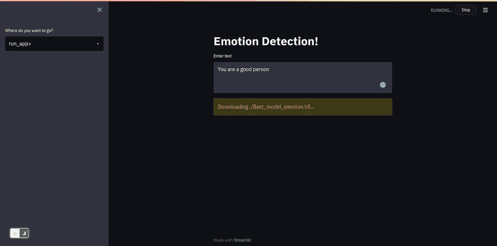

# 在 web 上部署您的 ML 模型，共享它们，制作令人惊叹的 web 界面第 2 部分

> 原文：<https://medium.com/mlearning-ai/deploying-your-ml-models-on-the-web-sharing-them-and-making-the-awesome-web-interface-part-2-1db472b1ca0b?source=collection_archive---------1----------------------->


Photo by [Joshua Aragon](https://unsplash.com/@goshua13?utm_source=medium&utm_medium=referral) on [Unsplash](https://unsplash.com?utm_source=medium&utm_medium=referral)

在前一部分中，我们已经设计了 app.py 主界面，在这一部分中，我们将重点关注应用程序的功能。

> 前一部分的链接

[](/mlearning-ai/deploying-your-ml-models-on-the-web-sharing-them-and-making-the-awesome-web-interface-part-1-1b70c6579d71) [## 在 web 上部署您的 ML 模型，共享它们，制作令人惊叹的 web 界面第 1 部分

### 在对某个问题建立了机器学习模型后，你可能想与其他朋友分享，让他们看看…

medium.com](/mlearning-ai/deploying-your-ml-models-on-the-web-sharing-them-and-making-the-awesome-web-interface-part-1-1b70c6579d71) 

在继续之前，让我们确保您已经在系统中安装了所有需要的库

确保您已经安装了上述库，以便安装这些库。您可以使用导航到上述文件来安装这些库(确保您将此文件保存在项目目录中，我们将需要它来在云计算机上安装库)

```
pip install -r requirements.txt
```

## 最后一次编辑 app.py

我们将取消对上一部分 if-else 阶梯的注释，并以`streamlit run app.py`开始我们的应用程序

## 编辑功能. py

在这一部分，我们将编写应用程序的功能

在创建应用程序的功能之前，我们将确保我们的模型为此做好准备。我发现 drive 是存储模型的最佳平台，因为在 GitHub 上，我们可以存储高达 20 MB 的模型。

确保您的模型是`h5`格式的，并上传到驱动器上

在这里，我已经上传了模型，你可以使用这个或者上传你自己的模型，并确保你设置的文件对每个人都可见

```
[https://drive.google.com/uc?id=1--eULExMNhEKGiY4zZmdSB7dvMwh0nOX](https://drive.google.com/uc?id=1--eULExMNhEKGiY4zZmdSB7dvMwh0nOX)
```

让我们导入所有需要的库和 URL

```
*import* json
*import* streamlit *as* st
*import* tensorflow_text *as* text
*import* tensorflow_hub *as* hub
*import* tensorflow *as* tf
*import* gdown
*import* osmodel_url = "https://drive.google.com/uc?id=1--eULExMNhEKGiY4zZmdSB7dvMwh0nOX"
model_path = './Best_model_emotion.h5'
```

让我们为主要功能编写 run_app 函数，它将作为我们

在这个函数中，我们使用`st.text_area`函数输入用户文本，这将在应用程序的屏幕上创建一个文本区域

我尝试使用 firebase python API 在 firebase 数据集上存储我的预测，但这不是一个必要的步骤，我们现在将忽略存储预测

之后，我们调用 load_model 函数，我们将在获得模型后编写该函数，我们使用`model.predict`函数进行预测

然后我们可以用`st.title`功能将预测显示在屏幕上

## 创建 load_model 函数

我们将在`functionality.py`中创建这个函数

这个模型负责从驱动器下载我们保存的模型，并确保它正确加载到我们的云机器中

为了验证模型是否存在，避免一次又一次地下载模型，每次加载时，我们都必须验证模型是否存在于我们的模型路径中，以及它是否工作正常

为了下载模型，我们使用了`gdown`库，这个库帮助我们从驱动器下载文件

如果你得到一个模块没有找到的错误，然后在你的终端运行`pip install gdown`

在我们的例子中，模型是使用 TensorFlow 构建的，我们使用 USE 作为特征提取的基础模型。

我们使用 Keras `load_model`函数加载模型，并返回它以便对该模型进行预测。

## 完整的 functionality.py 文件

最后，确保提交并推送至 GitHub 库。如果你想学习如何在 GitHub 上推送文件，请参考[杰耶什·贾因](https://medium.com/u/9ca3204a0400?source=post_page-----1db472b1ca0b--------------------------------)的博客

[](/@jayeshjain_246/github-for-beginners-8ff6b072539b) [## 适合初学者的 GitHub

### 在这篇博客中，我试图用一种非常初学者友好的方式来解释 GitHub 及其用法，这样他们就有了一个清晰的视角

medium.com](/@jayeshjain_246/github-for-beginners-8ff6b072539b) 

如果您在运行并导航到`run_app`栏后正确完成了所有步骤

```
 streamlit run app.py
```

你应该有一些类似的屏幕



现在，您几乎处于部署的最后阶段，您只需要设置一个云机器，然后您就可以与您的朋友分享您的模型了😃

我们将在本教程的下一部分讨论在 Streamlit.cloud 上设置云机器并共享我们的应用程序

> 感谢你阅读我的博客:)关注更多，在评论中向我问好，这给了我写更多博客的鼓励:)祝你有美好的一天:)

[](/mlearning-ai/mlearning-ai-submission-suggestions-b51e2b130bfb) [## Mlearning.ai 提交建议

### 如何成为 Mlearning.ai 上的作家

medium.com](/mlearning-ai/mlearning-ai-submission-suggestions-b51e2b130bfb)