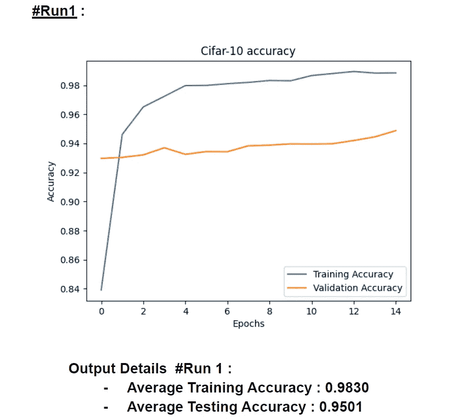
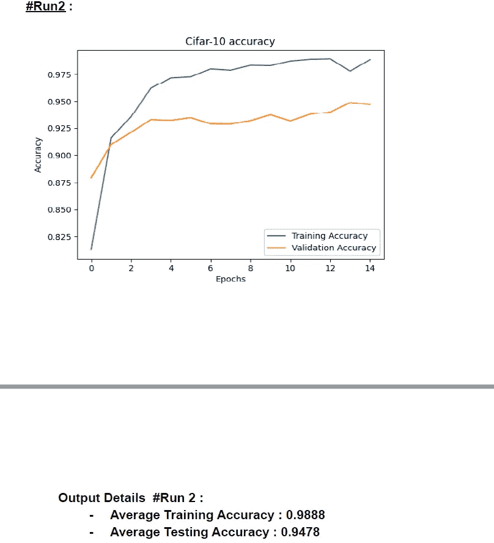
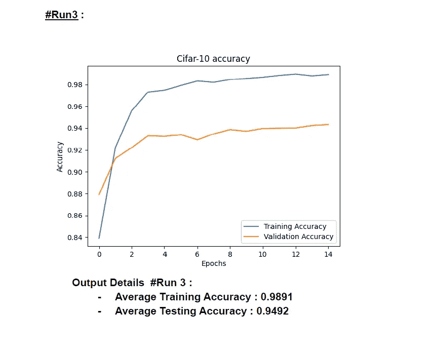
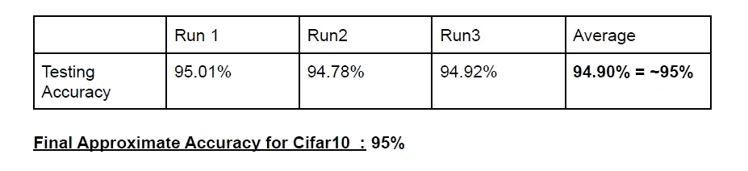

# 使用迁移学习在 Cifar10 数据集上设计卷积神经网络— Resnet101

> 原文：<https://medium.com/mlearning-ai/designing-convolutional-neural-networks-on-cifar10-dataset-using-transfer-learning-resnet101-423473d1b17c?source=collection_archive---------2----------------------->

具有 101 层的卷积神经网络被称为 ResNet-101。
ImageNet 数据库包含一个预先训练好的适应网络，该网络已经在超过一百万张图像上准备好了。该网络可以将图像区分为 1000 种不同的对象类别，包括键盘、鼠标、铅笔，更重要的是，各种各样的动物。相应地，网络为各种各样的图像提供了丰富的组件描述。

首先，我们将在 CIFAR-10 数据集上执行操作。有 50000 个训练图像和 10000 个测试图像。它有五个训练批次和一个测试批次。数据集由 10 个类组成，我在代码中将它们计算为 x，比如 x0，x1……x9。

以下是我在代码中使用的一些参数的摘要:

*   数据集:CIFAR-10
*   实施 Resnet-101 模型时使用的库— Tensorflow、Keras、matplotlib、NumPy、cv2。
*   CNN 型号— Resnet101
*   输入形状/图像宽度和高度— 227x227x3
*   批量大小— 28
*   学习率— 0.000057
*   纪元数量— 15

Run 1

Run 2

Run 3

Final Accuracy

最后，我们已经完成了我们的代码，并实现了大约 95%的平均测试准确率。

Github 代码:[https://github . com/durveshshah/Machine-Learning/blob/main/cifar 10 _ code . py](https://github.com/durveshshah/Machine-Learning/blob/main/Cifar10_Code.py)

在 Github 上关注我:[https://github.com/durveshshah](https://github.com/durveshshah)

 [## Mlearning.ai 提交建议

### 如何成为 Mlearning.ai 上的作家

medium.com](/mlearning-ai/mlearning-ai-submission-suggestions-b51e2b130bfb) 

🔵 [**成为作家**](/mlearning-ai/mlearning-ai-submission-suggestions-b51e2b130bfb)