# 模仿学习和强化学习

> 原文：<https://medium.com/mlearning-ai/detailed-basics-of-deep-learning-part-three-b930c40cf7f8?source=collection_archive---------6----------------------->

这是我总结 Sergey Levine 教授举办的 CS182 讲座系列文章的第三篇，所有的荣誉都归于他。所有图片均取自他的讲座。这些是第一条、[、第二条](/mlearning-ai/convolutional-networks-recurrent-neural-networks-and-transfomers-ee6a63ddb57f)和[第四条。](https://samuelebolotta.medium.com/7a88e847f62e)

[模仿学习](https://www.youtube.com/watch?v=kGc8jOy5_zY&list=PL_iWQOsE6TfVmKkQHucjPAoRtIJYt8a5A&index=42)

当我们在现实世界中部署机器学习系统时，很多时候我们都对使用它们来做决定感兴趣——我们因此进入了控制问题的领域(比如控制机器人或自动驾驶汽车)。

当我们从解决预测问题转向解决控制问题时，会出现许多挑战。

**1。每个决定都可以改变未来的输入**

例如，在预测中，我们几乎总是假设我们的数据是独立且同分布的。i.i.d .假设数据集中的数据点根据每个数据点的相同分布进行分布，并且每个数据点更加独立于其他每个数据点:

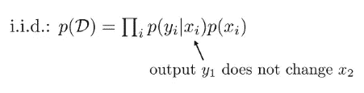

您为第一个数据点输出的标签不会影响您为第二个数据点看到的图像:如果您将第一只豹子误归类为老虎，这并不意味着第二张图片会有任何变化。

然而，在控制问题中，情况并非如此。例如，如果你在一条多风的山路上开车，在某些地方做出错误的选择也许是可以的:

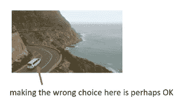

但在其他方面，这可能是一场灾难:

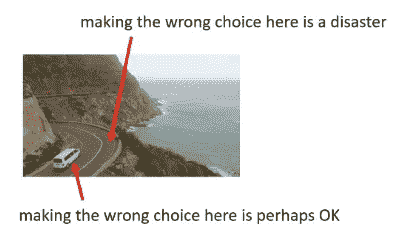

换句话说，你在第一时间步的输出会影响你在第二时间步的输入。这非常重要，因为预测中的 i.i.d .假设允许我们专注于获得整个数据集的最高平均准确度，而*我们控制的非 i.i.d .设置意味着我们必须考虑不同的目标*。

**2。监管可能是高层和抽象的**

另一个我们在解决预测问题时通常做的假设是，我们知道基本事实标签；例如，我们可能得到一张照片，而这张照片被贴上了小狗的标签。另一方面，在控制问题中，我们可能被给予更抽象的目标；例如，我们的学习系统可能被告知开车去杂货店——但该系统不应该仅仅输出句子“开车去杂货店”。**它应该能够为一辆汽车输出转向命令，让它开到杂货店。**

# 术语

让我们从一个图像分类器开始，它接收一个图像并输出一个类。我会逐渐把这个变成控制的模型。

首先，我要给东西重新命名。

*   我不把输入称为 x，而是把它称为“o”，表示“观察”
*   我不把输出称为 y，而是把它称为“a”，表示“动作”
*   我准备把我的模型叫做 *π* θ(a|o)而不是 pθ(y | x)；" *π* "因为这是一个策略，它代表了观察如何映射到行动。此外，我们将在“a”和“o”上加一个下标“t ”,以强调它们发生在特定的时间点

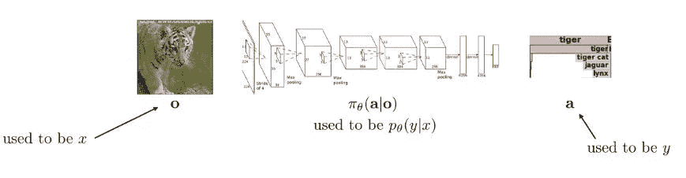

也许当你看到一只老虎时，有一个正确的反应，如果你没有正确的反应，下一次观察将对你不利。此外，您的动作可以是连续的-在这种情况下，您将输出正态分布动作的平均值和方差。

现在，我们将开始引入一些新的东西，来帮助我们围绕这个建立一个数学形式。

*   状态，简称为“s”
*   有时我们的政策将取决于观察，有时它将取决于国家(完全观察)

让我们稍微打开包装。什么是状态，什么是观察？如果你看到一张猎豹追逐瞪羚的图片，那这张图片就包含了像素。你的观察是一幅图画，但是在它的下面有一个状态:一些真实的物理系统，它有描述世界结构的潜在变量。这种区别可能非常重要；例如，如果有一辆汽车行驶在猎豹的前面，而您不再看到猎豹，则观察结果已经改变，因为它不再包含猎豹。但是猎豹的状态还在。

*   一个状态满足马尔可夫性质，这意味着如果你知道 s2，状态 s3 有条件地独立于状态 s1。这是另一种说法，特定时间的状态总结了你需要知道的关于系统的一切，所以，如果你知道当前的状态，知道以前的状态不会帮助你预测未来的状态。
*   观察值不服从马尔可夫性质，这意味着如果我知道当前的观察值，也知道以前的观察值可能有助于我预测未来。

# 1 模仿学习

在其最基本的形式中，它对应于仅仅使用像 CNN 这样的监督学习工具来解决控制问题。我们将讨论非 i.i.d .数据的问题，但假设地面真实监督。

作为一个例子，我们将使用驾驶汽车的任务。因此，你的观察将包括来自汽车摄像头的图像，你的行动将包括你是左转还是右转——我们将考虑一个非常简单的情况，在这种情况下，我们实际上获得了地面实况监督的数据。

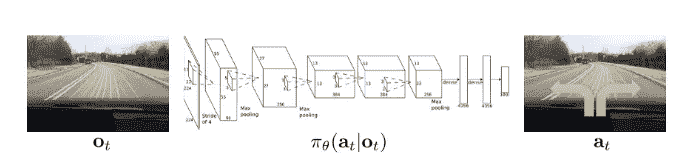

因此，我们假设一个乐于助人的人类驾驶员已经花了大量时间四处驾驶，并收集了一个数据集，该数据集由车辆摄像头的观察结果和他们发出的实际驾驶命令组成。

然后，我们将使用这些训练数据来训练一个 CNN，它读入图像并输出一个动作。这有时被称为行为克隆，想法非常简单。不简单的是理解这种方法何时以及如何实际解决控制问题。

我们可以问的第一件事是:它在理论上行得通吗？理论上，答案是否定的。假设这条黑色曲线代表训练数据中的时间轨迹:

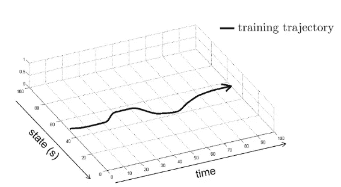

只是为了形象化，你可以想象你的州是 1D，假设你的行为是州内的小位移。基本上，下一个状态就是前一个状态加上动作——在现实中，你当然会有很多轨迹，而不仅仅是一个。

即使是真正好的政策也会犯一些错误。它们可能是非常小的错误，但它会犯错误。当您运行您的策略时，它所采用的轨迹与在训练数据中看到的轨迹略有不同。当它偏离一点点时，在下一个时间步骤中输入到策略中的状态将与它过去看到的状态略有不同，因为它犯了一个错误，它会得到一些非典型的东西。

例子:你在山路上开车，你习惯于保持在左车道。然后，你犯了一个小错误，你稍微转向了错误的车道，所以你看到的和你之前看到的有一点不同，你更有可能犯一个稍微大一点的错误。当这种情况发生时，你看到的下一个状态将与你之前看到的其他状态稍有不同，你将会犯一个稍大的错误……这些错误将会复合；理论上，它们将在你的轨迹长度上平方复合。

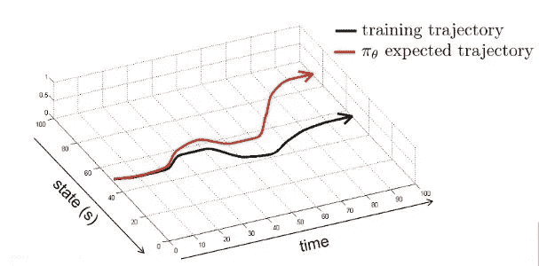

在实践中，如果我们无视理论，行为克隆实际上可以体面地工作。使用模仿学习驾驶汽车，NVIDIA 研究表明，起初它会犯明显的错误，但后来他们收集了更多的数据，汽车会做一些合理的事情。

# 让行为克隆发挥作用

我们可以将这个“复合误差”问题形式化为一个分布转移的问题。我们的策略表示某种分布 *π* θ(a|o)。

由于 o(t+1)依赖于 a(t)，如果 *π* θ(a|o)与专业人类驾驶员的策略不完全相同，那么我们将面临的问题是，受先前动作影响的观测值 p 数据(o(t))的分布将偏离我们实际运行策略时获得的观测值的分布。

这是因为我们在 p 数据(o(t))上训练我们的策略，但是当我们运行它时，我们将开始从 p *π* θ(o(t))获得观察值。我们的行为会影响未来的观察，因此我们对观察的分布是不同的——这是我们新策略的观察分布，而不是生成训练数据的专家的观察分布。

换句话说，问题是 p 数据(o(t))和 p *π* θ(o(t))不一样；这是分布转移的问题，因为输入分布从专家的观察(在训练时)转移到政策本身的观察(在测试时)。出现这个问题是因为 *π* θ(a(t)|o(t))，即使对于训练有素的模型来说，一般来说也不会与给定其观察值的人在动作上的分布相同。这是培训/测试差异；在训练时，网络总是将真实序列作为输入，但在测试时，它将自己的(可能不正确的)预测作为输入。

我们可以从策略中采取预测的行动，并观察下一个观察结果是什么；然后我们就知道观察结果会是什么，我们可以把它反馈给网络。问题是，这需要与世界互动:我们事先不知道采取其他行动会产生什么样的观察结果，你只有一个汽车驾驶和转向命令的视频。

更正式地说，这是因为你不知道转移概率——你不知道给定当前状态下下一个状态的概率，你不知道给定状态下观察的概率，因此你不知道给定前一个观察和动作下一个观察的概率。你可以通过与世界的实际互动来获得样本，但你不知道在计算机中这些概率是多少，因此你不能很容易地模拟你从采取不同行动中得到的观察结果。

有算法试图学习这些概率，它们被称为基于模型的强化学习算法。但对于模仿学习，我们希望保持简单，我们希望能够训练这些 CNN 将图像映射到驾驶命令，而无需学习任何其他组件。

我们能缓解这个问题吗？

如果 *π* θ(a(t)|o(t))非常精确，意味着它与专家的真实动作分布非常相似，则该问题可以得到缓解。所以，如果你的政策非常好，也许分配的变化会很小。在实践中，这有时是可行的，而且当数据集非常大时，效果会更好。我们需要收集大量的数据，我们需要一个非常好的方法来训练我们的政策。怎样才能得到更准确的模型？好吧，为了开始思考我们如何才能得到一个更准确的模型，我们可以问为什么我们可能无法适应专家——错误的一些可能原因是什么？

有两个真正重要的原因:

**1 非马尔可夫行为**

如果我们看到同样的事情两次，我们会做同样的事情两次，不管之前发生了什么。换句话说，你正在学习一个策略 *π* θ(a(t)|o(t))，这隐含地假设动作只取决于当前的观察。当然，这对人类来说是非常不自然的；如果你左转，你可能会继续左转，如果你右转，你可能会继续右转。你不会在每个时间点都做出完全独立的决定。你的大脑不会在每一瞬间都做出独立的前馈决定。代表人类实际行为的更准确的模型是，他们的行为可能取决于迄今为止发生的一切。我们如何训练一个模型，根据从时间步 1 到时间步 t 的所有观察来预测时间步 t 的动作？

这是一个典型的多对一 RNN 架构的例子。本质上，我们需要读取图像的完整历史，因此我们将设计某种带有卷积编码器的递归神经网络。在每一个时间步，我们都有一个具有相同权重的 CNN，它读入图像并产生一些矢量表示。这个向量表示进入一个 LSTM，在最后一个时间步，我们有一个网络，查看最后一个 LSTM 状态，并预测动作。

**2 多模态行为**

假设我们正在控制一架在森林中飞行的无人机，它需要绕着一棵树飞行。绕着树向左飞没问题，绕着树向右飞也没问题，当然直着飞不行。假设我们的行为是连续的，那么我们正在解决一个回归问题——我们正在回归到决定我们左转还是右转的连续值行为上。

*   **低维动作**

如果我们将我们的行为离散化，我们将其转化为离散的分类标签，然后我们使用 softmax 来预测该标签上的分布，softmax 完全有可能捕捉到这样一个事实，即左转有 50%的概率，右转有 50%的概率，而直行的概率为零。但是，如果我们使用像均方误差损失这样的东西来输出连续值到动作，我们可能会有一个问题-因为我们的一半数据将被视为向左，一半数据将被视为向右，所以均方误差损失将平均出差异。

*   **高维动作**

如果你有高维度的操作，那么离散化是非常困难的，因为你需要的离散仓的数量随着操作的维度呈指数增长。对于处理多模态行为，我们有几种选择。我将对这些方式进行高度概括:

*   我们可以输出一个高斯混合的**——有均值和方差的多个值。这可能是最简单的方法，但在许多情况下是最不有效的。其思想是，您将输出 n 个可能的高斯混合元素的平均值、方差和权重，而不是输出具有均方误差的单个值。传统上，高斯混合模型有一组均值、一组方差和一组权重，但它不依赖于任何东西。在这里，高斯混合本身实际上取决于输入图像，因此对于不同的图像，您会得到不同的高斯混合模型。例如，如果你看到你前面有一棵树，你会有一个混合元素写着“向左飞”，另一个写着“向右飞”；但是，如果你没有看到一棵树，两个混合元素可能会说“直走”。我们如何实现这一点？我们实现了它，所以它们都是我们神经网络的输出。**

额外的高斯表示有什么问题？在非常高维的空间中，这并不像离散化一切那样糟糕，但是一般来说，你可能仍然需要指数数量的高斯元素来近似任意复杂的高维分布

*   **潜在变量模型**是获得非常复杂的多模态输出分布的一种更复杂的方法。潜在变量模型的思想是，我们实际上是改变输入，而不是改变网络的输出。你选择绕着树从左往右飞的原因是图像中没有包含的其他信息:也许今天你想向左飞，明天你想向右飞。*你的感受是一种潜在的未被观察到的变量*，因为你不知道训练数据中的那个变量是什么。你可以设计你的神经网络，让它接受当前的图像和一个代表这些未知变量的额外向量；在测试的时候，你可以随机地对那个变量进行采样(在测试的时候，机器人可以解释它自己，只是随机地对它的感觉进行采样)。
    这些潜在变量模型的棘手之处在于计算出训练时的潜在变量应该是什么，因为在训练时你不知道某人是想向左还是向右。有很多方法可以有效地做到这一点，如果你小心处理训练数据，你实际上可以让它使用它
*   **自回归离散化**源于直觉，即离散化你的行动非常有效，如果你能做到的话。问题是，如果你的行为是非常高维的，如果你试图将其离散化，你可能会得到指数级的多个面元；自回归离散化背后的思想是，我们将一次离散化一个维度，而不是离散化整个动作空间。
    如果我们的行动有五个维度，我们将取第一个维度，将其离散化为 n 个区间，并在这 n 个区间上建立一个 softmax。然后，在测试时，我们将从 softmax 中采样，这将为我们提供第一个动作的值，然后我们将该样本输入另一个网络，该网络输出第二维分布。然后，我们从那里取样，等等。我们的令牌对应于动作的每个维度的离散仓。这是一个非常强大的想法，因为它不需要摆弄潜在变量，它仍然可以表示非常复杂的分布。

# 我们能让它更频繁地工作吗？

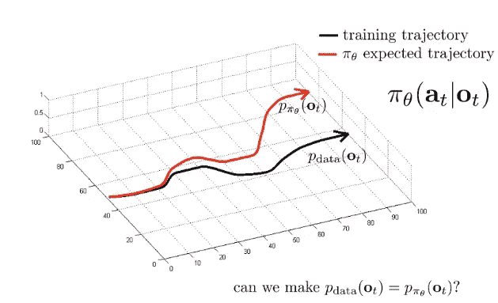

我前面说过，如果你的政策是完美的，那么 p data(o(t))和 p *π* θ(o(t))会相等，但那是极不可能发生的。那么，我们能有一个即使你的政策不完美也能保证获得好结果的算法吗？

关键思想是，如果你不能修复策略，就修复数据。与其在 p *π* θ(o(t))上耍小聪明，不如在 p data(o(t))上耍小聪明——值得一提的是，只有当你确实对如何收集数据有所影响时，才能做到这一点。

**DAgger:数据集聚合**

DAgger 本质上是一种用于模仿学习的迭代算法，它以一种非常特殊的方式收集数据，并避免分布偏移问题。

具体来说，您希望从 p *π* θ(o(t))中收集训练数据，而不是 p 数据(o(t))。怎么会？三个步骤:

1.拿一个人类给你的数据集，它包括人类的观察和行为，并用它来训练你的初始策略。该策略易受分布变化影响，因为训练集来自 p 数据(o(t)):

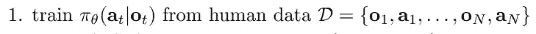

2.运行您的策略，这会产生一些观察结果；其中一些观察结果可能相当糟糕:

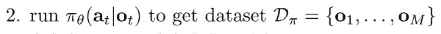

3.我们会让一个人坐下来，给每一个观察结果贴上标签，让他们给出在那些情况下他们会采取的驾驶指令

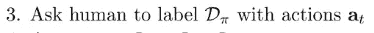

4.我们连接数据集 D 到 D *π。*这为我们提供了一个新的数据集，它更接近我们新策略的观察分布

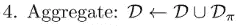

5.我们重复这个过程

直觉告诉我们，如果将这两个数据集充分结合，最终数据集将由来自 p *π* θ(o(t))的数据支配。

匕首有什么问题？通常，如果运行您的系统真的不安全，第二步可能会有问题；第三步可能是一个问题，因为当系统不对他们做出反应时，人类不太擅长做出决定——当你驾驶汽车时，这是一种非常不自然的收集数据的方式，但汽车没有对你做出反应。

# 模仿学习综述

原则上，由于分布的变化，行为克隆不应该起作用。原则上，DAgger 可以解决这个问题，但它需要昂贵的数据收集和标记。

也就是说，有时候行为克隆无论如何都很有效。它需要一点启发性的技巧和非常好的高精度模型

[强化学习](https://www.youtube.com/watch?v=_AYvYUrDohw&list=PL_iWQOsE6TfVmKkQHucjPAoRtIJYt8a5A&index=45)

到目前为止，我们谈论了一个简化的设置，其中我们有地面真相监督；在这一部分，我们不会有这样的假设:我们将解决高层次目标的问题。我们如何指定我们想要什么？

作为题外话，我们将坚持状态而不是观察。一个方便的假设是，无论你输入到你的网络中的是什么，都足以完全推断出状态，这意味着它服从马尔可夫性质。

如果你没有一个人类专家提供的这些地面真相状态-动作元组，你怎么知道哪些动作更好或者更差？

我们可以做的一件事是定义一个奖励函数，这是一个关于状态和动作的标量函数，它给每个状态或每个状态动作打分。直觉上，分数告诉你那种状态有多可取。但重要的是要注意，你的目标不是简单地贪婪地采取会给你最高回报的行动，而是在一系列决策过程中最大化回报。

一个好的强化学习系统可能会为了以后更有回报而做出现在回报较少的决定。例如，在前面关于模仿学习的部分，我们讨论了贪婪地试图预测正确行动的算法(但如果你的监督较弱，那么你需要思考你的行动对未来回报的影响，这些算法就会变得低效)。

**一些定义**

为了充分说明强化学习问题，我们必须定义的第一件事是马尔可夫决策过程(MDP)，这是一种将马尔可夫链扩展到你可以选择行动和想要最大化奖励的设置中的方法。您可以用四个基本要素来指定 MDP:

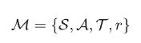

*   各州**。**一个重要的警告是，状态需要是马尔可夫的:当前图像必须足以应对未来发生的一切，而过去的图像不应该有助于这一点。
*   行动。状态和动作一起定义了一个受控的马尔可夫过程，这是一个带有动作的马尔可夫链。下一个状态的概率取决于当前状态和动作。

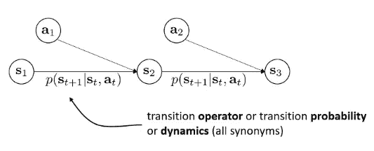

*   转移概率。转换运算符定义了这些概率。
*   奖励。奖励函数将状态-动作元组映射到标量值奖励

另一个重要的概念是部分观察的马尔可夫决策过程，它将观察值引入到组合中:

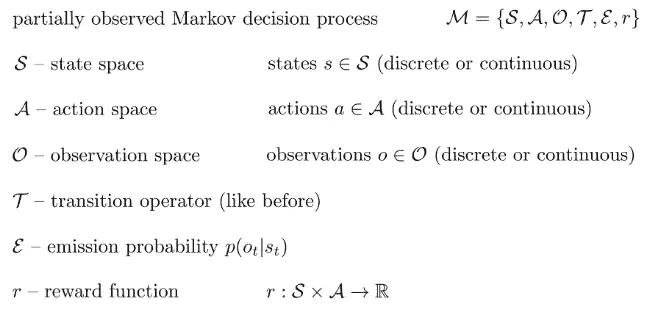

## 强化学习的目标

我们有我们的策略 *π* θ(a|s ),它有我们称之为θ的参数。状态作为策略输入给出，动作作为输出产生；然后，世界根据未知的转移概率产生下一个状态，下一个状态仅取决于当前状态和策略选择的动作。这将成为策略的新状态。

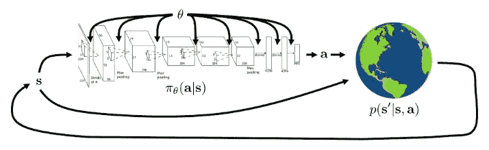

顺序决策过程导致状态和动作序列的分布。看到“状态 1，动作 1，状态 2，动作 2，…，状态 T，动作 T”的概率可以看作是三项的乘积:

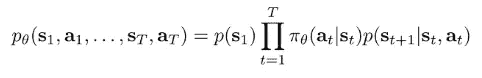

第一项:(1)一个初态概率分布，由世界决定(2)*π*θ(at | ST)(3)p(ST+1 | ST，at)。

这个公式是从概率的链式法则得到的，然后应用独立性的性质。我们可以这样写初始状态概率分布:

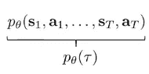

我们可以这样定义强化学习的目标:

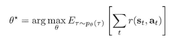

**最优参数θ是在 pθ(τ)下最大化期望的参数，该期望是在该时间步的状态和动作处评估的所有时间步的报酬之和。**

稍微解释一下这个陈述，由 MDP 定义的初始状态分布和转移概率，连同由参数定义的策略，在状态和动作的完整序列上引起联合分布。强化学习的目标是在这种分布下最大化总回报的期望值

## 1 政策梯度

我们如何评估目标？

你不能列举所有可能的轨迹并对它们求和，因为可能轨迹的数量在时间范围内呈指数增长。

但是，您可以通过生成样本来构造无偏估计量:

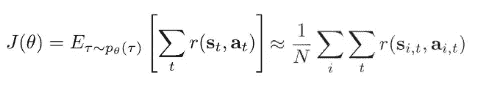

你可以把它近似为样本平均值。我们将运行该策略 n 次，以从 pθ(τ)生成 n 个样本轨迹；我们将对每条轨迹上的回报进行求和，然后对这些轨迹进行平均。这是期望值的无偏估计量。

这总是正确的:如果你有某个分布下某个函数的期望值，你可以从该分布中抽样，然后对这些样本的函数值进行平均，这就是期望值的无偏估计量。

我们将要学习的第一个强化学习算法，即策略梯度，背后的思想是，我们可以使用相同的样本估计量，经过一些修改，来计算这个期望值的导数。如果我们计算导数，那么我们可以使用我们最喜欢的基于梯度的优化算法来最大化预期回报。这将是政策的梯度下降，尽管现在因为我们最大化目标，它实际上是梯度上升。

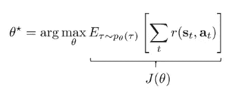

现在，我们将通过一个巧妙的数学技巧来计算期望值相对于分布的梯度，我们正在计算期望值。

我将用 r(τ)来表示奖励的总和。您可以将期望值写成一个积分(或者一个和，如果您有离散的状态和动作):

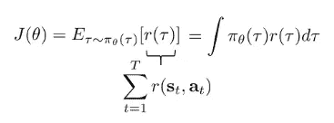

现在我来计算这个东西相对于θ的梯度。梯度算子是线性算子，所以它实际上与积分符号互换。换句话说，积分的梯度就是梯度的积分:

我们来看一个方便的身份。如果您有:

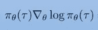

您可以应用对数导数的标准公式，这就变成了:

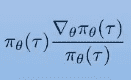

因为如果你对 f(x)对 x 的对数求导，那就是 1/f(x)乘以 df / dx。这给了我们:

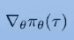

我们将反过来应用这个恒等式:

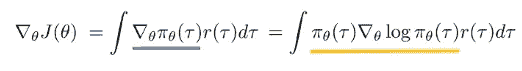

我们这样做的原因是，现在我们有了一些量乘以 pθ(τ)的积分，这是 pθ(τ)下的期望值。计算期望值比计算任意积分更容易:

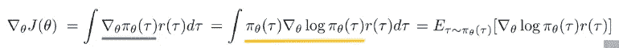

然而，我们仍然不知道如何计算∇θ对数 *π* θ(τ)

为了做到这一点，我们要取 *π* θ(τ)的对数，这就是我们得到的结果:

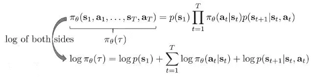

当你对一个乘积取对数时，你会得到对数的和。现在，我们要对θ求导，但是记住，当你对一个和求导的时候，就等于对一个和求导:

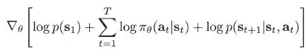

重要的是，该和中唯一依赖于θ的项是 log *π* θ，而初始状态概率和转移概率不依赖于θ。

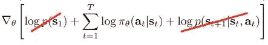

而这一点很重要，因为我们知道 *π* θ(at | st)，但不知道其他项，这些项是由宇宙决定的。这意味着我们可以将政策梯度的公式简化成我们可以计算的东西。这个:

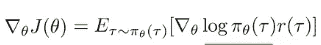

变成了这样:

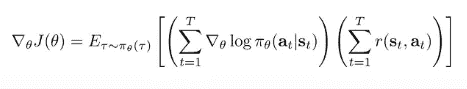

如果你想评估政策梯度，你所要做的就是从 *π* θ(τ)中生成一些样本，你只需要在世界上运行你的政策就可以得到这些样本。对于每一个样本，计算:

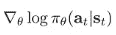

并且:

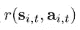

…在每个时间步，将它们相乘。

一旦你计算出这个梯度，你只需要做梯度上升

这是一个经典的算法，叫做加强，由三个基本步骤组成:

1 通过运行策略生成样本

2 总结所有样本的回报(估计回报)

3 通过应用梯度来改进政策

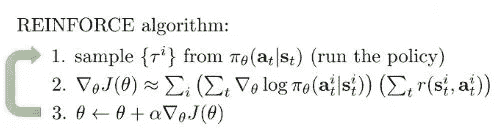

让我们更深入地解释一下这个方法。这是什么？

为什么这个算法会增加我们的预期回报，背后的直觉是什么？政策梯度法确实有一个相当自然的解释。

政策梯度以正回报增加沿着轨迹行动的概率，以负回报减少沿着轨迹行动的概率。

如果你运行你的政策，你的一些轨迹真的很好，并有巨大的回报，而你的一些轨迹真的很差，并有非常负的回报，政策梯度将试图使前一类行动的概率更大，后一类行动的概率更小。好东西变得更有可能，坏东西变得不太可能。这本质上是试错学习的数学形式化

策略梯度是为数不多的强化学习算法之一，它不关心您是具有部分可观察性还是完全可观察性，这意味着如果您有部分可观察的问题，您可以将这些观察结果插入到您的策略中，而无需对算法进行任何更改

**让政策梯度真正发挥作用**

到目前为止，我们讨论的政策梯度方法在数学上非常简单，非常优雅，但是如果你试图完全按照我描述的方式实现它，它可能不会工作。

我们要做的第一件事是，稍微改进一下政策梯度估计器。到目前为止，我们讨论的估计器的问题是，它没有利用任何关于问题的时间结构的知识；我们取所有行动的对数概率的梯度之和，然后乘以所有回报的总和。但这并不能说明未来的行为不能影响过去的回报。这个梯度公式并不专门适用于顺序决策。

直觉告诉我们，我们要避免用过去的奖励来增加未来的行动。你可以认为这种方法利用了一个显而易见的因果关系概念，即过去导致未来，但未来不能导致过去:

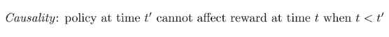

如果我们在∇θ log *π* 上分配奖励的总和，我们得到这个等式:

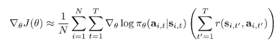

这使得为什么这个估计器没有利用因果关系变得更加明显:在时间 t 的一个行为的概率梯度乘以一个包括过去回报的和，但是改变在时间 t 的行为的概率永远不会改变过去的回报。我们能做的是，我们可以避免对过去的那些奖励求和，并将内部求和从 t 改为大写 t——我们不包括过去的所有奖励。这样，我们还可以得到一个方差较小的估计量，这意味着如果您生成许多不同的样本组，并使用这些不同的组来估计梯度，您的估计值将会更加接近:

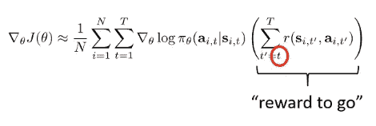

**基线**

在政策梯度本质上将试错学习形式化之前，我们就有这种直觉；然而，这并不一定会发生。

想象一下，所有的奖励都是大正数。现在，所有动作的权重实际上都是很大的正数，这意味着所有的轨迹都变得更有可能。**如果轨迹比平均水平好，我们希望让它们更有可能，如果轨迹比平均水平差，我们希望让它们更不可能。**

直觉上，我们想获得奖励，并从中减去平均奖励:

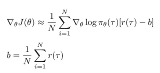

这个估计量仍然是正确的，而且要好得多。证据是 b 的期望值为零。事实上，这是统计学中的一个常见技巧:如果你有一些基于样本的估计量，你可以减去期望值为零的东西，那么当你从样本估计量中减去它时，你会得到不同样本组之间的较小方差。

为了证明这一点，我们必须证明∇θ对数 *π* 乘以 b 的期望值为零。这意味着你可以减去任何你想要的 b，τ乘以 b，而不改变期望值:

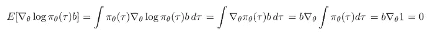

总之，有两种方法可以改善政策梯度:(1)使用因果关系，仅从当前时间点直到结束时对奖励求和(2)使用基线减去平均奖励

**政策梯度的一些考虑**

策略梯度是一种基于策略的强化学习算法。这意味着每次修改策略参数时，都必须通过在现实世界中实际运行策略来收集额外的样本。

请记住，您的梯度是在 *π* θ(τ)下的期望值，这意味着每次您需要计算梯度时，您都需要从 *π* θ(τ)获得一个样本。在强化学习算法的每一步，你都必须生成新的样本并丢弃旧的样本。**这是一个问题，因为神经网络在每个梯度步骤中只会发生一点点变化**，而你通常需要采取大量的梯度步骤进行训练——就样本数量而言，基于策略的学习可能效率极低，因为你每次采取梯度步骤时都需要与世界进行交互。

有办法减轻这种情况。如果您想要估计政策梯度，但是没有来自 *π* θ(τ)的样本，而是有来自其他一些政策(如 *π* bar (τ))的样本，该怎么办？

您可以使用重要性抽样，这是一种在给定来自不同分布的样本的情况下，估计某个分布下某个函数的期望值的方法。

分布 p(x)下 f(x)的期望值等于:

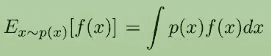

这等于:

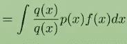

并且:

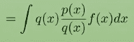

这是以下预期值:

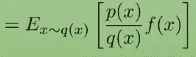

这意味着，如果你有来自 q(x)的样本，并且你想在 p(x)下估计一个期望值，你只需要将你的样本乘以 p(x)除以 q(x)，这就是所谓的重要性权重。之所以称之为重要性权重，是因为更有可能在 p(x)下而不太可能在 q(x)下的样本被认为更重要，应用这种校正可以得到期望的分布。

我们可以应用这个精确的想法，仅使用来自 *π* 棒线(τ)的样本来估计 *π* θ(τ)下的期望:

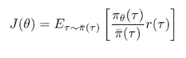

该重要性权重中的概率由该乘积比给出:

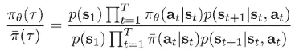

大多数术语出现在分数的顶部和底部，这意味着它们相互抵消:

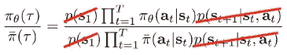

同样，我们可以完全用行动概率来表达我们的重要性权重，这是我们唯一知道的，这一点非常重要。我们的重要性权重就是新政策下行动概率的乘积除以旧政策下的乘积的比值:

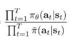

**利用重要性抽样导出政策梯度**

如果你有来自 *π* θ(τ)的样本，并且你想估计一些新参数θ’的 J(θ’)，这是在 *π* θ(τ)下的期望值:

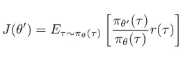

如果你想计算它的梯度，你可以应用前面的公式:

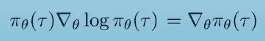

为了得到这个等式:

这是我们之前的政策梯度，但每个样本都用*π*θ’(τ)除以 *π* θ(τ)进行加权，而期望值是在旧政策下由θ得出的。

不幸的是，这是一个非常糟糕的估计:

您可以像之前一样应用因果关系，将该乘积分成两半:t 之前所有时间步长的乘积和 t 之后所有时间步长的乘积。由于未来行动不会影响当前权重，您可以删除未来奖励的重要性权重。这是不相等的，但事实证明这是一个运行良好的梯度:

去掉那些额外的重要性权重，就不必将这么多数字相乘，这是一件非常好的事情；不幸的是，从第一步到第二步，你都无法摆脱重要性权重，这实际上是一个大问题，因为你在乘以 t 个概率，这意味着这些重要性权重很快就会变为零或无穷大。

这里是我们可以做些什么来缓解这种情况。我们可以把目标写得稍有不同:我们可以把常规的政策梯度写成对轨迹的期望，而不是把它写成对国家行动边际的期望:

基本上，你可以在每个时间步采样状态和动作，只要它们是从轨迹分布的边缘采样的，那就是一个正确的估计量。然后你可以计算这些边际的重要性权重:

然后你可以分解成一个状态依赖项( *π* θ(s))和一个动作依赖项( *π* θ(a|s))。这个“s”项是个问题，因为你可以访问 a|s，但不能访问π(s)。你能做的就是忽略这部分:

这不再是无偏的，但如果θ和θ'非常接近，那么这样做的误差是有界的。你的政策梯度只会有一点点错。这就产生了一个我们可以使用的实用算法。

我们生成一些样本，然后根据重要性权重对这些样本进行加权，但我们不会优化太多。如果我们走得太远，那么我们的梯度就会变得不正确

**关于实践中政策梯度的几点意见**

*   梯度具有很高的方差:如果您想要使用样本来估计策略比率，您通常需要比在正常的监督学习任务中使用的样本更多的样本
*   考虑使用更大的批量
*   调整学习率变得更加困难，ADAM 等自适应步长规则对于策略梯度变得更加重要

**正渐变实际上是用来做什么的？**

*   显然，您可以使用策略梯度来学习策略，并通过强化学习来进行控制
*   您可以在一系列需要通过不可微运算计算导数的设置中使用策略梯度
*   您还可以使用强化或策略梯度来区分离散潜在变量模型，这些模型具有离散而非连续的随机变量。你不能计算一个离散变量的导数，但是你可以让这个变量变得随机，然后计算它的分布参数的导数

## 2 演员-评论家算法

你可以做很多事情来估算奖励，这比在 REINFORCE 中更有效，这导致了一类更强大的算法:

q .如果你在状态 s(t)采取行动 a(t ),对预期回报的估计是多少，这个估计越好，你的政策梯度就越精确。

在常规的强化算法中，这个估计值是通过将你从时间步长 t 到结束时获得的实际奖励相加而获得的，但是这些奖励只存在于一个可能的轨迹上，你可以在该时间步长之后跟随该轨迹。

事实上，如果你再次发现自己处于同样的状态，并采取同样的行动，你可能会得到不同的结果，因为随后发生的一切都是随机的。简单地将你得到的回报相加并不是你能得到的最好的估计，因为当你这样做的时候，还有许多其他可能的未来你没有考虑到:

从数学上来说，奖励的总和是一个单一的样本估计量:你是在用一个单一的样本估计所有可能结果的某个积分。你真正想要的是从现在到最后你会看到的回报的期望值，但是当然精确地计算这些期望值是不可能的:

实际上，我们应该这样写，说明这取决于政策:

例如，如果你采取了一些行动，然后你只是因为运气好而获得了很高的奖励，那么你很可能仅仅通过重复这个行动就不会再赢了。然而，如果你有一个更好的回报估计，你可能会发现这个行动的期望值并不高。

然后，我们可以用这个更准确的预期奖励来代替 q hat，得到一个比简单地将实际获得的奖励相加更好的政策梯度估计值:

在这里，您的基线将取决于状态:我们可以使用状态值函数作为基线，其中某个策略的状态 s 的状态值函数是该状态的预期回报，假设您继续遵循该策略:

现在公式变成了:

差值 Q-V 代表优势。action-advantage 函数告诉我们在状态 s 采取动作 a 和选择策略的默认动作之间的区别。换句话说，它描述了状态 s 中的动作 a 比一般的动作好多少。你对优势估计得越好，你对政策梯度的估计就越准确。你不知道优势值到底是多少，但你可以用许多不同的方法来估算它们，其中许多方法比简单地将你在单个样本中看到的回报相加要好得多。

概括一下:

*   假设你继续遵循这个政策，那么一个政策的状态 s 的状态值函数就是从那个状态得到回报的期望值。
*   **一项政策的行动价值函数**是假设你在状态 s 采取行动 a 并继续遵循该政策，它的预期回报。
*   **行动优势函数**告诉我们在状态 s 采取行动 a 和选择策略的默认行动之间的区别。

我们看到的旧政策梯度是单样本估计，其中 q 由奖励总和给出，v 仅由单个标量值给出，这当然不是很好的估计。这是一个无偏的估计，但它有很高的方差——这意味着你需要大量的样本来从中获得准确的估计。

在我们的新估算器中，我们将有两个网络:一个策略网络和一个价值函数网络，我们将使用它们来估算这些优势，这将为我们提供所谓的**演员评论算法。**

我们有三个不同的对象:q，v 和 a。它们都相互关联，我们最终想要的是 a。但如果我们要拟合一个单独的神经网络，我们将询问我们将拟合什么，以及我们将拟合什么。理想情况下，价值函数只取决于状态而不取决于动作，因此应该更容易拟合，因为它的输入更少。

Q 函数可以写成当前报酬加上对未来报酬的期望:

对未来报酬的期望正好是价值函数，所以你可以把你的 Q 函数写成当前报酬(因为它们不是随机变量)加上价值函数在 t + 1 时刻的期望值。因此，我们可以这样写:

这意味着，你可以用实际状态 s(t+1)加上下一个时间步的值函数，形成一个很好的 Q 函数的近似值。这是对 s(t+1)的单样本估计，但不是对剩余轨迹的单样本估计，因为你还在用价值函数。所以如果你想写出优势，你只要这样做:

您可以用价值函数来表示优势和 q 值，因此经典的 actor critic 算法通常适合价值函数，尽管也可能有适合 q 函数的算法。

我们将有另一个神经网络，它将状态作为输入，并输出对值的估计，因此它接受一个状态并输出一个标量值。我们将使用这个网络来计算优势，然后我们将它插入到策略梯度中:

拟合价值函数有时也称为策略评估，因为当您拟合价值函数时，您并没有试图使策略变得更好。你只是想知道它有多好。

**政策评估**

强化学习目标就是从初始状态开始的总报酬的期望值，也等于初始步上价值函数的期望值。所以，如果你能计算价值函数，你也能评估强化学习目标的价值。

**我们如何进行政策评估？**

蒙特卡洛政策评估:这基本上就是政策梯度所做的。当您从您的策略生成样本时，运行它们，看看您得到的总回报是什么:

在这种情况下，您会希望特定状态下的值大约等于从该状态开始直到结束的奖励总和。如果你有多个样本，你可以沿着多个样本对奖励进行采样:

但是通常你不能这样做，因为你不能传送到你以前在另一个轨道上看到的状态，然后再从那里滚出来。如果你想要一个多样本估计器，你必须使用一个模拟器，你可以重置到一个任意的状态

**我们可以用神经网络函数近似进行蒙特卡罗评估，但是是单样本估计吗？**

你的神经网络将接收 s，并输出一个标量值，代表你对价值函数的估计:

您将通过沿着通过采样生成的轨迹获取您看到的所有状态来生成标签，并且对于每个状态，您将合计从该时间步直到结束的奖励，并将这些作为您的标签。但是请记住，您可能有多个状态接近的轨迹，因此即使您使用的是单个样本估计器，学习一个值函数仍然是一个好主意，因为您的值函数可能会将相似的值分配给不完全相同的邻近样本。

如果两个相邻的州具有不同的标注，但它们非常接近，则值函数可能会对它们的值进行平均:

虽然没有每个州都有多个样本那么好，但还是相当不错的。

形式上，你生成你的样本轨迹:

然后，对于你看到的每一个状态，你用从那个时间步直到结束的总回报来标记那个状态。然后，您只需根据均方误差损失使用梯度下降来训练您的模型:

这将获得比直接将这些奖励的总和代入政策梯度更好的价值函数估计，因为代表你的价值函数的神经网络将对附近各州的值进行平均，这将减少那些幸运或不幸结果的影响

概括地说，在 MC 评估中，您采用单个样本总和，而理想目标是完整的期望值:

这些完整的期望值可以写成现在的奖励加上从下一个状态到该步骤预期奖励结束的总和。请记住，我们的价值函数直接试图估计预期回报，因此，如果我们知道 v *π* ，我们就可以通过当前回报加上下一个价值来计算更好的目标。

**自举**

我们不知道 vπ，但我们可以自举:我们可以通过当前的价值函数在下一个时间步逼近 vπ，本质上，价值函数会自我学习:

现在，我们的训练数据将通过滚动出一些轨迹来获得，取我们看到的每个状态，然后用该时间步的回报加上下一个时间步的价值函数进行标记。价值函数就是我们对以前的数据进行拟合的以前的价值函数:

我们用监督回归来拟合:

它可能更难训练和设置，但如果实施得当，它最终会比 MC 评估好得多。

**演员-评论家算法**

现在，我们已经讨论了如何估计价值函数，我们可以推导出一个完整的行动者-批评家算法，该算法实际上使用这些价值函数来改善政策梯度。

术语行动者-批评家指的是我们有两个神经网络的事实:政策**是行动者，即行动者，而价值函数**是批评家，即批评政策并试图估计其价值的人。****

batch actor-critic 算法的结构与 REINFORCE 的结构非常相似，只是我们要训练这些价值函数。

1 我们通过运行策略
对轨迹进行采样 2 我们将价值函数与我们的样本回报总和进行拟合(自举效果更好)
3 我们评估我们看到的每个状态-动作元组的优势
4 我们通过将∇θ对数 *π* 与优势相乘来估计我们的梯度

顺便说一句，到目前为止，我对引导程序的解释存在一个问题，因为每次更新值函数时，您都要使用以前的值函数，并在其中添加一些内容。所以，如果你的奖励总是正的，你的目标值将会越来越大，因为你总是在增加东西，而不是减少。

如果你的剧集长度是无穷大呢？你的价值函数可能变得无限大。我们处理这个问题的方法是稍微修改这个目标值:

我们不是取奖励并加上价值函数，而是取奖励并加上乘以一个小常数γ的价值函数。伽马将会是一个接近 0.9 或者 0.99 的数字，本质上是把未来的回报打了一点折扣。

这个折现系数是什么意思？因为在无限时间范围的任务中，时间步长的无限序列的可能性，我们需要一种方法来贴现奖励随时间的价值；也就是说，我们需要一种方法来告诉代理人，获得+1 越早越好。我们得到的回报越往后，它在当下就越不值钱。通常使用贴现因子的另一个重要原因是为了减少收益估计的方差。鉴于未来是不确定的，并且我们对未来看得越远，我们积累的随机性就越多，我们的价值估计的方差就越大，折扣因子有助于降低未来回报对我们的价值函数估计的影响程度，这稳定了大多数代理的学习。

这是演员-评论家算法，有折扣:

我们也可以写出一个完全在线版的演员评论家。有了这些自举值估计，我们只需要知道轨迹中的下一个状态，而不是所有其余的状态。这意味着我们可以更新评论家和演员的每一步，而不是等待收集一批轨迹:

# 基于价值的 RL

现在，让我们基于价值函数和 Q 函数的想法来开发完全不需要参与者的算法:我们可以完全忽略策略梯度，完全使用价值函数来进行强化学习吗？

请记住:

*   优势函数告诉我们，根据策略，一个动作 a 比平均动作好多少。
*   如果我们随后遵循该策略，则该行动的最大优势参数是该状态下的最佳行动。这意味着您可以安全地采取这个 arg max 操作，它不会比当前策略中的操作更差，事实上，它很可能会更好。

那么，为什么还要考虑政策梯度呢？为什么不通过取优势的 arg max 来选择动作呢？

我们将根据优势函数隐式地定义一个策略；我们将它定义为动作的分布，如果它是前一个策略的优势的 arg max，则为动作分配概率 1，否则为 0:

不管之前的策略是什么，你都会得到比前一个策略更好的操作，这意味着你甚至不再需要神经网络来表示策略。

我们仍然要生成样本，我们仍然要拟合我们的值函数，但是我们不是通过采取策略梯度步骤来改进策略，而是通过用这个贪婪的 arg max 替换我们的策略来简单地改进策略。这是一种叫做策略迭代的算法的基础。

## 策略迭代

高层次的想法是，评估当前策略的优势函数，然后将新策略设置为 arg max 策略。然后你重复。

最大的问题是:你如何评价优势？我们可以使用与之前讨论的演员评论家完全相同的方法:

让我们评估价值函数。为了做到这一点，我们首先来看一个特例，在我们知道转移概率的情况下，我们如何拟合价值函数。然后，我们再回到无模型的情况。

**动态编程**

首先，让我们假设你知道在某个状态下采取某个动作，转移到下一个状态的概率。s 和 a 都很小，而且是离散的，这意味着你可以对所有可能的动作中所有可能的状态求和。一般来说，你不能这样做，但这确实有助于在你可以的情况下导出优雅的算法，然后将它们推广到你不能的情况。你可以想象你的状态代表这个网格中的细胞:

每个状态有四个可能的动作:向上、向下、向右、向左。在这种情况下，您可以将完整的值函数存储在一个表中；你的转移概率是一个 16(下一个状态)乘 16(前一个状态)乘 4(动作)的张量。您可以将价值函数的更新表示为策略中的行动的期望值，即奖励加 gamma 乘以下一时间步的期望值:

因为我们的策略将是 arg max 策略，所以我们可以将这个 arg max 代入上面的等式:

这是一个期望值，但只有一个动作的概率为 1。

第一步:政策评估；它包括重复应用这个备份，直到你的价值函数收敛

步骤 2:将新策略设置为 arg max 策略并重复。

有一个更简单的动态编程过程，我们可以利用这个事实，即策略不只是任何确定性策略，它是 argmax 策略。首先，我们注意到优势是:

因为 value-function 的当前值不依赖于动作，所以它不会改变 arg max。这意味着优势函数的 arg max 等于 Q 函数的 arg max，即:

你可以把表格中的 Q 想象成一个表，每个可能的状态和每个可能的动作都有不同的数字；arg max 在该表的每一行中挑选具有最大 Q 值的条目:

而 arg max 给了你策略。但是 Q 值本身给了你这些值。所以你可以只取最大值而不取参数最大值。您可以直接从 Q 函数中获取它的值，而不是构造 arg max 策略。这是经典的值迭代算法，计算 Q 值作为奖励加上下一个值，然后将这些值更新为 Q 函数表中该行该列所有条目的最大值:

现在让我们回到神经网络领域，用神经网络代替表格。价值函数怎么表示？我们不能再使用表了，因为随着你的任务变得更高维，存储所有状态的所有值变得完全不切实际。所以你需要一个将状态映射到值的神经网络。

## 拟合值迭代

我们可以使用与值迭代中相同的思想，在值迭代中，我们计算这些 Q 值，而不是简单地将所有状态的值都设置为 Q 值，我们将进行相同的均方误差回归:

我们将使用 Q(s，a)在 a 上的最大值作为目标值，并使用均方误差回归对其进行回归

然而，在不知道转移概率的情况下，没有办法精确地评估这个最大值。

但是我们不需要在第一步中取最大值，因为我们只需要计算 Q 值目标(以动作为条件，所以我们不需要选择动作):

这甚至适用于不符合政策的样本；你实际上不需要来自最新政策的样本来做到这一点，不像演员-评论家，因为 q 函数是有条件的行动，你只有一个网络，所以没有复杂的政策梯度。你所做的只是估计 q 函数。

不幸的是，这种算法失去了一些收敛保证；从理论上讲，当你使用函数逼近时，这比政策梯度少了很多原则，而在实践中，这意味着我们必须更加努力地调整算法，使其实际上工作良好

这是完全拟合的 Q 迭代算法:

第一步是使用一些策略收集状态、动作、下一个状态和奖励的数据集；实际上，您可能会进行推广，并且您必须选择每次收集多少样本

第二步是计算这些样本的目标值，方法是在下一个状态和下一个动作上计算 Qφ的下一个动作的奖励加 gamma 乘以最大值

第三步是通过实际拟合这些目标值来解决均方误差回归问题，您所拟合的是一个神经网络，它接受一个状态和一个动作，并输出一个具有一些参数φ的实值 Q 值；您必须选择拟合时要采取的梯度步骤的数量，并且您必须选择在收集更多数据之前更新目标值和重新拟合的次数。

这可以作为我们可以在实践中实际使用的实用深度 Q 学习算法的起点；我们还没到那一步，但这是基本的脚手架

## q 学习

这是我们之前看到的完全拟合的 Q 迭代算法。我们可以把它推广到一个在线 Q-learning 方法，它将采取一个单一的行动并观察一个转变；它将计算单个转变的目标值，然后它将采取一个梯度步骤来最小化估计的 q 值和目标值 y 之间的误差

1.  我们如何选择行动？

这个算法是脱离策略的，这意味着您不必为了让它正常工作而选择带有 arg max 策略的操作，因此您有许多选择。你要做的是选择能进行有效探索的行动。使用 arg max 策略选择您的操作将是一个问题，因为如果您的初始 Q 函数非常糟糕，它可能会错误地将高概率分配给一些真正糟糕的操作，从而将您引入死胡同。如果你总是选择这种行为，你可能永远看不到环境的其他部分。这意味着您希望确保其他不是您当前认为最佳的行动具有某种非零的被选中概率。

一个非常常见的策略是所谓的ε贪婪探索策略:你选择一个称为ε的小数字，这是你随机探索的概率，然后用概率 1 减去ε你选择 arg max 动作。

另一个策略是使用玻尔兹曼探索。

这里的想法是 epsilon-greedy 有点天真，因为除了 arg max 之外，它没有真正区分不同的操作。可能会有一些你确信是非常糟糕的行为，你不想采取。玻尔兹曼探索将不同行为的概率与它们的 Q 值的指数成比例，这意味着非常好的行为被选中的概率大约相等，而你知道非常坏的行为被选中的概率非常低。

**2。相关样本**

如果你在运行在线 Q-learning，你在下一个时间步看到的状态将与你在上一个时间步看到的状态相似。因此，即使步骤 3 看起来像是在进行随机梯度下降，但它不是正确的 SGD——它要求您从缓冲区中对数据点 i.i.d .进行采样。减轻这种情况的一种方法是使用重放缓冲区。

这个想法是做一些更类似于完全拟合 Q 迭代的事情，但是仍然保留了在线方法的味道。请记住，在完全拟合的 Q 迭代中，我们将使用一些策略收集一个数据集，然后在该数据集上进行多次训练。在某种意义上，在线 Q 学习是这种完全拟合 Q 迭代算法的一个特例，其中 k = 1(我们不在目标和回归之间交替，在步骤三中只有一个梯度步骤)。我们可以修改完全拟合的 Q 迭代算法来从缓冲区加载数据。我们边走边存储数据，当需要更新时，我们不更新最新的转换:我们从目前为止看到的所有转换中加载一批转换。

1 从包含目前看到的所有转换的缓冲区中对一批转换进行采样

2 更新小批量的 Q 函数——现在，这看起来更像小批量梯度下降，您的样品不再相关

3 重复

数据从哪里来？您需要定期向重放缓冲区提供数据；当你收集数据时，你不断地把它添加到缓冲区，如果你的缓冲区变得太大，那么你就扔掉最老的数据，这被证明是一个非常好的策略。

**3。q-学习不是梯度下降**

在步骤 3 中，我们采取随机梯度下降步骤，但不幸的是，Q-learning 不是梯度下降。目标值 y 本身取决于 Q 函数，但是当我们计算梯度第三步时，我们忽略这一点，并将其视为常数。出于这个原因，Q-learning 不是常规的梯度下降，这意味着它不太容易很好地工作

我们可以让我们的在线算法看起来更像完全拟合的 Q 迭代，我们可以这样做的方法是基本上减慢我们的目标。我们使用目标网络来实现它；我们使用某种策略收集数据集，将其添加到我们的缓冲区，从该缓冲区对一批数据进行采样，然后当我们对该批数据进行梯度下降步骤时，我们不使用相同的 qφ来计算我们的目标值，而是使用一个 qφ’,其参数是通过更少复制 qφ参数的参数来获得的。所以你可以把 qφ'看成是 qφ的旧拷贝。这意味着目标很少改变:

这给了我们经典的 DQN 算法:

在我们得到一个完整的深度 Q 学习方法之前，我们必须讨论如何实际表示 Q 函数，这里有几个选择

1.将其表示为一个神经网络，该网络将状态和动作作为输入，并输出标量值 q 值。这在连续动作中更常见

2.拥有一个网络，它将一个状态作为输入，并为每一个可能的动作输出一个单独的数字；这对于离散动作来说非常方便，因为取最大值非常方便

**回到影评人**

到目前为止，我所描述的在线 Q-迭代算法对于连续动作的使用可能非常不方便，因为最大值需要连续的优化；对于离散动作来说，这很好，因为最大值很容易计算。

如果你有连续的动作，在实践中使用行动者-批评家会方便得多，但是如果你想保留 Q 学习的非策略性质并仍然使用行动者-批评家，你可以用 Q 函数来做行动者-批评家，这可以很好地工作。

1.  采取一些行动，观察一个转变
2.  将其添加到您的缓冲区
3.  从该缓冲液中取样小批量
4.  计算你的目标值，但不是取最大值，而是使用一个足够接近最大值的实际网络
5.  就像 Q-learning 一样，对批评家采取渐变步骤
6.  使用策略梯度对参与者执行梯度步骤
7.  更新 Q 函数的目标网络；每 n 步就有一个演员的目标网络

这是一个演员评论家的非政策 Q 函数版本；它工作得非常好，是像 SAC 这样广泛使用的算法的基础，这些算法是连续动作的标准

对于离散的动作，你不需要演员，Q-learning 工作得很好。

**Q 学习的实用技巧**

*   Q-learning 需要非常小心才能稳定下来；为 Q-learning 调整超参数往往比常规的监督学习更耗时，首先测试一些简单可靠的任务是一个好主意，这些任务非常简单
*   大的重放缓冲器有助于提高 Q-learning 的稳定性，所以不要害怕使用多达一百万或更多转换的重放缓冲器
*   总的来说，Q-learning 需要时间，在很长一段时间内，它可能不会比随机学习更好；这是因为 Q-learning 有一个探索的挑战。因此，从高探索开始，然后随着学习的进展逐渐降低ε是有帮助的

 [## Mlearning.ai 提交建议

### 如何成为 Mlearning.ai 上的作家

medium.com](/mlearning-ai/mlearning-ai-submission-suggestions-b51e2b130bfb)