# 使用自定义视觉人工智能模型检测图像或照片中的物理安全和隐私设备自定义对象

> 原文：<https://medium.com/mlearning-ai/detect-physical-security-and-privacy-device-custom-objects-in-an-image-or-photo-using-custom-vision-55440cbe48c5?source=collection_archive---------10----------------------->

# 将 Azure 认知定制视觉服务与 power 应用和流程结合使用

# 用例

*   创建物理安全和隐私设备检测
*   像刀、枪等物品。
*   像 alexa，google home，手机等监听设备。

# 创建自定义模型

*   创建自定义模型
*   使用 Azure 认知服务
*   创建 Azure 自定义视觉认知服务帐户
*   为班级收集图像
*   枪
*   刀
*   亚历克莎
*   谷歌主页
*   手机
*   以上是我们选择检测的对象，但我们还可以添加更多
*   前往 [https://customvision.ai](https://customvision.ai/)
*   创建对象检测项目
*   创建标签

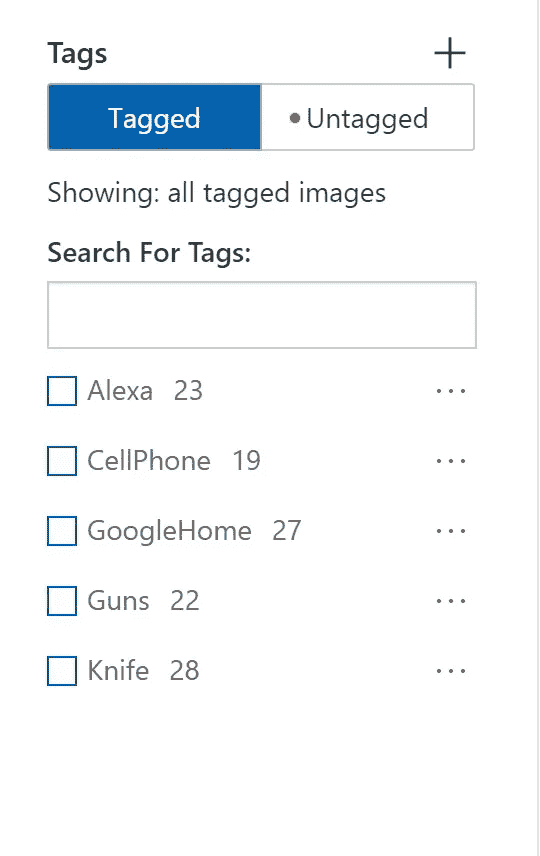

*   上传图片

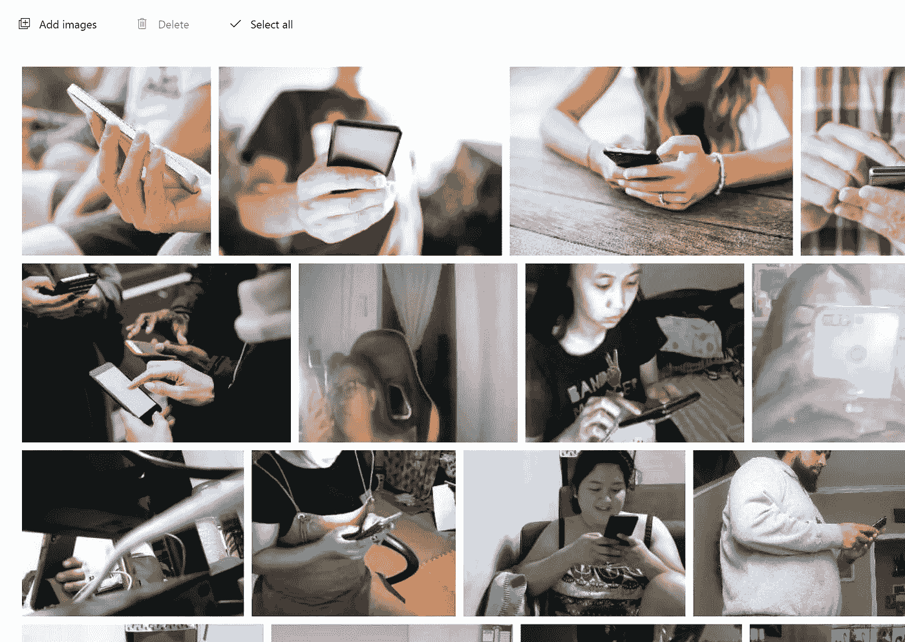

*   为每个对象做边界框并分配标签

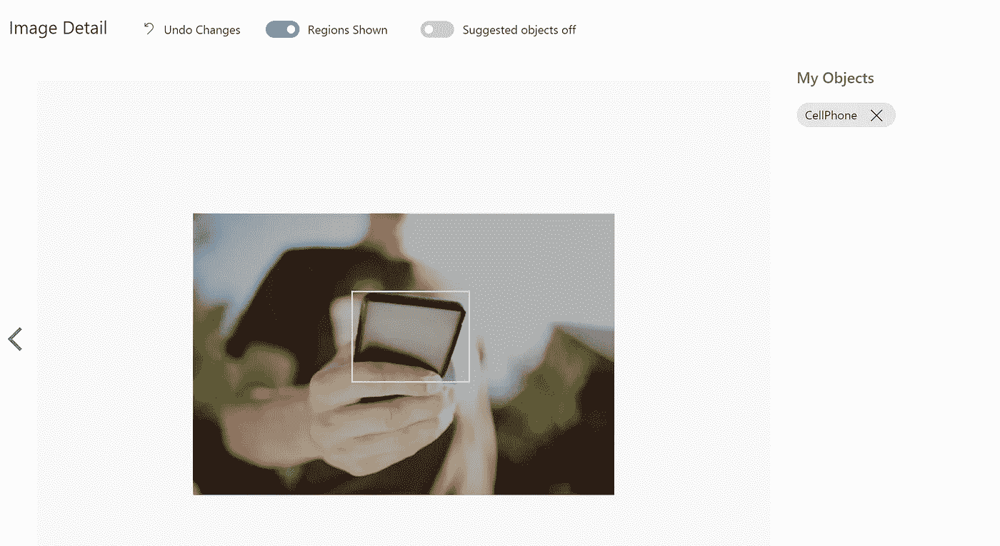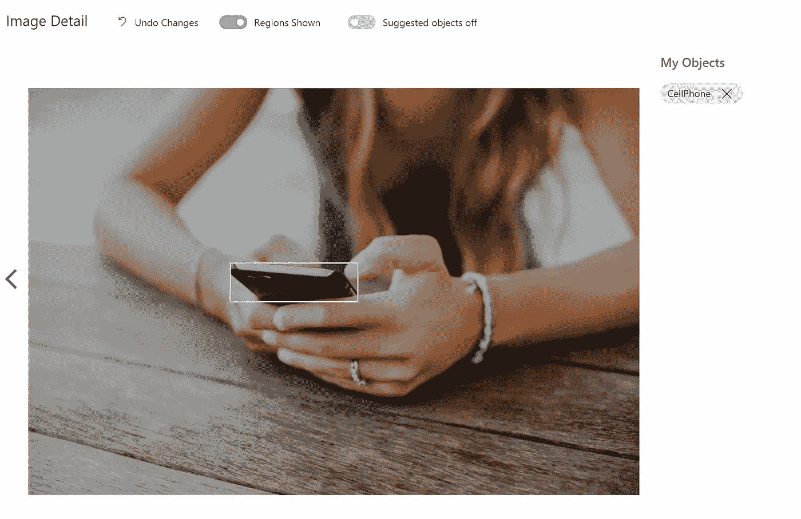

*   现在点击训练按钮
*   点击快速培训
*   等待 20 分钟

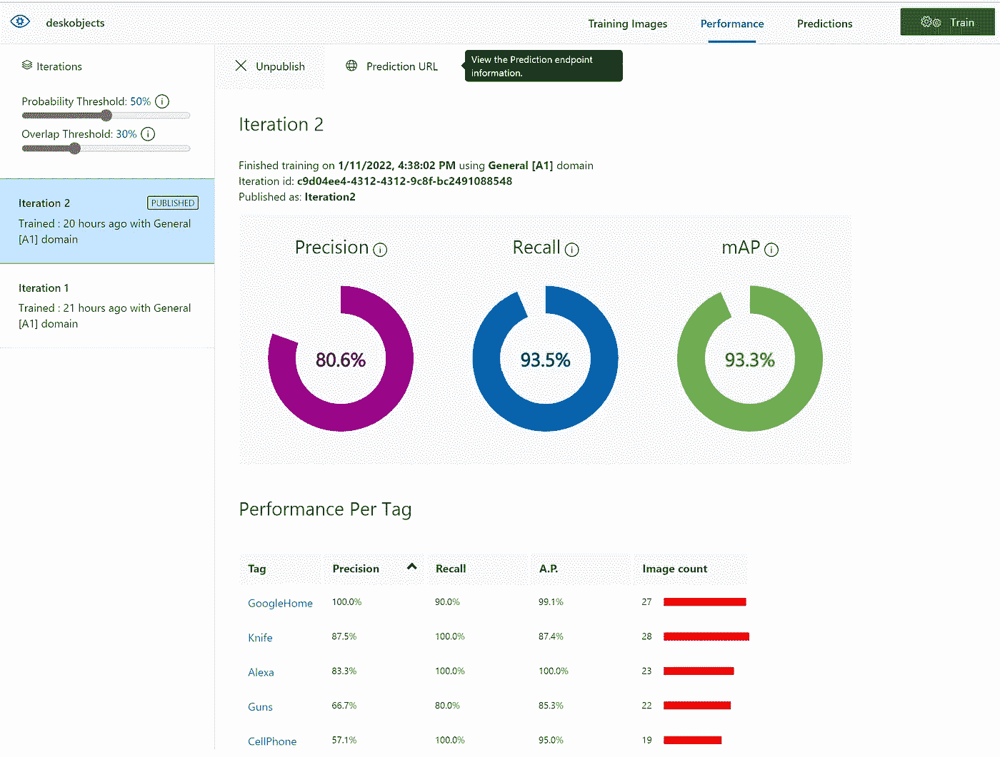

*   点击预测网址。

# 创建一个新的探测物体的强大应用程序

*   现在是时候创建强大的应用程序了
*   去 https://make.preview.powerapps.com/[的](https://make.preview.powerapps.com/)
*   还获得 power app 高级许可证
*   创建新的画布应用程序

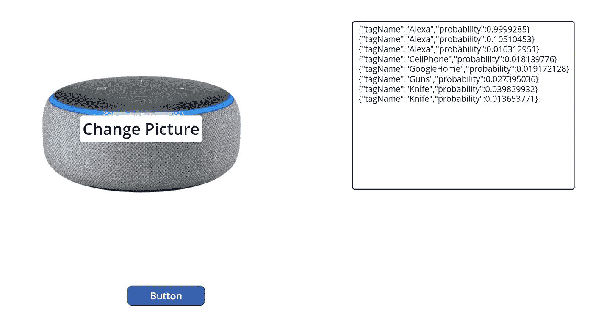

*   创建空白应用程序
*   插入媒体->添加图片->并拖到画布上
*   单击操作->电源自动化，并选择下面创建的流程
*   在进行下一步之前，首先创建如下的功率流
*   一旦流被创建，然后按照下面的
*   插入按钮
*   插入文本框

```
Set(JSONImageSample, JSON(UploadedImage2.Image, JSONFormat.IncludeBinaryData));
Set(outputtext,getcustomvisionimage.Run(JSONImageSample, 0, 0,0));
```

*   现在设置文本框默认值

```
outputtext.output
```

# 推理对象的功率流

*   总流量

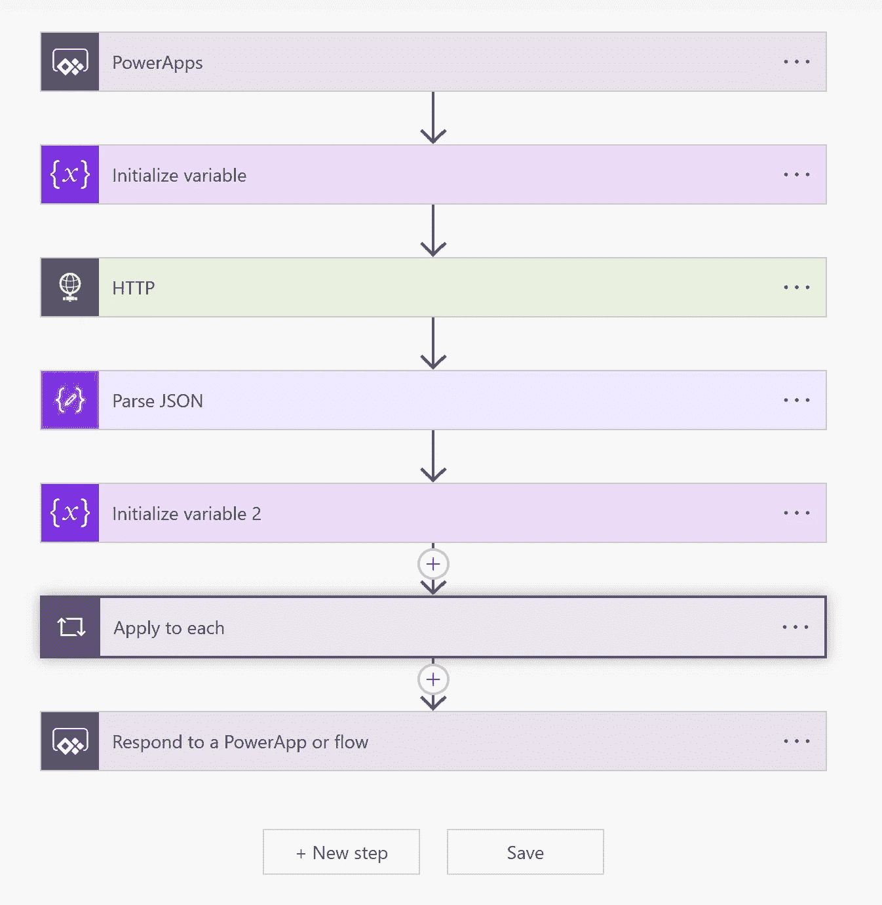

*   ▲初始化一个变量

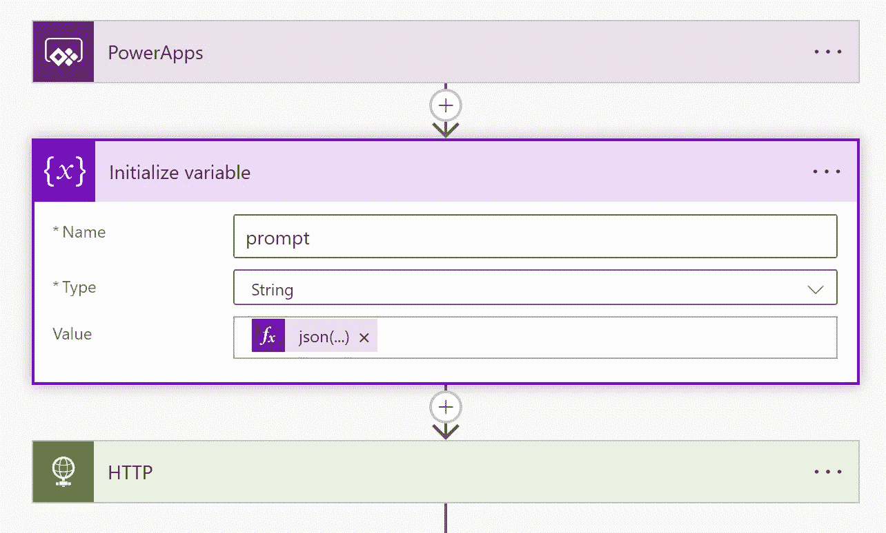

```
json(triggerBody()['HTTP_Body'])
```

*   现在带上 HTTP

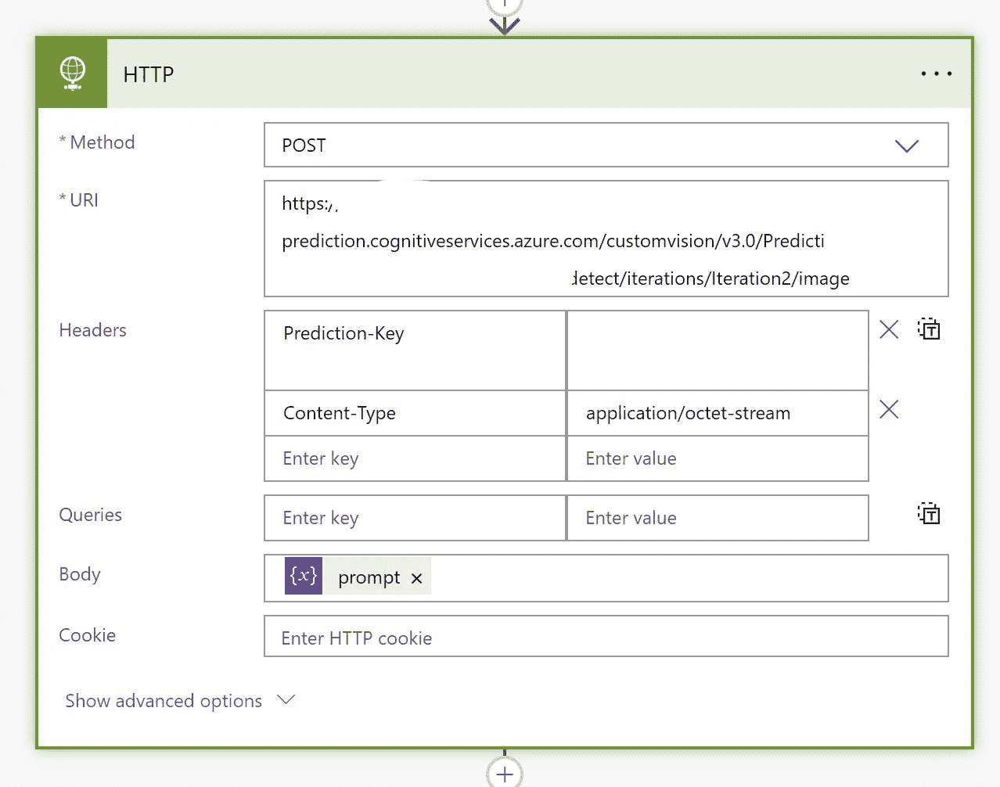

*   现在从自定义视觉的预测 URL 中获取 URL
*   获取预测键
*   设置内容类型

```
[https://cogsvcname-prediction.cognitiveservices.azure.com/customvision/v3.0/Prediction/xxxxxxxxxxxxxxxxxxxxxx/detect/iterations/Iteration2/image](https://cogsvcname-prediction.cognitiveservices.azure.com/customvision/v3.0/Prediction/xxxxxxxxxxxxxxxxxxxxxx/detect/iterations/Iteration2/image)Content-Type: application/octet-stream
Prediction-key: xxxxxxxxxxxxxxxxxxxxx
```

*   对于 Body，选择上面初始化的变量
*   现在带来 Parse JSON

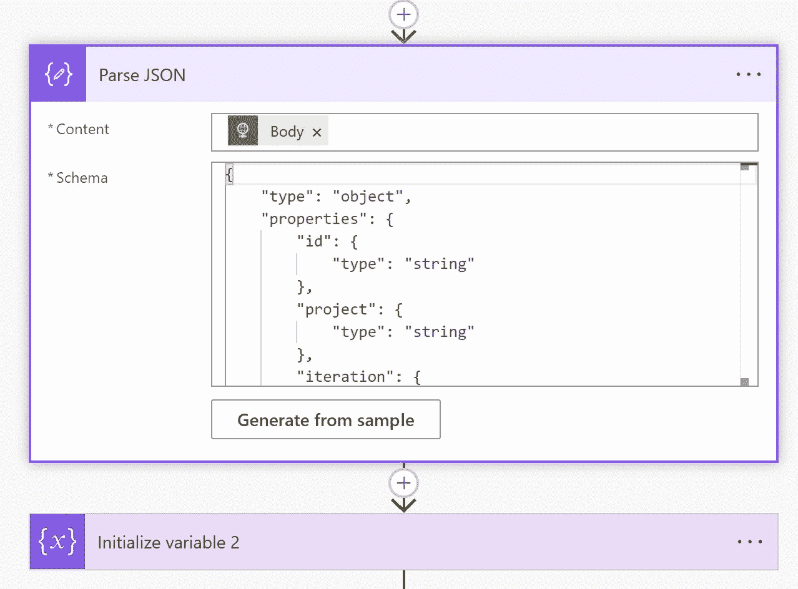

```
{
    "type": "object",
    "properties": {
        "id": {
            "type": "string"
        },
        "project": {
            "type": "string"
        },
        "iteration": {
            "type": "string"
        },
        "created": {
            "type": "string"
        },
        "predictions": {
            "type": "array",
            "items": {
                "type": "object",
                "properties": {
                    "probability": {
                        "type": "number"
                    },
                    "tagId": {
                        "type": "string"
                    },
                    "tagName": {
                        "type": "string"
                    },
                    "boundingBox": {
                        "type": "object",
                        "properties": {
                            "left": {
                                "type": "number"
                            },
                            "top": {
                                "type": "number"
                            },
                            "width": {
                                "type": "number"
                            },
                            "height": {
                                "type": "number"
                            }
                        }
                    }
                },
                "required": [
                    "probability",
                    "tagId",
                    "tagName",
                    "boundingBox"
                ]
            }
        }
    }
}
```

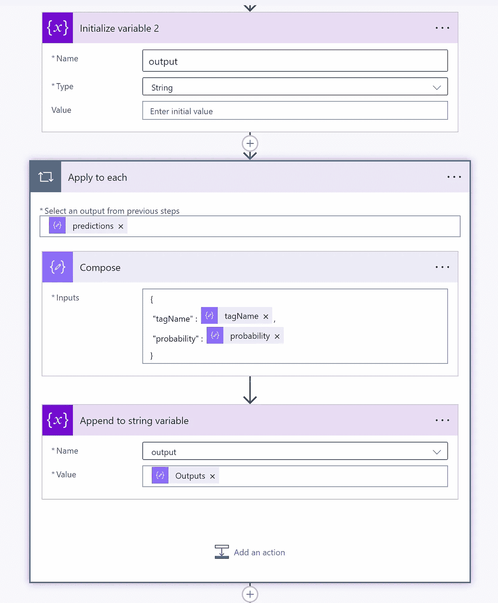

*   初始变量
*   应用每个任务
*   选择预测

```
predictions
```

*   带来作曲

```
{
 "tagName" : @{items('Apply_to_each')?['tagName']},
 "probability" : @{items('Apply_to_each')?['probability']}
}
```

*   追加变量
*   用上述变量设置输出变量
*   响应电源应用程序
*   下面是 power app 的示例输出

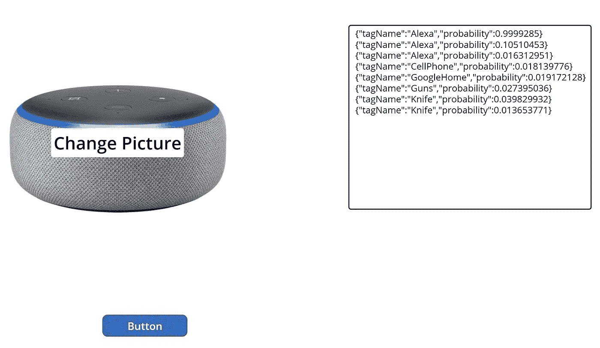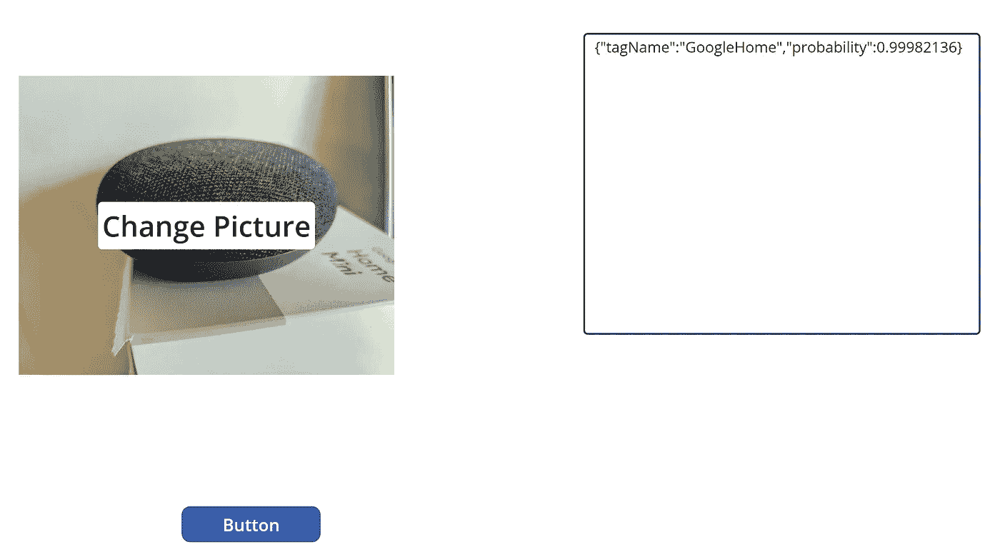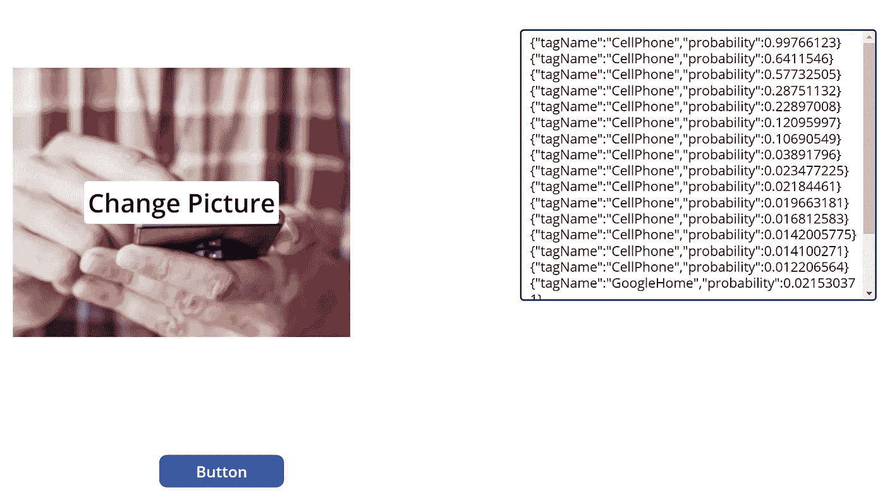

【github.com】

[](/mlearning-ai/mlearning-ai-submission-suggestions-b51e2b130bfb) [## Mlearning.ai 提交建议

### 如何成为 Mlearning.ai 上的作家

medium.com](/mlearning-ai/mlearning-ai-submission-suggestions-b51e2b130bfb) 

🔵 [**成为作家**](/mlearning-ai/mlearning-ai-submission-suggestions-b51e2b130bfb)