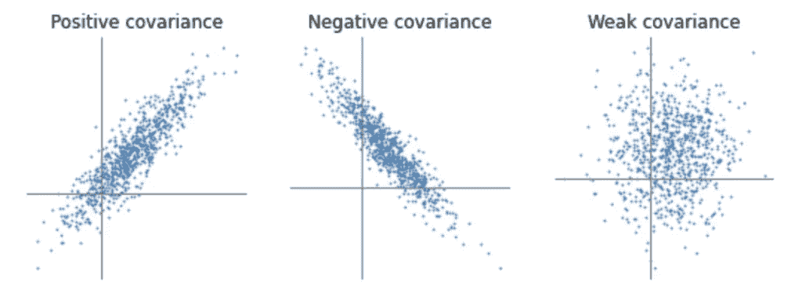
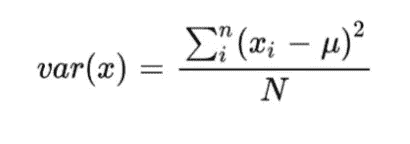
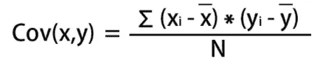
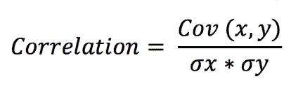

# 协变、方差和相关之间的区别

> 原文：<https://medium.com/mlearning-ai/difference-between-co-variance-variance-and-co-relation-aae9c51f1c66?source=collection_archive---------1----------------------->

在过去的两年里，我一直在深度学习和机器学习领域打拼。尽管如此，我还是经常混淆协变、方差和相关性这几个术语。我敢肯定，在您的数据科学之旅中，您一定多次听到过所有这些词语。因此，在本文中，我们将尝试用非常通俗易懂的语言来理解所有这些术语。

[Source](https://programmathically.com/covariance-and-correlation/)

# **1)差异**

方差，你会从名字本身得到思路。它告诉我们一个量相对于它的平均值变化了多少。方差在统计学中用于描述数据集与其平均值之间的差异。

方差公式简单明了，如下所示。

Formula to find the variance

> **xi** =一次观测的值
> 
> μ=所有观察值的平均值
> 
> n =观察总数

通过计算数据的方差，你将只知道可变性的**大小**，即数据变化了多少。

# 2)协变

共方差告诉我们两个特征/数量相互变化的**方向**。如果两个量之间的方差为正**则表明这两个量在同一个方向上移动。要么一起增加，要么一起减少。而负的**协方差表示它们在相反的方向上移动。****

Formula to find the co-variance

> Xi = x 坐标/数据点的值
> 
> 所有 x 值的 x̅=平均值
> 
> y =坐标/数据点的值
> 
> 所有 y 值的 ȳ=Mean
> 
> n =观察总数

示例-特征工资和经验有正的协变。我们知道，随着经验的增加，薪水也会增加。

> - **∞ <** 协方差< **∞**

注意协方差的值可以是从负到正无穷大的任何值。我们只需要考虑输出值的符号。量是正的还是负的协方差。

# 3)相互关系

相互关系既表示数量关系的**方向**又表示数量关系的**大小**

> 西格玛=标准偏差

换句话说，我们也可以称相关为归一化的协方差。

> < Co-relation <1

A correlation of +1 indicates a perfect positive correlation.

A correlation of -1 indicates a perfect negative correlation.

A correlation of 0 indicates that there is no relationship between the different variables (mass of a ball does not affect the time taken to fall).

# **-1*总结一切-*-**

我希望你对这些术语有一个清晰的概念。基本上，它们都是用来告诉我们数量或数据集之间的关系。但它们在以下几点上有所不同-

> 方差-告诉我们**的大小**
> 
> 协方差-告诉我们**方向**
> 
> 相关-告诉我们**方向**以及**大小**

谢谢大家！

请关注更多精彩博客:)

[Github](https://github.com/Pranav082001)

[*领英*](https://www.linkedin.com/in/pranav-kushare-ab217418a/)

 [## Mlearning.ai 提交建议

### 如何成为 Mlearning.ai 上的作家

medium.com](/mlearning-ai/mlearning-ai-submission-suggestions-b51e2b130bfb) 

🔵 [**成为作家**](/mlearning-ai/mlearning-ai-submission-suggestions-b51e2b130bfb)