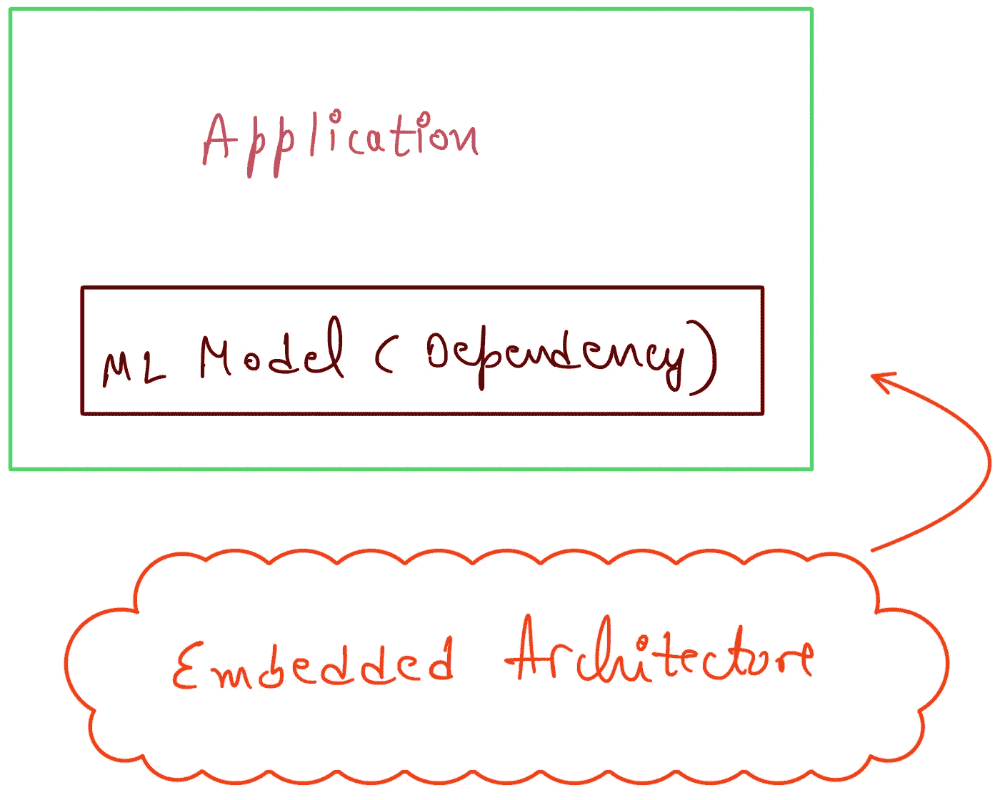
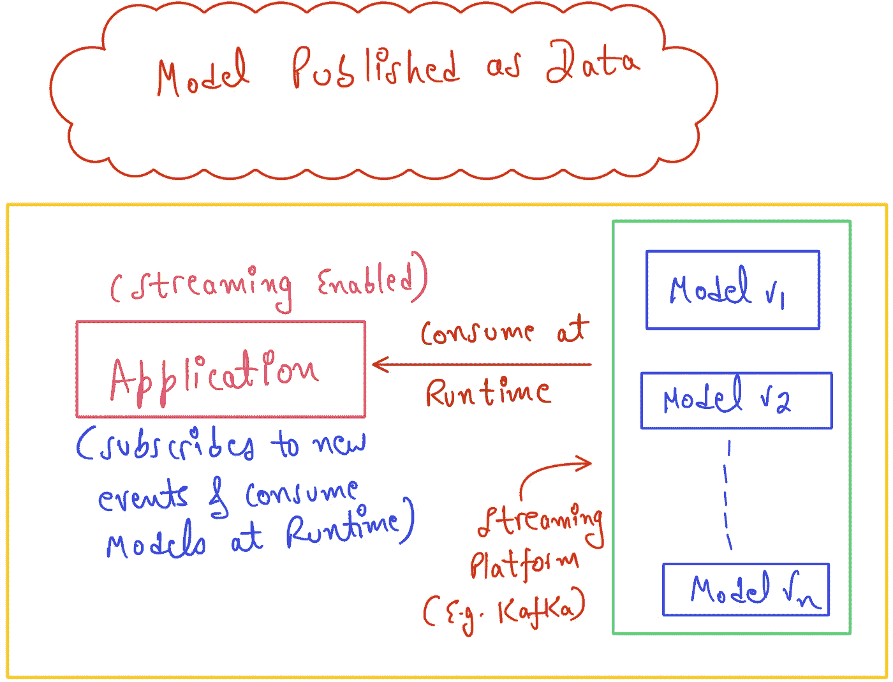
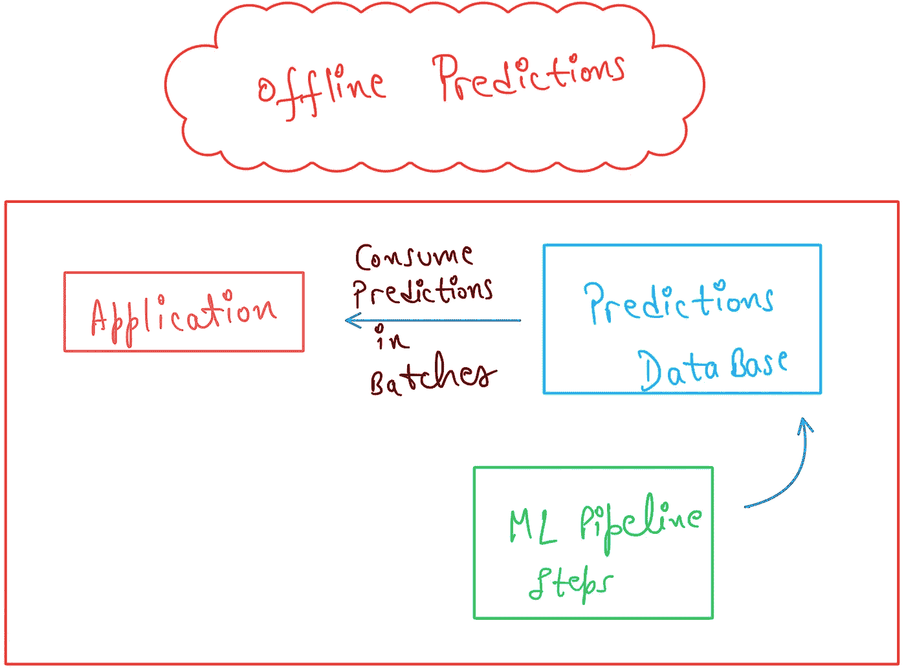
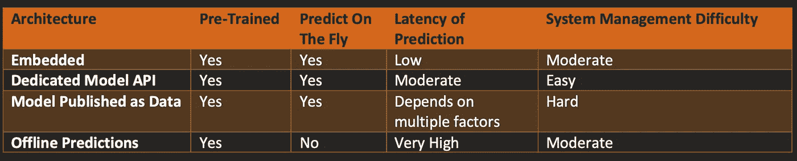

# 机器学习模型部署的不同架构！

> 原文：<https://medium.com/mlearning-ai/different-architectures-of-machine-learning-model-deployment-250a4a3a37b4?source=collection_archive---------0----------------------->

## 本博客旨在解释模型部署&部署任何机器学习模型的不同可用架构，并提供用例及示例。除此之外，它还揭示了在现实中是否部署了机器学习模型，或者它是其他东西？

[**Source**](https://humanativaspa.it/en/machine-learning-how-to-choose-the-best-model/)

随着时间的推移，机器学习进化到了另一个水平，但令人难过的是，无论何时在大多数地方(大学/博客/任何其他来源)解释机器学习的基础或管道，都只是传达了不完整的知识。直到模型创建/训练&测试，相关概念才被解释。很少有地方解释了模型部署，即使有人知道模型部署，了解部署模型的不同/多种可用方式及其用例&架构也是非常重要的。

考虑到模型部署及其方式的重要性，这个博客将作为一个指南/路径，使您理解这个主题。

现在，话虽如此，让我们继续实际内容。

# 什么是模型部署？

术语模型部署指的是使机器学习模型对最终用户/期望的观众可用的行为/过程。创建的模型应该能够接受来自预期受众的请求&然后应该能够将结果/输出返回给相同的预期受众。

> 例如:有一个非常简单的用例，创建一个预测机器学习模型，其目标是根据一些属性/特征来预测员工的工资。这种模式需要出现在一些公司的网站上，以便试图申请该公司工作的人可以对该公司将提供的工资有一个粗略的想法。为了实现这个用例，首先，理想的机器学习管道的所需步骤将被实现，然后一旦模型准备好，它需要以某种方式与公司的网站集成，以便它可以服务于任何人的请求。将经过培训和测试的模型放在期望的位置(公司的网站)以满足目标受众的要求的过程被称为模型部署。

> 实际上，不仅部署了模型，而且部署了几乎完整的机器学习管道(不完整，但是部署了管道的大部分步骤，即:特征工程、特征选择和模型训练)。采取这一行动的原因很多，下面列出了其中一些:

*1。为了执行特征工程，所有的处理都需要重新进行，所以需要部署这个功能。当接受用户输入时，用户应该面对简单的界面，认为它完全忘记了内部处理。可能有多种需求，包括生成新列、多次转换等。对于只能由特征工程处理的特定用例。*

*2。一旦特征工程完成，可能会有多个场景需要选择一些主要特征用于最终的模型训练，这反过来也消除了“维数灾难”的问题(由数据集中的大量特征引起的问题)。*

*3。随着时间的推移，模型变得陈旧/过时，因此，它需要定期更新，因此，持续培训、持续测试、&持续部署是非常需要的，或者我可以说，这是一项任务。这就是导致* ***MLOPS 诞生的原因。***

# 机器学习模型部署的各种架构！

机器学习模型部署架构表示如何部署机器学习模型或用于部署机器学习模型的设计模式。

任何被部署的模型，在每种情况下，都是与一些应用程序一起部署的，因为模型将被部署来满足一些用例&用例的呈现或者至少是用于部署模型的接口的设计将使用任何应用程序来完成。例如，最简单的模型部署可以通过一个 web 页面来完成，该页面可以接受用户的输入，然后将输入传递给模型(API 工作)，然后将结果返回给用户。在这里，应用程序将是那个简单的 web 页面。

也就是说，让我们理解 4 种不同的模型部署架构:

## 嵌入式架构

***Image Designed by Author!***

在该架构中，模型作为应用程序的依赖项以嵌入式方式部署在应用程序中，模型在应用程序的构建时打包在最终/消费应用程序中。

应用程序和模型在同一个位置服务于它们特定的目的。

***此处使用的模型是经过预先训练的&将具有“即时预测”的能力。***

> ***在这种架构中，灵活性和简单性之间有一个权衡。由于模型部署在应用程序中，因此，如果这两件事情中的任何一件需要更新，它将影响这两件事情，具体地说，如果模型需要更新，那么在这种情况下，应用程序也需要再次部署。这里提倡的是简单性而不是灵活性。***

这种架构也可以在移动设备内部用作移动应用，例如“Core ML”。也可以直接在浏览器中使用，例如“Tensorflow.js”。这种架构也广泛应用于 Flask & Django 应用程序中。

## 专用模型 API

***Image Designed by Author!***

该架构将应用程序和模型分开部署，无论何时应用程序需要模型，都可以使用 REST API 调用或任何其他方式远程调用它。

***这里使用的模型也是经过预先训练的&将具有“即时预测”的能力。***

> ***在这种架构中，嵌入式架构的权衡是相反的，因为我们现在有单独的服务器托管 API &增加复杂性(降低简单性)的应用&增加灵活性。每个部分(模型&应用程序)都可以独立扩展以处理流量。***

## 作为数据发布的模型

***Image Designed by Author!***

***这里使用的模型也是经过预先训练的&将具有“即时预测”的能力。***

> ***在这个架构中，应用程序中的流功能也是存在的，这就是为什么像 Apache Kafka 这样的流应用程序被用来保存/存储应用程序可以使用的模型。在这里，ML 工程师将同一模型的不同版本或解决不同用例的不同模型发布到 Apache Kafka 主题上&。应用程序订阅 Apache Kafka 主题，以便根据需要/要求在运行时使用。这里，权衡也更倾向于增加复杂性(减少简单性)&增加整个系统/架构的灵活性。这种架构要先进得多&可以解决许多复杂的用例。***

## 离线预测

***Image Designed by Author!***

***这里使用的模型是预先训练好的，但它不具备“即时预测”的能力。***

> ***这是唯一不支持“即时预测”的架构。这里，权衡也更倾向于增加复杂性(减少简单性)&增加整个系统/架构的灵活性。通过应用所需的任何 ML 流水线步骤，以离线方式生成预测，&然后将它们存储在预测数据库中。这种架构在某种程度上已经过时了，但在某些用例中仍然非常有用，例如，当需要验证预测是否正确时。为了解决这样的用例，可以使用这个架构，因为我们已经有了预测，然后我们可以验证它们。***

# 结论

下表根据最重要的因素对所有体系结构进行了比较:

***Table generated by Author!***

这里没有机器学习模型部署的最佳架构，事实是架构选择主要取决于用例，还取决于其他一些因素，如管理复杂系统架构的能力等。

> 所以分析完所有的东西，选择一个架构来部署机器学习模型！

***我希望我的文章用所有详细的概念和解释解释了与主题相关的每一件事。非常感谢你花时间阅读我的博客&，增加你的知识。如果你喜欢我的作品，那么我请求你为我的博客鼓掌&关注我的*** [***中的***](https://harshitdawar.medium.com/) ，[***GitHub***](https://www.github.com/HarshitDawar55)，***&***[***LinkedIn***](https://www.linkedin.com/in/harshitdawar)***关于多种技术及其集成的更多精彩内容！***

***还有，在 Medium 上订阅我，获取我所有博客的更新！***

 [## Mlearning.ai 提交建议

### 如何成为 Mlearning.ai 上的作家

medium.com](/mlearning-ai/mlearning-ai-submission-suggestions-b51e2b130bfb)