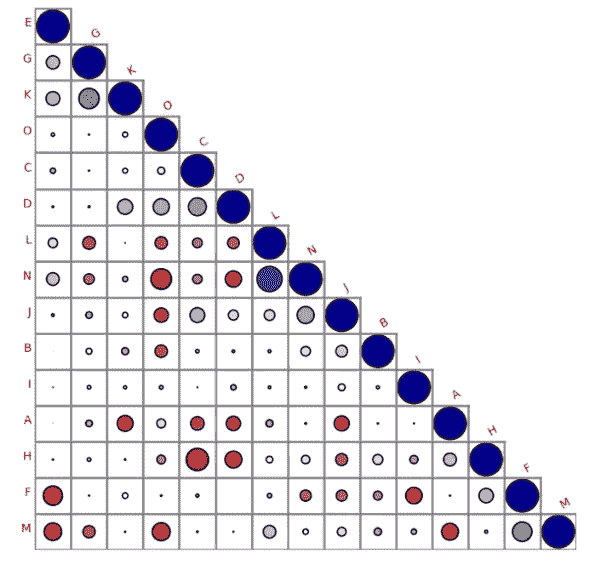

# 不同的相关图进行直观解释！！✨💥☀️

> 原文：<https://medium.com/mlearning-ai/different-correlation-plot-for-visual-explanation-%EF%B8%8F-89d419b7c5db?source=collection_archive---------1----------------------->

*   如果你想实现一个不同的**关联图**，那么有一个名为 **biokit.viz** 的库

```
##biokit library we are importing correlation plot
**from biokit.viz import corrplot**

**df =pd.read_csv("train.csv")**

##df shoud contain numerical columns and dataframe object 
##if categorical columns are present then use get_dummies or encoder ##functions and convert into numerical

##i the input is not a square matrix or indices do not match 
##column names, correlation is computed on the fly

**c = corrplot.Corrplot(df)**

**c.plot(colorbar=False, method='circle', shrink=.9, lower='circle',label_color='red'  )**
```

在这里我们可以创建一个可视化如下。



详细实现请查看以下链接—>[https://nb viewer . org/github/bio kit/bio kit/blob/master/notebooks/viz/corr plot . ipynb](https://nbviewer.org/github/biokit/biokit/blob/master/notebooks/viz/corrplot.ipynb)

如果你想看到一个项目中的代码实现和见解，请看 kaggle 中的这个[代码。](https://www.kaggle.com/code/mahendragundeti/abc-analysis/notebook)

**归功于这个 jupyter 笔记本的作者，我们学到了新的关联可视化。**

[](/mlearning-ai/mlearning-ai-submission-suggestions-b51e2b130bfb) [## Mlearning.ai 提交建议

### 如何成为 Mlearning.ai 上的作家

medium.com](/mlearning-ai/mlearning-ai-submission-suggestions-b51e2b130bfb)