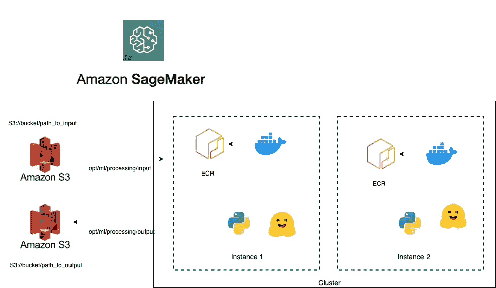

# Amazon Sagemaker 上带拥抱脸的分布式批量推理

> 原文：<https://medium.com/mlearning-ai/distributed-batch-inference-with-hugging-face-on-amazon-sagemaker-51980e460ec1?source=collection_archive---------3----------------------->

## 使用 SageMaker 处理作业，通过 Hugging Face 的 Transformer 模型轻松地对大型数据集进行推理


Photo by [Alex Kulikov](https://unsplash.com/@burntime?utm_source=medium&utm_medium=referral) on [Unsplash](https://unsplash.com?utm_source=medium&utm_medium=referral)

这篇博客将向您完整地介绍如何对生产中的大量数据运行分布式批量推理。我们将使用亚马逊 Sagemaker，一种完全托管的机器学习服务。借助 Amazon SageMaker，数据科学家和开发人员可以快速构建和训练机器学习模型，然后将其部署到生产就绪的托管环境中。

假设我们有数 Pb 的数据，我们想使用一个预训练的模型进行批量推理。Sagemaker 处理作业是最简单的方法之一，因为它专注于抽象出所需的基础设施。它还要求对我们现有的代码进行最小的更改。在本教程中，我们将使用来自 Huggin Face 的预训练模型来计算一对句子之间的语义相似度。

**这篇博文将涵盖以下主题:**

*   修改 SageMaker 处理作业的代码
*   用代码和依赖项构建 docker 容器，并将其推送到 Amazon 弹性容器注册(Amazon ECR)存储库
*   使用自定义 docker 图像启动处理作业

# 修改代码

创建处理作业需要指定一个亚马逊简单存储服务(亚马逊 S3) URI 来下载数据，并在 docker 容器中指定一个路径来下载数据。处理容器中的路径必须以`/opt/ml/processing/`开头。稍后将对此进行更多讨论。

> 注意:`/opt/ml`及其所有子目录由 SageMaker 保留。在构建处理 Docker 映像时，不要将容器所需的任何数据放在这些目录中。

我们需要修改我们的脚本从这个路径读取数据`/opt/ml/processing/`

在本例中，我们使用来自上游数据管道的数据，该管道将数据分成多个拼花文件，并将它们存储在 S3 存储桶中。如果所选实例上有多个 GPU，我们将使用每个 GPU 并行推断每个文件。这里我们使用了一个来自拥抱脸的预训练句子转换器(更多信息[这里](https://huggingface.co/sentence-transformers/distiluse-base-multilingual-cased-v2))，但是我们可以通过简单地修改下面的脚本来使用任何模型。

示例脚本从输入目录中读取文件，从句子嵌入中添加一个具有余弦相似性的新列，并将其保存在输出目录中。如下所示，可以从处理作业中覆盖这些参数。

```
import os
import argparse
import logging
import numpy as np
import pandas as pd
from numpy.linalg import norm
import torch.multiprocessing as mp
from sentence_transformers import SentenceTransformer

# set up logger
logging.basicConfig(format="%(asctime)s:%(levelname)s:%(name)s:%(message)s")
logger = logging.getLogger("HuggingFace")
logger.propagate = True
logger.setLevel(logging.INFO)

def get_model_output(cfg, model, df, device_idx):

    # sanity check
    text1 = df["text1"].values
    text2 = df["text2"].values

    # Create the trainer for inference.
    logger.info("Predicting model")
    # Compute embedding for both lists
    embeddings1 = model.encode(
        text1,
        batch_size=cfg.batch_size,
        convert_to_numpy=True,
        device=device_idx,
    )
    embeddings2 = model.encode(
        text2,
        batch_size=cfg.batch_size,
        convert_to_numpy=True,
        device=device_idx,
    )
    df["semanticScore"] = np.hstack(
        [
            (emb1 @ emb2.T) / (norm(emb1) * norm(emb2))
            for emb1, emb2 in zip(embeddings1, embeddings2)
        ]
    )
    return df

def do_infer(cfg, device_idx):

    # Load the model.
    logger.info("Loading model")
    model = SentenceTransformer(cfg.model, device=device_idx)

    # Init file path that this process needs to process.
    if os.path.isdir(cfg.input_dir):
        filepath_list = [
            filepath
            for filepath in os.listdir(cfg.input_dir)
            if filepath.endswith(".parquet")
        ]
        filepath_list = sorted(filepath_list)
        filepath_list = [
            filepath_list[idx]
            for idx in range(len(filepath_list))
            if idx % cfg.num_gpu == device_idx
        ]
    else:
        filepath_list = (
            [cfg.input_dir] if device_idx == 0 else []
        )  # only use the first GPU.

    # Get the input and output filepath.
    input_list = [os.path.join(cfg.input_dir, filepath) for filepath in filepath_list]
    output_list = [os.path.join(cfg.output_dir, filepath) for filepath in filepath_list]
    logger.info(f"Device {device_idx} input: {input_list}")
    logger.info(f"Device {device_idx} output: {output_list}")

    # Start processing.
    for in_filename, out_filename in zip(input_list, output_list):
        # Read the dataset.
        logger.info("Reading file {}".format(in_filename))
        prod_df = pd.read_parquet(in_filename)

        # Run the inference.
        output_df = get_model_output(cfg, model, prod_df, device_idx)

        # Save the results
        logger.info(f"Writing the result to {out_filename}")
        output_df.to_parquet(out_filename)
        logger.info(f"Done writing the result to {out_filename}")

def do_multiprocessing_infer(cfg):

    processes_list = [
        mp.Process(target=do_infer, args=(cfg, device_idx))
        for device_idx in range(cfg.num_gpu)
    ]

    for process in processes_list:
        process.start()

    for process in processes_list:
        process.join()

if __name__ == "__main__":
    parser = argparse.ArgumentParser()
    parser.add_argument("--num_gpu", type=int, default=4)
    parser.add_argument("--batch_size", type=int, default=128)
    parser.add_argument(
        "--input_dir", type=str, default="/opt/ml/processing/data/input"
    )
    parser.add_argument(
        "--output_dir", type=str, default="/opt/ml/processing/data/output"
    )
    parser.add_argument(
        "--model",
        type=str,
        default="sentence-transformers/distiluse-base-multilingual-cased-v2",
    )
    args = parser.parse_args()
    do_multiprocessing_infer(args)
```

# 构建 docker 映像并将其推送到 Amazon ECR

一旦我们完成了代码，我们需要构建一个 docker 容器。下面是一个 DOCKER 文件示例。在这个例子中，我们所有的代码都在 src 目录中

```
 FROM python:3.8

RUN apt-get -y update && apt-get install -y --no-install-recommends \
         wget \
         python3 \
    && rm -rf /var/lib/apt/lists/*

RUN wget https://bootstrap.pypa.io/get-pip.py && python3 get-pip.py && \
        rm -rf /root/.cache

COPY requirements.txt /opt/program/
COPY src/ /opt/program/src/
WORKDIR /opt/program

RUN pip install -r requirements.txt

# Set some environment variables. PYTHONUNBUFFERED keeps Python from buffering our standard
# output stream, which means that logs can be delivered to the user quickly. PYTHONDONTWRITEBYTECODE
# keeps Python from writing the .pyc files which are unnecessary in this case. We also update
# PATH so that the train and serve programs are found when the container is invoked.
ENV PYTHONUNBUFFERED=TRUE
ENV PYTHONDONTWRITEBYTECODE=TRUE
```

一旦我们有了 DOCKER 文件，我们需要构建它来创建一个图像，并在将它推送到 Amazon ECR 之前标记该图像。ECR 是一个类似 Docker Hub 的容器注册中心，我们可以在这里托管容器映像。

示例 bash 脚本将处理所有与 AWS 相关的认证，创建一个名为 ***sm-semantic-similarity、*** 的存储库，并对其进行标记，最后将其推送到 Amazon ECR 存储库。我们将得到一个独特的链接，如"<**ACCOUNT-ID>. dkr . ECR . us-east-1 . Amazon AWS . com/sm-lexical-similarity:v1**"

```
# Name of algo -> ECR
algorithm_name=sm-semantic-similarity

account=$(aws sts get-caller-identity --query Account --output text)

# Region, defaults to us-east-1
region=$(aws configure get region)
region=${region:-us-east-1}

fullname="${account}.dkr.ecr.${region}.amazonaws.com/${algorithm_name}:v1"

# If the repository doesn't exist in ECR, create it.
aws ecr describe-repositories --repository-names "${algorithm_name}" --region ${region}> /dev/null 2>&1

if [ $? -ne 0 ]
then
    aws ecr create-repository --repository-name "${algorithm_name}" --region ${region}> /dev/null
fi

# Get the login command from ECR and execute it directly
aws ecr get-login-password --region ${region}|docker login --username AWS --password-stdin ${fullname}

# Build the docker image locally with the image name and then push it to ECR
# with the full name.

docker build -t ${algorithm_name} .
docker tag ${algorithm_name} ${fullname}
docker push ${fullname}
```

# 使用自定义容器运行 SageMaker 处理作业

Amazon SageMaker 从 S3 复制数据，然后提取容器。群集资源在作业期间调配，并在作业完成时清理。处理作业的输出存储在参数中指定的 S3 存储桶中。



`Processor`类需要以下参数:

*   **角色**:AWS IAM 角色名或 ARN
*   **image _ uri:**Docker 图像的唯一链接
*   **instance_count:** 运行处理作业的实例数。
*   **instance_type:** 用于处理的 EC2 实例的类型
*   **入口点:**构成入口点命令的字符串列表。这里我们可以根据 instance_type 传递`num_gpus`参数。例如`ml.p3.16xlarge`有 8 个 GPU
*   **volume_size_in_gb** :以 gb 为单位的大小，用于在处理作业期间存储数据

当运行处理作业时，我们需要提供作为`[**ProcessingInput**](https://sagemaker.readthedocs.io/en/stable/api/training/processing.html#sagemaker.processing.ProcessingInput)`对象的输入文件列表和作为输出的`[**ProcessingOutput**](https://sagemaker.readthedocs.io/en/stable/api/training/processing.html#sagemaker.processing.ProcessingOutput)`对象列表。请注意参数`**s3_data_distribution_type**`，它可以是“**full replicated**或“ **ShardedByS3Key** ”，其中 full replicated 将使给定数据集的副本在每个实例中可用，ShardedByS3Key 将把[**# of data files**]/[**# of instances**]条数据复制到每个实例中。
更多信息请参考此处的[和](https://sagemaker.readthedocs.io/en/stable/index.html)。

```
import boto3
import sagemaker
from sagemaker import get_execution_role
from sagemaker.processing import Processor
from sagemaker.processing import ProcessingInput, ProcessingOutput

region = boto3.session.Session().region_name
role = get_execution_role()

ecr_image = '<ACCOUNT-ID>.dkr.ecr.us-east-1.amazonaws.com/sm-lexical-similarity:v1'

huggingface_processor = Processor(role=role,
                                  entrypoint=['python', '-u', 'src/infer.py', '--num_gpus=8'],
                                  image_uri=ecr_image,
                                  instance_type='ml.p3.16xlarge',
                                  instance_count=50,
                                  volume_size_in_gb=600,
                                  base_job_name = 'preprocess-semantic'
                                 )

huggingface_processor.run(
    inputs=[
        ProcessingInput(
            source='<s3_uri or local path>',
            s3_data_distribution_type='ShardedByS3Key',
            destination='/opt/ml/processing/data/input')
    ],

    outputs=[
        ProcessingOutput(
          source='/opt/ml/processing/data/output/',
          destination='<s3_uri>,
          s3_upload_mode='Continuous'
        )
    ]

)
```

# 结论

在这篇博客中，我们介绍了一个端到端的分布式处理作业，它使用了来自 Hugging Face 的预训练的 transformer 模型。我们利用 Amazon SageMaker 抽象出资源供应。我们学习了如何打包我们的代码，创建 docker 容器，并将其上传到 Amazon ECR。这里是官方 [**亚马逊 SageMaker 处理类文档**](https://sagemaker.readthedocs.io/en/stable/amazon_sagemaker_processing.html#learn-more) 了解更多。

希望你喜欢这个教程，觉得有用。如果你有任何想法、评论或问题，请在下面留下评论或在 [LinkedIn](https://www.linkedin.com/in/ratulghosh1/) 上联系我。快乐阅读🙂

[](/mlearning-ai/mlearning-ai-submission-suggestions-b51e2b130bfb) [## Mlearning.ai 提交建议

### 如何成为 Mlearning.ai 上的作家

medium.com](/mlearning-ai/mlearning-ai-submission-suggestions-b51e2b130bfb)